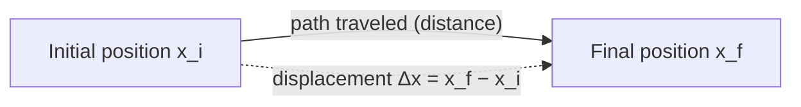
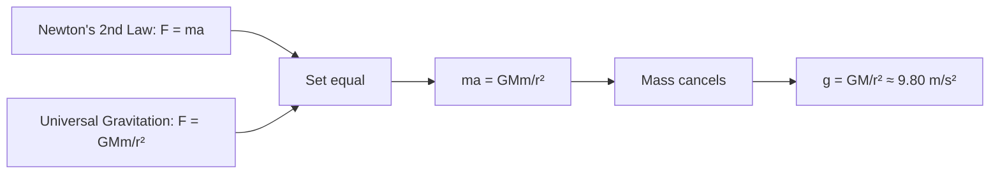
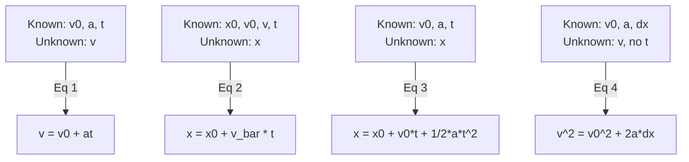

# SPL Run: build_concept_book

- **Adapter:** claude_cli
- **Model:** claude-sonnet-5
- **Tokens:** 17567 in / 9616 out
- **Latency:** 260511ms
- **Timestamp:** 2026-09-27 09:43:13

## Output

```output


---

## Position

Position specifies where an object is located at a given instant, always measured relative to a chosen reference frame — an origin, a set of axes, and a choice of units. Without a reference frame, "position" is meaningless: saying a car is "5 km away" only makes sense once you fix what it is 5 km away *from*. In one dimension, position is written as a signed number $x(t)$, where the sign indicates direction from the origin (positive to the right, negative to the left, by convention). In two or three dimensions, position is a vector $\vec{r}(t) = x(t)\hat{i} + y(t)\hat{j} + z(t)\hat{k}$, whose components are the projections onto each axis — this is the same idea as the one-dimensional case, just tracked along more than one axis at once.

**Worked example.** A runner starts at the 0 m mark on a straight track. At $t = 0\,\text{s}$ she is at $x = 0\,\text{m}$; at $t = 4\,\text{s}$ she is at $x = 28\,\text{m}$. Choosing the starting line as the origin and "forward" as positive, her positions are $x(0) = 0\,\text{m}$ and $x(4) = 28\,\text{m}$. If instead we had chosen the finish line (100 m away) as the origin, with "backward toward the start" as positive, the same physical points would be recorded as $x(0) = 100\,\text{m}$ and $x(4) = 72\,\text{m}$. The runner's motion hasn't changed — only the numbers describing it have, because the reference frame changed. This is the key conceptual point: position is not an intrinsic property of an object, but a relationship between the object and an observer's chosen frame.

**Problem-solving application.** Because position depends on frame choice, the first step in any kinematics problem is to define the origin, positive direction, and units explicitly — before writing any equations or comparing measurements. Once a frame is fixed, every subsequent position value in the problem must be reported in that same frame; switching origins or flipping the positive direction partway through a solution is the single most common source of sign errors in introductory mechanics. This matters especially in multi-object problems — for instance, two cars approaching each other on a highway — where both objects' positions must be expressed relative to the *same* origin and the *same* positive direction before any comparison between them is meaningful. A useful habit is to sketch the frame (origin marked, positive direction as an arrow) before assigning any numbers, since a clear diagram makes inconsistent frame choices immediately visible.

---

## Time

Time is the physical quantity that orders events and measures the interval over which change occurs. In the International System of Units (SI), the second (s) is the base unit, and since 1967 it has been defined not by astronomical motion but by an atomic standard: one second equals 9,192,631,770 periods of the radiation emitted during a specific hyperfine transition of a cesium-133 atom. This definition replaced earlier ones tied to Earth's rotation because atomic transitions are far more stable and reproducible — Earth's spin varies slightly due to tidal friction and geological effects, while a cesium atom's transition frequency is fixed by quantum mechanics.

Formally, if a process begins at $t_1$ and ends at $t_2$, the elapsed time is $\Delta t = t_2 - t_1$, measured in seconds. This simple subtraction underlies every rate-based quantity in physics: velocity $v = \Delta x / \Delta t$, acceleration $a = \Delta v / \Delta t$, and power $P = \Delta E / \Delta t$ all require a well-calibrated $\Delta t$ to be meaningful.

**Worked example.** A sprinter runs 100 m in 9.58 s. To find average speed, apply $v = \Delta x / \Delta t = 100\text{ m} / 9.58\text{ s} \approx 10.44\text{ m/s}$. The precision of the answer is bounded by the precision of the time measurement: if the stopwatch is accurate only to $\pm 0.01$ s, the speed calculation inherits that uncertainty, roughly $\pm 0.01\text{ m/s}$ here. This is why timing standards matter beyond the laboratory — Olympic records, GPS satellite positioning (which requires nanosecond-level synchronization), and financial trading systems all depend on a shared, precise time reference.

**Problem-solving application.** Suppose two events are measured by clocks that have not been synchronized: Clock A reads $t_1 = 3.200$ s and Clock B, offset by a known calibration error of $+0.015$ s, reads $t_2' = 12.515$ s for the true time $t_2$. To find the true elapsed interval, first correct Clock B's reading: $t_2 = t_2' - 0.015 = 12.500$ s. Then $\Delta t = 12.500 - 3.200 = 9.300$ s. This two-step process — calibrate, then subtract — is the general method for any timing problem involving imperfect instruments: identify each clock's offset relative to the standard, correct the raw readings, and only then compute the interval.

---

## Vector

A vector is a mathematical object that carries both magnitude (size) and direction, distinguishing it from a scalar, which carries magnitude alone. Graphically, a vector is drawn as an arrow: its length represents magnitude, and the direction it points represents direction. In two dimensions, a vector $\vec{v}$ is written in component form as $\vec{v} = \langle v_x, v_y \rangle$, and its magnitude is $|\vec{v}| = \sqrt{v_x^2 + v_y^2}$, a direct application of the Pythagorean theorem. Because two vectors placed head-to-tail combine into a single resultant vector, addition is performed component-wise: $\vec{u} + \vec{v} = \langle u_x + v_x,\ u_y + v_y \rangle$. This combination rule is what makes vectors useful — they let us track quantities like displacement, velocity, and force, where direction changes the outcome and cannot be ignored.

**Worked example.** A hiker walks 3 km east, then 4 km north. Represent each leg as a vector: $\vec{A} = \langle 3, 0 \rangle$ and $\vec{B} = \langle 0, 4 \rangle$. The total displacement is $\vec{A} + \vec{B} = \langle 3, 4 \rangle$, with magnitude $|\vec{A}+\vec{B}| = \sqrt{3^2+4^2} = 5$ km. Note that 5 km is less than the total distance walked (7 km) — the vector sum captures net displacement, not path length, which is precisely why direction matters.

**Problem-solving application.** Vector addition extends directly to problems with more than two contributing quantities, as long as each is expressed in the same component form. Suppose the hiker continues with a third leg, walking 2 km west: $\vec{C} = \langle -2, 0 \rangle$. The new total displacement is $\vec{A} + \vec{B} + \vec{C} = \langle 3-2,\ 4 \rangle = \langle 1, 4 \rangle$, with magnitude $\sqrt{1^2+4^2} \approx 4.12$ km. The same component-wise addition applies regardless of how many vectors are combined or what physical quantity they represent — three forces pulling on an object, four velocity contributions in a moving reference frame, or a sequence of displacements — because addition is defined per component, and components along the same axis simply sum. This is the general strategy for any multi-vector problem: convert each vector to components, add matching components, then compute the magnitude of the result if a single size is needed.

---

## Displacement

Displacement measures how far an object's position has changed, and in which direction — it is not the same as distance traveled. If a runner completes one full lap of a 400-meter track, the distance traveled is 400 m, but the displacement is zero, because the runner ends up back where she started. Formally, displacement is defined as

$$\Delta x = x_f - x_i$$

where $x_i$ is the initial position and $x_f$ is the final position, both measured along a coordinate axis with a defined positive direction. Because $\Delta x$ carries a sign, it is a vector quantity, while distance — the total length of the path — is a scalar.

**Worked example.** A cyclist starts at position $x_i = 2\text{ m}$ on a straight bike path, rides forward to $x = 15\text{ m}$, then backtracks to $x_f = 9\text{ m}$. The total distance traveled is $13\text{ m} + 6\text{ m} = 19\text{ m}$. The displacement, however, depends only on start and end points:

$$\Delta x = x_f - x_i = 9\text{ m} - 2\text{ m} = 7\text{ m}$$

The positive sign indicates the net motion is in the positive direction, even though the cyclist reversed course partway through.

**Problem-solving application.** The same formula applies no matter how many segments a trip is broken into, because $\Delta x$ depends only on endpoints. Suppose a delivery drone starts at $x_i = 0\text{ m}$, flies to $x = 40\text{ m}$, returns to $x = 10\text{ m}$, then advances to $x_f = 25\text{ m}$. The distance traveled sums every leg: $40 + 30 + 15 = 85\text{ m}$. The displacement ignores the back-and-forth entirely:

$$\Delta x = x_f - x_i = 25\text{ m} - 0\text{ m} = 25\text{ m}$$

This property — that displacement collapses any number of intermediate moves into a single start-to-end difference — is what makes it useful for tracking net motion. A common error is to add up signed segment lengths as if computing distance; the correct method is always to subtract the final position from the initial one directly, regardless of the path's twists and turns.


*The dashed arrow shows displacement as the direct, straight-line change between start and end positions, independent of the actual path (solid arrow) taken.*

---

## Elapsed Time

Elapsed time, denoted $\Delta t$, is the duration between the start and end of a motion or process. It is defined as

$$
\Delta t = t_f - t_0
$$

where $t_0$ is the initial (beginning) time and $t_f$ is the final (ending) time, both measured in seconds (s) in SI units. Elapsed time is always a positive scalar when $t_f$ occurs after $t_0$; the subtraction convention exists precisely so that a later time minus an earlier time yields a positive duration. Note that $t_0$ and $t_f$ are *clock readings* (points on a timeline), while $\Delta t$ is an *interval* — this distinction matters because $t_0$ need not be zero. A stopwatch might read $t_0 = 3.0\text{ s}$ when you start observing a moving object, not because time itself began then, but because that is when your measurement window opened.

**Worked example.** A sprinter is timed starting when a starting gun fires at $t_0 = 0\text{ s}$ and finishing when she crosses the line at $t_f = 11.3\text{ s}$. Her elapsed time is

$$
\Delta t = 11.3\text{ s} - 0\text{ s} = 11.3\text{ s}.
$$

Now suppose a race official's camera starts recording at $t_0 = 2.0\text{ s}$ (a few seconds before the gun) and captures the finish at $t_f = 13.3\text{ s}$ on the camera's internal clock. The elapsed time is still $\Delta t = 13.3 - 2.0 = 11.3\text{ s}$ — identical to before, confirming that elapsed time is independent of where the clock's zero is set.

**Problem-solving application.** A common error is subtracting times in the wrong order or mixing units (minutes vs. seconds) before subtracting — always convert to a common unit first, then subtract, and check that $\Delta t > 0$ for forward-moving processes. For multi-stage motion (e.g., a car that accelerates, then cruises, then brakes), the total elapsed time is the sum of the elapsed times of each stage: $\Delta t_{\text{total}} = \Delta t_1 + \Delta t_2 + \Delta t_3$. For instance, if a trip involves 5.0 minutes of acceleration, 12.0 minutes of cruising, and 1.5 minutes of braking, the total elapsed time is $5.0 + 12.0 + 1.5 = 18.5$ minutes — a decomposition that will become essential once you start computing rates like velocity and acceleration, where $\Delta t$ serves as the timing measurement underlying every calculation.

---

## Average Velocity

Average velocity is the ratio of an object's displacement to the time interval over which that displacement occurs:

$$\bar{v} = \frac{\Delta x}{\Delta t} = \frac{x_f - x_i}{t_f - t_i}$$

Because displacement $\Delta x$ is a vector, $\bar{v}$ is a vector too — it carries both magnitude and direction. This distinguishes it sharply from average *speed*, which is total distance traveled divided by total time and is always non-negative. A round trip that ends where it started has zero displacement, and therefore zero average velocity, even if the average speed was large. The SI unit is meters per second (m/s).

**Worked example.** A cyclist starts at position $x_i = 2\text{ m}$ at $t_i = 0\text{ s}$ and, moving along a straight bike path, reaches $x_f = 62\text{ m}$ at $t_f = 10\text{ s}$. The displacement is $\Delta x = 62 - 2 = 60\text{ m}$, and the elapsed time is $\Delta t = 10\text{ s}$, so

$$\bar{v} = \frac{60\text{ m}}{10\text{ s}} = 6\text{ m/s}, \quad \text{directed along the path of travel.}$$

If the cyclist instead rode 60 m forward and then 60 m back to the start over the same 10 s, $\Delta x = 0$, giving $\bar{v} = 0\text{ m/s}$ — even though the wheels covered 120 m of distance at an average speed of 12 m/s.

**Problem-solving application.** Average velocity is most useful when you're given endpoint data (positions and times) rather than a continuous record of motion, since it requires only two data points. A common strategy: when a problem states "traveled from A to B in time $T$," immediately identify whether it's asking for average velocity (needs net displacement, direction matters) or average speed (needs total path length) — these are easy to conflate but rarely interchangeable. For multi-leg trips, apply $\bar{v} = \Delta x/\Delta t$ to the *entire* trip using net displacement and total time, rather than averaging the individual leg velocities directly; for example, a trip with legs of $+40\text{ m}$ in $5\text{ s}$ followed by $-10\text{ m}$ in $5\text{ s}$ has net displacement $30\text{ m}$ over $10\text{ s}$, giving $\bar{v} = 3\text{ m/s}$ — not the simple average of the two leg velocities. This habit of working from total displacement and total elapsed time, rather than combining rates informally, is the algebraic discipline that later problem types will build on.

---

## Average Acceleration

Average acceleration measures how quickly velocity changes over a time interval. It is defined as

$$
\bar{a} = \frac{\Delta v}{\Delta t} = \frac{v_f - v_i}{t_f - t_i}
$$

where $v_f$ and $v_i$ are the final and initial velocities and $t_f - t_i$ is the elapsed time. Because velocity is a vector, so is acceleration: it points in the direction of the *change* in velocity, not necessarily in the direction of motion. Its SI unit is meters per second squared ($\text{m/s}^2$), reflecting that it is a rate of a rate — a change in (m/s) per second.

**Worked example.** A car traveling east at $v_i = 12\ \text{m/s}$ speeds up to $v_f = 28\ \text{m/s}$ over $\Delta t = 8\ \text{s}$. Taking east as positive,

$$
\bar{a} = \frac{28 - 12}{8} = \frac{16}{8} = 2\ \text{m/s}^2 \text{ (east)}
$$

The car gains 2 m/s of eastward speed every second, on average. If instead the car slowed from 28 m/s to 12 m/s over the same interval, $\bar{a} = -2\ \text{m/s}^2$: the negative sign indicates deceleration, i.e., acceleration directed opposite to the velocity.

**Problem-solving application.** The real power of $\bar{a} = \Delta v/\Delta t$ is using it to solve for an unknown among $v_i$, $v_f$, $\Delta t$, or $\bar{a}$ by algebraic rearrangement, e.g. $v_f = v_i + \bar{a}\,\Delta t$. Suppose a cyclist decelerates from $18\ \text{m/s}$ at a constant average rate of $-3\ \text{m/s}^2$ and you need the time to reach $6\ \text{m/s}$:

$$
\Delta t = \frac{v_f - v_i}{\bar{a}} = \frac{6 - 18}{-3} = 4\ \text{s}
$$

A key distinction for problem-solving: *average* acceleration uses the net change over the whole interval, while *instantaneous* acceleration (the derivative $dv/dt$) describes the rate at a single moment. When motion is non-uniform — as on a velocity-time graph with curvature — the average acceleration equals the slope of the straight line connecting the initial and final points, not the slope of the curve itself. Recognizing which quantity a problem asks for, and whether acceleration is constant, determines whether $\bar{a} = \Delta v/\Delta t$ alone suffices or whether calculus-based kinematics equations are needed.

---

## Acceleration Due To Gravity

Near Earth's surface, every freely falling object—regardless of mass—speeds up at the same rate: $g \approx 9.80\ \text{m/s}^2$, directed toward the center of the Earth. This constancy is not a coincidence but a consequence of Newton's second law combined with his law of universal gravitation. The gravitational force on an object of mass $m$ is $F = \dfrac{GMm}{r^2}$, where $M$ is Earth's mass and $r$ is the distance from Earth's center. Newton's second law gives $F = ma$, so setting the two expressions equal:

$$
ma = \frac{GMm}{r^2} \quad \Longrightarrow \quad a = \frac{GM}{r^2} = g
$$

The mass $m$ cancels, which is why a bowling ball and a feather accelerate identically in a vacuum—a result first demonstrated conceptually by Galileo and confirmed dramatically during the Apollo 15 Moon landing.

**Worked example.** A stone is dropped from rest off a 45 m cliff. How long does it take to hit the ground, and how fast is it moving on impact? Using the kinematic equation for constant acceleration, $y = \frac{1}{2}g t^2$ (taking downward as positive, initial velocity zero):

$$
45 = \frac{1}{2}(9.80)t^2 \quad \Longrightarrow \quad t^2 = 9.18 \quad \Longrightarrow \quad t \approx 3.03\ \text{s}
$$

The impact speed follows from $v = gt$:

$$
v = (9.80)(3.03) \approx 29.7\ \text{m/s}
$$

**Problem-solving application.** The constancy of $g$ lets you decouple motion into independent horizontal and vertical components—the foundation of projectile motion. For a ball launched horizontally at $20\ \text{m/s}$ from the same 45 m cliff, the vertical fall time is unaffected by the horizontal velocity: it is still $3.03\ \text{s}$, because gravity acts only vertically. The horizontal distance traveled is then simply $x = v_x t = (20)(3.03) \approx 60.6\ \text{m}$. This decoupling strategy—solve the vertical equation for time, then substitute into the horizontal equation—is the standard technique for any two-dimensional motion problem under gravity, from artillery trajectories to basketball shots.


*Derivation showing how equating Newton's second law with the law of universal gravitation yields the mass-independent constant g.*

---

## Kinematic Equations Constant Acceleration

When acceleration $a$ is constant, velocity changes linearly with time and position changes quadratically with time. Four equations capture every relationship among displacement $\Delta x$, initial velocity $v_0$, final velocity $v$, acceleration $a$, and time $t$:

$$v = v_0 + at \qquad (1)$$
$$x = x_0 + \bar{v}t, \quad \bar{v} = \frac{v_0+v}{2} \qquad (2)$$
$$x = x_0 + v_0t + \tfrac{1}{2}at^2 \qquad (3)$$
$$v^2 = v_0^2 + 2a\Delta x \qquad (4)$$

Equation (1) comes directly from the definition $a = \Delta v/\Delta t$. Equation (3) integrates velocity over time; equation (4) eliminates $t$ algebraically between (1) and (3) — useful when time isn't given. Each equation omits exactly one of the five variables ($x, v_0, v, a, t$), so the practical skill is matching the equation to the three variables you know and the one you want.

**Worked example.** A car accelerates from rest at $a = 3\ \text{m/s}^2$ for $t = 4\ \text{s}$. Find its displacement and final velocity.

Since $v_0 = 0$, equation (3) gives $x = 0 + 0 + \tfrac{1}{2}(3)(4)^2 = 24\ \text{m}$. Equation (1) gives $v = 0 + (3)(4) = 12\ \text{m/s}$. Check with equation (4): $v^2 = 0 + 2(3)(24) = 144$, so $v = 12\ \text{m/s}$ — consistent.

**Problem-solving application.** A ball is thrown upward at $v_0 = 20\ \text{m/s}$; find the maximum height, using $a = -9.8\ \text{m/s}^2$. At the peak, $v = 0$, so time isn't known but height is wanted — reach for equation (4), which skips $t$ entirely: $0 = (20)^2 + 2(-9.8)\Delta x \Rightarrow \Delta x = \frac{400}{19.6} \approx 20.4\ \text{m}$. This variable-elimination strategy — identifying which of the five quantities is absent from the problem and choosing the one equation that also omits it — is the core problem-solving move for all constant-acceleration motion, from projectile ranges to braking distances.


*Decision map for choosing which kinematic equation to apply based on which variable is unknown or absent from the problem.*

---

## Free Fall

Free fall is the idealized motion of an object under the influence of gravity alone, with air resistance and friction ignored. Near Earth's surface, this means every object—regardless of mass—experiences the same constant downward acceleration, $g \approx 9.8\ \text{m/s}^2$. Choosing "up" as the positive direction, the acceleration is written $a = -g$, since gravity always pulls toward Earth. Because acceleration is constant, the standard kinematic equations apply directly:

$$v(t) = v_0 - gt$$
$$y(t) = y_0 + v_0 t - \tfrac{1}{2}g t^2$$
$$v^2 = v_0^2 - 2g(y - y_0)$$

**Worked example.** A ball is thrown straight up from ground level with initial speed $v_0 = 20\ \text{m/s}$. How high does it rise, and when does it return to the ground?

At the peak, $v = 0$, so $0 = v_0 - gt_{\text{peak}}$, giving $t_{\text{peak}} = v_0/g \approx 2.04\ \text{s}$. The maximum height is $y_{\max} = v_0^2/(2g) \approx 20.4\ \text{m}$. By symmetry, the ball returns to the ground at $t = 2t_{\text{peak}} \approx 4.08\ \text{s}$, striking the ground with speed $v_0$ (downward)—a direct consequence of energy conservation, since the same height is lost that was gained.

**Problem-solving application.** Free-fall problems are solved by identifying which of the three kinematic variables ($t$, $v$, $y$) is unknown and selecting the equation that omits the irrelevant one. For instance, if a rock is dropped ($v_0 = 0$) from a 45 m cliff, the time to reach the bottom uses the position equation directly:

$$45 = \tfrac{1}{2}g t^2 \implies t = \sqrt{\frac{2(45)}{9.8}} \approx 3.03\ \text{s}$$

A common pitfall is sign confusion: once "up" is chosen as positive, $v_0$, $y_0$, and $y$ must all be assigned consistent signs, and $g$ itself stays positive—only the acceleration term $-g$ carries the negative sign. Mastering free fall builds the foundation for projectile motion, where horizontal and vertical components are treated independently, with the vertical component obeying exactly these same equations.

---

## Falling Objects Calculation

Free fall is motion under gravity alone, with air resistance neglected. Near Earth's surface, every falling object accelerates downward at the same constant rate, $g \approx 9.8 \text{ m/s}^2$. Because acceleration is constant, the three kinematic equations govern position and velocity at any time $t$:

$$v = v_0 + at, \qquad y = y_0 + v_0 t + \tfrac{1}{2}at^2, \qquad v^2 = v_0^2 + 2a(y - y_0)$$

Here $a = -g$ if "up" is chosen as positive, or $a = +g$ if "down" is chosen as positive. The sign convention must be fixed before substituting numbers — this is the most common source of error, not the physics itself.

**Worked example.** A stone is dropped ($v_0 = 0$) from a cliff 45 m high. Taking down as positive, $a = g = 9.8 \text{ m/s}^2$ and $y_0 = 0$. To find the fall time, use $y = \tfrac{1}{2}gt^2$:

$$45 = \tfrac{1}{2}(9.8)t^2 \;\Rightarrow\; t^2 = 9.18 \;\Rightarrow\; t \approx 3.03 \text{ s}$$

The impact speed follows from $v = gt = (9.8)(3.03) \approx 29.7 \text{ m/s}$, or equivalently from $v^2 = 2gy$, which avoids carrying rounding error from $t$.

**Problem-solving application.** For objects thrown *upward* with initial speed $v_0$, switch to up-positive so $a = -g$. The object decelerates, momentarily stops at maximum height $y_{max} = v_0^2/(2g)$, then falls back. A key insight: the time to rise equals the time to fall back to the same height, and the speed at any height going down equals the speed at that height going up (by symmetry of $v^2 = v_0^2 - 2gy$). This lets you solve two-phase problems (ball thrown up from a rooftop, landing below the throw point) in one equation rather than splitting into "up" and "down" segments, provided $y_0$, $v_0$, and the sign of $a$ are set consistently from the start.


*Decision flow for setting up and solving a free-fall kinematics problem.*

---

## Payoff

The falling-objects calculation is where kinematics stops being a set of separate formulas and becomes a single, reliable predictive tool. Starting from Newton's second law under constant gravitational acceleration, $a = -g$, integration twice with respect to time yields the two equations that govern any object dropped or thrown near Earth's surface:

$$v(t) = v_0 - gt, \qquad y(t) = y_0 + v_0 t - \tfrac{1}{2} g t^2.$$

What makes this the natural endpoint of the unit is that it forces you to combine everything learned about position, velocity, and acceleration into one coherent model, then use algebra — not just calculus — to answer a physical question. Given a height and an initial velocity, you now solve for time of flight by treating $y(t) = 0$ as a quadratic equation in $t$ and applying the quadratic formula:

$$t = \frac{v_0 \pm \sqrt{v_0^2 + 2gy_0}}{g}.$$

Worked example: a ball is thrown downward from a $45\,\text{m}$ balcony at $v_0 = 5\,\text{m/s}$. Setting $y_0 = 45$, $g = 9.8\,\text{m/s}^2$, solving gives $t \approx 2.60\,\text{s}$ — a single number extracted from a model built entirely from first principles, not from a lookup table.

This calculation is the gateway to every problem involving motion under a constant force. Projectile motion — a soccer ball arcing toward a goal, a basketball leaving a shooter's hand — is this same equation with a horizontal velocity component added, decoupled because gravity acts only vertically. Engineering safety design — calculating stopping distances, drop-test survivability, or the terminal velocity at which air resistance balances gravity — reuses this same $v$-$t$ and $y$-$t$ framework, only substituting a more complex force law for $-g$. Even orbital mechanics, at its foundation, is the falling-object problem generalized to a body that falls forever without hitting the ground, because its sideways velocity is great enough to keep missing the Earth's curved surface.

From here, the most rewarding next step is to open the projectile motion extension: fix $g$ vertically, add an independent horizontal velocity, and predict exactly where — and when — a thrown object lands.
```
