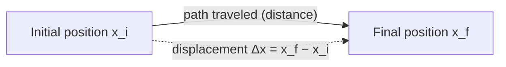
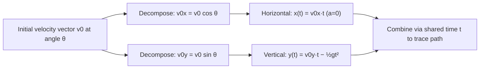
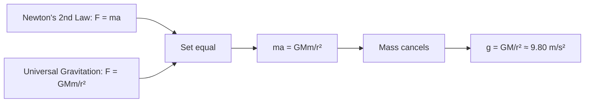
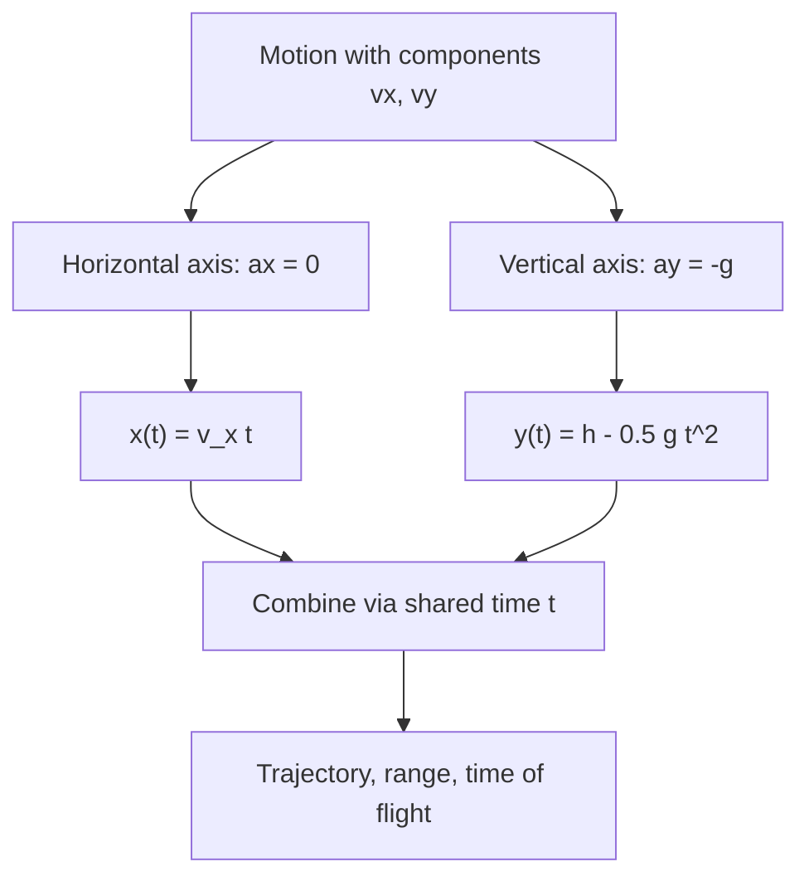
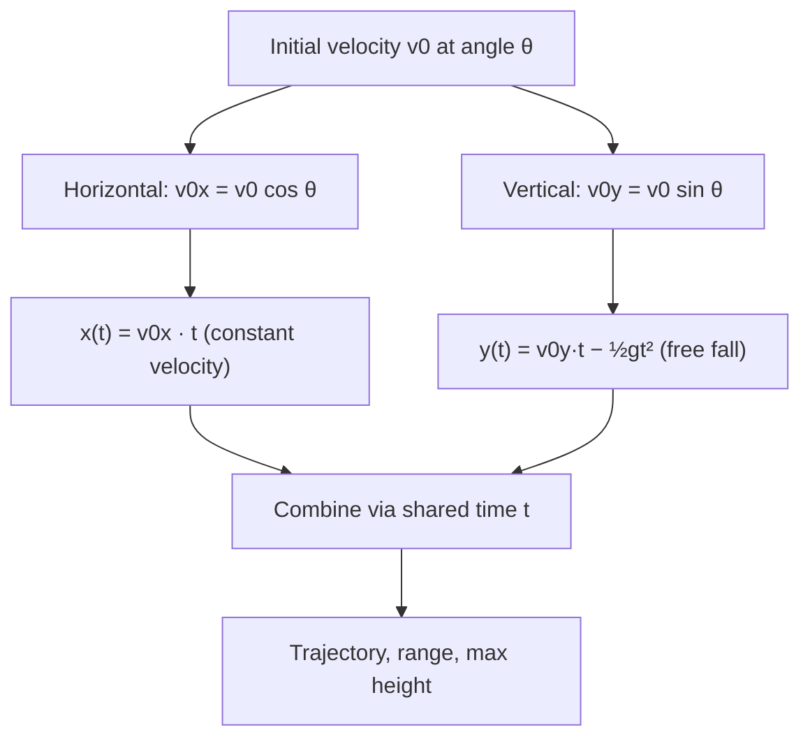
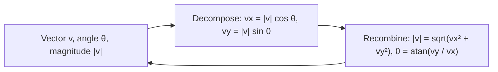
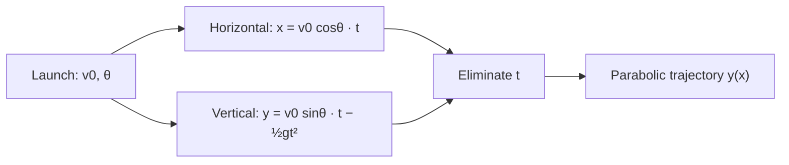
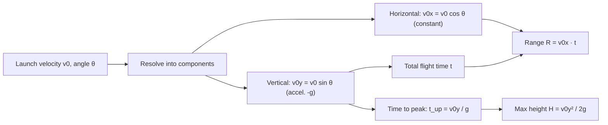

# SPL Run: build_concept_book

- **Adapter:** claude_cli
- **Model:** claude-sonnet-5
- **Tokens:** 16928 in / 9695 out
- **Latency:** 395193ms
- **Timestamp:** 2026-09-27 09:47:34

## Output

```output


---

## Vector

A vector is a mathematical object that carries both magnitude (size) and direction, distinguishing it from a scalar, which carries magnitude alone. Graphically, a vector is drawn as an arrow: its length represents magnitude, and the direction it points represents direction. In two dimensions, a vector $\vec{v}$ is written in component form as $\vec{v} = \langle v_x, v_y \rangle$, and its magnitude is $|\vec{v}| = \sqrt{v_x^2 + v_y^2}$, a direct application of the Pythagorean theorem. Because two vectors placed head-to-tail combine into a single resultant vector, addition is performed component-wise: $\vec{u} + \vec{v} = \langle u_x + v_x,\ u_y + v_y \rangle$. This combination rule is what makes vectors useful — they let us track quantities like displacement, velocity, and force, where direction changes the outcome and cannot be ignored.

**Worked example.** A hiker walks 3 km east, then 4 km north. Represent each leg as a vector: $\vec{A} = \langle 3, 0 \rangle$ and $\vec{B} = \langle 0, 4 \rangle$. The total displacement is $\vec{A} + \vec{B} = \langle 3, 4 \rangle$, with magnitude $|\vec{A}+\vec{B}| = \sqrt{3^2+4^2} = 5$ km. Note that 5 km is less than the total distance walked (7 km) — the vector sum captures net displacement, not path length, which is precisely why direction matters.

**Problem-solving application.** Vector addition extends directly to problems with more than two contributing quantities, as long as each is expressed in the same component form. Suppose the hiker continues with a third leg, walking 2 km west: $\vec{C} = \langle -2, 0 \rangle$. The new total displacement is $\vec{A} + \vec{B} + \vec{C} = \langle 3-2,\ 4 \rangle = \langle 1, 4 \rangle$, with magnitude $\sqrt{1^2+4^2} \approx 4.12$ km. The same component-wise addition applies regardless of how many vectors are combined or what physical quantity they represent — three forces pulling on an object, four velocity contributions in a moving reference frame, or a sequence of displacements — because addition is defined per component, and components along the same axis simply sum. This is the general strategy for any multi-vector problem: convert each vector to components, add matching components, then compute the magnitude of the result if a single size is needed.

---

## Displacement

Displacement measures how far an object's position has changed, and in which direction — it is not the same as distance traveled. If a runner completes one full lap of a 400-meter track, the distance traveled is 400 m, but the displacement is zero, because the runner ends up back where she started. Formally, displacement is defined as

$$\Delta x = x_f - x_i$$

where $x_i$ is the initial position and $x_f$ is the final position, both measured along a coordinate axis with a defined positive direction. Because $\Delta x$ carries a sign, it is a vector quantity, while distance — the total length of the path — is a scalar.

**Worked example.** A cyclist starts at position $x_i = 2\text{ m}$ on a straight bike path, rides forward to $x = 15\text{ m}$, then backtracks to $x_f = 9\text{ m}$. The total distance traveled is $13\text{ m} + 6\text{ m} = 19\text{ m}$. The displacement, however, depends only on start and end points:

$$\Delta x = x_f - x_i = 9\text{ m} - 2\text{ m} = 7\text{ m}$$

The positive sign indicates the net motion is in the positive direction, even though the cyclist reversed course partway through.

**Problem-solving application.** The same formula applies no matter how many segments a trip is broken into, because $\Delta x$ depends only on endpoints. Suppose a delivery drone starts at $x_i = 0\text{ m}$, flies to $x = 40\text{ m}$, returns to $x = 10\text{ m}$, then advances to $x_f = 25\text{ m}$. The distance traveled sums every leg: $40 + 30 + 15 = 85\text{ m}$. The displacement ignores the back-and-forth entirely:

$$\Delta x = x_f - x_i = 25\text{ m} - 0\text{ m} = 25\text{ m}$$

This property — that displacement collapses any number of intermediate moves into a single start-to-end difference — is what makes it useful for tracking net motion. A common error is to add up signed segment lengths as if computing distance; the correct method is always to subtract the final position from the initial one directly, regardless of the path's twists and turns.


*The dashed arrow shows displacement as the direct, straight-line change between start and end positions, independent of the actual path (solid arrow) taken.*

---

## Two Dimensional Kinematics

Two-dimensional kinematics describes motion in a plane by treating the horizontal and vertical directions as independent, simultaneous one-dimensional motions. Position, velocity, and acceleration become vectors, $\vec{r}(t)$, $\vec{v}(t)$, $\vec{a}(t)$, each split into $x$- and $y$-components: $\vec{r}(t) = x(t)\,\hat{i} + y(t)\,\hat{j}$. The key principle — first demonstrated by Galileo — is that these components do not interact: horizontal motion and vertical motion evolve independently, coupled only by a shared time variable $t$. This is why projectile motion, the classic application, can be solved as two separate one-dimensional problems.

**Worked example.** A ball is launched with initial speed $v_0 = 20\ \text{m/s}$ at angle $\theta = 30°$ above the horizontal, from ground level, with $g = 9.8\ \text{m/s}^2$. Decompose the initial velocity:
$$v_{0x} = v_0\cos\theta = 17.3\ \text{m/s}, \qquad v_{0y} = v_0\sin\theta = 10.0\ \text{m/s}$$
Horizontal motion has zero acceleration: $x(t) = v_{0x}t$. Vertical motion has constant acceleration $-g$: $y(t) = v_{0y}t - \tfrac{1}{2}gt^2$. Setting $y(t) = 0$ gives the time of flight $t_f = \dfrac{2v_{0y}}{g} = 2.04\ \text{s}$, and the range is $x(t_f) = v_{0x}t_f \approx 35.3\ \text{m}$.

**Problem-solving application.** The independence of components is the tool for handling any two-dimensional motion problem: (1) resolve all vectors into $x$- and $y$-components, (2) apply the appropriate one-dimensional kinematic equation to each axis separately, (3) use time as the shared link to recombine the results — for instance, finding where $y = 0$ to get $t_f$, then substituting into $x(t)$. A common pitfall is mixing components, such as using $v_0$ (the magnitude) instead of $v_{0x}$ in the horizontal equation; keeping the vector decomposition explicit at every step avoids this error.


*Diagram showing how a single velocity vector splits into independent horizontal and vertical motions, recombined through time to produce the trajectory.*

---

## Vector Components

Any vector in a plane can be decomposed into two perpendicular pieces — one along the horizontal axis, one along the vertical — such that adding them back together reconstructs the original vector exactly. This decomposition is not just a mathematical convenience; it reflects a physical reality: motion or force along the x-direction has no effect on what happens along the y-direction. The two components are independent, which is why decomposing a vector into components turns a single hard problem into two easy ones.

For a vector $\vec{A}$ with magnitude $A$ and direction angle $\theta$ measured from the positive x-axis, the components are

$$A_x = A\cos\theta, \qquad A_y = A\sin\theta,$$

and this relationship runs both ways: given the components, the original magnitude and direction are recovered by $A = \sqrt{A_x^2 + A_y^2}$ and $\theta = \tan^{-1}(A_y/A_x)$. These are simply the same statement read forward or backward — one primitive, not two.

**Worked example.** A drone's velocity is 20 m/s at 30° above the horizontal. Its horizontal component is $A_x = 20\cos30^\circ \approx 17.3$ m/s, and its vertical component is $A_y = 20\sin30^\circ = 10$ m/s. These two numbers tell you everything: after 1 second, the drone has moved 17.3 m horizontally and 10 m vertically — independently, as if two separate one-dimensional motions were happening at once.

**Problem-solving application.** Components matter most when several vectors must be combined. Suppose a hiker walks 5 km east, then 3 km at 60° north of east. Decompose the second leg the same way as above: $3\cos60^\circ = 1.5$ km east and $3\sin60^\circ \approx 2.6$ km north. Now the whole trip lives on two independent number lines, so combining it is just addition, not geometry: $5 + 1.5 = 6.5$ km east, $0 + 2.6 = 2.6$ km north. Feeding these totals back into the same recovery formulas gives the resultant displacement, $\sqrt{6.5^2+2.6^2} \approx 7.0$ km, at $\tan^{-1}(2.6/6.5) \approx 22^\circ$ north of east. Nothing new was invented here — decompose, do ordinary arithmetic on each axis, recompose — and that same three-step pattern is what makes projectile motion, forces on an incline, and net electric fields tractable.

---

## Acceleration Due To Gravity

Near Earth's surface, every freely falling object—regardless of mass—speeds up at the same rate: $g \approx 9.80\ \text{m/s}^2$, directed toward the center of the Earth. This constancy is not a coincidence but a consequence of Newton's second law combined with his law of universal gravitation. The gravitational force on an object of mass $m$ is $F = \dfrac{GMm}{r^2}$, where $M$ is Earth's mass and $r$ is the distance from Earth's center. Newton's second law gives $F = ma$, so setting the two expressions equal:

$$
ma = \frac{GMm}{r^2} \quad \Longrightarrow \quad a = \frac{GM}{r^2} = g
$$

The mass $m$ cancels, which is why a bowling ball and a feather accelerate identically in a vacuum—a result first demonstrated conceptually by Galileo and confirmed dramatically during the Apollo 15 Moon landing.

**Worked example.** A stone is dropped from rest off a 45 m cliff. How long does it take to hit the ground, and how fast is it moving on impact? Using the kinematic equation for constant acceleration, $y = \frac{1}{2}g t^2$ (taking downward as positive, initial velocity zero):

$$
45 = \frac{1}{2}(9.80)t^2 \quad \Longrightarrow \quad t^2 = 9.18 \quad \Longrightarrow \quad t \approx 3.03\ \text{s}
$$

The impact speed follows from $v = gt$:

$$
v = (9.80)(3.03) \approx 29.7\ \text{m/s}
$$

**Problem-solving application.** The constancy of $g$ lets you decouple motion into independent horizontal and vertical components—the foundation of projectile motion. For a ball launched horizontally at $20\ \text{m/s}$ from the same 45 m cliff, the vertical fall time is unaffected by the horizontal velocity: it is still $3.03\ \text{s}$, because gravity acts only vertically. The horizontal distance traveled is then simply $x = v_x t = (20)(3.03) \approx 60.6\ \text{m}$. This decoupling strategy—solve the vertical equation for time, then substitute into the horizontal equation—is the standard technique for any two-dimensional motion problem under gravity, from artillery trajectories to basketball shots.


*Derivation showing how equating Newton's second law with the law of universal gravitation yields the mass-independent constant g.*

---

## Independence Of Perpendicular Motions

**Definition.** In two-dimensional motion, the horizontal ($x$) and vertical ($y$) components of an object's motion are independent: the acceleration, velocity, and position along one axis do not depend on the motion along the perpendicular axis. This follows directly from the vector nature of Newton's second law. Force, acceleration, velocity, and displacement are all vectors, and Cartesian components of a vector combine additively but do not interact:

$$
\vec{a} = a_x\,\hat{x} + a_y\,\hat{y}, \qquad F_x = m a_x, \qquad F_y = m a_y
$$

Because $F_x$ depends only on forces acting along $x$ (and similarly for $F_y$), solving for $x(t)$ and $y(t)$ becomes two separate, uncoupled one-dimensional problems that share only a common time variable $t$.

**Worked example.** A ball is launched horizontally at $v_0 = 20\ \text{m/s}$ from a cliff of height $h = 45\ \text{m}$, with $g = 9.8\ \text{m/s}^2$. Vertically, the ball behaves exactly as if dropped from rest — the horizontal launch speed has zero effect on how fast it falls:

$$
y(t) = h - \tfrac{1}{2}g t^2 = 0 \quad\Rightarrow\quad t = \sqrt{\frac{2h}{g}} = \sqrt{\frac{2(45)}{9.8}} \approx 3.03\ \text{s}
$$

Horizontally, there is no acceleration ($a_x = 0$), so the ball travels at constant velocity for that same time:

$$
x = v_0 t \approx 20(3.03) \approx 60.6\ \text{m}
$$

Note the key move: $t$ is found purely from the vertical equation, then substituted into the horizontal equation. The two axes never exchange information except through $t$.

**Problem-solving application.** This independence is the standard strategy for any projectile problem: solve the vertical axis (constant acceleration $-g$) to find how long the motion lasts, solve the horizontal axis (constant velocity, $a_x = 0$) independently, then recombine the two results using the shared time $t$ to answer questions about range, time of flight, or trajectory. It also explains classic demonstrations, such as a bullet fired horizontally and a bullet dropped from the same height landing simultaneously — their vertical motions are identical despite vastly different horizontal speeds.


*The horizontal and vertical components evolve independently under their own kinematics, reuniting only through the shared time variable to describe the full trajectory.*

---

## One Dimensional Kinematics

One-dimensional kinematics describes motion along a single straight line without reference to the forces causing it. When acceleration $a$ is constant, three equations relate displacement $\Delta x$, initial velocity $v_0$, final velocity $v$, acceleration $a$, and elapsed time $t$:

$$v = v_0 + at$$
$$\Delta x = v_0 t + \tfrac{1}{2}at^2$$
$$v^2 = v_0^2 + 2a\,\Delta x$$

These follow directly from the definitions $a = \dfrac{dv}{dt}$ and $v = \dfrac{dx}{dt}$, integrated under the assumption that $a$ is constant in time. Each equation omits one variable, so the choice of formula is dictated by which quantities are known and which is sought.

**Worked example.** A car starts at rest ($v_0 = 0$) and accelerates at $a = 3\ \text{m/s}^2$ for $t = 4\ \text{s}$. Its final velocity is $v = 0 + (3)(4) = 12\ \text{m/s}$, and its displacement is $\Delta x = 0 + \tfrac{1}{2}(3)(4)^2 = 24\ \text{m}$. Checking with the third equation: $v^2 = 0 + 2(3)(24) = 144$, so $v = 12\ \text{m/s}$ — consistent.

**Problem-solving application.** The essential skill is variable identification: list what is given, what is asked, and select the equation that excludes the unknown you don't have. A common trap is sign convention — velocity, acceleration, and displacement must share a consistent positive direction, or braking ($a$ negative) and forward motion ($v_0$ positive) will produce contradictory results.

Consider a second scenario using the same three equations: a train decelerates from $v_0 = 30\ \text{m/s}$ to rest over a distance of $\Delta x = 150\ \text{m}$. Since $t$ is not given and not asked for, the third equation is the right tool: $0 = 30^2 + 2a(150)$, giving $a = -3\ \text{m/s}^2$. Once $a$ is known, the first equation yields $t = \dfrac{0 - 30}{-3} = 10\ \text{s}$. This two-step pattern — solving for an intermediate unknown before substituting into a second equation — is the core technique behind nearly all constant-acceleration problems, and it is worth practicing until the choice of equation becomes automatic from the list of knowns and unknowns alone.

---

## Projectile Motion

Projectile motion describes the path of an object launched into the air and acted on by gravity alone (air resistance neglected). The key insight is decomposition: horizontal and vertical motion are independent and can be analyzed separately, then recombined.

If a projectile launches with initial speed $v_0$ at angle $\theta$ above the horizontal, its initial velocity components are:
$$v_{0x} = v_0\cos\theta, \qquad v_{0y} = v_0\sin\theta$$

Horizontal motion has zero acceleration (constant velocity):
$$x(t) = v_{0x}\,t$$

Vertical motion is free fall under constant acceleration $-g$ (with $g \approx 9.8\ \text{m/s}^2$):
$$y(t) = v_{0y}\,t - \tfrac{1}{2}g t^2, \qquad v_y(t) = v_{0y} - g t$$

**Worked example.** A ball is launched at $v_0 = 20\ \text{m/s}$ at $\theta = 30°$. Then $v_{0x} = 20\cos30° \approx 17.3\ \text{m/s}$ and $v_{0y} = 20\sin30° = 10\ \text{m/s}$. Time to reach maximum height occurs when $v_y = 0$: $t_{\text{up}} = v_{0y}/g \approx 1.02\ \text{s}$. By symmetry, total flight time (returning to launch height) is $T = 2v_{0y}/g \approx 2.04\ \text{s}$. Horizontal range is $R = v_{0x} T \approx 35.3\ \text{m}$.

**Problem-solving application.** Combining $T = 2v_{0y}/g$ with $R = v_{0x}T$ yields the range formula:
$$R = \frac{v_0^2 \sin(2\theta)}{g}$$
This shows range is maximized at $\theta = 45°$, since $\sin(2\theta)$ peaks at $2\theta = 90°$. For a projectile landing at a different height than launch (e.g., a ball kicked off a cliff), don't reuse the symmetric-time shortcut — instead solve the quadratic $y(t) = y_0 + v_{0y}t - \tfrac{1}{2}gt^2 = y_{\text{final}}$ for $t$, then substitute into $x(t)$. This decomposition strategy — separate the axes, use kinematics independently, recombine via shared time $t$ — generalizes to any two-dimensional constant-acceleration problem, including motion on inclined planes or with wind resistance modeled as an added horizontal acceleration term.


*The independence of horizontal and vertical motion components, joined only by the shared time variable, to produce the full trajectory.*

---

## Trigonometric Functions

For a right triangle with an angle $\theta$, the three basic trigonometric ratios relate that angle to the lengths of the triangle's sides:

$$\sin\theta = \frac{\text{opposite}}{\text{hypotenuse}}, \qquad \cos\theta = \frac{\text{adjacent}}{\text{hypotenuse}}, \qquad \tan\theta = \frac{\text{opposite}}{\text{adjacent}} = \frac{\sin\theta}{\cos\theta}$$

These ratios extend naturally to describe vectors. Any vector $\vec{v}$ in the plane, drawn from the origin, makes an angle $\theta$ with the positive $x$-axis and has a length (magnitude) $|\vec{v}|$. Its horizontal and vertical components are then:

$$v_x = |\vec{v}|\cos\theta, \qquad v_y = |\vec{v}|\sin\theta$$

This is exactly the right-triangle relationship, with the vector as the hypotenuse and its components as the legs. Running the relationship in reverse — using the Pythagorean theorem and the inverse tangent — recovers magnitude and direction from known components:

$$|\vec{v}| = \sqrt{v_x^2 + v_y^2}, \qquad \theta = \tan^{-1}\!\left(\frac{v_y}{v_x}\right)$$

**Worked example.** A force vector has magnitude $50\text{ N}$ directed at $\theta = 37°$ above the horizontal. Decomposing it:

$$F_x = 50\cos(37°) \approx 50(0.799) \approx 39.9\text{ N}$$
$$F_y = 50\sin(37°) \approx 50(0.602) \approx 30.1\text{ N}$$

Conversely, if only the components are known — say $v_x = 3$ and $v_y = 4$ — the same reverse relationship gives $|\vec{v}| = \sqrt{9+16} = 5$ and $\theta = \tan^{-1}(4/3) \approx 53.1°$.

**Problem-solving application.** A common use of decomposition is finding how much of a vector acts along a particular direction. Suppose a $100\text{ N}$ force is applied at $30°$ to the direction of motion of a crate. Only the component along the motion, $F_x = 100\cos(30°) \approx 86.6\text{ N}$, does work moving the crate; the perpendicular component, $F_y = 100\sin(30°) = 50\text{ N}$, does not. Given the resulting horizontal and vertical effects instead, the inverse relationship recovers the original applied force and angle. This decompose-then-recombine cycle, using only the ratios above, is the core skill needed before tackling problems that involve combining several vectors at once.



*How trigonometric ratios decompose a vector into components and recover magnitude and direction from those components.*

---

## Projectile Maximum Height

When a projectile is launched with an initial velocity that has a vertical component $v_{0y}$, gravity decelerates that vertical motion at rate $g$ until, at the peak of the trajectory, the vertical velocity momentarily equals zero. Beyond that instant, gravity accelerates the projectile back downward. The height at which this turning point occurs — the maximum height $H$ — depends only on $v_{0y}$, not on the horizontal velocity component or on time directly.

This result follows from the kinematic equation $v_y^2 = v_{0y}^2 - 2gH$. Setting $v_y = 0$ at the peak and solving for $H$ gives:

$$H = \frac{v_{0y}^2}{2g}$$

Note that $H$ scales with the *square* of $v_{0y}$: doubling the vertical launch speed quadruples the maximum height, not doubles it. This is because kinetic energy associated with vertical motion, $\tfrac{1}{2}mv_{0y}^2$, converts entirely into gravitational potential energy $mgH$ at the peak — an energy-conservation view that yields the same formula.

**Worked example.** A ball is launched at $30\text{ m/s}$ at an angle of $40°$ above the horizontal. The vertical component is $v_{0y} = 30\sin(40°) \approx 19.28\text{ m/s}$. Using $g = 9.8\text{ m/s}^2$:

$$H = \frac{(19.28)^2}{2(9.8)} \approx \frac{371.7}{19.6} \approx 18.96\text{ m}$$

The ball rises to roughly 19 meters, regardless of its horizontal speed component, $30\cos(40°) \approx 22.98\text{ m/s}$, which affects only how far it travels, not how high.

**Problem-solving application.** This formula is most useful when working backward from a measured or target height to recover launch conditions, or when comparing two launches. For instance, if a design requirement specifies a projectile must clear a 12 m wall, rearranging gives the minimum vertical velocity needed: $v_{0y} = \sqrt{2gH} = \sqrt{2(9.8)(12)} \approx 15.3\text{ m/s}$. Any launch angle and total speed combination satisfying $v_0\sin\theta \geq 15.3\text{ m/s}$ will clear the wall. This decoupling of vertical and horizontal motion — a direct consequence of treating projectile motion as two independent one-dimensional problems — is the core problem-solving strategy for the entire topic: solve the vertical motion for height and time-of-flight, then use that time in the horizontal equation for range.

---

## Projectile Range

For a projectile launched from and landing on the same horizontal level, with initial speed $v_0$ and launch angle $\theta_0$ above the horizontal, the horizontal distance traveled — the **range** — is

$$R = \frac{v_0^2 \sin(2\theta_0)}{g}$$

This follows directly from the kinematic equations for projectile motion, which separate into independent horizontal and vertical components. The horizontal velocity $v_0\cos\theta_0$ is constant (no horizontal force, ignoring air resistance), while the vertical motion decelerates under gravity $g$. Setting the vertical displacement to zero gives the time of flight $t = \dfrac{2v_0\sin\theta_0}{g}$. Multiplying by the horizontal velocity yields $R = v_0\cos\theta_0 \cdot \dfrac{2v_0\sin\theta_0}{g} = \dfrac{2v_0^2\sin\theta_0\cos\theta_0}{g}$, which simplifies to the boxed formula using the identity $2\sin\theta_0\cos\theta_0 = \sin(2\theta_0)$.

Because $\sin(2\theta_0)$ reaches its maximum value of 1 when $2\theta_0 = 90°$, the range is maximized at $\theta_0 = 45°$, giving $R_{\max} = v_0^2/g$. Note also that any two angles symmetric about 45° (e.g., 30° and 60°) produce the *same* range, since $\sin(2\theta_0) = \sin(180° - 2\theta_0)$.

**Worked example:** A soccer ball is kicked at $v_0 = 20\ \text{m/s}$ at $\theta_0 = 35°$. Using $g = 9.8\ \text{m/s}^2$:

$$R = \frac{(20)^2 \sin(70°)}{9.8} = \frac{400 \times 0.940}{9.8} \approx 38.3\ \text{m}$$

**Problem-solving application:** Suppose a coach wants a kick to travel exactly 30 m with the same initial speed of 20 m/s. Solve for $\theta_0$:

$$\sin(2\theta_0) = \frac{Rg}{v_0^2} = \frac{30 \times 9.8}{400} = 0.735$$

$$2\theta_0 = \sin^{-1}(0.735) = 47.3° \quad \text{or} \quad 132.7°$$

$$\theta_0 = 23.65° \quad \text{or} \quad 66.35°$$

Both angles are valid solutions — a low, flat trajectory or a high, arcing one — illustrating the symmetry property directly. This dual-solution structure is common in range problems: whenever $R < R_{\max}$, two distinct launch angles achieve it, and recognizing this without redoing the full derivation each time is a key problem-solving shortcut.

---

## Trajectory

A trajectory is the path traced by a projectile moving under constant gravitational acceleration alone, once launched. Because horizontal and vertical motion are independent (Galileo's key insight), each axis obeys its own simple kinematic equation, and combining them produces the curved path.

Set up coordinates with the launch point at the origin, launch speed $v_0$, and launch angle $\theta$ above the horizontal. The initial velocity components are $v_{0x} = v_0\cos\theta$ and $v_{0y} = v_0\sin\theta$. Horizontal velocity stays constant (no horizontal force, ignoring air resistance), while vertical velocity changes under gravitational acceleration $g$:

$$x(t) = v_0\cos\theta \, t, \qquad y(t) = v_0\sin\theta \, t - \tfrac{1}{2}g t^2$$

Solving the first equation for $t = x / (v_0\cos\theta)$ and substituting into the second eliminates time entirely, giving $y$ as a function of $x$:

$$y(x) = x\tan\theta - \frac{g}{2v_0^2\cos^2\theta}\,x^2$$

This is a quadratic in $x$, confirming that the trajectory is a parabola — the "combining" in the definition is literally the algebraic elimination of the shared parameter $t$.

**Worked example.** A ball is launched at $v_0 = 20\ \text{m/s}$, $\theta = 30°$, with $g = 9.8\ \text{m/s}^2$. Time of flight (return to launch height) is found by setting $y(t)=0$: $t = 2v_0\sin\theta/g = 2(20)(0.5)/9.8 \approx 2.04\ \text{s}$. Range is $x = v_0\cos\theta \cdot t \approx (20)(0.866)(2.04) \approx 35.3\ \text{m}$. Maximum height occurs at half the flight time, $t=1.02\ \text{s}$: $y_{max} = v_0\sin\theta\, t - \tfrac12 g t^2 \approx 10.2 - 5.1 \approx 5.1\ \text{m}$.

**Problem-solving application.** The parabolic form reveals a useful shortcut: range $R = \dfrac{v_0^2\sin(2\theta)}{g}$, maximized when $\theta = 45°$ since $\sin(2\theta)$ peaks at $2\theta = 90°$. This lets you answer optimization questions — "at what angle does a cannon achieve maximum range?" — without re-deriving the trajectory each time. It also explains a classic symmetry: launch angles $\theta$ and $90°-\theta$ give the same range but different flight times and peak heights, since $\sin(2\theta) = \sin(2(90°-\theta))$.


*How independent horizontal and vertical motion combine, via elimination of the time parameter, into the parabolic trajectory equation.*

---

## Projectile Motion Applications

Projectile motion — the curved path of an object launched into the air and acted on only by gravity — governs phenomena as varied as a fireworks shell bursting overhead, a chunk of volcanic ejecta arcing back to the ground, and a soccer ball sailing toward a goal. The key insight is that horizontal and vertical motion are independent: gravity ($g = 9.8\ \text{m/s}^2$) acts only vertically, while horizontal velocity stays constant (ignoring air resistance).

Resolve the launch velocity $v_0$ at angle $\theta$ into components:
$$v_{0x} = v_0\cos\theta, \qquad v_{0y} = v_0\sin\theta$$

Three quantities follow directly. Time to reach maximum height occurs when vertical velocity is zero: $t_{up} = v_{0y}/g$. Maximum height is
$$H = \frac{v_{0y}^2}{2g}$$
For a launch and landing at the same elevation, total flight time is $t = 2v_{0y}/g$, giving range
$$R = v_{0x} \cdot t = \frac{v_0^2 \sin(2\theta)}{g}$$
Since $\sin(2\theta)$ peaks at $\theta = 45°$, this angle maximizes range for equal launch/landing heights — a fact coaches and artillery engineers alike exploit.

**Worked example:** A fireworks shell launches at $v_0 = 40\ \text{m/s}$, $\theta = 60°$. Then $v_{0y} = 40\sin(60°) \approx 34.6\ \text{m/s}$ and $v_{0x} = 40\cos(60°) = 20\ \text{m/s}$. Maximum height: $H = (34.6)^2/(2 \times 9.8) \approx 61.2\ \text{m}$ — the altitude at which the shell detonates. Impact velocity (if it fell back to launch height) equals $v_0$ in magnitude, but a fireworks shell instead explodes at $H$, so its fragments inherit only the residual horizontal velocity plus whatever the burst imparts.

**Problem-solving application:** Volcanic ejecta and sports problems often add a twist — unequal launch and landing heights. If a projectile launches from height $y_0$, use kinematics directly: solve $y_0 + v_{0y}t - \tfrac12 g t^2 = 0$ for $t$ via the quadratic formula, then substitute into $R = v_{0x}t$. This generalizes the range formula and is essential for volcanology (ejecta landing below the crater rim) and sports (a golf ball launched from an elevated tee). Always separate the two axes, solve time from the vertical equation, then apply that time to the horizontal one.


*Diagram showing how launch velocity splits into independent horizontal and vertical components, which separately determine flight time, maximum height, and range.*

---

## Payoff

Projectile motion applications mark the point where kinematics stops being an abstract exercise in decomposing vectors and becomes a working toolkit for predicting where a moving object will land, how high it will rise, and what launch conditions produce a desired outcome. Everything built earlier — constant acceleration equations, independence of horizontal and vertical motion, and the trajectory equation $y = x\tan\theta - \dfrac{g x^2}{2v_0^2\cos^2\theta}$ — converges here into a single predictive framework. This is the natural endpoint of the unit because it is the first place where you *solve for* a launch parameter rather than merely describing motion: given a target distance, height, or time, you invert the equations to find $v_0$, $\theta$, or $t$.

**Worked example.** A engineer designs an emergency water-cannon system that must clear a 12 m wide fire zone and land precisely on a target 40 m away, launched from ground level. Using the range equation $R = \dfrac{v_0^2 \sin(2\theta)}{g}$, if $v_0 = 22\ \text{m/s}$ is fixed by the pump's capability, solving $40 = \dfrac{22^2 \sin(2\theta)}{9.8}$ gives $\sin(2\theta) \approx 0.802$, so $\theta \approx 26.5^\circ$ or $63.5^\circ$ — the two complementary angles that share a range, a direct consequence of $\sin(2\theta) = \sin(180^\circ - 2\theta)$. Choosing the lower angle produces a flatter, faster arc; the higher angle clears obstacles at the cost of hang time. This dual-solution structure is not a curiosity — it is the decision variable engineers exploit.

This is where the concept earns its keep across domains. In sports science, it explains why a soccer free kick and a basketball three-pointer favor different launch angles despite both maximizing range or accuracy. In ballistics and artillery, the same range equation, extended with air resistance, sets firing tables. In aerospace, suborbital and payload-drop trajectories use identical decomposition logic scaled to different accelerations. In civil and mechanical engineering, it governs debris-clearance zones, sprinkler and firefighting equipment, and even conveyor-discharge design.

From here, pick one domain — sports biomechanics, artillery ballistics, or spacecraft payload deployment — and trace how the idealized equations above are modified by drag, spin, or variable gravity to match real-world precision.
```
