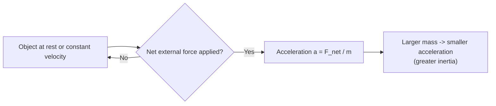
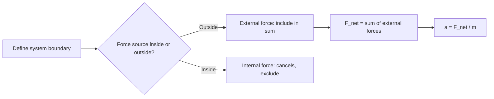
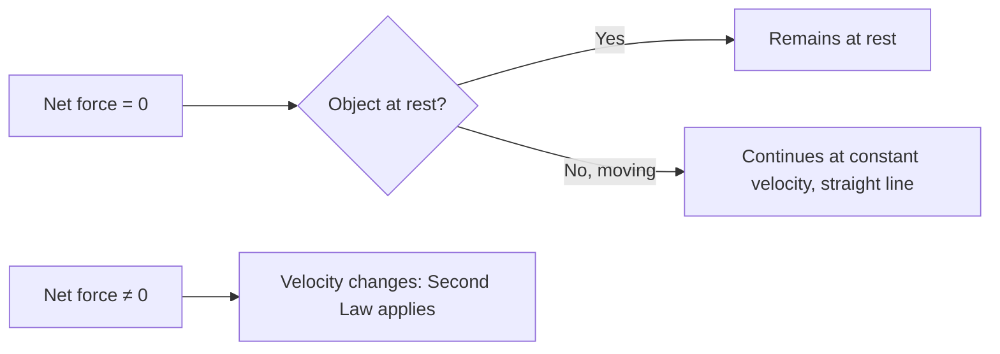

# SPL Run: build_concept_book

- **Adapter:** claude_cli
- **Model:** claude-sonnet-5
- **Tokens:** 19814 in / 11159 out
- **Latency:** 320858ms
- **Timestamp:** 2026-09-27 09:54:59

## Output

```output


---

## Force

A force is any push or pull exerted on an object as a result of its interaction with another object. Because a force has both a size and a direction, it is a **vector quantity**: pushing a box with $10\text{ N}$ to the right produces a completely different outcome than pushing it with $10\text{ N}$ downward, even though the magnitude is identical. Forces are measured in newtons ($1\text{ N} = 1\text{ kg·m/s}^2$), and their effect on motion is governed by Newton's second law, $\vec{F}_{net} = m\vec{a}$, where $\vec{F}_{net}$ is the vector sum of every force acting on the object.

Because forces add like vectors, not like plain numbers, two forces acting on the same object combine by components. Suppose a $50\text{ N}$ force pulls east and a $30\text{ N}$ force pulls north on the same crate. The net force is not $80\text{ N}$; it is the vector sum:
$$
\vec{F}_{net} = (50\,\hat{x} + 30\,\hat{y})\ \text{N}, \qquad |\vec{F}_{net}| = \sqrt{50^2 + 30^2} \approx 58.3\ \text{N}
$$
directed at $\arctan(30/50) \approx 31^\circ$ north of east. This is why resolving forces into perpendicular ($x$- and $y$-) components before adding them is the standard first move in any force problem — it converts a geometric vector-addition problem into simple arithmetic on each axis.

**Problem-solving application:** A $2\text{ kg}$ block sits on a frictionless table. A rope pulls it with $12\text{ N}$ at $30^\circ$ above the horizontal, while a second rope pulls it with $8\text{ N}$ purely horizontally in the opposite direction. Find the block's acceleration.

Step 1 — resolve into components: rope 1 gives $F_{1x} = 12\cos30^\circ \approx 10.39\text{ N}$, $F_{1y} = 12\sin30^\circ = 6\text{ N}$; rope 2 gives $F_{2x} = -8\text{ N}$.
Step 2 — sum by axis: $F_{net,x} \approx 2.39\text{ N}$, $F_{net,y} = 6\text{ N}$ (a normal force and gravity cancel vertically only if the block stays on the table — here the vertical pull would need to be checked against the normal force, but treating this as a pure horizontal-plane problem gives $a_x = F_{net,x}/m \approx 1.2\text{ m/s}^2$).
Step 3 — interpret: the block accelerates predominantly in the direction of the stronger, more aligned force — illustrating that "adding forces" always means adding components, never magnitudes directly.

---

## Dynamics

Dynamics is the branch of mechanics that explains *why* objects move the way they do — it connects motion (kinematics) to its cause: force. Where kinematics asks "how fast, how far," dynamics asks "what pushed or pulled it, and how much." The single governing relationship is Newton's second law: $\vec{F}_{net} = m\vec{a}$ — the net force acting on an object equals its mass times its acceleration. The first law (an object's motion doesn't change unless a net force acts on it) and the third law (forces come in equal-and-opposite pairs) simply describe *when* and *why* a net force arises; the second law is the equation you actually solve. Everything in dynamics comes down to identifying the forces on an object and applying $\vec{F}_{net} = m\vec{a}$.

**Worked example.** A 1200 kg car accelerates from rest to 20 m/s in 8 seconds on a flat road. What net force did the engine's drive system need to supply, and how does this change if a constant 400 N air-resistance force is also present?

First find acceleration: $a = \dfrac{\Delta v}{\Delta t} = \dfrac{20 - 0}{8} = 2.5\ \text{m/s}^2$.

Without resistance, $F_{net} = ma = 1200 \times 2.5 = 3000\ \text{N}$.

With air resistance, the net force must still equal 3000 N, but now $F_{net} = F_{engine} - F_{drag}$, so the engine must supply $F_{engine} = 3000 + 400 = 3400\ \text{N}$.

**Problem-solving application.** Every dynamics problem follows the same recipe: (1) isolate the object, (2) list every force acting on it, (3) sum those forces along a convenient axis, (4) set the sum equal to $ma$, (5) solve algebraically before plugging in numbers. The car example above shows this recipe on a single axis with two opposing forces (engine thrust, drag); the identical equation and the identical recipe apply no matter how many forces are present or how the object is oriented in space — you are always just totaling forces and dividing by mass. Mastering this one move — reducing any physical scenario to a force list and applying $F_{net} = ma$ — is the central skill dynamics builds, and it is the same skill that later lets you analyze inclines, orbits, and structural loads once you learn to resolve forces into components.

---

## Mass

Mass is the quantity of matter contained in an object, measured in kilograms (kg) in the SI system. It is a scalar and an intrinsic, additive property: two 2 kg blocks combined have a mass of 4 kg regardless of location, whether on Earth, the Moon, or in deep space. Mass is measured operationally through Newton's second law,

$$
F = ma \quad \Longrightarrow \quad m = \frac{F}{a},
$$

which says that a fixed force produces less acceleration on a more massive object — mass quantifies an object's resistance to being accelerated.

This distinguishes mass from **weight**, the gravitational force on an object, $W = mg$, which does vary with location because the gravitational acceleration $g$ changes from place to place.

**Worked example.** A 10 kg block is pushed across a frictionless surface with a net force of 25 N. Its acceleration is

$$
a = \frac{F}{m} = \frac{25\ \text{N}}{10\ \text{kg}} = 2.5\ \text{m/s}^2.
$$

If the same block is transported to the Moon, where $g$ drops from $9.8\ \text{m/s}^2$ to $1.6\ \text{m/s}^2$, its weight changes from 98 N to 16 N — but its mass remains 10 kg, and pushing it with 25 N still produces the same $2.5\ \text{m/s}^2$ acceleration, since mass is unaffected by gravity.

**Problem-solving application.** Because mass is additive and location-independent, it can be tracked as a conserved quantity through a physical process even when the object's shape, state, or location changes. Suppose 2 kg of ice at 0°C melts completely into water. No matter is created or destroyed, so the resulting water has a mass of exactly 2 kg — even though its volume shrinks by about 9%. The same reasoning applies to any mixing, phase change, or combination of masses: the total mass equals the sum of the parts, $m_{\text{total}} = m_1 + m_2 + \dots$, unless matter is physically added or removed. Recognizing mass as the conserved, additive quantity — as opposed to volume, weight, or force, all of which can change under identical conditions — is often the deciding step in correctly setting up a physics or chemistry problem.

---

## System Of Interest

A **system of interest** is the specific object, or the specific collection of objects, that you deliberately choose to isolate for analysis. Drawing this boundary is not a formality — it is the single decision that determines which forces you must account for and which you can ignore. Any force exerted by something *outside* the boundary on something *inside* it is an **external force** and belongs in your analysis. Any force exerted between two objects that are both *inside* the boundary is an **internal force**; by Newton's third law it appears as an action-reaction pair entirely within the system, and if you are only interested in the system's overall motion, internal forces cancel and can be dropped from the sum.

**Worked example.** Consider a locomotive pulling two rail cars connected by couplers, accelerating along a straight, frictionless track. If your system of interest is "the locomotive plus both cars" (treated as one combined object), the coupler tensions are internal forces — they pull each car forward and pull the neighboring car backward with equal magnitude, so they vanish from the net-force calculation. Only the engine's driving force and gravity/normal force (which cancel vertically) remain external, giving $F_{net} = (m_1+m_2+m_3)a$. But if you instead redraw the boundary around just the second car, the coupler tensions on *both* sides of that car become external forces, because the objects producing them (the first car and the third car) now lie outside the boundary. The physics hasn't changed — the acceleration $a$ is the same — but the bookkeeping of which forces you write down has changed completely.

**Problem-solving application.** When a problem is difficult with one choice of system, redrawing the boundary is often the fastest way forward. To find the *tension in a specific coupler*, you must isolate a system that puts that coupler on the boundary — analyzing the whole train, where it's internal, tells you nothing about it. Conversely, to find the *overall acceleration*, the biggest system you can justify is usually best, since it eliminates the most unknowns. A reliable strategy: identify the one quantity the problem asks for, then choose the smallest system whose boundary is crossed by a force involving that quantity.

---

## Velocity

Velocity is a vector quantity describing both the rate of change of an object's position and the direction of that change. This distinguishes it from speed, which captures only magnitude. For motion along a straight line, average velocity over a time interval is defined as

$$\bar{v} = \frac{\Delta x}{\Delta t} = \frac{x_2 - x_1}{t_2 - t_1}$$

where $x_1$ and $x_2$ are positions at times $t_1$ and $t_2$. As $\Delta t$ shrinks toward zero, this ratio converges to the instantaneous velocity, defined as the time derivative of position:

$$v(t) = \frac{dx}{dt} = \lim_{\Delta t \to 0} \frac{x(t + \Delta t) - x(t)}{\Delta t}$$

This limit definition is essential — velocity is not merely "distance over time," but the *slope of the position-time curve at a single instant*, which is why calculus, not arithmetic, is the correct tool for describing motion that changes continuously.

**Worked example.** Suppose a particle's position is given by $x(t) = 3t^2 - 2t + 1$ meters, with $t$ in seconds. To find the velocity at $t = 4\text{ s}$, differentiate: $v(t) = \frac{dx}{dt} = 6t - 2$. At $t = 4$, $v(4) = 6(4) - 2 = 22\ \text{m/s}$. This is the instantaneous velocity — the reading a speedometer-with-direction would show at that exact moment, distinct from the average velocity over, say, the interval $[0, 4]$, which would be $\bar{v} = \frac{x(4)-x(0)}{4-0} = \frac{41 - 1}{4} = 10\ \text{m/s}$. The discrepancy between 22 and 10 m/s illustrates why instantaneous and average velocity must never be conflated when motion is non-uniform.

**Problem-solving application.** Velocity graphs let you extract or verify motion information geometrically: the slope of a position-time graph gives velocity, and the *area* under a velocity-time graph gives displacement, since $\Delta x = \int_{t_1}^{t_2} v(t)\,dt$. This inverse relationship — differentiation to go from position to velocity, integration to go back — is the core toolkit for solving kinematics problems where you're given one function (position, velocity, or acceleration) and asked to reconstruct another, such as finding total displacement from a velocity function that changes sign (indicating a reversal in direction).

---

## Acceleration

Acceleration is the rate at which velocity changes over time. Because velocity is a vector — carrying both magnitude (speed) and direction — acceleration occurs whenever either one changes: speeding up, slowing down, or turning, even at constant speed. Average acceleration over a time interval is defined as

$$
\vec{a}_{avg} = \frac{\Delta \vec{v}}{\Delta t} = \frac{\vec{v}_f - \vec{v}_i}{t_f - t_i}
$$

Instantaneous acceleration, the value at a single moment, is the derivative of velocity with respect to time, $\vec{a} = \dfrac{d\vec{v}}{dt}$, and since velocity itself is $\dfrac{d\vec{x}}{dt}$, acceleration is the second derivative of position: $\vec{a} = \dfrac{d^2\vec{x}}{dt^2}$. This derivative structure is not optional formalism — it is what makes acceleration a *local* quantity, telling you the instantaneous curvature of a motion graph rather than a coarse average, and it is exactly what lets calculus-based kinematics predict position and velocity at any future time via integration.

**Worked example.** A car traveling east at $12\ \text{m/s}$ speeds up uniformly to $28\ \text{m/s}$ over $8.0\ \text{s}$. Its average acceleration is

$$
a = \frac{28 - 12}{8.0} = 2.0\ \text{m/s}^2 \text{ (east)}
$$

Now suppose the same car instead maintains a constant $20\ \text{m/s}$ but goes around a circular curve of radius $50\ \text{m}$. Its speed never changes, yet it is still accelerating, because direction changes continuously. This centripetal acceleration has magnitude $a_c = v^2/r = (20)^2/50 = 8.0\ \text{m/s}^2$, directed toward the center of the curve — a case invisible to a purely speed-based intuition of acceleration.

**Problem-solving application.** When acceleration is constant, the derivative relation integrates cleanly into the kinematic equations $v_f = v_i + at$ and $x_f = x_i + v_i t + \tfrac{1}{2}at^2$, which let you solve for any unknown (time, displacement, final velocity) given the others — the standard toolkit for projectile motion, braking distance, and launch problems. For non-uniform acceleration, such as a rocket burning fuel, you must instead integrate $a(t)$ directly: $v(t) = v_0 + \int_0^t a(\tau)\, d\tau$. Recognizing which regime you're in — constant $a$ versus $a(t)$ — is the first decision in any kinematics problem, and determines whether algebraic formulas or integration is the correct tool.

---

## Inertia

Inertia is the tendency of an object to resist changes in its state of motion — an object at rest stays at rest, and an object moving at constant velocity keeps moving at that same speed and direction, unless acted on by a net external force. That behavior is Newton's First Law, which you have already met; inertia is simply the name for the resistance it describes. Some objects need only a light push to speed up, while others barely budge under a hard shove — inertia is the property responsible for that difference.

Recall from Newton's Second Law that $\vec{F}_{\text{net}} = m\vec{a}$, so $\vec{a} = \vec{F}_{\text{net}}/m$. For a fixed net force, acceleration is inversely proportional to mass — doubling the mass halves the acceleration. This is what lets us measure inertia numerically: mass $m$ is not just "amount of stuff," but a direct measure of an object's resistance to being sped up, slowed down, or redirected.

**Worked example.** A shopping cart of mass $15\ \text{kg}$ and a loaded cart of mass $60\ \text{kg}$ are each pushed with the same force, $\vec{F} = 30\ \text{N}$. Their accelerations are

$$
a_{\text{light}} = \frac{30\ \text{N}}{15\ \text{kg}} = 2.0\ \text{m/s}^2, \qquad a_{\text{heavy}} = \frac{30\ \text{N}}{60\ \text{kg}} = 0.5\ \text{m/s}^2.
$$

The heavier cart accelerates four times more slowly, even though the applied force is identical — a direct demonstration that mass quantifies inertia.

**Problem-solving application.** Inertia reasoning is essential whenever you must find a missing force, mass, or acceleration in a system. Suppose a $1200\ \text{kg}$ car decelerates uniformly from $25\ \text{m/s}$ to rest in $5.0\ \text{s}$. First find the acceleration: $a = \Delta v/\Delta t = (0 - 25)/5.0 = -5.0\ \text{m/s}^2$. Then apply $F_{\text{net}} = ma = (1200)(-5.0) = -6000\ \text{N}$, meaning a net braking force of $6000\ \text{N}$ acted opposite to the car's motion. This two-step pattern — extract kinematics, then apply $F = ma$ — is the standard method for connecting observed motion to the forces (and the inertia) producing it, underlying problems from seatbelt design to rocket propulsion.


*How Newton's First Law (no net force → no change in motion) connects to the Second Law, showing mass as the measure of inertial resistance to acceleration.*

---

## Net External Force

The net external force, $\vec{F}_{\text{net}} = \sum \vec{F}_{\text{ext}}$, is the vector sum of every force acting on a system that originates outside its defined boundary. Internal forces — the ones objects within the system exert on each other — always cancel in pairs by Newton's third law and never appear in this sum. This distinction matters because Newton's second law, $\vec{F}_{\text{net}} = m\vec{a}$, only holds when $\vec{F}_{\text{net}}$ is computed correctly: include an internal force by mistake and the equation gives a wrong acceleration; omit an external one and you miss real motion. Choosing the system boundary is therefore not a bookkeeping formality — it determines which forces count as "external" and which vanish from the calculation entirely.

**Worked example.** Two blocks, $m_1 = 2\ \text{kg}$ and $m_2 = 3\ \text{kg}$, sit in contact on a frictionless floor. A horizontal push $F = 10\ \text{N}$ is applied to $m_1$. If we define the system as *both blocks together*, the contact force between them is internal and cancels out. The only external horizontal force is $F$, so
$$a = \frac{F_{\text{net}}}{m_1+m_2} = \frac{10}{5} = 2\ \text{m/s}^2.$$
Now shrink the boundary to just $m_2$. The push $F$ is no longer external to this smaller system — it never touches $m_2$ directly. The only external horizontal force on $m_2$ is the contact push $N$ from $m_1$. Since both blocks share the same acceleration, $N = m_2 a = 3(2) = 6\ \text{N}$. Redefining the boundary changed which forces counted as external, but the physics — and the acceleration — stayed consistent.

**Problem-solving application.** When solving multi-body problems, first isolate each object with a free-body diagram, then ask of every force: "does its source lie inside or outside my chosen boundary?" Only external forces enter $\sum \vec{F}_{\text{ext}} = m\vec{a}$ for that isolated body. A common error is including the reaction partner of an internal pair (e.g., friction between two blocks in contact) when the boundary encloses both — always check whether the force's origin and its target are both inside the same system before discarding it as internal.


*Decision flow for classifying forces as external or internal when computing net force on a chosen system.*

---

## Free Body Diagram

A free body diagram (FBD) isolates a single object from its surroundings and represents every external force acting on it as a vector originating from a point. The object itself is drawn as a dot or a simple box; internal forces (parts of the object pushing on each other) are excluded entirely, and only forces exerted *on* the body *by* something else — gravity, normal force, tension, friction, applied push or pull — appear. The diagram is not a picture of the physical scene; it is an abstraction whose sole purpose is to let you apply Newton's second law, $\sum \vec{F} = m\vec{a}$, correctly along chosen coordinate axes.

**Worked example.** A 10 kg block rests on a frictionless incline at $30^\circ$, held stationary by a rope parallel to the incline surface. To find the tension $T$, first isolate the block. Three forces act on it: gravity $\vec{W} = mg$ pointing straight down, the normal force $\vec{N}$ perpendicular to the incline surface, and tension $\vec{T}$ up the incline. Draw these three vectors from a single point representing the block — this is the FBD.

Rather than resolving gravity into components immediately, it is standard practice to tilt the coordinate system so the $x$-axis lies along the incline. Then $W_x = mg\sin\theta$ (down the incline) and $W_y = mg\cos\theta$ (into the surface). Newton's second law along each axis, with the block in equilibrium, gives:
$$T - mg\sin\theta = 0 \quad\Rightarrow\quad T = mg\sin\theta = (10)(9.8)(0.5) = 49\ \text{N}$$
$$N - mg\cos\theta = 0 \quad\Rightarrow\quad N = mg\cos\theta \approx 84.9\ \text{N}$$

The diagram did the real work here: by forcing every force onto the page as a vector, it made clear which forces have components along which axis, preventing the common error of forgetting the normal force or misassigning gravity's direction.

**Problem-solving application.** The systematic value of an FBD emerges in multi-body problems — e.g., two blocks connected by a rope over a pulley. Draw a *separate* FBD for each block. Tension appears in both diagrams but is treated as a shared unknown, since by Newton's third law the rope pulls each block with equal magnitude. Writing $\sum F = ma$ for each isolated body yields one equation per block; solving simultaneously determines both the acceleration and the tension. The discipline of isolating one body at a time — never lumping two objects into one diagram unless they move together as a rigid unit — is what makes complex force problems tractable.

---

## Newton's First Law

Newton's First Law states that an object remains at rest, or continues moving at constant velocity in a straight line, unless a net external force acts on it. Formally, if the net force on a body is zero,

$$\sum \vec{F} = 0 \quad \Rightarrow \quad \frac{d\vec{v}}{dt} = 0$$

This law introduces **inertia** — the property of matter that resists changes in motion, quantified later by mass in the Second Law. The key conceptual shift from pre-Newtonian (Aristotelian) physics is that constant velocity, not rest, is the "natural" state requiring no explanation; only a *change* in velocity (acceleration) demands a causal force. (The related idea of an *inertial reference frame* — one in which this law actually holds — is developed separately once relative motion is introduced.)

**Worked example.** A hockey puck slides across smooth ice at $5\ \text{m/s}$. Ice exerts negligible friction, and gravity is balanced by the normal force from the ice surface, so $\sum \vec{F} \approx 0$. The First Law predicts the puck continues at $5\ \text{m/s}$ in a straight line indefinitely — which matches observation far better than assuming it should naturally slow down. If the puck *does* slow, the law tells us to look for an unbalanced force (friction, air resistance) rather than accept deceleration as default behavior.

**Problem-solving application.** The First Law's real diagnostic power appears in free-body analysis: whenever a body's velocity is constant (including zero), you can conclude $\sum \vec{F} = 0$ and use that equation to solve for unknown forces. For instance, a book resting on a table has weight $mg$ acting downward; since it is not accelerating, the normal force $N$ must satisfy $N - mg = 0$, giving $N = mg$. This technique — setting net force to zero for equilibrium problems — is the standard method for analyzing static structures, objects on inclines, and systems in constant-velocity motion (e.g., a car cruising at steady speed, where engine thrust exactly cancels drag and friction).



*This diagram contrasts the zero-net-force condition governed by the First Law with the nonzero case that transitions into the Second Law.*

---

## Newtons Second Law

Newton's second law states that the acceleration of an object is directly proportional to the net external force acting on it, points in the same direction as that force, and is inversely proportional to the object's mass:

$$\vec{F}_{net} = m\vec{a}$$

Here $\vec{F}_{net}$ is the vector sum of all forces acting on the object (in newtons, N), $m$ is the mass (in kilograms, a scalar measure of inertia — the object's resistance to acceleration), and $\vec{a}$ is the resulting acceleration (in m/s²). Because force and acceleration are vectors, the law must be applied component-by-component: $F_{net,x} = ma_x$, $F_{net,y} = ma_y$, and so on. This law is not just descriptive — it is the equation you solve to predict motion whenever you know the forces, or to infer unknown forces whenever you know the motion.

**Worked example.** A 12 kg sled is pulled across ice by a rope with tension 40 N at $20°$ above horizontal, while friction opposes the motion with a force of 6 N. Find the sled's horizontal acceleration.

Resolve the tension into components: $F_x = 40\cos(20°) \approx 37.6$ N. The net horizontal force is $F_{net,x} = 37.6 - 6 = 31.6$ N. Applying $F_{net} = ma$:

$$a_x = \frac{F_{net,x}}{m} = \frac{31.6}{12} \approx 2.63 \text{ m/s}^2$$

**Problem-solving application.** In any system with multiple forces, the working procedure is: (1) isolate the object of interest with a free-body diagram showing every force acting on it, (2) sum the forces along convenient axes to get $F_{net}$, and (3) set $F_{net} = ma$ and solve for whatever is unknown — acceleration, an individual force, or the mass. Applying this to the sled above: once you know $a_x$, the same equation lets you work backward — if the sled were instead observed to accelerate at a *given* rate, you could solve for the unknown friction or tension rather than for $a$. This flexibility — solving the same equation for whichever quantity is missing — is what makes Newton's second law the computational backbone of classical mechanics, scaling from a sled on ice to rockets and structural loads.


*The standard procedure for applying Newton's second law to any mechanics problem.*

---

## Newtons Third Law

For every action force, there is a reaction force equal in magnitude and opposite in direction, acting on a different body. Formally, if body $A$ exerts force $\vec{F}_{A \to B}$ on body $B$, then body $B$ simultaneously exerts a force on body $A$ such that

$$\vec{F}_{A \to B} = -\vec{F}_{B \to A}$$

The two forces are equal in magnitude, opposite in direction, act along the same line, and — critically — act on *different* objects. This last point is what makes the law non-trivial: because the forces act on different bodies, they never cancel each other out when analyzing the motion of either object alone.

**Worked example.** A $60\,\text{kg}$ skater pushes off a $90\,\text{kg}$ skater on frictionless ice. The push exerts a force on the second skater; by Newton's Third Law, the second skater exerts an equal and opposite force back on the first. Since $F$ is the same magnitude for both, Newton's Second Law ($F = ma$) gives each skater a different acceleration, inversely proportional to mass. If the interaction lasts $0.2\,\text{s}$ and produces a force of $300\,\text{N}$:

$$a_1 = \frac{300\,\text{N}}{60\,\text{kg}} = 5\,\text{m/s}^2, \qquad a_2 = \frac{300\,\text{N}}{90\,\text{kg}} \approx 3.33\,\text{m/s}^2$$

The lighter skater recoils faster — same force, different response, because mass differs.

**Problem-solving application.** The law's power is in isolating one object at a time. To find the $60\,\text{kg}$ skater's motion, you only need the force acting *on* that skater — the $300\,\text{N}$ push from the other skater — and you apply $F = ma$ to that skater alone. You do not need to also track the reaction force the first skater exerts back, since that force acts on the *other* skater and belongs to a separate calculation. This is the standard technique in any multi-body problem: consider one object, list only the forces acting on it, and solve. A common student error is combining both members of an action-reaction pair into the same calculation — this always makes the forces cancel incorrectly and predicts zero net force where none exists. The fix is procedural, not conceptual: before solving, ask "which single object am I analyzing right now?" and discard every force that acts on anything else.


*The action force and its reaction force act on two different bodies simultaneously, equal in magnitude and opposite in direction.*

---

## Newton Problem Solving Strategy

Newton's second law, $\sum \vec{F} = m\vec{a}$, is deceptively simple to write down and easy to misapply. The four-step strategy — **sketch, identify system and free-body diagram, apply $\sum \vec{F} = m\vec{a}$, check reasonableness** — turns the law into a repeatable procedure rather than a guess-and-check exercise.

**Step 1 — Sketch.** Draw the physical situation: objects, surfaces, ropes, angles. This step catches geometric details (an incline angle, a pulley's orientation) that are easy to lose once the problem becomes abstract symbols.

**Step 2 — Identify the system and draw a free-body diagram (FBD).** Choose which object (or set of objects) is "the system," then isolate it and draw every force acting *on* it — gravity, normal force, tension, friction, applied force — as vectors from a single point. Forces the system exerts on *other* objects do not belong in this diagram; this is the most common source of sign errors.

**Step 3 — Apply Newton's second law.** Choose a coordinate axis aligned with the expected acceleration (e.g., along an incline), resolve each force into components, and write $\sum F_x = ma_x$ and $\sum F_y = ma_y$ separately. This converts one vector equation into two scalar equations, which is what actually gets solved algebraically.

**Step 4 — Check reasonableness.** Confirm units are consistent, signs match the assumed direction of acceleration, and limiting cases behave sensibly — e.g., if friction $\to 0$, does the block's acceleration approach $g\sin\theta$ on a frictionless incline?

**Worked example.** A 5 kg block slides down a frictionless $30^\circ$ incline. FBD: weight $mg$ downward, normal force $N$ perpendicular to the incline. Aligning axes with the incline: $x$-direction gives $mg\sin\theta = ma$, so $a = g\sin(30^\circ) = 4.9\ \text{m/s}^2$; $y$-direction gives $N = mg\cos\theta = 42.4\ \text{N}$. Reasonableness check: $a < g$, as expected since only a component of gravity drives the motion, and $a \to g$ as $\theta \to 90^\circ$, matching free fall.

The power of this strategy is that it separates geometry (Steps 1–2) from algebra (Step 3), so errors are localized and easy to trace — a discipline that scales directly to multi-body systems, pulleys, and circular motion problems later in the course.

---

## Payoff

The Newton problem-solving strategy is the moment where every preceding concept in this book converges into a single, repeatable procedure. Kinematics gave you the vocabulary of position, velocity, and acceleration. Free-body diagrams gave you a way to isolate a single object from a tangled system of contacts and constraints. Newton's three laws gave you the physics that connects force to motion. The strategy itself is the discipline that assembles these pieces into a reliable method: identify the system, draw every force acting on it, choose a coordinate frame aligned with the motion, apply $\sum \vec{F} = m\vec{a}$ along each axis, and solve the resulting equations — simultaneously if the system involves more than one object. It is the natural endpoint of the book because it is not a new physical law but a *procedure for using* the laws you already know. Mastering it means you can walk into an unfamiliar mechanics problem — a block on an incline, two masses connected by a pulley, a car rounding a banked curve — and know exactly where to start.

This is why the strategy generalizes so far beyond the textbook page. In engineering design, the same free-body-diagram-then-$\sum F = ma$ logic underlies structural load analysis and vehicle suspension tuning. In robotics, it is the backbone of computing the joint torques needed to move a robotic arm along a planned path. In orbital mechanics, the identical bookkeeping of forces — now gravitational rather than frictional or normal — produces the equations that govern satellite trajectories. In biomechanics, isolating a limb as a free body and summing forces at a joint predicts the load a muscle or tendon must bear. In each domain, the objects, forces, and constraints change, but the four-step discipline — isolate, diagram, sum, solve — does not.

That transferability is the real payoff: you are not memorizing formulas for specific scenarios but acquiring a method that scales to any Newtonian system, however unfamiliar. Consider now taking that method into orbital mechanics, where the same free-body reasoning — with gravity as the only force — produces the elegant, testable equations that predict a satellite's path around the Earth.
```
