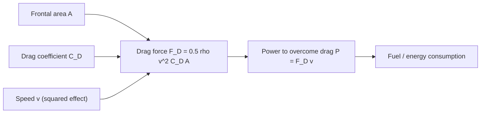

# SPL Run: build_concept_book

- **Adapter:** claude_cli
- **Model:** claude-sonnet-5
- **Tokens:** 6432 in / 3022 out
- **Latency:** 74796ms
- **Timestamp:** 2026-09-27 10:00:21

## Output

```output


---

## Drag Coefficient

The drag force on an object moving through a fluid is given by
$$F_D = \tfrac{1}{2}\,\rho\, v^2\, C_D\, A,$$
where $\rho$ is fluid density, $v$ is relative speed, $A$ is a reference area (usually the frontal cross-section), and $C_D$ is the drag coefficient — a dimensionless number that absorbs everything about the object's shape, surface texture, and orientation that the other variables don't capture. Because $C_D$ is dimensionless, it lets engineers compare the aerodynamic efficiency of a bicycle helmet and a jumbo jet on the same scale, independent of size or speed, as long as the flow regime (Reynolds number) is similar.

$C_D$ is not derived from first principles for real shapes; it is measured. A scale model or full-size object is placed in a wind tunnel, air is driven past it at controlled speed, and a force balance measures $F_D$ directly. Rearranging the drag equation gives $C_D = 2F_D / (\rho v^2 A)$, so the coefficient is simply back-calculated from the measured force. A smooth sphere has $C_D \approx 0.47$; a streamlined teardrop shape drops to about $0.04$; a flat plate perpendicular to the flow can exceed $1.1$. Lower $C_D$ means the shape sheds less energy to turbulent wake for the same frontal area.

**Worked example.** A sedan has frontal area $A = 2.2\ \text{m}^2$, drag coefficient $C_D = 0.30$, and cruises at $v = 30\ \text{m/s}$ (about 108 km/h) through air with $\rho = 1.2\ \text{kg/m}^3$. Then
$$F_D = \tfrac{1}{2}(1.2)(30)^2(0.30)(2.2) \approx 356\ \text{N}.$$
The power needed just to overcome drag is $P = F_D v \approx 10.7\ \text{kW}$. If engineers redesign the body to cut $C_D$ to $0.25$ — a 17% reduction — drag force and power scale proportionally, saving roughly 1.8 kW at highway speed, which is exactly why automakers chase small $C_D$ reductions in wind-tunnel testing.

**Problem-solving application.** Because $F_D \propto v^2$, doubling speed quadruples drag force and requires eight times the power (since $P = F_D v$). This is why fuel economy drops sharply at highway speeds and why cyclists, swimmers, and vehicle designers treat $C_D$ reduction as a high-leverage lever: a fixed percentage cut in $C_D$ yields the same percentage cut in drag at every speed, but the payoff in power savings grows with the cube of speed.

---

## Fluid Density

Fluid density, denoted $\rho$, is the mass per unit volume of the medium through which an object moves — air, water, or any other gas or liquid:

$$
\rho = \frac{m}{V}
$$

with SI units $\text{kg/m}^3$. Density is a property of the fluid itself, not of the moving object, and it is the variable that couples the surrounding medium to the strength of drag. Air at sea level has $\rho \approx 1.225\ \text{kg/m}^3$; water has $\rho \approx 1000\ \text{kg/m}^3$ — nearly 800 times denser. This ratio explains why the same object falling through water decelerates far more abruptly than one falling through air.

Density enters the quadratic drag force directly:

$$
F_d = \tfrac{1}{2}\, \rho\, C_d\, A\, v^2
$$

where $C_d$ is the drag coefficient, $A$ is the cross-sectional area, and $v$ is the object's speed relative to the fluid. Because $F_d$ is *linear* in $\rho$, doubling the fluid's density doubles the drag force at any given speed — no exponent, no threshold effect, just direct proportionality.

**Worked example.** A sphere with $C_d = 0.5$, $A = 0.01\ \text{m}^2$, moving at $v = 20\ \text{m/s}$, first through air then through water:

- In air: $F_d = 0.5 \times 1.225 \times 0.5 \times 0.01 \times 20^2 \approx 1.23\ \text{N}$
- In water: $F_d = 0.5 \times 1000 \times 0.5 \times 0.01 \times 20^2 \approx 1000\ \text{N}$

The force in water is roughly 800 times larger — exactly the ratio of the two densities, since every other factor is unchanged. This is why terminal velocity in water is so much lower than in air for the same object.

**Problem-solving application.** When setting up a drag problem, always identify $\rho$ from the physical scenario before touching the rest of the formula: standard tables give $\rho_{\text{air}} \approx 1.225\ \text{kg/m}^3$ at sea level (decreasing with altitude), $\rho_{\text{water}} \approx 1000\ \text{kg/m}^3$ for fresh water, and $\rho_{\text{seawater}} \approx 1025\ \text{kg/m}^3$. A common error is treating density as constant across a tall altitude range in atmospheric-reentry or skydiving problems — in those cases $\rho$ itself becomes a function of height, and the drag force equation must be solved as a differential equation rather than evaluated at a single point.

---

## Drag Force

When an object moves through a fluid — air, water, or any gas or liquid — the fluid resists that motion with a force called drag, $F_D$, directed opposite to the object's velocity. At low speeds, drag scales linearly with velocity, but for objects that are large and fast enough to generate turbulence (a baseball, a skydiver, a car), the fluid is churned into eddies behind the object, and drag instead grows with the *square* of speed:

$$F_D = \frac{1}{2} C \rho A v^2$$

Here $\rho$ is the fluid density, $A$ is the cross-sectional area the object presents to the flow, $v$ is speed, and $C$ (the drag coefficient) is a dimensionless number capturing the object's shape — roughly 0.5 for a sphere, 1.0–1.3 for a flat plate, and as low as 0.2 for a streamlined car body. The $v^2$ dependence, not the $v^1$ you might expect intuitively, is the essential physics here: it arises because both the rate of momentum transferred to the fluid *and* the speed at which that momentum is transferred scale with $v$, so the two factors of $v$ multiply.

**Worked example.** A skydiver (mass 75 kg, $A \approx 0.7\ \text{m}^2$, $C \approx 1.0$) falls through air ($\rho \approx 1.2\ \text{kg/m}^3$). At terminal velocity, drag balances gravity: $F_D = mg$. Solving,

$$v_{\text{term}} = \sqrt{\frac{2mg}{C\rho A}} = \sqrt{\frac{2(75)(9.8)}{(1.0)(1.2)(0.7)}} \approx 42\ \text{m/s} \ (\approx 151\ \text{km/h}).$$

This is why skydivers reach a stable falling speed rather than accelerating indefinitely: as $v$ increases, $F_D$ grows quadratically until it exactly cancels weight.

**Problem-solving application.** The quadratic form means drag is far more sensitive to speed than to size — doubling velocity quadruples drag, while doubling area only doubles it. This is why aerodynamic shaping (reducing $C$) matters more at highway speeds than at walking speeds, and why cyclists gain more from crouching (reducing $A$) than from switching to a slightly lighter bike. When solving terminal-velocity or projectile-with-drag problems, always check the regime first: at low $v$ (e.g., a dust particle settling in air), linear (Stokes) drag applies instead, and using the quadratic formula there gives a badly wrong answer.

---

## Aerodynamic Drag Reduction

Drag force on a moving object is given by $F_D = \tfrac{1}{2} \rho v^2 C_D A$, where $\rho$ is fluid density, $v$ is speed, $A$ is frontal area, and $C_D$ is the drag coefficient — a dimensionless number capturing how efficiently the object's shape lets air flow around it. Because drag grows with the *square* of velocity, at highway or racing speeds it dominates total resistance and dictates fuel or energy consumption. Drag reduction is the engineering practice of minimizing $C_D$, $A$, or both, since they enter the equation as a simple product.

The two levers are independent but often traded off against each other. Reducing frontal area $A$ (a lower hood line, a cyclist tucking into an aerodynamic crouch) directly shrinks the cross-section the fluid must displace. Reducing $C_D$ means reshaping the body so airflow separates later and with less turbulence — teardrop fuselages, curved car roofs that taper into a rear spoiler, and dimpled golf balls (which trip the boundary layer into turbulence deliberately, delaying separation and *lowering* effective drag) are classic strategies. A blunt, flat-backed shape like a delivery truck has $C_D \approx 0.8$–$1.0$; a modern sedan achieves $0.25$–$0.30$; a competition-grade cyclist's suit and posture can push effective $C_D A$ down by 15–20% relative to an upright rider.

Worked example: a car with $A = 2.2\text{ m}^2$ and $C_D = 0.32$ traveling at $30\text{ m/s}$ (108 km/h) through air ($\rho = 1.2\text{ kg/m}^3$) experiences $F_D = 0.5 \times 1.2 \times 30^2 \times 0.32 \times 2.2 = 380\text{ N}$. Power to overcome drag is $P = F_D v = 380 \times 30 = 11.4\text{ kW}$. If a redesign cuts $C_D$ to $0.27$ (a 15.6% reduction), drag power drops proportionally to the same 15.6%, saving about 1.8 kW at that speed — savings that compound over a full drive cycle and directly reduce fuel or battery consumption. This linear scaling of power savings with $C_D A$ reduction is why manufacturers report drag improvements to two decimal places: a change from $C_D = 0.30$ to $0.29$ is a genuine 3.3% cut in cruising power draw.


*How frontal area, drag coefficient, and speed combine to determine drag force, power demand, and ultimately fuel or energy use.*

In problem-solving practice, drag reduction analysis usually starts from a target: a required top speed, a fuel-economy standard, or a power budget. Engineers work backward through the drag equation to find the maximum allowable $C_D A$, then allocate that budget between shape refinement (wind-tunnel or CFD-optimized surfaces) and geometric downsizing (smaller frontal profile), since both enter the same multiplicative term.

---

## Payoff

Aerodynamic drag reduction is where the fluid dynamics developed throughout this book converges on a single, high-stakes design objective: minimizing the resistive force a body experiences as it moves through air. That force is governed by

$$F_d = \frac{1}{2} \rho v^2 C_d A$$

where $\rho$ is air density, $v$ is velocity, $A$ is the frontal cross-sectional area, and $C_d$ is the drag coefficient — a dimensionless number capturing how efficiently a shape sheds the air around it. The quadratic dependence on $v$ is the crux of why this concept sits at the capstone: doubling speed quadruples drag, and since the power required to overcome drag scales as $F_d v \propto v^3$, drag reduction delivers compounding returns precisely where speed matters most. This is why the concept is the natural endpoint of the book — it forces you to synthesize boundary layer behavior, pressure differentials, and flow separation into a single optimization target with direct economic and physical consequences.

**Worked example.** Consider a delivery van with $C_d = 0.42$, $A = 3.2\ \text{m}^2$, cruising at $v = 25\ \text{m/s}$ ($\rho = 1.225\ \text{kg/m}^3$). Its drag force is $F_d = \frac{1}{2}(1.225)(25)^2(0.42)(3.2) \approx 514\ \text{N}$. Adding a roof fairing that reduces $C_d$ to $0.35$ lowers drag to about $429\ \text{N}$ — a 17% reduction, translating almost directly into a 17% cut in the power needed to overcome aerodynamic resistance at highway speed, since power scales linearly with drag force at fixed velocity.

**Problem-solving application.** This is precisely the calculation performed, at far greater fidelity, in every domain where this concept becomes decisive: automotive and aerospace engineering (fuel and battery range), competitive cycling and speedskating (shaving fractions of a second), wind turbine and building design (structural loading and efficiency), and sports equipment engineering (swimsuits, helmets, javelins). In each case, the underlying move is the same — measure or simulate $C_d$, identify where flow separates, and reshape the body to delay separation or reduce wake size.

From here, the most productive next step is to pick one domain — say, automotive aerodynamics — and trace how engineers use wind tunnels and computational fluid dynamics to iterate toward a lower $C_d$ under real design constraints.
```
