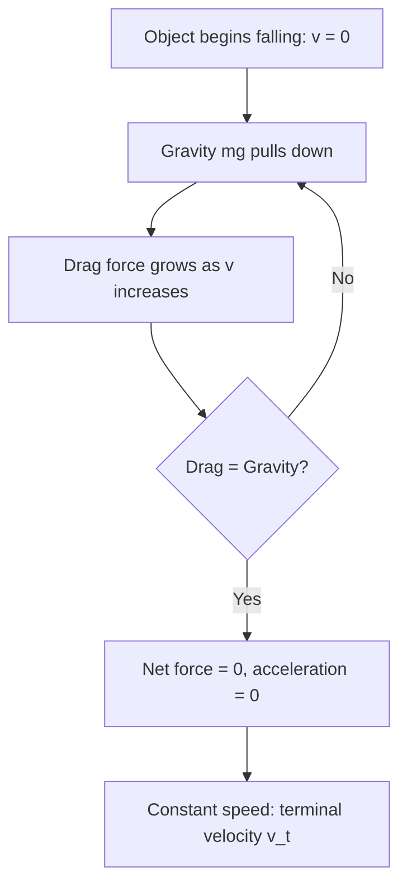
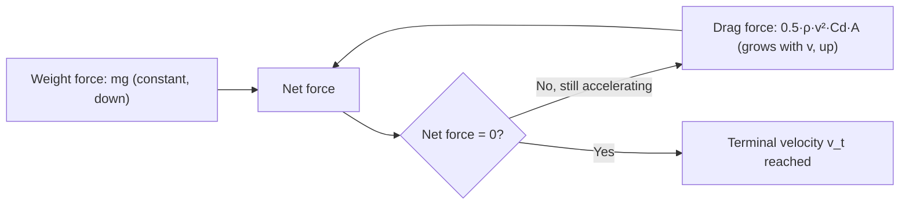

# SPL Run: build_concept_book

- **Adapter:** claude_cli
- **Model:** claude-sonnet-5
- **Tokens:** 3529 in / 1722 out
- **Latency:** 53638ms
- **Timestamp:** 2026-09-27 10:01:36

## Output

```output


---

## Drag Coefficient

The drag force on an object moving through a fluid is given by
$$F_D = \tfrac{1}{2}\,\rho\, v^2\, C_D\, A,$$
where $\rho$ is fluid density, $v$ is relative speed, $A$ is a reference area (usually the frontal cross-section), and $C_D$ is the drag coefficient — a dimensionless number that absorbs everything about the object's shape, surface texture, and orientation that the other variables don't capture. Because $C_D$ is dimensionless, it lets engineers compare the aerodynamic efficiency of a bicycle helmet and a jumbo jet on the same scale, independent of size or speed, as long as the flow regime (Reynolds number) is similar.

$C_D$ is not derived from first principles for real shapes; it is measured. A scale model or full-size object is placed in a wind tunnel, air is driven past it at controlled speed, and a force balance measures $F_D$ directly. Rearranging the drag equation gives $C_D = 2F_D / (\rho v^2 A)$, so the coefficient is simply back-calculated from the measured force. A smooth sphere has $C_D \approx 0.47$; a streamlined teardrop shape drops to about $0.04$; a flat plate perpendicular to the flow can exceed $1.1$. Lower $C_D$ means the shape sheds less energy to turbulent wake for the same frontal area.

**Worked example.** A sedan has frontal area $A = 2.2\ \text{m}^2$, drag coefficient $C_D = 0.30$, and cruises at $v = 30\ \text{m/s}$ (about 108 km/h) through air with $\rho = 1.2\ \text{kg/m}^3$. Then
$$F_D = \tfrac{1}{2}(1.2)(30)^2(0.30)(2.2) \approx 356\ \text{N}.$$
The power needed just to overcome drag is $P = F_D v \approx 10.7\ \text{kW}$. If engineers redesign the body to cut $C_D$ to $0.25$ — a 17% reduction — drag force and power scale proportionally, saving roughly 1.8 kW at highway speed, which is exactly why automakers chase small $C_D$ reductions in wind-tunnel testing.

**Problem-solving application.** Because $F_D \propto v^2$, doubling speed quadruples drag force and requires eight times the power (since $P = F_D v$). This is why fuel economy drops sharply at highway speeds and why cyclists, swimmers, and vehicle designers treat $C_D$ reduction as a high-leverage lever: a fixed percentage cut in $C_D$ yields the same percentage cut in drag at every speed, but the payoff in power savings grows with the cube of speed.

---

## Fluid Density

Fluid density, denoted $\rho$, is the mass per unit volume of the medium through which an object moves — air, water, or any other gas or liquid:

$$
\rho = \frac{m}{V}
$$

with SI units $\text{kg/m}^3$. Density is a property of the fluid itself, not of the moving object, and it is the variable that couples the surrounding medium to the strength of drag. Air at sea level has $\rho \approx 1.225\ \text{kg/m}^3$; water has $\rho \approx 1000\ \text{kg/m}^3$ — nearly 800 times denser. This ratio explains why the same object falling through water decelerates far more abruptly than one falling through air.

Density enters the quadratic drag force directly:

$$
F_d = \tfrac{1}{2}\, \rho\, C_d\, A\, v^2
$$

where $C_d$ is the drag coefficient, $A$ is the cross-sectional area, and $v$ is the object's speed relative to the fluid. Because $F_d$ is *linear* in $\rho$, doubling the fluid's density doubles the drag force at any given speed — no exponent, no threshold effect, just direct proportionality.

**Worked example.** A sphere with $C_d = 0.5$, $A = 0.01\ \text{m}^2$, moving at $v = 20\ \text{m/s}$, first through air then through water:

- In air: $F_d = 0.5 \times 1.225 \times 0.5 \times 0.01 \times 20^2 \approx 1.23\ \text{N}$
- In water: $F_d = 0.5 \times 1000 \times 0.5 \times 0.01 \times 20^2 \approx 1000\ \text{N}$

The force in water is roughly 800 times larger — exactly the ratio of the two densities, since every other factor is unchanged. This is why terminal velocity in water is so much lower than in air for the same object.

**Problem-solving application.** When setting up a drag problem, always identify $\rho$ from the physical scenario before touching the rest of the formula: standard tables give $\rho_{\text{air}} \approx 1.225\ \text{kg/m}^3$ at sea level (decreasing with altitude), $\rho_{\text{water}} \approx 1000\ \text{kg/m}^3$ for fresh water, and $\rho_{\text{seawater}} \approx 1025\ \text{kg/m}^3$. A common error is treating density as constant across a tall altitude range in atmospheric-reentry or skydiving problems — in those cases $\rho$ itself becomes a function of height, and the drag force equation must be solved as a differential equation rather than evaluated at a single point.

---

## Drag Force

When an object moves through a fluid — air, water, or any gas or liquid — the fluid resists that motion with a force called drag, $F_D$, directed opposite to the object's velocity. At low speeds, drag scales linearly with velocity, but for objects that are large and fast enough to generate turbulence (a baseball, a skydiver, a car), the fluid is churned into eddies behind the object, and drag instead grows with the *square* of speed:

$$F_D = \frac{1}{2} C \rho A v^2$$

Here $\rho$ is the fluid density, $A$ is the cross-sectional area the object presents to the flow, $v$ is speed, and $C$ (the drag coefficient) is a dimensionless number capturing the object's shape — roughly 0.5 for a sphere, 1.0–1.3 for a flat plate, and as low as 0.2 for a streamlined car body. The $v^2$ dependence, not the $v^1$ you might expect intuitively, is the essential physics here: it arises because both the rate of momentum transferred to the fluid *and* the speed at which that momentum is transferred scale with $v$, so the two factors of $v$ multiply.

**Worked example.** A skydiver (mass 75 kg, $A \approx 0.7\ \text{m}^2$, $C \approx 1.0$) falls through air ($\rho \approx 1.2\ \text{kg/m}^3$). At terminal velocity, drag balances gravity: $F_D = mg$. Solving,

$$v_{\text{term}} = \sqrt{\frac{2mg}{C\rho A}} = \sqrt{\frac{2(75)(9.8)}{(1.0)(1.2)(0.7)}} \approx 42\ \text{m/s} \ (\approx 151\ \text{km/h}).$$

This is why skydivers reach a stable falling speed rather than accelerating indefinitely: as $v$ increases, $F_D$ grows quadratically until it exactly cancels weight.

**Problem-solving application.** The quadratic form means drag is far more sensitive to speed than to size — doubling velocity quadruples drag, while doubling area only doubles it. This is why aerodynamic shaping (reducing $C$) matters more at highway speeds than at walking speeds, and why cyclists gain more from crouching (reducing $A$) than from switching to a slightly lighter bike. When solving terminal-velocity or projectile-with-drag problems, always check the regime first: at low $v$ (e.g., a dust particle settling in air), linear (Stokes) drag applies instead, and using the quadratic formula there gives a badly wrong answer.

---

## Terminal Velocity

An object falling through a fluid (typically air) experiences two opposing forces: gravity, which pulls it downward with constant force $mg$, and drag, which resists motion and grows with speed. For most everyday objects at moderate-to-high speeds, drag is well modeled as quadratic in velocity:

$$F_{\text{drag}} = \tfrac{1}{2} \rho v^2 C_d A$$

where $\rho$ is fluid density, $v$ is speed, $C_d$ is the drag coefficient (shape-dependent), and $A$ is the cross-sectional area facing the flow. As the object accelerates, drag increases until it exactly equals gravity — at that instant, net force is zero, so acceleration is zero, and the object continues at constant speed. This is the **terminal velocity** $v_t$.

Setting $mg = \tfrac{1}{2}\rho v_t^2 C_d A$ and solving:

$$v_t = \sqrt{\frac{2mg}{\rho C_d A}}$$

**Worked example.** A skydiver (mass 75 kg) in a belly-down spread position has $C_d A \approx 0.7\ \text{m}^2$ effective drag area, with $\rho_{\text{air}} \approx 1.2\ \text{kg/m}^3$. Then:

$$v_t = \sqrt{\frac{2(75)(9.8)}{(1.2)(0.7)}} \approx \sqrt{1750} \approx 42\ \text{m/s} \approx 151\ \text{km/h}$$

This matches the commonly cited ~200 km/h figure for a head-down dive, where $A$ shrinks and $v_t$ rises — the formula correctly predicts that reducing frontal area increases terminal speed.

**Problem-solving application.** The equation shows $v_t$ is not fixed for an object — it depends on orientation, altitude (via $\rho$), and mass. This explains why a flat sheet of paper falls slowly (large $A$, small $v_t$) while the same paper crumpled into a ball falls much faster (smaller $A$, same $m$). It also explains why raindrops of different sizes fall at different terminal speeds ($m$ scales with $r^3$, $A$ with $r^2$, so $v_t \propto \sqrt{r}$) — a fact used in radar meteorology to infer droplet size from fall speed.



*The feedback loop by which increasing drag caps a falling object's acceleration at terminal velocity.*

---

## Skydiver Terminal Velocity

A falling skydiver experiences two forces: gravity pulling down with constant magnitude $mg$, and air drag pushing up, growing with speed. Drag force is modeled as
$$F_D = \frac{1}{2} \rho v^2 C_d A$$
where $\rho$ is air density, $v$ is speed, $C_d$ is the drag coefficient (depends on body shape/orientation), and $A$ is the cross-sectional area facing the airflow. Applying Newton's second law along the vertical axis:
$$ma = mg - \frac{1}{2}\rho v^2 C_d A$$
As $v$ increases, drag grows until it equals gravity, giving $a = 0$. At that point velocity stops changing — this is **terminal velocity**, $v_t$. Setting $a=0$ and solving:
$$v_t = \sqrt{\frac{2mg}{\rho C_d A}}$$

**Worked example:** A skydiver of mass $m = 80\text{ kg}$ falls in a belly-down "spread eagle" position with $C_d = 1.0$ and $A = 0.7\text{ m}^2$. Using $\rho = 1.2\text{ kg/m}^3$ and $g = 9.8\text{ m/s}^2$:
$$v_t = \sqrt{\frac{2(80)(9.8)}{(1.2)(1.0)(0.7)}} = \sqrt{1866.7} \approx 43.2\text{ m/s} \approx 155\text{ km/h}$$
This matches the commonly cited ~200 km/h range for belly-down freefall (actual $C_d$ and $A$ vary with body position, producing the familiar 195–220 km/h figures).

**Problem-solving application:** Suppose the same skydiver pulls into a head-down dive, reducing $A$ to $0.18\text{ m}^2$ and $C_d$ to $0.7$ (a more streamlined shape). Recompute:
$$v_t = \sqrt{\frac{2(80)(9.8)}{(1.2)(0.7)(0.18)}} = \sqrt{10370} \approx 101.8\text{ m/s} \approx 366\text{ km/h}$$
This explains why head-down "tracking" skydivers reach speeds far above belly-down flyers — smaller $A$ and $C_d$ both raise $v_t$ under the square root's inverse relationship. It also shows why heavier skydivers fall faster than lighter ones in the same position: $v_t \propto \sqrt{m}$, so mass increases terminal speed, while a wingsuit's large $A$ dramatically lowers it. This single equation lets you predict how any change in gear, posture, or altitude (via $\rho$) shifts the skydiver's maximum falling speed.


*How increasing drag force balances constant gravity until acceleration reaches zero at terminal velocity.*

---

## Payoff

Terminal velocity is where this book's chain of ideas — force, acceleration, and the calculus of change — collapses into a single, testable number. A skydiver falling through air experiences two competing forces: gravity, constant at $mg$, and air resistance, which grows with speed. Modeling drag as proportional to the square of velocity, $F_d = \tfrac{1}{2}\rho C_d A v^2$, Newton's second law gives the differential equation
$$
m\frac{dv}{dt} = mg - \tfrac{1}{2}\rho C_d A v^2.
$$
As $v$ increases, drag grows until it exactly balances gravity — at that instant $dv/dt = 0$, and the skydiver stops accelerating. Solving for this equilibrium yields the terminal velocity
$$
v_t = \sqrt{\frac{2mg}{\rho C_d A}}.
$$
This is the natural endpoint of the book because it demonstrates, in one closed-form result, that a differential equation modeling motion under a resistive force does not require solving for $v(t)$ at every instant to answer the question that matters most: how fast does the system settle, and at what value? Setting the derivative to zero and solving algebraically is a technique that generalizes far beyond skydiving — anywhere a driving force is opposed by a resistance that scales with the state variable itself.

That generality is the concept's real payoff. The same balance-of-forces logic governs a raindrop reaching constant fall speed, a car's top speed limited by aerodynamic drag, a bacterium settling in a centrifuge, or current in an RC circuit approaching a steady value as resistive losses match the driving voltage. Each case swaps the physical actors — mass and drag coefficient for resistance and capacitance, say — but the mathematical skeleton, a first-order equation with an asymptotic equilibrium, is identical. Recognizing that skeleton is what turns a memorized formula into a transferable problem-solving tool.

From here, the most direct next step is to open the equation back up: instead of asking only for $v_t$, solve the full differential equation for $v(t)$ and watch the skydiver's velocity curve rise smoothly toward that asymptote — connecting this capstone back to the techniques of separable differential equations that made it solvable in the first place.
```
