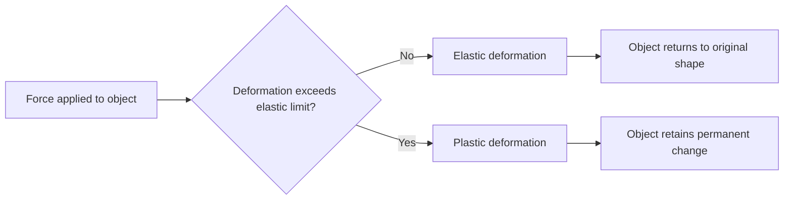
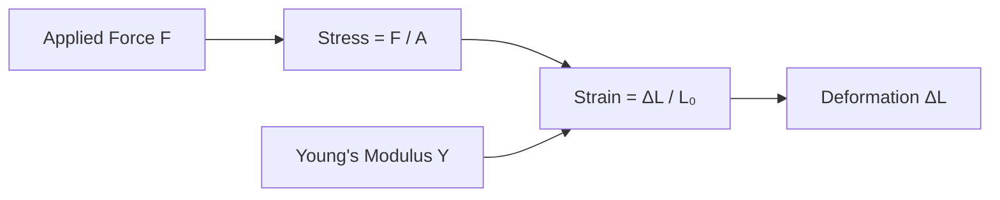
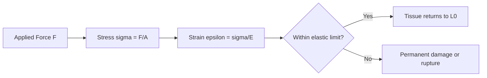

# SPL Run: build_concept_book

- **Adapter:** claude_cli
- **Model:** claude-sonnet-5
- **Tokens:** 15171 in / 6338 out
- **Latency:** 156466ms
- **Timestamp:** 2026-09-27 10:02:31

## Output

```output


---

## Deformation

Deformation is any change in an object's shape or size resulting from an applied force. When a force acts on a solid object, the object's internal structure resists the load, and the material stretches, compresses, bends, or twists in response. If the deformation is small and the object fully returns to its original shape once the force is removed, the response is called **elastic deformation**. If the force is large enough to permanently rearrange the material's internal structure, the object does not fully recover, and the response is called **plastic deformation**.

For elastic deformation, the relationship between applied force and resulting deformation is often linear over a limited range — a behavior described by Hooke's Law:

$$F = -kx$$

Here $F$ is the restoring force, $x$ is the displacement from the equilibrium shape, and $k$ is the stiffness constant of the material or structure. The negative sign indicates that the restoring force opposes the deformation, pulling the object back toward its original shape.

**Worked example.** A spring with stiffness $k = 250\ \text{N/m}$ is stretched by $0.04\ \text{m}$. The restoring force is

$$F = -kx = -(250)(0.04) = -10\ \text{N}$$

meaning the spring pulls back with $10\ \text{N}$ of force. If the applied force is removed, the spring returns to its natural length — this is elastic behavior.

**Problem-solving application.** Suppose the same spring is stretched until it no longer returns to its original length after the force is removed — engineers call this point the **elastic limit**. Beyond this point, Hooke's Law no longer applies, and the material undergoes plastic deformation. This concept is essential in structural engineering: a bridge cable or building beam must be designed so that expected loads keep the material well within its elastic limit, ensuring the structure always returns to its original shape rather than accumulating permanent damage over repeated stress cycles.



*Decision path showing how the magnitude of an applied force determines whether an object undergoes elastic or plastic deformation.*

---

## Stress

Stress measures how intensely an external force is distributed inside a material as it resists deformation. Formally,

$$
\sigma = \frac{F}{A}
$$

where $F$ is the applied force (in newtons) perpendicular to the cross-sectional area $A$ (in square meters), and $\sigma$ is stress, measured in pascals (Pa = N/m²). Unlike force, which is a single external push or pull, stress describes the *internal* response of the material — the same force produces different stress depending on how much area carries it. This is why a thin wire snaps under a load that a thick rod of the same material easily supports.

**Worked example.** A steel cable with a circular cross-section of radius $r = 5\ \text{mm}$ supports a hanging load of $F = 4000\ \text{N}$. The cross-sectional area is

$$
A = \pi r^2 = \pi (0.005\ \text{m})^2 \approx 7.85 \times 10^{-5}\ \text{m}^2
$$

so the stress in the cable is

$$
\sigma = \frac{F}{A} = \frac{4000}{7.85 \times 10^{-5}} \approx 5.10 \times 10^{7}\ \text{Pa} = 51.0\ \text{MPa}
$$

**Problem-solving application.** Engineers use stress, not raw force, to decide whether a material will fail, because failure is governed by the material's *stress tolerance* (its yield or ultimate strength), not by force alone. Suppose the steel cable above has a yield strength of $250\ \text{MPa}$. Since $51.0\ \text{MPa}$ is well below this threshold, the cable is safe — with a safety factor of roughly $250/51.0 \approx 4.9$. If the load doubled to $8000\ \text{N}$, stress would double to $102\ \text{MPa}$, still safe, but if the cable's radius were halved instead (area reduced by a factor of 4), the original load would produce $204\ \text{MPa}$, dangerously close to failure. This inverse-square sensitivity to radius is why cable and beam diameters are chosen with wide margins in real structures — bridges, elevators, and aircraft wings are all sized by solving $A \geq F/\sigma_{\text{allow}}$ for the minimum safe cross-sectional area.

---

## Bulk Modulus

The bulk modulus $B$ measures a material's resistance to uniform compression from all sides. When a volume of material experiences a pressure increase $\Delta P$, it responds with a fractional volume decrease $-\Delta V / V$. The two are related by

$$B = -V\frac{\Delta P}{\Delta V} = \frac{\Delta P}{-\Delta V / V}$$

The negative sign keeps $B$ positive, since increasing pressure ($\Delta P > 0$) always decreases volume ($\Delta V < 0$). Units are $\mathrm{N/m^2}$ (pascals), the same as pressure, because the fractional volume change $-\Delta V/V$ is dimensionless. A large $B$ means the material is hard to compress — steel has $B \approx 160\ \text{GPa}$, water $B \approx 2.2\ \text{GPa}$, and air (at constant temperature) $B \approx 10^5\ \text{Pa}$, roughly one atmosphere. This is why steel feels rigid, water is "almost" incompressible for everyday purposes, and air compresses easily under a bicycle pump.

**Worked example.** A steel block of volume $2.0\ \text{m}^3$ is submerged at ocean depth where pressure increases by $2.0 \times 10^7\ \text{Pa}$ relative to the surface. Using $B_{\text{steel}} = 1.6 \times 10^{11}\ \text{Pa}$, find the volume change.

Rearranging the definition: $\Delta V = -V \Delta P / B$.

$$\Delta V = -\frac{(2.0\ \text{m}^3)(2.0\times10^7\ \text{Pa})}{1.6\times10^{11}\ \text{Pa}} = -2.5\times10^{-4}\ \text{m}^3$$

The block shrinks by only 250 cm³ out of 2 m³ — about 0.0125%, confirming steel's near-incompressibility even under enormous pressure.

**Problem-solving application.** Bulk modulus is the key input whenever a problem involves pressure-driven volume change: hydraulic systems, deep-sea engineering, or comparing how gases versus liquids respond to compression. The general solution strategy is always the same three-step rearrangement: (1) identify which two of $B$, $\Delta P$, $\Delta V/V$ are given, (2) solve $B = -\Delta P/(\Delta V/V)$ for the unknown, (3) check the sign — compression should always yield $\Delta V < 0$. A common error is forgetting that $\Delta V/V$ is a *fraction* of the original volume, not an absolute length change, so always divide by the initial volume $V$ before applying $B$.

---

## Shear Modulus

The shear modulus $S$ (also written $G$) is a material-specific constant, measured in $\text{N/m}^2$ (pascals), that quantifies how strongly a material resists shear deformation — a distortion in which parallel layers of the material slide relative to one another, changing the material's shape without changing its volume. Shear modulus relates the shear stress applied to an object to the resulting shear strain:

$$
S = \frac{\text{shear stress}}{\text{shear strain}} = \frac{F/A}{\Delta x / h}
$$

Here $F$ is the force applied parallel to a surface of area $A$, $\Delta x$ is the lateral displacement produced, and $h$ is the height (or thickness) over which that displacement occurs. Unlike Young's modulus, which governs stretching or compressing along an axis, $S$ governs distortion of angles — think of pushing the top of a deck of cards sideways while the bottom stays fixed. Values of $S$ are tabulated experimentally for each material (e.g., steel: $\sim 80 \times 10^9\ \text{N/m}^2$; aluminum: $\sim 25 \times 10^9\ \text{N/m}^2$; rubber: $\sim 0.0003 \times 10^9\ \text{N/m}^2$) and cannot be derived from first principles for a general course — they depend on atomic bonding and microstructure.

**Worked example**: A steel rod of cross-sectional area $A = 2 \times 10^{-4}\ \text{m}^2$ and length $h = 0.50\ \text{m}$ is fixed at one end. A shear force of $F = 4000\ \text{N}$ is applied parallel to the free end. Using $S_{\text{steel}} = 80 \times 10^9\ \text{N/m}^2$, solve for the lateral displacement $\Delta x$:

$$
\Delta x = \frac{Fh}{SA} = \frac{(4000)(0.50)}{(80\times10^9)(2\times10^{-4})} = 1.25 \times 10^{-4}\ \text{m}
$$

This displacement of about $0.125\ \text{mm}$ is tiny, consistent with steel's high resistance to shear.

**Problem-solving application**: Given any three of the four quantities $F$, $A$, $h$, $\Delta x$ (with $S$ looked up from a table), you can solve for the fourth. This is the core skill: identify which quantity is unknown, rearrange the defining relation algebraically, and substitute consistent SI units. A common pitfall is confusing $A$ (the area parallel to the applied force, i.e., the face being sheared) with the cross-sectional area perpendicular to an axial load — these are the same surface in shear problems but easy to mislabel when transitioning from tension/compression problems.

---

## Strain

When a material is stretched, compressed, or otherwise deformed by an applied force, the amount of deformation depends on both the material and its original size — a longer rod stretches more (in absolute terms) than a short one under the same load. To describe deformation in a way that is independent of the object's original dimensions, engineers use **strain**, defined as the fractional change in length:

$$
\varepsilon = \frac{\Delta L}{L_0} = \frac{L - L_0}{L_0}
$$

where $L_0$ is the original length, $L$ is the length after deformation, and $\Delta L = L - L_0$. Because strain is a ratio of two lengths, it is dimensionless — often reported as a plain decimal, a percentage, or in microstrain ($\mu\varepsilon$, i.e., $\varepsilon \times 10^6$) for very small deformations. Positive strain indicates elongation (tension); negative strain indicates shortening (compression).

**Worked example.** A steel cable with an original length of $L_0 = 2.000\text{ m}$ is loaded and stretches to $L = 2.003\text{ m}$. The strain is:

$$
\varepsilon = \frac{2.003 - 2.000}{2.000} = \frac{0.003}{2.000} = 0.0015
$$

This corresponds to 0.15%, or 1500 microstrain. Note that strain alone doesn't tell you whether the cable is close to failure — that depends on the material's strain limits — but it standardizes the measurement so cables of different lengths can be compared directly.

**Problem-solving application.** Strain becomes powerful when paired with stress ($\sigma = F/A$, force per cross-sectional area) through Hooke's Law for elastic materials: $\sigma = E\varepsilon$, where $E$ is the material's Young's modulus. This lets you predict deformation from a known force, or back-calculate force from a measured strain — the exact principle used in strain gauges, which convert tiny length changes into electrical resistance changes to monitor bridges, aircraft wings, and load cells in real time. For example, if a strain gauge on a steel beam ($E = 200\text{ GPa}$) reads $\varepsilon = 0.0005$, the internal stress is $\sigma = (200\times10^9)(0.0005) = 1.0\times10^8\text{ Pa} = 100\text{ MPa}$ — a value engineers compare against the steel's yield strength to assess safety margins.

---

## Youngs Modulus

Young's modulus $Y$ (also written $E$) is the constant of proportionality between tensile or compressive stress and the resulting strain, valid within the elastic region of a material. It is defined by

$$Y = \frac{\text{stress}}{\text{strain}} = \frac{F/A}{\Delta L / L_0}$$

where $F$ is the applied force, $A$ is the cross-sectional area, $L_0$ is the original length, and $\Delta L$ is the change in length. Since strain is dimensionless, $Y$ carries the units of stress: $\text{N/m}^2$, or pascals. Rearranged, this gives Hooke's law for an extended object:

$$\Delta L = \frac{F L_0}{A Y}$$

This is the same linear spring relationship $F = k\,\Delta L$ from introductory mechanics, except $Y$ isolates the material's intrinsic stiffness from the object's geometry — a steel rod and a steel wire share the same $Y$ even though they stretch by very different amounts under the same force.

**Worked example.** A steel wire ($Y = 2.0 \times 10^{11}\ \text{N/m}^2$) has length $L_0 = 2.0\ \text{m}$ and cross-sectional area $A = 1.0 \times 10^{-6}\ \text{m}^2$ (about 1 mm across). A mass hanging from it exerts $F = 200\ \text{N}$. The stretch is:

$$\Delta L = \frac{F L_0}{A Y} = \frac{(200)(2.0)}{(1.0\times10^{-6})(2.0\times10^{11})} = \frac{400}{2.0\times10^{5}} = 2.0\times10^{-3}\ \text{m}$$

The wire stretches 2 mm — small, but measurable, and this is the basis of strain gauges.

**Problem-solving application.** Because $Y$ is tabulated per material, the standard workflow is: (1) identify the material and look up $Y$, (2) compute stress from the applied load and geometry, (3) verify stress stays below the material's elastic limit (beyond which $Y$ no longer applies and permanent deformation occurs), and (4) solve for strain or $\Delta L$. This same relation lets engineers work backward — given a maximum allowable deflection $\Delta L$, solve for the minimum cross-sectional area $A$ needed, which is exactly how cable and beam sizing is done in structural design.

---

## Bulk Compression

When a force presses inward on every surface of an object simultaneously — as when a submerged object is squeezed by surrounding fluid pressure — the object shrinks uniformly in volume rather than stretching or shearing in any one direction. This is bulk compression, and it is governed by the same linear elasticity that describes stretching a rod, except the "strain" here is fractional volume change rather than fractional length change.

The governing relation is
$$\frac{\Delta V}{V_0} = -\frac{F}{B \cdot A}$$

where $\Delta V$ is the change in volume, $V_0$ is the original volume, $F$ is the total inward force distributed over surface area $A$, and $B$ is the **bulk modulus** — a material property quantifying resistance to uniform compression. The quantity $F/A$ is pressure, so the relation is more commonly written $\Delta V / V_0 = -\Delta P / B$, meaning fractional volume change is proportional to applied pressure change and inversely proportional to $B$. The negative sign encodes the physical fact that increasing pressure decreases volume. A large $B$ (steel: $\sim 1.6 \times 10^{11}\,\text{Pa}$) means the material barely compresses even under large pressure; a small $B$ (air: $\sim 1.4 \times 10^5\,\text{Pa}$) means it compresses easily — this is why gases are compressible and solids are not.

**Worked example.** A steel block of volume $V_0 = 0.500\,\text{m}^3$ is lowered to a depth where the surrounding pressure increases by $\Delta P = 2.0 \times 10^7\,\text{Pa}$ (about 200 atmospheres). Using $B_{\text{steel}} = 1.6 \times 10^{11}\,\text{Pa}$:
$$\frac{\Delta V}{V_0} = -\frac{\Delta P}{B} = -\frac{2.0 \times 10^7}{1.6 \times 10^{11}} = -1.25 \times 10^{-4}$$
$$\Delta V = -1.25 \times 10^{-4} \times 0.500\,\text{m}^3 \approx -6.25 \times 10^{-5}\,\text{m}^3$$

The block shrinks by only about 63 cm³ out of half a cubic meter — consistent with steel's reputation as nearly incompressible under everyday pressures.

**Problem-solving application.** Bulk modulus lets engineers predict how much a material will compress under known pressure loads without needing to model the microscopic forces — this is essential in hydraulic system design, deep-sea vessel hulls, and geophysics (where $B$ of rock layers affects seismic wave speeds). Given any two of $\Delta V/V_0$, $\Delta P$, and $B$, the third follows directly by algebraic rearrangement, making this formula a standard tool for back-of-envelope compressibility estimates in both engineering and earth science contexts.

---

## Shear Deformation

When a force acts parallel to a surface rather than perpendicular to it, the object doesn't stretch or compress — it skews. Picture a thick book lying on a table: if you push the top cover sideways while the bottom stays fixed, each page slides slightly relative to the one below it, and the book's cross-section tilts into a parallelogram. This is shear deformation, and it governs how bolts, rivets, beams under transverse loads, and even tectonic plates respond to sideways forces.

The relationship is analogous to Hooke's Law for stretching, but the displacement $\Delta x$ is now perpendicular to the original length $L_0$, rather than along it:

$$
\Delta x = \frac{1}{S}\frac{F}{A}L_0
$$

Here $F$ is the force applied parallel to the surface, $A$ is the area of that surface, $L_0$ is the length over which the shear acts (measured perpendicular to $F$), and $S$ is the shear modulus — a material property describing resistance to this sideways sliding. A large $S$ (like steel) means the material barely shears under a given stress; a small $S$ (like rubber) means it deforms easily.

**Worked example.** A steel bolt with cross-sectional area $A = 2.0 \times 10^{-4}\ \text{m}^2$ and shear length $L_0 = 0.010\ \text{m}$ experiences a transverse shear force $F = 4.0 \times 10^4\ \text{N}$. Given $S_{\text{steel}} = 8.0 \times 10^{10}\ \text{Pa}$:

$$
\Delta x = \frac{1}{8.0 \times 10^{10}} \cdot \frac{4.0 \times 10^4}{2.0 \times 10^{-4}} \cdot 0.010 = 2.5 \times 10^{-5}\ \text{m}
$$

This tiny displacement (25 micrometers) is why engineers can treat bolts as rigid in most designs — but pushed further, the same equation predicts the force at which the bolt shears off entirely, once stress exceeds the material's shear strength.

**Problem-solving application.** Shear deformation problems typically ask you to solve for whichever variable isn't given: the force needed to produce a specified $\Delta x$, the minimum cross-sectional area to keep displacement below a safety threshold, or the shear modulus of an unknown material from experimental data. The key skill is correctly identifying which area is "$A$" — it's always the surface parallel to the applied force, not the surface the force pushes against, a distinction that trips up students moving from tension/compression problems where area is measured perpendicular to $F$.

---

## Tension Compression Deformation

When a force is applied along the axis of a rod or wire, the material stretches (tension) or shortens (compression). For small deformations, the change in length $\Delta L$ is directly proportional to the applied force $F$ and the original length $L_0$, and inversely proportional to the cross-sectional area $A$:

$$
\Delta L = \frac{1}{Y}\frac{F}{A}L_0
$$

Here $Y$ is Young's modulus, a material-specific constant with units of pascals (Pa) that measures stiffness — how strongly a material resists elastic deformation. A large $Y$ (like steel, $\sim 2.0 \times 10^{11}\,\text{Pa}$) means the material barely stretches under load; a small $Y$ (like rubber) means it deforms easily. This relation is the one-dimensional form of Hooke's law and holds only within the elastic limit, where the material returns to its original length once the force is removed.

**Worked example.** A steel wire of length $L_0 = 2.0\,\text{m}$ and cross-sectional area $A = 1.0 \times 10^{-6}\,\text{m}^2$ supports a hanging mass that exerts $F = 200\,\text{N}$. Using $Y_{\text{steel}} = 2.0 \times 10^{11}\,\text{Pa}$:

$$
\Delta L = \frac{1}{2.0\times10^{11}}\cdot\frac{200}{1.0\times10^{-6}}\cdot 2.0 = 2.0 \times 10^{-3}\,\text{m} = 2.0\,\text{mm}
$$

**Problem-solving application.** The formula is often rearranged to solve for an unknown quantity depending on what an engineering problem asks: to find the required area for a maximum allowable stretch, solve $A = FL_0/(Y\Delta L)$; to find the stress a material experiences, compute $F/A$ directly and compare it to the material's known yield strength. A key skill is unit consistency — $F$ in newtons, $A$ in square meters, $L_0$ in meters — since a mismatch (e.g., using $\text{mm}^2$ for $A$) is the most common source of error. Note also that $\Delta L$ scales linearly with $L_0$: a longer cable stretches proportionally more under the same load, which is why crane cables and bridge suspension cables require careful area sizing relative to their span.



*How force, cross-sectional area, and Young's modulus combine to determine the resulting change in length.*

---

## Elasticity In Biological Structures

Biological tissues obey the same elastic framework used for engineered materials, but across a much wider strain range. Stress is $\sigma = F/A$ (force per cross-sectional area) and strain is $\epsilon = \Delta L / L_0$ (fractional deformation). Within the elastic (linear) region, the two are related by Young's modulus, $\sigma = E\epsilon$, where $E$ is the material's stiffness. Tissues differ enormously in $E$: cortical bone is roughly $E \approx 15$–$20\text{ GPa}$, while tendon is about $E \approx 1$–$2\text{ GPa}$, and elastin-rich arterial wall is under $1\text{ MPa}$ — a range of four orders of magnitude reflecting each tissue's mechanical role. Unlike steel, most tissues also show a nonlinear "toe region" at low strain, where collagen fibers straighten before bearing load, followed by a stiffer linear region until the elastic limit is exceeded.

**Worked example.** An Achilles tendon with resting length $L_0 = 25\text{ cm}$ and cross-sectional area $A = 0.6\text{ cm}^2 = 6\times10^{-5}\text{ m}^2$ is stretched during running by a force of $F = 1800\text{ N}$. Taking $E = 1.5\text{ GPa}$ for tendon in its linear region: $\sigma = F/A = 1800 / (6\times10^{-5}) = 3.0\times10^7\text{ Pa} = 30\text{ MPa}$. Strain is $\epsilon = \sigma/E = (3.0\times10^7)/(1.5\times10^9) = 0.02$, so $\Delta L = \epsilon L_0 = 0.02 \times 0.25\text{ m} = 5\text{ mm}$. This 2% strain is well within tendon's elastic limit (tendons typically rupture beyond 8–10% strain), confirming the tendon returns to its original length after the stride — the physical basis of elastic energy storage in locomotion.

**Problem-solving application.** These relations let you assess failure risk: a bone under bending load experiences stress that must stay below its yield stress (~130 MPa for cortical bone in compression) to avoid fracture, while an artery under blood pressure develops circumferential (hoop) stress $\sigma_h = Pr/t$ (pressure $P$, radius $r$, wall thickness $t$), which clinicians use to estimate rupture risk in aneurysms — a widening $r$ or thinning $t$ raises $\sigma_h$ even at constant pressure. Comparing computed stress against a tissue's known elastic limit is the core diagnostic and engineering technique in orthopedics, sports medicine, and vascular biomechanics.


*Flow from applied force through stress-strain analysis to the elastic-limit decision that determines tissue recovery versus injury.*

---

## Payoff

Elasticity in biological structures is where the abstract machinery of stress, strain, and Hooke's Law finally earns its keep: it explains why a tendon snaps back after a jump, why a tree bends in wind instead of shattering, and why an artery expands and recoils with every heartbeat without tearing. The concept achieves a predictive link between a material's microscopic architecture — collagen fiber alignment, cross-linking density, hydration — and its macroscopic mechanical behavior, captured by the same relation you've already used for springs and steel beams: $\sigma = E\varepsilon$, where stress $\sigma = F/A$, strain $\varepsilon = \Delta L / L_0$, and $E$ is the material's Young's modulus. What makes biological tissue distinct — and why this is the natural endpoint of the course — is that most living materials are *nonlinearly* elastic: $E$ itself grows with $\varepsilon$, producing the characteristic J-shaped stress-strain curve of skin, blood vessels, and cartilage. This nonlinearity, $\sigma(\varepsilon) = A(e^{B\varepsilon}-1)$ in common phenomenological models, is not a nuisance but a functional feature: it lets tissue feel soft and compliant at rest yet stiffen sharply to resist injury under load — a self-limiting safety mechanism no linear spring can replicate.

This single framework radiates outward into every domain that touches living mechanics. In orthopedics and prosthetics, matching an implant's modulus to bone's $E \approx 10$–$20$ GPa prevents stress-shielding and bone resorption. In cardiovascular medicine, arterial stiffness (a rising $E$ with age) is a direct clinical marker for hypertension risk, measured via pulse-wave velocity, $c = \sqrt{E h / (2 \rho r)}$. In tissue engineering, scaffolds are designed to mimic native $\sigma$-$\varepsilon$ curves so that cells sense the correct mechanical cues to differentiate properly. Even in plant biomechanics, the elastic modulus of a stem's lignified cell walls determines the trade-off between rigidity and wind resilience.

From here, the deepest next step is to open the pulse-wave velocity equation and ask what it reveals about diagnosing cardiovascular disease non-invasively — a place where a single elastic constant becomes a window into the health of an entire circulatory system.
```
