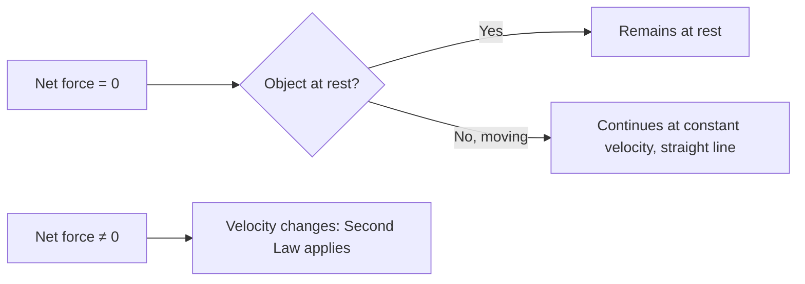
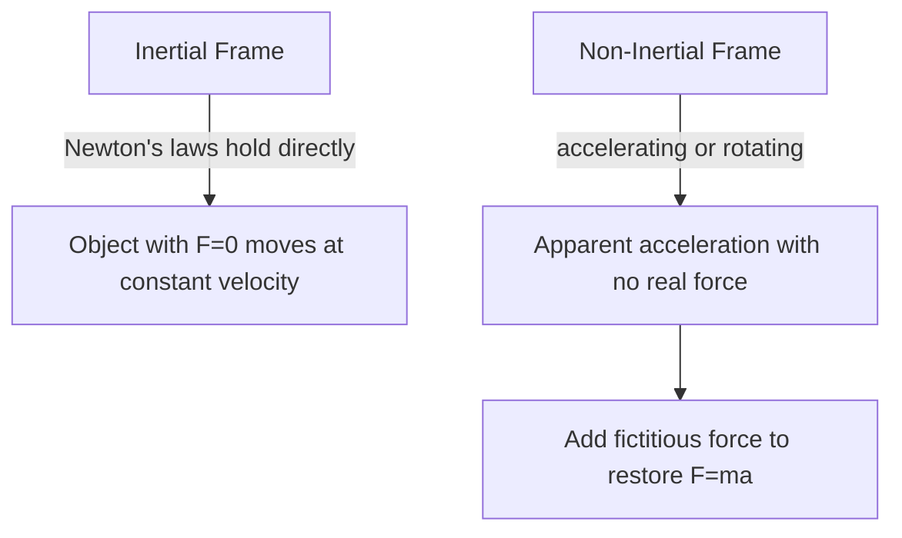
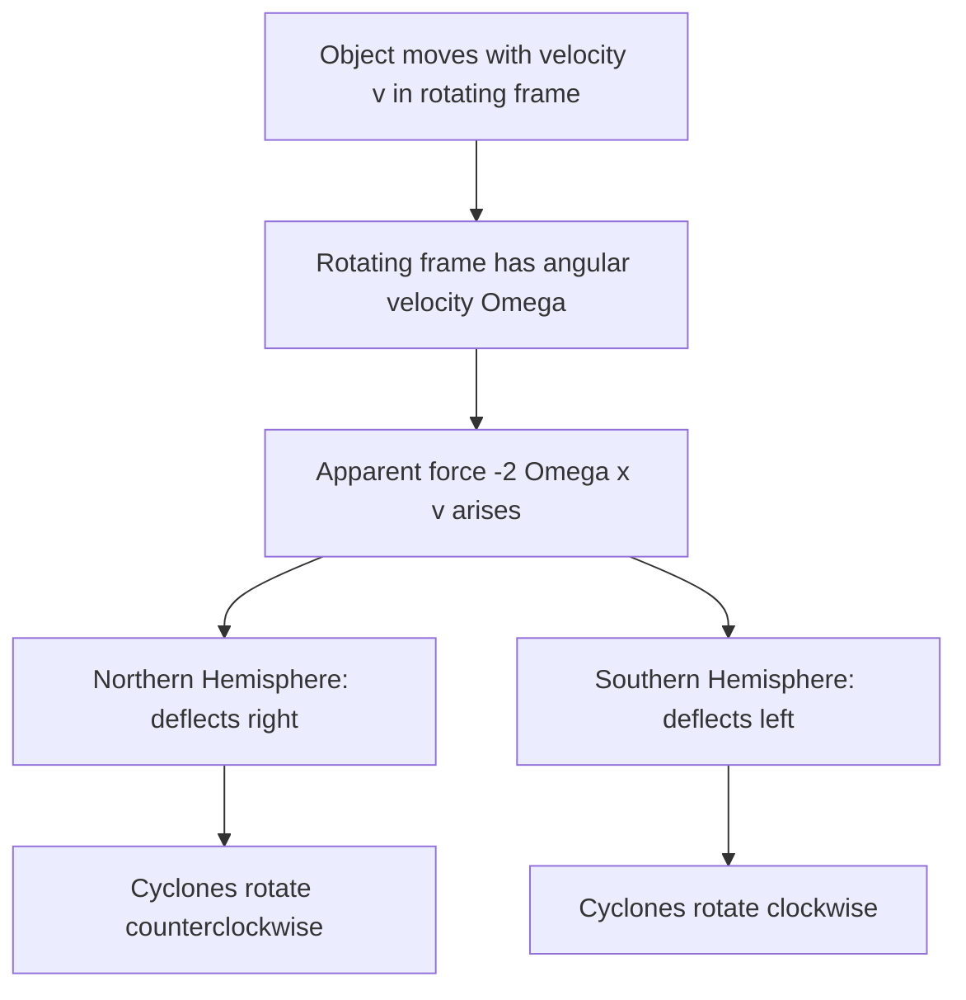
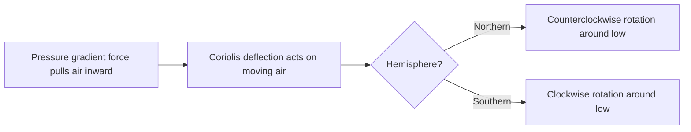

# SPL Run: build_concept_book

- **Adapter:** claude_cli
- **Model:** claude-sonnet-5
- **Tokens:** 9973 in / 6078 out
- **Latency:** 151444ms
- **Timestamp:** 2026-09-27 10:05:08

## Output

```output


---

## Newton's First Law

Newton's First Law states that an object remains at rest, or continues moving at constant velocity in a straight line, unless a net external force acts on it. Formally, if the net force on a body is zero,

$$\sum \vec{F} = 0 \quad \Rightarrow \quad \frac{d\vec{v}}{dt} = 0$$

This law introduces **inertia** — the property of matter that resists changes in motion, quantified later by mass in the Second Law. The key conceptual shift from pre-Newtonian (Aristotelian) physics is that constant velocity, not rest, is the "natural" state requiring no explanation; only a *change* in velocity (acceleration) demands a causal force. (The related idea of an *inertial reference frame* — one in which this law actually holds — is developed separately once relative motion is introduced.)

**Worked example.** A hockey puck slides across smooth ice at $5\ \text{m/s}$. Ice exerts negligible friction, and gravity is balanced by the normal force from the ice surface, so $\sum \vec{F} \approx 0$. The First Law predicts the puck continues at $5\ \text{m/s}$ in a straight line indefinitely — which matches observation far better than assuming it should naturally slow down. If the puck *does* slow, the law tells us to look for an unbalanced force (friction, air resistance) rather than accept deceleration as default behavior.

**Problem-solving application.** The First Law's real diagnostic power appears in free-body analysis: whenever a body's velocity is constant (including zero), you can conclude $\sum \vec{F} = 0$ and use that equation to solve for unknown forces. For instance, a book resting on a table has weight $mg$ acting downward; since it is not accelerating, the normal force $N$ must satisfy $N - mg = 0$, giving $N = mg$. This technique — setting net force to zero for equilibrium problems — is the standard method for analyzing static structures, objects on inclines, and systems in constant-velocity motion (e.g., a car cruising at steady speed, where engine thrust exactly cancels drag and friction).



*This diagram contrasts the zero-net-force condition governed by the First Law with the nonzero case that transitions into the Second Law.*

---

## Newtons Second Law

Newton's second law states that the acceleration of an object is directly proportional to the net external force acting on it, points in the same direction as that force, and is inversely proportional to the object's mass:

$$\vec{F}_{net} = m\vec{a}$$

Here $\vec{F}_{net}$ is the vector sum of all forces acting on the object (in newtons, N), $m$ is the mass (in kilograms, a scalar measure of inertia — the object's resistance to acceleration), and $\vec{a}$ is the resulting acceleration (in m/s²). Because force and acceleration are vectors, the law must be applied component-by-component: $F_{net,x} = ma_x$, $F_{net,y} = ma_y$, and so on. This law is not just descriptive — it is the equation you solve to predict motion whenever you know the forces, or to infer unknown forces whenever you know the motion.

**Worked example.** A 12 kg sled is pulled across ice by a rope with tension 40 N at $20°$ above horizontal, while friction opposes the motion with a force of 6 N. Find the sled's horizontal acceleration.

Resolve the tension into components: $F_x = 40\cos(20°) \approx 37.6$ N. The net horizontal force is $F_{net,x} = 37.6 - 6 = 31.6$ N. Applying $F_{net} = ma$:

$$a_x = \frac{F_{net,x}}{m} = \frac{31.6}{12} \approx 2.63 \text{ m/s}^2$$

**Problem-solving application.** In any system with multiple forces, the working procedure is: (1) isolate the object of interest with a free-body diagram showing every force acting on it, (2) sum the forces along convenient axes to get $F_{net}$, and (3) set $F_{net} = ma$ and solve for whatever is unknown — acceleration, an individual force, or the mass. Applying this to the sled above: once you know $a_x$, the same equation lets you work backward — if the sled were instead observed to accelerate at a *given* rate, you could solve for the unknown friction or tension rather than for $a$. This flexibility — solving the same equation for whichever quantity is missing — is what makes Newton's second law the computational backbone of classical mechanics, scaling from a sled on ice to rockets and structural loads.


*The standard procedure for applying Newton's second law to any mechanics problem.*

---

## Acceleration

Acceleration is the rate at which velocity changes over time. Because velocity is a vector — carrying both magnitude (speed) and direction — acceleration occurs whenever either one changes: speeding up, slowing down, or turning, even at constant speed. Average acceleration over a time interval is defined as

$$
\vec{a}_{avg} = \frac{\Delta \vec{v}}{\Delta t} = \frac{\vec{v}_f - \vec{v}_i}{t_f - t_i}
$$

Instantaneous acceleration, the value at a single moment, is the derivative of velocity with respect to time, $\vec{a} = \dfrac{d\vec{v}}{dt}$, and since velocity itself is $\dfrac{d\vec{x}}{dt}$, acceleration is the second derivative of position: $\vec{a} = \dfrac{d^2\vec{x}}{dt^2}$. This derivative structure is not optional formalism — it is what makes acceleration a *local* quantity, telling you the instantaneous curvature of a motion graph rather than a coarse average, and it is exactly what lets calculus-based kinematics predict position and velocity at any future time via integration.

**Worked example.** A car traveling east at $12\ \text{m/s}$ speeds up uniformly to $28\ \text{m/s}$ over $8.0\ \text{s}$. Its average acceleration is

$$
a = \frac{28 - 12}{8.0} = 2.0\ \text{m/s}^2 \text{ (east)}
$$

Now suppose the same car instead maintains a constant $20\ \text{m/s}$ but goes around a circular curve of radius $50\ \text{m}$. Its speed never changes, yet it is still accelerating, because direction changes continuously. This centripetal acceleration has magnitude $a_c = v^2/r = (20)^2/50 = 8.0\ \text{m/s}^2$, directed toward the center of the curve — a case invisible to a purely speed-based intuition of acceleration.

**Problem-solving application.** When acceleration is constant, the derivative relation integrates cleanly into the kinematic equations $v_f = v_i + at$ and $x_f = x_i + v_i t + \tfrac{1}{2}at^2$, which let you solve for any unknown (time, displacement, final velocity) given the others — the standard toolkit for projectile motion, braking distance, and launch problems. For non-uniform acceleration, such as a rocket burning fuel, you must instead integrate $a(t)$ directly: $v(t) = v_0 + \int_0^t a(\tau)\, d\tau$. Recognizing which regime you're in — constant $a$ versus $a(t)$ — is the first decision in any kinematics problem, and determines whether algebraic formulas or integration is the correct tool.

---

## Inertial Frame Of Reference

An inertial frame of reference is a coordinate system in which a body subject to zero net force moves at constant velocity — Newton's first law holds exactly, with no unexplained accelerations. Equivalently, in an inertial frame every force acting on an object can be traced to an identifiable physical source (gravity, tension, friction, electromagnetic interaction). Any frame moving at constant velocity relative to an inertial frame is also inertial, since accelerations transform identically between them: $\vec{a}' = \vec{a}$ when $\vec{v}_{\text{frame}} = \text{constant}$. A frame that is accelerating or rotating relative to an inertial frame is *non-inertial*, and in it, objects appear to accelerate with no real force causing them to — for example, passengers lurch forward when a bus brakes, even though no physical force pushed them forward. To make Newton's second law $F = ma$ balance in a non-inertial frame, physicists introduce a *fictitious force* ($-m\vec{a}_{\text{frame}}$, or the centrifugal/Coriolis terms for rotation) — a mathematical correction, not a real interaction.

**Worked example:** A ball rests on a frictionless table inside a train. In the ground frame (inertial), if the train accelerates forward at $a = 2\ \text{m/s}^2$, the ball — with no horizontal force acting on it — stays at rest relative to the ground, so it appears to slide backward relative to the train. A passenger inside the train (non-inertial frame) sees the ball accelerate backward at $2\ \text{m/s}^2$ and, to apply $F=ma$, must invoke a fictitious force $F_{\text{fict}} = -ma$ acting on the ball, even though nothing physically touched it.

**Problem-solving application:** When analyzing motion, first ask whether your reference frame is inertial. If it is rotating or accelerating (a car turning, a spinning space station, Earth's surface over large timescales), either (1) switch to an inertial frame and solve there, then transform results back, or (2) stay in the non-inertial frame but add the correct fictitious force term. Misidentifying the frame is a common source of error — e.g., forgetting the Coriolis force when modeling projectile motion over long distances on Earth's rotating surface leads to systematic prediction errors.


*Comparison of inertial and non-inertial frames: only the non-inertial case requires a fictitious force correction.*

---

## Radian

A radian is the angle subtended at the center of a circle by an arc whose length equals the circle's radius. Formally, if an arc of length $s$ lies on a circle of radius $r$, the angle $\theta$ it subtends (in radians) is defined by the ratio

$$\theta = \frac{s}{r}.$$

Because both $s$ and $r$ carry units of length, $\theta$ is dimensionless — it is a pure number, not a unit tied to an arbitrary convention like the degree. Since the circumference of a full circle is $2\pi r$, one complete revolution corresponds to $\theta = \frac{2\pi r}{r} = 2\pi$ radians. This gives the standard conversion between degrees and radians:

$$\theta_{\text{rad}} = \theta_{\text{deg}} \cdot \frac{\pi}{180}, \qquad \theta_{\text{deg}} = \theta_{\text{rad}} \cdot \frac{180}{\pi}.$$

**Worked example.** Convert $135^\circ$ to radians: $135 \cdot \frac{\pi}{180} = \frac{3\pi}{4}$ rad. Conversely, an angle of $\frac{\pi}{6}$ rad equals $\frac{\pi}{6} \cdot \frac{180}{\pi} = 30^\circ$. Notice how the $\pi$ cancels cleanly — this is precisely why radians are the natural unit in calculus and physics: derivatives of trigonometric functions, such as $\frac{d}{d\theta}\sin\theta = \cos\theta$, hold only when $\theta$ is measured in radians. Using degrees would force an extra conversion factor into every derivative and integral.

**Problem-solving application.** Radians make arc-length and angular-motion problems direct algebra rather than unit-juggling. Suppose a wheel of radius $0.3$ m rotates through an angle of $2.5$ rad. The arc length traveled by a point on the rim is simply $s = r\theta = 0.3 \times 2.5 = 0.75$ m — no conversion factor needed. Similarly, if the wheel spins at an angular velocity $\omega = 4$ rad/s, the linear speed of a point on the rim is $v = r\omega = 0.3 \times 4 = 1.2$ m/s. This formula $v = r\omega$ is valid *only* when $\omega$ is in radians per unit time, because the radian's definition as $s/r$ is what makes the radius factor out correctly. Whenever a problem involves circular motion, rotational velocity, or trigonometric calculus, converting to radians first — rather than working in degrees — eliminates unnecessary scaling errors and keeps the underlying geometry transparent.

---

## Radius Of Curvature

Any smooth curved path can be approximated, at each point, by a circle that best matches the path's bend at that instant — the **osculating circle**. Its radius, $r$, is the **radius of curvature**: the distance from the path to the center of that instantaneous circle. For a particle undergoing genuinely circular motion (constant $r$), this is simply the radius of the circle. For a particle moving along a general curve — a car rounding a bend of varying sharpness, a roller-coaster loop — $r$ changes from point to point, and it is this local $r$ that governs the physics at each instant.

The radius of curvature sets the scale for every rotational and centripetal quantity. Centripetal acceleration is $a_c = v^2/r$, and centripetal force is $F_c = mv^2/r$. A smaller $r$ means sharper turning, which for fixed speed $v$ demands larger acceleration and force. This is why highway curves with small radii carry lower speed limits: the required centripetal force ($F_c = mv^2/r$) is supplied by friction between tires and road, and friction has a maximum value. Set $F_c$ equal to the maximum static friction $\mu_s mg$ and solve for the maximum safe speed:

$$v_{max} = \sqrt{\mu_s g r}$$

**Worked example.** A car rounds a flat curve of radius $r = 50\text{ m}$ on a road with $\mu_s = 0.6$. Using $g = 9.8\text{ m/s}^2$:

$$v_{max} = \sqrt{(0.6)(9.8)(50)} = \sqrt{294} \approx 17.1\text{ m/s} \approx 61.6\text{ km/h}$$

Doubling the radius to $100\text{ m}$ increases $v_{max}$ only by a factor of $\sqrt{2} \approx 1.41$, since $v_{max} \propto \sqrt{r}$ — a useful proportional-reasoning shortcut for problem-solving without recomputing everything from scratch.

**Problem-solving application.** When a curve isn't circular, extracting $r$ at a specific point requires calculus: for a path $y(x)$,

$$r = \frac{\left[1 + (y')^2\right]^{3/2}}{|y''|}$$

This formula converts local slope and concavity into an equivalent circular radius, letting you apply $a_c = v^2/r$ at any point along an arbitrary trajectory — for instance, finding where a roller coaster's loop exerts maximum force on a rider, which occurs where $r$ is smallest.

---

## Non Inertial Frame Of Reference

A reference frame is **inertial** if Newton's first law holds unmodified: an object with no net real force on it moves at constant velocity. A **non-inertial frame** is any frame that is accelerating or rotating relative to an inertial frame — a braking car, a spinning carousel, or the surface of the rotating Earth. Inside such a frame, objects appear to accelerate even when no real force acts on them. To make Newton's second law, $\vec{F} = m\vec{a}$, still work in these frames, physicists introduce **fictitious (pseudo) forces** — mathematical corrections, not interactions between bodies, that account for the frame's own acceleration.

For a frame accelerating linearly with acceleration $\vec{A}$, an observer inside must add a pseudo-force $\vec{F}_{\text{fict}} = -m\vec{A}$ to make the equations balance. For a frame rotating at constant angular velocity $\vec{\omega}$, two pseudo-forces appear: the **centrifugal force**, $\vec{F}_{cf} = -m\,\vec{\omega} \times (\vec{\omega} \times \vec{r})$, pointing outward from the rotation axis, and the **Coriolis force**, $\vec{F}_{cor} = -2m\,\vec{\omega} \times \vec{v}'$, acting on anything moving within the rotating frame (here $\vec{v}'$ is the object's velocity as measured in that rotating frame).

**Worked example:** A ball sits on a merry-go-round rotating at $\omega = 2\ \text{rad/s}$, at radius $r = 1.5\ \text{m}$, held in place by friction. In the inertial (ground) frame, the ball undergoes real centripetal acceleration $a_c = \omega^2 r = 6\ \text{m/s}^2$, produced by friction pointing inward. In the rotating frame co-moving with the ball, the ball is at rest — so to satisfy $\vec{F}=m\vec{a}=0$, an observer riding the merry-go-round must invoke a centrifugal force of $m\omega^2 r$ outward, exactly balancing friction.

**Problem-solving application:** To analyze motion in a rotating frame, first write Newton's second law using only real forces in the inertial frame, solve for the physical acceleration, then transform to the rotating frame by adding $-m\vec{A}$ (translational) and/or the centrifugal and Coriolis terms (rotational). This method is essential for predicting weather-system rotation (Coriolis effect), spacecraft docking maneuvers, and apparent weight variations at Earth's equator versus poles.

---

## Rotation Angle

When an object moves along a circular arc, the amount by which it turns can be measured two ways: as an angle in degrees, or as the ratio of the distance traveled along the arc to the radius of the circle. This second measure is the **rotation angle**, defined as

$$\Delta\theta = \frac{\Delta s}{r}$$

where $\Delta s$ is the arc length traveled and $r$ is the radius of curvature. Because $\Delta\theta$ is a ratio of two lengths, it is dimensionless — but by convention we give it the unit **radian** to distinguish it from a raw number. One full revolution corresponds to an arc length equal to the circle's circumference, $\Delta s = 2\pi r$, so $\Delta\theta = 2\pi$ radians, matching the familiar $360°$. This gives the conversion $1 \text{ rad} = \dfrac{180°}{\pi} \approx 57.3°$.

**Worked example.** A car's tire has a radius of $0.30\text{ m}$. If a point on the tire's edge travels an arc length of $1.5\text{ m}$ as the wheel rolls forward, find the rotation angle of the tire.

$$\Delta\theta = \frac{\Delta s}{r} = \frac{1.5\text{ m}}{0.30\text{ m}} = 5.0 \text{ rad}$$

Converting to degrees: $5.0 \times \dfrac{180°}{\pi} \approx 286.5°$ — just under one full turn.

**Problem-solving application.** The formula $\Delta\theta = \Delta s / r$ is the bridge between straight-line (translational) motion and rotational motion, and it is the reason a smaller radius produces a larger rotation angle for the same arc length — think of a bicycle's small front sprocket turning more than its large rear wheel for the same chain length moved. This relationship also extends directly to angular velocity and angular acceleration: dividing both sides by time, $\Delta\theta/\Delta t = \Delta s/(r\,\Delta t)$, gives $\omega = v/r$, linking linear speed $v$ to angular speed $\omega$. When solving problems involving wheels, gears, orbits, or any body executing circular motion, always begin by identifying the radius of curvature relevant to the point of interest — using the wrong radius (e.g., a gear's inner radius instead of its outer radius) is the most common source of error. Once $r$ is fixed, converting between arc length, rotation angle, and their time derivatives becomes a matter of consistent unit bookkeeping, always working in radians for any formula involving $\omega$ or $\alpha$.

---

## Angular Velocity

**Definition.** Angular velocity, $\omega$, measures how fast an object rotates — the rate of change of angular position $\theta$ with respect to time:
$$
\omega = \frac{\Delta \theta}{\Delta t}, \qquad \text{or instantaneously,} \qquad \omega = \frac{d\theta}{dt}
$$
Angle is measured in radians, so $\omega$ has units of radians per second (rad/s). Angular velocity is a vector quantity: its magnitude gives the rotation rate, and its direction (by the right-hand rule) points along the rotation axis, indicating the sense of rotation (e.g., counterclockwise vs. clockwise when viewed from above).

Angular velocity connects directly to linear (tangential) speed for a point on a rotating body. If a point sits at radius $r$ from the rotation axis, its tangential speed is
$$
v = \omega r
$$
This relationship is why a horse on the outer edge of a merry-go-round moves faster (larger $v$) than one near the center, even though both share the same $\omega$.

**Worked example.** A bicycle wheel of radius $0.35\text{ m}$ completes 2 full revolutions in 1 second. Find $\omega$ and the tangential speed of a point on the rim.

Each revolution corresponds to $2\pi$ radians, so total angle swept is $\Delta\theta = 2 \times 2\pi = 4\pi$ rad in $\Delta t = 1\text{ s}$:
$$
\omega = \frac{4\pi \text{ rad}}{1\text{ s}} \approx 12.57 \text{ rad/s}
$$
Tangential speed at the rim:
$$
v = \omega r = 12.57 \times 0.35 \approx 4.40 \text{ m/s}
$$

**Problem-solving application.** Angular velocity is essential whenever you must relate rotational motion to real-world quantities like speed, frequency, or period. Given a rotation frequency $f$ (revolutions per second), convert with $\omega = 2\pi f$; given period $T$ (seconds per revolution), use $\omega = \dfrac{2\pi}{T}$. For example, Earth's rotation has $T = 86{,}164\text{ s}$ (one sidereal day), giving $\omega = \dfrac{2\pi}{86{,}164} \approx 7.29 \times 10^{-5}$ rad/s — a value used directly in satellite orbit calculations and Coriolis-effect problems. When solving multi-step mechanics problems (e.g., a rotating disk with objects at different radii), first find $\omega$ from the given time/angle data, then apply $v = \omega r$ to each point of interest — since $\omega$ is the same for every point on a rigid rotating body, it's often the most efficient quantity to solve for first.

---

## Fictitious Force

Newton's laws hold only in inertial reference frames — frames that are not accelerating. When you analyze motion from a non-inertial frame (one that is accelerating linearly or rotating), objects appear to experience forces that have no physical source: no push, no pull, no field, no contact. These are fictitious forces, also called pseudo-forces or inertial forces. They must be added to Newton's second law to make it balance correctly when the observer's frame itself is accelerating.

The general rule: if a frame accelerates with acceleration $\vec{a}_{\text{frame}}$ relative to an inertial frame, an observer in that frame must add a fictitious force $\vec{F}_{\text{fict}} = -m\vec{a}_{\text{frame}}$ to any object of mass $m$ to make Newton's second law appear valid locally. For rotating frames, two additional terms appear: the centrifugal force $\vec{F}_{\text{cf}} = -m\vec{\omega} \times (\vec{\omega} \times \vec{r})$, pointing outward from the rotation axis, and the Coriolis force $\vec{F}_{\text{Cor}} = -2m\vec{\omega} \times \vec{v}'$, which acts on objects moving within the rotating frame, where $\vec{v}'$ is the velocity measured in that frame.

Worked example: a passenger stands in a bus that suddenly accelerates forward at $a = 3\ \text{m/s}^2$. From the ground (inertial) frame, the passenger's feet are pushed forward by friction, while the passenger's upper body — due to inertia — resists the acceleration, causing an apparent backward lurch. From the passenger's own (non-inertial) frame, this appears as if a backward force $F_{\text{fict}} = -ma$ acted on their body, even though no such physical force exists. If the passenger has mass $70\ \text{kg}$, this apparent backward force is $210\ \text{N}$.

Problem-solving application: fictitious forces are essential for correctly modeling systems that are naturally rotating, such as Earth. The Coriolis force explains why large-scale winds and ocean currents curve — clockwise in the Northern Hemisphere, counterclockwise in the Southern — rather than flowing straight from high to low pressure. Engineers analyzing systems in rotating frames — centrifuges, merry-go-rounds, spacecraft with rotational "artificial gravity" — must include centrifugal and Coriolis terms to correctly predict trajectories and forces, even though a ground-based inertial observer would explain the same motion using only real forces and Newton's first law (inertia alone, no forces needed).

---

## Coriolis Force

In a rotating reference frame, an object moving with velocity $\vec{v}$ relative to that frame experiences an apparent deflection described by the Coriolis acceleration:

$$\vec{a}_{\text{cor}} = -2\vec{\Omega} \times \vec{v}$$

where $\vec{\Omega}$ is the angular velocity vector of the rotating frame (for Earth, pointing along its rotation axis, magnitude $\Omega = 7.292 \times 10^{-5}\ \text{rad/s}$). This is not a real force — no physical interaction produces it — but an artifact of describing motion from within a frame that is itself accelerating (rotating). Observers in the rotating frame must include it, alongside the centrifugal term $-\vec{\Omega} \times (\vec{\Omega} \times \vec{r})$, to make Newton's second law balance correctly.

**Worked example.** Consider a projectile fired horizontally northward at latitude $\phi$ with speed $v$. The local vertical component of $\vec{\Omega}$ is $\Omega \sin\phi$, so the horizontal deflection acceleration has magnitude $2\Omega v \sin\phi$, directed eastward in the Northern Hemisphere (to the right of motion) and westward in the Southern Hemisphere (to the left). At $\phi = 45^\circ$ and $v = 300\ \text{m/s}$ (an artillery shell), the deflection acceleration is:

$$a = 2(7.292\times10^{-5})(300)\sin 45^\circ \approx 0.031\ \text{m/s}^2$$

Over a 30-second flight, the lateral displacement $\Delta x \approx \tfrac{1}{2}a t^2 \approx 14\ \text{m}$ — small per second, but enough to require ballistic corrections for long-range artillery.

**Problem-solving application.** The Coriolis force governs large-scale atmospheric and oceanic circulation: it deflects poleward-moving air to the east and equatorward-moving air to the west, producing the characteristic counterclockwise rotation of Northern Hemisphere cyclones (and clockwise in the Southern Hemisphere). To solve for the geostrophic wind — the balance between the pressure-gradient force and the Coriolis force in the free atmosphere — set $2\Omega v \sin\phi = \frac{1}{\rho}\frac{dP}{dn}$ and solve for $v$. This single balance equation lets meteorologists estimate wind speed directly from a pressure map's isobar spacing, without simulating the full fluid dynamics.


*How rotational frame motion produces hemisphere-dependent deflection and observed storm rotation direction.*

---

## Coriolis Weather Patterns

The Coriolis effect arises because Earth rotates while wind moves relative to its surface. An observer in the rotating reference frame of Earth sees moving air deflect sideways from its expected straight-line path — to the right in the Northern Hemisphere, to the left in the Southern Hemisphere. This is not a real force in the inertial sense; it is an artifact of tracking motion from a spinning platform, formally captured by the Coriolis acceleration:

$$
\vec{a}_{cor} = -2\vec{\Omega} \times \vec{v}
$$

where $\vec{\Omega}$ is Earth's angular velocity vector and $\vec{v}$ is the wind velocity relative to Earth's surface. The magnitude of the effect depends on latitude through the Coriolis parameter $f = 2\Omega\sin\phi$, which is zero at the equator and maximal at the poles — explaining why hurricanes never form near the equator: there is too little deflection to organize rotation.

**Worked example**: Consider a low-pressure system. Air rushes inward toward the center, driven by the pressure-gradient force. In the Northern Hemisphere, the Coriolis acceleration deflects this inflowing air to the right of its motion. As parcels converge from all directions and each gets deflected rightward, the net effect is a counterclockwise rotation around the low — this is exactly the swirl visible in satellite images of Northern Hemisphere storms. In the Southern Hemisphere, the same physics with $\sin\phi < 0$ flips the deflection, producing clockwise rotation.

**Problem-solving application**: Meteorologists use this relationship to diagnose pressure systems from wind data alone. If a station reports wind shifting from south to west to north over a day (Northern Hemisphere), that veering pattern indicates a counterclockwise-rotating low is passing to the north — allowing forecasters to locate storm centers without direct pressure readings. This same balance between pressure-gradient force and Coriolis deflection defines geostrophic wind, the large-scale approximation $f v = \frac{1}{\rho}\frac{\partial p}{\partial n}$, used operationally to estimate wind speed directly from pressure-map spacing.


*How pressure-gradient force and hemisphere-dependent Coriolis deflection combine to determine the rotational direction of a low-pressure system.*

---

## Payoff

The Coriolis effect on weather patterns is the point where kinematics, dynamics, and fluid behavior on a rotating planet converge into something you can actually watch unfold on a satellite loop. Every earlier concept — angular velocity, reference frames, pressure gradients, fluid parcels — was building toward this: an explanation for why hurricanes spin counterclockwise in the Northern Hemisphere, why trade winds curve instead of blowing straight from high to low pressure, and why the jet stream meanders rather than running in a straight line. The governing relationship is the Coriolis acceleration acting on a moving air parcel:

$$
\vec{a}_{\text{Cor}} = -2\,\vec{\Omega} \times \vec{v}
$$

where $\vec{\Omega}$ is Earth's angular velocity vector and $\vec{v}$ is the parcel's velocity in the rotating frame. Combined with the pressure-gradient force, this produces geostrophic balance — the reason winds flow *along* isobars rather than across them, once you're far enough from the equator that $\Omega \sin(\text{latitude})$ is non-negligible. This is the natural endpoint of the book because it is the first result that cannot be understood by intuition alone; it requires everything you've assembled — vectors, rotation, force balance — operating simultaneously on a real, messy physical system.

What makes this concept a genuine capstone is that it does not stay confined to meteorology. The same $-2\vec{\Omega}\times\vec{v}$ term governs ocean gyres and the direction of major currents, explains why long-range artillery and ballistic trajectories require Coriolis correction, and appears again in engineering contexts such as the design of Foucault pendulums and inertial navigation systems. In atmospheric science specifically, it is the backbone of climate modeling, cyclone-formation prediction, and the interpretation of global circulation cells (Hadley, Ferrel, Polar). Anywhere a system moves across a rotating reference frame — air, water, or a rigid body — this same force reappears in a new costume.

That range is the invitation: pick one domain — cyclone genesis, ocean gyre circulation, or inertial navigation — and trace how the identical Coriolis term, now embedded in a different set of governing equations, produces a completely different observable phenomenon. Understanding *why* the same three lines of vector calculus explain both a hurricane's spin and a submarine's guidance system is where this book's ideas stop being abstract and start becoming a working toolkit.
```
