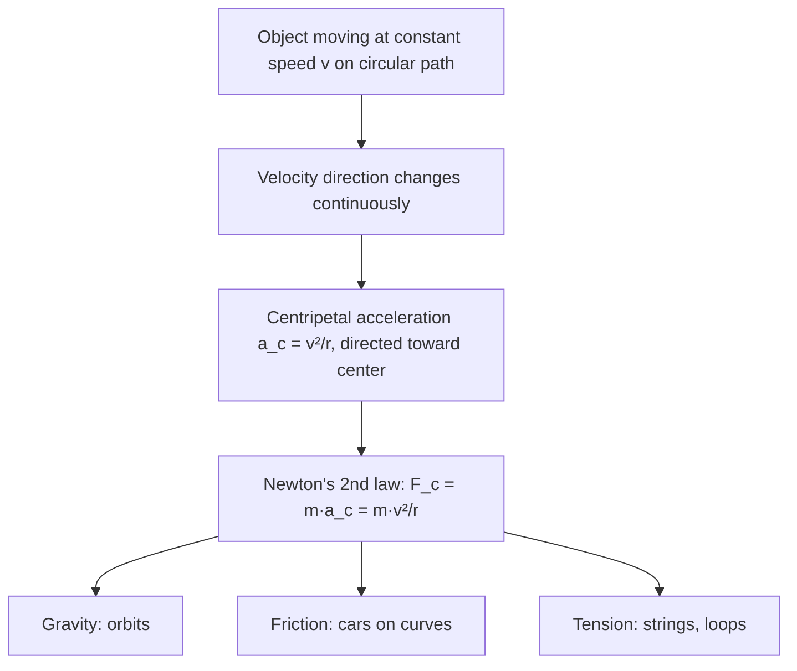

# SPL Run: build_concept_book

- **Adapter:** claude_cli
- **Model:** claude-sonnet-5
- **Tokens:** 7050 in / 4310 out
- **Latency:** 147874ms
- **Timestamp:** 2026-09-27 10:07:41

## Output

```output


---

## Radius Of Curvature

Any smooth curved path can be approximated, at each point, by a circle that best matches the path's bend at that instant — the **osculating circle**. Its radius, $r$, is the **radius of curvature**: the distance from the path to the center of that instantaneous circle. For a particle undergoing genuinely circular motion (constant $r$), this is simply the radius of the circle. For a particle moving along a general curve — a car rounding a bend of varying sharpness, a roller-coaster loop — $r$ changes from point to point, and it is this local $r$ that governs the physics at each instant.

The radius of curvature sets the scale for every rotational and centripetal quantity. Centripetal acceleration is $a_c = v^2/r$, and centripetal force is $F_c = mv^2/r$. A smaller $r$ means sharper turning, which for fixed speed $v$ demands larger acceleration and force. This is why highway curves with small radii carry lower speed limits: the required centripetal force ($F_c = mv^2/r$) is supplied by friction between tires and road, and friction has a maximum value. Set $F_c$ equal to the maximum static friction $\mu_s mg$ and solve for the maximum safe speed:

$$v_{max} = \sqrt{\mu_s g r}$$

**Worked example.** A car rounds a flat curve of radius $r = 50\text{ m}$ on a road with $\mu_s = 0.6$. Using $g = 9.8\text{ m/s}^2$:

$$v_{max} = \sqrt{(0.6)(9.8)(50)} = \sqrt{294} \approx 17.1\text{ m/s} \approx 61.6\text{ km/h}$$

Doubling the radius to $100\text{ m}$ increases $v_{max}$ only by a factor of $\sqrt{2} \approx 1.41$, since $v_{max} \propto \sqrt{r}$ — a useful proportional-reasoning shortcut for problem-solving without recomputing everything from scratch.

**Problem-solving application.** When a curve isn't circular, extracting $r$ at a specific point requires calculus: for a path $y(x)$,

$$r = \frac{\left[1 + (y')^2\right]^{3/2}}{|y''|}$$

This formula converts local slope and concavity into an equivalent circular radius, letting you apply $a_c = v^2/r$ at any point along an arbitrary trajectory — for instance, finding where a roller coaster's loop exerts maximum force on a rider, which occurs where $r$ is smallest.

---

## Radian

A radian is the angle subtended at the center of a circle by an arc whose length equals the circle's radius. Formally, if an arc of length $s$ lies on a circle of radius $r$, the angle $\theta$ it subtends (in radians) is defined by the ratio

$$\theta = \frac{s}{r}.$$

Because both $s$ and $r$ carry units of length, $\theta$ is dimensionless — it is a pure number, not a unit tied to an arbitrary convention like the degree. Since the circumference of a full circle is $2\pi r$, one complete revolution corresponds to $\theta = \frac{2\pi r}{r} = 2\pi$ radians. This gives the standard conversion between degrees and radians:

$$\theta_{\text{rad}} = \theta_{\text{deg}} \cdot \frac{\pi}{180}, \qquad \theta_{\text{deg}} = \theta_{\text{rad}} \cdot \frac{180}{\pi}.$$

**Worked example.** Convert $135^\circ$ to radians: $135 \cdot \frac{\pi}{180} = \frac{3\pi}{4}$ rad. Conversely, an angle of $\frac{\pi}{6}$ rad equals $\frac{\pi}{6} \cdot \frac{180}{\pi} = 30^\circ$. Notice how the $\pi$ cancels cleanly — this is precisely why radians are the natural unit in calculus and physics: derivatives of trigonometric functions, such as $\frac{d}{d\theta}\sin\theta = \cos\theta$, hold only when $\theta$ is measured in radians. Using degrees would force an extra conversion factor into every derivative and integral.

**Problem-solving application.** Radians make arc-length and angular-motion problems direct algebra rather than unit-juggling. Suppose a wheel of radius $0.3$ m rotates through an angle of $2.5$ rad. The arc length traveled by a point on the rim is simply $s = r\theta = 0.3 \times 2.5 = 0.75$ m — no conversion factor needed. Similarly, if the wheel spins at an angular velocity $\omega = 4$ rad/s, the linear speed of a point on the rim is $v = r\omega = 0.3 \times 4 = 1.2$ m/s. This formula $v = r\omega$ is valid *only* when $\omega$ is in radians per unit time, because the radian's definition as $s/r$ is what makes the radius factor out correctly. Whenever a problem involves circular motion, rotational velocity, or trigonometric calculus, converting to radians first — rather than working in degrees — eliminates unnecessary scaling errors and keeps the underlying geometry transparent.

---

## Rotation Angle

When an object moves along a circular arc, the amount by which it turns can be measured two ways: as an angle in degrees, or as the ratio of the distance traveled along the arc to the radius of the circle. This second measure is the **rotation angle**, defined as

$$\Delta\theta = \frac{\Delta s}{r}$$

where $\Delta s$ is the arc length traveled and $r$ is the radius of curvature. Because $\Delta\theta$ is a ratio of two lengths, it is dimensionless — but by convention we give it the unit **radian** to distinguish it from a raw number. One full revolution corresponds to an arc length equal to the circle's circumference, $\Delta s = 2\pi r$, so $\Delta\theta = 2\pi$ radians, matching the familiar $360°$. This gives the conversion $1 \text{ rad} = \dfrac{180°}{\pi} \approx 57.3°$.

**Worked example.** A car's tire has a radius of $0.30\text{ m}$. If a point on the tire's edge travels an arc length of $1.5\text{ m}$ as the wheel rolls forward, find the rotation angle of the tire.

$$\Delta\theta = \frac{\Delta s}{r} = \frac{1.5\text{ m}}{0.30\text{ m}} = 5.0 \text{ rad}$$

Converting to degrees: $5.0 \times \dfrac{180°}{\pi} \approx 286.5°$ — just under one full turn.

**Problem-solving application.** The formula $\Delta\theta = \Delta s / r$ is the bridge between straight-line (translational) motion and rotational motion, and it is the reason a smaller radius produces a larger rotation angle for the same arc length — think of a bicycle's small front sprocket turning more than its large rear wheel for the same chain length moved. This relationship also extends directly to angular velocity and angular acceleration: dividing both sides by time, $\Delta\theta/\Delta t = \Delta s/(r\,\Delta t)$, gives $\omega = v/r$, linking linear speed $v$ to angular speed $\omega$. When solving problems involving wheels, gears, orbits, or any body executing circular motion, always begin by identifying the radius of curvature relevant to the point of interest — using the wrong radius (e.g., a gear's inner radius instead of its outer radius) is the most common source of error. Once $r$ is fixed, converting between arc length, rotation angle, and their time derivatives becomes a matter of consistent unit bookkeeping, always working in radians for any formula involving $\omega$ or $\alpha$.

---

## Angular Velocity

**Definition.** Angular velocity, $\omega$, measures how fast an object rotates — the rate of change of angular position $\theta$ with respect to time:
$$
\omega = \frac{\Delta \theta}{\Delta t}, \qquad \text{or instantaneously,} \qquad \omega = \frac{d\theta}{dt}
$$
Angle is measured in radians, so $\omega$ has units of radians per second (rad/s). Angular velocity is a vector quantity: its magnitude gives the rotation rate, and its direction (by the right-hand rule) points along the rotation axis, indicating the sense of rotation (e.g., counterclockwise vs. clockwise when viewed from above).

Angular velocity connects directly to linear (tangential) speed for a point on a rotating body. If a point sits at radius $r$ from the rotation axis, its tangential speed is
$$
v = \omega r
$$
This relationship is why a horse on the outer edge of a merry-go-round moves faster (larger $v$) than one near the center, even though both share the same $\omega$.

**Worked example.** A bicycle wheel of radius $0.35\text{ m}$ completes 2 full revolutions in 1 second. Find $\omega$ and the tangential speed of a point on the rim.

Each revolution corresponds to $2\pi$ radians, so total angle swept is $\Delta\theta = 2 \times 2\pi = 4\pi$ rad in $\Delta t = 1\text{ s}$:
$$
\omega = \frac{4\pi \text{ rad}}{1\text{ s}} \approx 12.57 \text{ rad/s}
$$
Tangential speed at the rim:
$$
v = \omega r = 12.57 \times 0.35 \approx 4.40 \text{ m/s}
$$

**Problem-solving application.** Angular velocity is essential whenever you must relate rotational motion to real-world quantities like speed, frequency, or period. Given a rotation frequency $f$ (revolutions per second), convert with $\omega = 2\pi f$; given period $T$ (seconds per revolution), use $\omega = \dfrac{2\pi}{T}$. For example, Earth's rotation has $T = 86{,}164\text{ s}$ (one sidereal day), giving $\omega = \dfrac{2\pi}{86{,}164} \approx 7.29 \times 10^{-5}$ rad/s — a value used directly in satellite orbit calculations and Coriolis-effect problems. When solving multi-step mechanics problems (e.g., a rotating disk with objects at different radii), first find $\omega$ from the given time/angle data, then apply $v = \omega r$ to each point of interest — since $\omega$ is the same for every point on a rigid rotating body, it's often the most efficient quantity to solve for first.

---

## Linear Velocity

Linear velocity is the rate of change of an object's position along its path of motion, measured in units such as meters per second. For an object moving along a straight line, this is simply displacement divided by time. But in circular motion, linear velocity refers specifically to the *tangential* speed — how fast a point on a rotating object is moving through space at any instant, even though its direction is constantly changing.

Consider a point on the rim of a spinning wheel of radius $r$, rotating with angular velocity $\omega$ (in radians per second). As the wheel completes one full rotation, the point traces a circle of circumference $2\pi r$ in a time period $T$. Since angular velocity relates to the period by $\omega = \dfrac{2\pi}{T}$, and the point travels distance $2\pi r$ in that same time $T$, the linear velocity is:

$$
v = \frac{2\pi r}{T} = \omega r
$$

This relationship, $v = \omega r$, is the key formula connecting rotational and linear motion. Notice that $v$ depends on $r$: points farther from the axis of rotation move faster in linear terms, even though every point on a rigid rotating body shares the same $\omega$.

**Worked example.** A carousel horse sits 4 meters from the center and completes one revolution every 8 seconds. Find its linear velocity.

First, find angular velocity: $\omega = \dfrac{2\pi}{T} = \dfrac{2\pi}{8} = \dfrac{\pi}{4} \text{ rad/s}$.

Then apply $v = \omega r$: $v = \dfrac{\pi}{4} \times 4 = \pi \approx 3.14 \text{ m/s}$.

A child sitting 2 meters from the center on the same carousel experiences the same $\omega$, but only $v = \dfrac{\pi}{4} \times 2 \approx 1.57$ m/s — half the linear speed, despite completing the same revolution in the same time.

**Problem-solving application.** This distinction matters whenever you must convert between rotational specifications (like RPM on a motor or engine) and real-world speed. For instance, a car's speedometer reports linear velocity, but it is calculated from the wheel's angular velocity and radius — engineers must know $v = \omega r$ (with $\omega$ converted to rad/s) to calibrate it correctly. Whenever a problem gives you rotation rate and a radius, but asks for speed, distance traveled, or velocity comparisons between points, this formula is the bridge between the two descriptions of motion.

---

## Acceleration

Acceleration is the rate at which velocity changes over time. Because velocity is a vector — carrying both magnitude (speed) and direction — acceleration occurs whenever either one changes: speeding up, slowing down, or turning, even at constant speed. Average acceleration over a time interval is defined as

$$
\vec{a}_{avg} = \frac{\Delta \vec{v}}{\Delta t} = \frac{\vec{v}_f - \vec{v}_i}{t_f - t_i}
$$

Instantaneous acceleration, the value at a single moment, is the derivative of velocity with respect to time, $\vec{a} = \dfrac{d\vec{v}}{dt}$, and since velocity itself is $\dfrac{d\vec{x}}{dt}$, acceleration is the second derivative of position: $\vec{a} = \dfrac{d^2\vec{x}}{dt^2}$. This derivative structure is not optional formalism — it is what makes acceleration a *local* quantity, telling you the instantaneous curvature of a motion graph rather than a coarse average, and it is exactly what lets calculus-based kinematics predict position and velocity at any future time via integration.

**Worked example.** A car traveling east at $12\ \text{m/s}$ speeds up uniformly to $28\ \text{m/s}$ over $8.0\ \text{s}$. Its average acceleration is

$$
a = \frac{28 - 12}{8.0} = 2.0\ \text{m/s}^2 \text{ (east)}
$$

Now suppose the same car instead maintains a constant $20\ \text{m/s}$ but goes around a circular curve of radius $50\ \text{m}$. Its speed never changes, yet it is still accelerating, because direction changes continuously. This centripetal acceleration has magnitude $a_c = v^2/r = (20)^2/50 = 8.0\ \text{m/s}^2$, directed toward the center of the curve — a case invisible to a purely speed-based intuition of acceleration.

**Problem-solving application.** When acceleration is constant, the derivative relation integrates cleanly into the kinematic equations $v_f = v_i + at$ and $x_f = x_i + v_i t + \tfrac{1}{2}at^2$, which let you solve for any unknown (time, displacement, final velocity) given the others — the standard toolkit for projectile motion, braking distance, and launch problems. For non-uniform acceleration, such as a rocket burning fuel, you must instead integrate $a(t)$ directly: $v(t) = v_0 + \int_0^t a(\tau)\, d\tau$. Recognizing which regime you're in — constant $a$ versus $a(t)$ — is the first decision in any kinematics problem, and determines whether algebraic formulas or integration is the correct tool.

---

## Tangential Speed

Every point on a rotating rigid body shares the same angular velocity $\omega$, but points at different distances from the axis of rotation move through space at different linear speeds. This linear speed — how fast a point actually travels along its circular arc — is called **tangential speed**, denoted $v_t$. It is called "tangential" because the velocity vector at any instant points along the tangent to the circle, perpendicular to the radius.

The relationship follows directly from the definition of angular velocity. If a point at radius $r$ sweeps through angle $\theta$ (in radians) in time $t$, it travels an arc length $s = r\theta$. Dividing both sides by $t$:

$$
\frac{s}{t} = r\frac{\theta}{t} \quad\Longrightarrow\quad v_t = r\omega
$$

This equation is exact only when $\omega$ is expressed in radians per second, since the arc-length formula $s = r\theta$ itself requires radian measure. A critical consequence: for a rigid body rotating at fixed $\omega$, $v_t$ is not constant across the object — it scales linearly with $r$. The center of a spinning disk has $v_t = 0$; a point on its rim has maximum $v_t$.

**Worked example.** A carousel completes one full rotation every 8 seconds, so $\omega = \dfrac{2\pi}{8} \approx 0.785\ \text{rad/s}$. A child sitting 3 m from the center has tangential speed $v_t = r\omega = 3 \times 0.785 \approx 2.36\ \text{m/s}$. A child seated only 1 m from the center, despite completing the same rotation in the same time, moves at just $v_t = 1 \times 0.785 \approx 0.785\ \text{m/s}$ — three times slower, even though both experience identical $\omega$.

**Problem-solving application.** Tangential speed lets you convert between rotational and translational descriptions of motion — essential for gears, pulleys, wheels, and orbital mechanics. For a car wheel of radius 0.3 m needing a road speed of 20 m/s, required angular velocity is $\omega = v_t/r = 20/0.3 \approx 66.7\ \text{rad/s}$. For two meshed gears of radii $r_1$ and $r_2$ in contact, their tangential speeds at the contact point must match ($v_{t1} = v_{t2}$), giving the gear-ratio relation $r_1\omega_1 = r_2\omega_2$ — the smaller gear must spin proportionally faster. This single equation, $v = r\omega$, is the bridge connecting every rotating system to the linear-motion quantities of everyday intuition.

---

## Uniform Circular Motion

An object moving at constant speed along a circular path is undergoing uniform circular motion. Although the speed (magnitude of velocity) never changes, the velocity vector itself is constantly changing direction — and any change in velocity constitutes acceleration. This is the central, often counterintuitive, idea: an object can accelerate without speeding up or slowing down.

The velocity vector at any instant is tangent to the circle. As the object moves, this tangent direction rotates continuously toward the center. The resulting acceleration, called centripetal acceleration, points radially inward — toward the center of the circle — at every moment. Its magnitude is derived by considering how the velocity vector changes over a small time interval $\Delta t$: as the position vector sweeps through angle $\Delta\theta$, the velocity vector sweeps through the same angle. Comparing the similar triangles formed by the position vectors and velocity vectors gives:

$$
a_c = \frac{v^2}{r}
$$

where $v$ is the constant speed and $r$ is the radius of the circular path. Equivalently, using angular velocity $\omega = v/r$ (radians per second), this can be written as $a_c = \omega^2 r$. Newton's second law then tells us the net inward force required to sustain this motion is:

$$
F_c = \frac{mv^2}{r}
$$

This is not a new, separate force — it is whatever real force (tension, gravity, friction, normal force) happens to supply the inward pull.

**Worked example:** A 0.15 kg ball on a 0.60 m string swings in a horizontal circle at 4.0 m/s. The centripetal acceleration is $a_c = v^2/r = (4.0)^2/0.60 \approx 26.7 \text{ m/s}^2$, and the tension supplying this force is $F_c = ma_c \approx 0.15 \times 26.7 \approx 4.0$ N. Note that tension does no work on the ball, since it is always perpendicular to velocity — consistent with the speed remaining constant.

**Problem-solving application:** A common exam scenario asks for the minimum speed at which a car can round a banked or flat curve without skidding, using $F_c = f_{friction} = \mu m g$ set equal to $mv^2/r$, giving $v_{max} = \sqrt{\mu g r}$. Recognizing that centripetal force is a *role*, not a distinct physical force, is the key skill: identify which real force(s) point toward the center, sum them, and set that sum equal to $mv^2/r$.

---

## Centripetal Acceleration

An object moving at constant speed along a circular path is still accelerating, even though its speed never changes. This is because velocity is a vector, and direction counts: as the object moves around the circle, the direction of its velocity constantly changes, and any change in velocity — speed, direction, or both — is by definition an acceleration. This acceleration, called **centripetal acceleration**, always points toward the center of the circle (the word *centripetal* means "center-seeking"). Its magnitude is

$$a_c = \frac{v^2}{r} = \omega^2 r$$

where $v$ is the tangential speed, $r$ is the radius of the circular path, and $\omega$ is the angular velocity ($v = \omega r$). This result follows from analyzing how the velocity vector rotates: over a small time interval $\Delta t$, the velocity vector sweeps through the same angle $\Delta\theta$ as the position vector, and geometric similarity between the position and velocity triangles gives $|\Delta v|/v = |\Delta r|/r$, which in the limit $\Delta t \to 0$ yields $a_c = v^2/r$.

**Worked example.** A car rounds a curve of radius 50 m at a constant speed of 20 m/s. Its centripetal acceleration is

$$a_c = \frac{v^2}{r} = \frac{(20)^2}{50} = 8\ \text{m/s}^2$$

This is about 0.82g — a noticeable sideways acceleration that some real force must be producing.

**Problem-solving application.** Centripetal acceleration by itself doesn't explain *why* an object turns — that requires combining $a_c = v^2/r$ with Newton's second law, giving the net inward force $F_c = ma_c = mv^2/r$. For the car above, this force is supplied by friction between the tires and the road; since friction has a maximum value before the tires slip, there is a maximum speed at which the car can take the curve without skidding. The same net-force equation governs every circular-motion scenario — gravity supplies $F_c$ for an orbiting satellite, tension supplies it for a ball on a string — but the analysis always starts the same way: identify which real force, or combination of forces, points toward the center, then set it equal to $mv^2/r$. A common error is treating centripetal acceleration as an "outward" force pushing the object away from the center, confusing it with the fictitious centrifugal force felt only in a rotating, non-inertial reference frame. In an inertial frame there is no outward force; $a_c$ is the real, inward acceleration produced entirely by whatever net force is acting.


*How centripetal acceleration arises from changing velocity direction and connects, via Newton's second law, to the real force that causes it.*

---

## Centrifuge

A centrifuge separates components of a mixture by spinning it rapidly around a fixed axis, replacing gravity's weak, slow pull with a much stronger, tunable acceleration. At angular velocity $\omega$ (in radians per second), a particle at radius $r$ from the axis experiences a centripetal acceleration

$$a = \omega^2 r$$

directed toward the axis, which is supplied by the container wall (or, in the rotating frame of the sample, felt as an outward "centrifugal" force pushing denser material away from the axis faster than lighter material). Because $\omega$ appears squared, doubling the spin rate quadruples the acceleration — this is why centrifuges achieve separations in minutes that gravitational settling would take days to accomplish.

To compare centrifuge performance to ordinary gravity, define the relative centrifugal force (RCF):

$$\text{RCF} = \frac{\omega^2 r}{g} = 1.118 \times 10^{-5} \cdot r \cdot \text{RPM}^2$$

where $r$ is in centimeters and $g = 9.8\ \text{m/s}^2$. RCF is reported in multiples of $g$ (e.g., "10,000 × g") because it is independent of the specific machine's geometry, making protocols reproducible across different rotor sizes.

**Worked example:** A rotor spins a sample at $r = 10\ \text{cm}$ at 10,000 RPM. Then:

$$\text{RCF} = 1.118 \times 10^{-5} \times 10 \times (10{,}000)^2 \approx 11{,}180 \times g$$

A particle in this field settles roughly 11,000 times faster than it would under gravity alone, which is why blood samples separate into plasma, buffy coat, and red cells within minutes rather than settling over hours.

**Problem-solving application:** Separation efficiency also depends on the density difference between particle and medium (via Stokes' law, which governs settling velocity), so increasing $\omega$ helps but cannot compensate for two components of nearly identical density — those require a density-gradient (isopycnic) centrifugation instead of simple spin-down. When designing a protocol, an engineer must balance RCF (from rotor radius and RPM), spin duration, and sample viscosity to hit a target separation without generating so much heat or mechanical stress that biological samples are destroyed — a real constraint in ultracentrifuges spinning at over 100,000 RPM.

---

## Payoff

A centrifuge is the physical embodiment of an idea you have already mastered analytically: spin something fast enough, and inertia does the sorting for you. Every particle in a rotating fluid needs a centripetal force $F_c = m\omega^2 r$ to keep it moving in a circle. When two particles differ in mass or density, buoyancy and drag can no longer supply exactly the right force to both, so they drift apart along the radius at different rates. The centrifuge is the natural endpoint of a course built on circular motion, Newton's second law in rotating frames, and fluid drag, because it is the single device where all three ideas act simultaneously on real, separable objects — it turns kinematics into a laboratory instrument.

The classic worked example is separating blood plasma from red blood cells. At rest, gravity does this too slowly to be useful ($a = g \approx 9.8\ \text{m/s}^2$). A clinical centrifuge spinning at $3{,}000$ rpm and radius $r = 0.1\ \text{m}$ gives $\omega = 2\pi(3000/60) \approx 314\ \text{rad/s}$, so $a = \omega^2 r \approx 9{,}860\ \text{m/s}^2$ — over 1,000$g$. Denser cells migrate outward far faster than gravity alone allows, and separation that would take hours takes minutes.

This is where the concept becomes generative rather than merely descriptive. The same $\omega^2 r$ relationship governs uranium isotope enrichment (where mass differences are minuscule, so $\omega$ must be enormous and rotor design becomes a materials-science problem), DNA and protein purification via ultracentrifugation (where sedimentation rate, the Svedberg coefficient, lets biologists infer molecular weight from spin data), industrial oil-water separation, and even astronaut training centrifuges that simulate sustained $g$-forces. In each case, the underlying physics is identical; only the scale of $\omega$, $r$, and the density contrast changes.

Pick one of these — biomedical separation, isotope enrichment, or human-rated $g$-force testing — and work through the numbers: what spin rate and radius would you need, and what does that demand of the materials holding it together?
```
