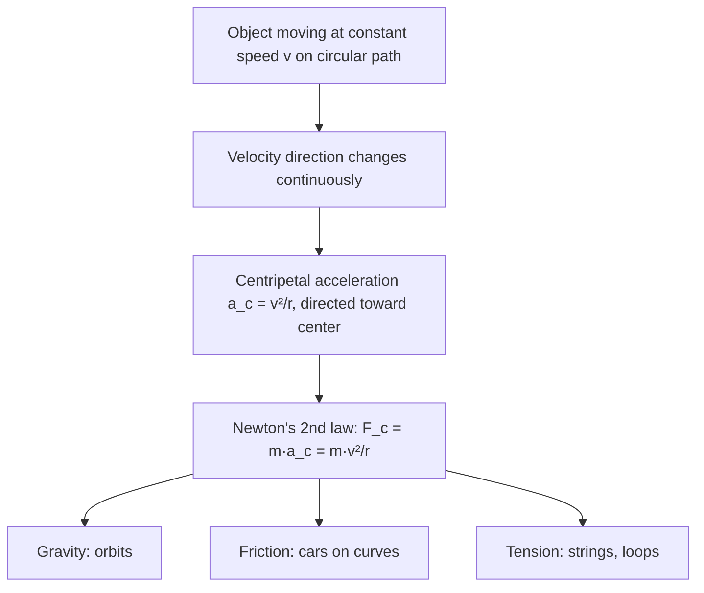
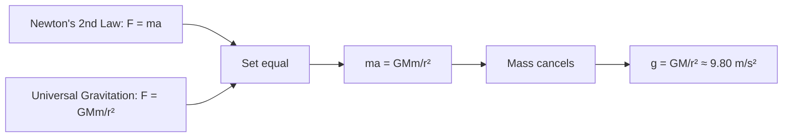
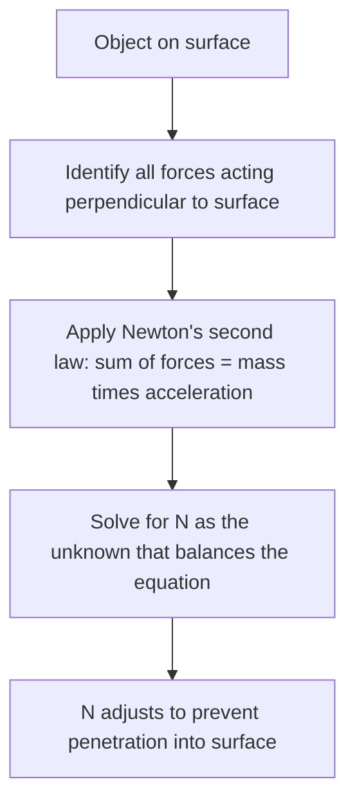

# SPL Run: build_concept_book

- **Adapter:** claude_cli
- **Model:** claude-sonnet-5
- **Tokens:** 8040 in / 4721 out
- **Latency:** 142896ms
- **Timestamp:** 2026-09-27 10:10:09

## Output

```output


---

## Radius Of Curvature

Any smooth curved path can be approximated, at each point, by a circle that best matches the path's bend at that instant — the **osculating circle**. Its radius, $r$, is the **radius of curvature**: the distance from the path to the center of that instantaneous circle. For a particle undergoing genuinely circular motion (constant $r$), this is simply the radius of the circle. For a particle moving along a general curve — a car rounding a bend of varying sharpness, a roller-coaster loop — $r$ changes from point to point, and it is this local $r$ that governs the physics at each instant.

The radius of curvature sets the scale for every rotational and centripetal quantity. Centripetal acceleration is $a_c = v^2/r$, and centripetal force is $F_c = mv^2/r$. A smaller $r$ means sharper turning, which for fixed speed $v$ demands larger acceleration and force. This is why highway curves with small radii carry lower speed limits: the required centripetal force ($F_c = mv^2/r$) is supplied by friction between tires and road, and friction has a maximum value. Set $F_c$ equal to the maximum static friction $\mu_s mg$ and solve for the maximum safe speed:

$$v_{max} = \sqrt{\mu_s g r}$$

**Worked example.** A car rounds a flat curve of radius $r = 50\text{ m}$ on a road with $\mu_s = 0.6$. Using $g = 9.8\text{ m/s}^2$:

$$v_{max} = \sqrt{(0.6)(9.8)(50)} = \sqrt{294} \approx 17.1\text{ m/s} \approx 61.6\text{ km/h}$$

Doubling the radius to $100\text{ m}$ increases $v_{max}$ only by a factor of $\sqrt{2} \approx 1.41$, since $v_{max} \propto \sqrt{r}$ — a useful proportional-reasoning shortcut for problem-solving without recomputing everything from scratch.

**Problem-solving application.** When a curve isn't circular, extracting $r$ at a specific point requires calculus: for a path $y(x)$,

$$r = \frac{\left[1 + (y')^2\right]^{3/2}}{|y''|}$$

This formula converts local slope and concavity into an equivalent circular radius, letting you apply $a_c = v^2/r$ at any point along an arbitrary trajectory — for instance, finding where a roller coaster's loop exerts maximum force on a rider, which occurs where $r$ is smallest.

---

## Radian

A radian is the angle subtended at the center of a circle by an arc whose length equals the circle's radius. Formally, if an arc of length $s$ lies on a circle of radius $r$, the angle $\theta$ it subtends (in radians) is defined by the ratio

$$\theta = \frac{s}{r}.$$

Because both $s$ and $r$ carry units of length, $\theta$ is dimensionless — it is a pure number, not a unit tied to an arbitrary convention like the degree. Since the circumference of a full circle is $2\pi r$, one complete revolution corresponds to $\theta = \frac{2\pi r}{r} = 2\pi$ radians. This gives the standard conversion between degrees and radians:

$$\theta_{\text{rad}} = \theta_{\text{deg}} \cdot \frac{\pi}{180}, \qquad \theta_{\text{deg}} = \theta_{\text{rad}} \cdot \frac{180}{\pi}.$$

**Worked example.** Convert $135^\circ$ to radians: $135 \cdot \frac{\pi}{180} = \frac{3\pi}{4}$ rad. Conversely, an angle of $\frac{\pi}{6}$ rad equals $\frac{\pi}{6} \cdot \frac{180}{\pi} = 30^\circ$. Notice how the $\pi$ cancels cleanly — this is precisely why radians are the natural unit in calculus and physics: derivatives of trigonometric functions, such as $\frac{d}{d\theta}\sin\theta = \cos\theta$, hold only when $\theta$ is measured in radians. Using degrees would force an extra conversion factor into every derivative and integral.

**Problem-solving application.** Radians make arc-length and angular-motion problems direct algebra rather than unit-juggling. Suppose a wheel of radius $0.3$ m rotates through an angle of $2.5$ rad. The arc length traveled by a point on the rim is simply $s = r\theta = 0.3 \times 2.5 = 0.75$ m — no conversion factor needed. Similarly, if the wheel spins at an angular velocity $\omega = 4$ rad/s, the linear speed of a point on the rim is $v = r\omega = 0.3 \times 4 = 1.2$ m/s. This formula $v = r\omega$ is valid *only* when $\omega$ is in radians per unit time, because the radian's definition as $s/r$ is what makes the radius factor out correctly. Whenever a problem involves circular motion, rotational velocity, or trigonometric calculus, converting to radians first — rather than working in degrees — eliminates unnecessary scaling errors and keeps the underlying geometry transparent.

---

## Mass

Mass is the quantity of matter contained in an object, measured in kilograms (kg) in the SI system. It is a scalar and an intrinsic, additive property: two 2 kg blocks combined have a mass of 4 kg regardless of location, whether on Earth, the Moon, or in deep space. Mass is measured operationally through Newton's second law,

$$
F = ma \quad \Longrightarrow \quad m = \frac{F}{a},
$$

which says that a fixed force produces less acceleration on a more massive object — mass quantifies an object's resistance to being accelerated.

This distinguishes mass from **weight**, the gravitational force on an object, $W = mg$, which does vary with location because the gravitational acceleration $g$ changes from place to place.

**Worked example.** A 10 kg block is pushed across a frictionless surface with a net force of 25 N. Its acceleration is

$$
a = \frac{F}{m} = \frac{25\ \text{N}}{10\ \text{kg}} = 2.5\ \text{m/s}^2.
$$

If the same block is transported to the Moon, where $g$ drops from $9.8\ \text{m/s}^2$ to $1.6\ \text{m/s}^2$, its weight changes from 98 N to 16 N — but its mass remains 10 kg, and pushing it with 25 N still produces the same $2.5\ \text{m/s}^2$ acceleration, since mass is unaffected by gravity.

**Problem-solving application.** Because mass is additive and location-independent, it can be tracked as a conserved quantity through a physical process even when the object's shape, state, or location changes. Suppose 2 kg of ice at 0°C melts completely into water. No matter is created or destroyed, so the resulting water has a mass of exactly 2 kg — even though its volume shrinks by about 9%. The same reasoning applies to any mixing, phase change, or combination of masses: the total mass equals the sum of the parts, $m_{\text{total}} = m_1 + m_2 + \dots$, unless matter is physically added or removed. Recognizing mass as the conserved, additive quantity — as opposed to volume, weight, or force, all of which can change under identical conditions — is often the deciding step in correctly setting up a physics or chemistry problem.

---

## Rotation Angle

When an object moves along a circular arc, the amount by which it turns can be measured two ways: as an angle in degrees, or as the ratio of the distance traveled along the arc to the radius of the circle. This second measure is the **rotation angle**, defined as

$$\Delta\theta = \frac{\Delta s}{r}$$

where $\Delta s$ is the arc length traveled and $r$ is the radius of curvature. Because $\Delta\theta$ is a ratio of two lengths, it is dimensionless — but by convention we give it the unit **radian** to distinguish it from a raw number. One full revolution corresponds to an arc length equal to the circle's circumference, $\Delta s = 2\pi r$, so $\Delta\theta = 2\pi$ radians, matching the familiar $360°$. This gives the conversion $1 \text{ rad} = \dfrac{180°}{\pi} \approx 57.3°$.

**Worked example.** A car's tire has a radius of $0.30\text{ m}$. If a point on the tire's edge travels an arc length of $1.5\text{ m}$ as the wheel rolls forward, find the rotation angle of the tire.

$$\Delta\theta = \frac{\Delta s}{r} = \frac{1.5\text{ m}}{0.30\text{ m}} = 5.0 \text{ rad}$$

Converting to degrees: $5.0 \times \dfrac{180°}{\pi} \approx 286.5°$ — just under one full turn.

**Problem-solving application.** The formula $\Delta\theta = \Delta s / r$ is the bridge between straight-line (translational) motion and rotational motion, and it is the reason a smaller radius produces a larger rotation angle for the same arc length — think of a bicycle's small front sprocket turning more than its large rear wheel for the same chain length moved. This relationship also extends directly to angular velocity and angular acceleration: dividing both sides by time, $\Delta\theta/\Delta t = \Delta s/(r\,\Delta t)$, gives $\omega = v/r$, linking linear speed $v$ to angular speed $\omega$. When solving problems involving wheels, gears, orbits, or any body executing circular motion, always begin by identifying the radius of curvature relevant to the point of interest — using the wrong radius (e.g., a gear's inner radius instead of its outer radius) is the most common source of error. Once $r$ is fixed, converting between arc length, rotation angle, and their time derivatives becomes a matter of consistent unit bookkeeping, always working in radians for any formula involving $\omega$ or $\alpha$.

---

## Angular Velocity

**Definition.** Angular velocity, $\omega$, measures how fast an object rotates — the rate of change of angular position $\theta$ with respect to time:
$$
\omega = \frac{\Delta \theta}{\Delta t}, \qquad \text{or instantaneously,} \qquad \omega = \frac{d\theta}{dt}
$$
Angle is measured in radians, so $\omega$ has units of radians per second (rad/s). Angular velocity is a vector quantity: its magnitude gives the rotation rate, and its direction (by the right-hand rule) points along the rotation axis, indicating the sense of rotation (e.g., counterclockwise vs. clockwise when viewed from above).

Angular velocity connects directly to linear (tangential) speed for a point on a rotating body. If a point sits at radius $r$ from the rotation axis, its tangential speed is
$$
v = \omega r
$$
This relationship is why a horse on the outer edge of a merry-go-round moves faster (larger $v$) than one near the center, even though both share the same $\omega$.

**Worked example.** A bicycle wheel of radius $0.35\text{ m}$ completes 2 full revolutions in 1 second. Find $\omega$ and the tangential speed of a point on the rim.

Each revolution corresponds to $2\pi$ radians, so total angle swept is $\Delta\theta = 2 \times 2\pi = 4\pi$ rad in $\Delta t = 1\text{ s}$:
$$
\omega = \frac{4\pi \text{ rad}}{1\text{ s}} \approx 12.57 \text{ rad/s}
$$
Tangential speed at the rim:
$$
v = \omega r = 12.57 \times 0.35 \approx 4.40 \text{ m/s}
$$

**Problem-solving application.** Angular velocity is essential whenever you must relate rotational motion to real-world quantities like speed, frequency, or period. Given a rotation frequency $f$ (revolutions per second), convert with $\omega = 2\pi f$; given period $T$ (seconds per revolution), use $\omega = \dfrac{2\pi}{T}$. For example, Earth's rotation has $T = 86{,}164\text{ s}$ (one sidereal day), giving $\omega = \dfrac{2\pi}{86{,}164} \approx 7.29 \times 10^{-5}$ rad/s — a value used directly in satellite orbit calculations and Coriolis-effect problems. When solving multi-step mechanics problems (e.g., a rotating disk with objects at different radii), first find $\omega$ from the given time/angle data, then apply $v = \omega r$ to each point of interest — since $\omega$ is the same for every point on a rigid rotating body, it's often the most efficient quantity to solve for first.

---

## Linear Velocity

Linear velocity is the rate of change of an object's position along its path of motion, measured in units such as meters per second. For an object moving along a straight line, this is simply displacement divided by time. But in circular motion, linear velocity refers specifically to the *tangential* speed — how fast a point on a rotating object is moving through space at any instant, even though its direction is constantly changing.

Consider a point on the rim of a spinning wheel of radius $r$, rotating with angular velocity $\omega$ (in radians per second). As the wheel completes one full rotation, the point traces a circle of circumference $2\pi r$ in a time period $T$. Since angular velocity relates to the period by $\omega = \dfrac{2\pi}{T}$, and the point travels distance $2\pi r$ in that same time $T$, the linear velocity is:

$$
v = \frac{2\pi r}{T} = \omega r
$$

This relationship, $v = \omega r$, is the key formula connecting rotational and linear motion. Notice that $v$ depends on $r$: points farther from the axis of rotation move faster in linear terms, even though every point on a rigid rotating body shares the same $\omega$.

**Worked example.** A carousel horse sits 4 meters from the center and completes one revolution every 8 seconds. Find its linear velocity.

First, find angular velocity: $\omega = \dfrac{2\pi}{T} = \dfrac{2\pi}{8} = \dfrac{\pi}{4} \text{ rad/s}$.

Then apply $v = \omega r$: $v = \dfrac{\pi}{4} \times 4 = \pi \approx 3.14 \text{ m/s}$.

A child sitting 2 meters from the center on the same carousel experiences the same $\omega$, but only $v = \dfrac{\pi}{4} \times 2 \approx 1.57$ m/s — half the linear speed, despite completing the same revolution in the same time.

**Problem-solving application.** This distinction matters whenever you must convert between rotational specifications (like RPM on a motor or engine) and real-world speed. For instance, a car's speedometer reports linear velocity, but it is calculated from the wheel's angular velocity and radius — engineers must know $v = \omega r$ (with $\omega$ converted to rad/s) to calibrate it correctly. Whenever a problem gives you rotation rate and a radius, but asks for speed, distance traveled, or velocity comparisons between points, this formula is the bridge between the two descriptions of motion.

---

## Acceleration

Acceleration is the rate at which velocity changes over time. Because velocity is a vector — carrying both magnitude (speed) and direction — acceleration occurs whenever either one changes: speeding up, slowing down, or turning, even at constant speed. Average acceleration over a time interval is defined as

$$
\vec{a}_{avg} = \frac{\Delta \vec{v}}{\Delta t} = \frac{\vec{v}_f - \vec{v}_i}{t_f - t_i}
$$

Instantaneous acceleration, the value at a single moment, is the derivative of velocity with respect to time, $\vec{a} = \dfrac{d\vec{v}}{dt}$, and since velocity itself is $\dfrac{d\vec{x}}{dt}$, acceleration is the second derivative of position: $\vec{a} = \dfrac{d^2\vec{x}}{dt^2}$. This derivative structure is not optional formalism — it is what makes acceleration a *local* quantity, telling you the instantaneous curvature of a motion graph rather than a coarse average, and it is exactly what lets calculus-based kinematics predict position and velocity at any future time via integration.

**Worked example.** A car traveling east at $12\ \text{m/s}$ speeds up uniformly to $28\ \text{m/s}$ over $8.0\ \text{s}$. Its average acceleration is

$$
a = \frac{28 - 12}{8.0} = 2.0\ \text{m/s}^2 \text{ (east)}
$$

Now suppose the same car instead maintains a constant $20\ \text{m/s}$ but goes around a circular curve of radius $50\ \text{m}$. Its speed never changes, yet it is still accelerating, because direction changes continuously. This centripetal acceleration has magnitude $a_c = v^2/r = (20)^2/50 = 8.0\ \text{m/s}^2$, directed toward the center of the curve — a case invisible to a purely speed-based intuition of acceleration.

**Problem-solving application.** When acceleration is constant, the derivative relation integrates cleanly into the kinematic equations $v_f = v_i + at$ and $x_f = x_i + v_i t + \tfrac{1}{2}at^2$, which let you solve for any unknown (time, displacement, final velocity) given the others — the standard toolkit for projectile motion, braking distance, and launch problems. For non-uniform acceleration, such as a rocket burning fuel, you must instead integrate $a(t)$ directly: $v(t) = v_0 + \int_0^t a(\tau)\, d\tau$. Recognizing which regime you're in — constant $a$ versus $a(t)$ — is the first decision in any kinematics problem, and determines whether algebraic formulas or integration is the correct tool.

---

## Gravitational Constant

Newton's law of universal gravitation states that every pair of masses attracts each other with a force

$$F = G\frac{m_1 m_2}{r^2}$$

where $m_1$ and $m_2$ are the masses, $r$ is the distance between their centers, and $G$ is the **gravitational constant**, $G \approx 6.674 \times 10^{-11}\ \text{N·m}^2/\text{kg}^2$. Unlike $g$ (the local acceleration due to gravity, $9.8\ \text{m/s}^2$ on Earth), $G$ is a universal constant — the same everywhere in the universe, independent of location or the masses involved. It sets the overall strength of gravity: because $G$ is so small, gravitational forces between everyday objects are negligible, and only become significant when at least one mass is planetary in scale.

$G$ cannot be derived from other constants; it must be measured. Henry Cavendish did this in 1798 using a torsion balance: two small lead spheres hung from a thin fiber, positioned near two large fixed lead spheres. The gravitational attraction between the pairs twisted the fiber by a tiny, measurable angle. Knowing the fiber's torsion stiffness, the masses, and the distances, Cavendish solved the force equation for $G$ — effectively "weighing the Earth" by comparing this measured force to Earth's known gravitational pull.

**Worked example:** Two 1 kg spheres are placed with centers 0.1 m apart. Find the gravitational force between them.

$$F = (6.674\times10^{-11})\frac{(1)(1)}{(0.1)^2} = 6.674\times10^{-9}\ \text{N}$$

This is about the weight of a single bacterium — illustrating why $G$'s small size makes gravity negligible at human scales but dominant at planetary scales, where masses reach $10^{24}$ kg.

**Problem-solving application:** Given Earth's radius $R = 6.37\times10^6$ m and surface gravity $g = 9.8\ \text{m/s}^2$, find Earth's mass. Since $g = GM/R^2$, rearrange:

$$M = \frac{gR^2}{G} = \frac{(9.8)(6.37\times10^6)^2}{6.674\times10^{-11}} \approx 5.97\times10^{24}\ \text{kg}$$

This technique — using $G$ to convert a measurable surface quantity ($g$) into the mass of an unreachable object — is the same strategy astronomers use to determine the masses of planets, stars, and even black holes from orbital data.

---

## Tangential Speed

Every point on a rotating rigid body shares the same angular velocity $\omega$, but points at different distances from the axis of rotation move through space at different linear speeds. This linear speed — how fast a point actually travels along its circular arc — is called **tangential speed**, denoted $v_t$. It is called "tangential" because the velocity vector at any instant points along the tangent to the circle, perpendicular to the radius.

The relationship follows directly from the definition of angular velocity. If a point at radius $r$ sweeps through angle $\theta$ (in radians) in time $t$, it travels an arc length $s = r\theta$. Dividing both sides by $t$:

$$
\frac{s}{t} = r\frac{\theta}{t} \quad\Longrightarrow\quad v_t = r\omega
$$

This equation is exact only when $\omega$ is expressed in radians per second, since the arc-length formula $s = r\theta$ itself requires radian measure. A critical consequence: for a rigid body rotating at fixed $\omega$, $v_t$ is not constant across the object — it scales linearly with $r$. The center of a spinning disk has $v_t = 0$; a point on its rim has maximum $v_t$.

**Worked example.** A carousel completes one full rotation every 8 seconds, so $\omega = \dfrac{2\pi}{8} \approx 0.785\ \text{rad/s}$. A child sitting 3 m from the center has tangential speed $v_t = r\omega = 3 \times 0.785 \approx 2.36\ \text{m/s}$. A child seated only 1 m from the center, despite completing the same rotation in the same time, moves at just $v_t = 1 \times 0.785 \approx 0.785\ \text{m/s}$ — three times slower, even though both experience identical $\omega$.

**Problem-solving application.** Tangential speed lets you convert between rotational and translational descriptions of motion — essential for gears, pulleys, wheels, and orbital mechanics. For a car wheel of radius 0.3 m needing a road speed of 20 m/s, required angular velocity is $\omega = v_t/r = 20/0.3 \approx 66.7\ \text{rad/s}$. For two meshed gears of radii $r_1$ and $r_2$ in contact, their tangential speeds at the contact point must match ($v_{t1} = v_{t2}$), giving the gear-ratio relation $r_1\omega_1 = r_2\omega_2$ — the smaller gear must spin proportionally faster. This single equation, $v = r\omega$, is the bridge connecting every rotating system to the linear-motion quantities of everyday intuition.

---

## Uniform Circular Motion

An object moving at constant speed along a circular path is undergoing uniform circular motion. Although the speed (magnitude of velocity) never changes, the velocity vector itself is constantly changing direction — and any change in velocity constitutes acceleration. This is the central, often counterintuitive, idea: an object can accelerate without speeding up or slowing down.

The velocity vector at any instant is tangent to the circle. As the object moves, this tangent direction rotates continuously toward the center. The resulting acceleration, called centripetal acceleration, points radially inward — toward the center of the circle — at every moment. Its magnitude is derived by considering how the velocity vector changes over a small time interval $\Delta t$: as the position vector sweeps through angle $\Delta\theta$, the velocity vector sweeps through the same angle. Comparing the similar triangles formed by the position vectors and velocity vectors gives:

$$
a_c = \frac{v^2}{r}
$$

where $v$ is the constant speed and $r$ is the radius of the circular path. Equivalently, using angular velocity $\omega = v/r$ (radians per second), this can be written as $a_c = \omega^2 r$. Newton's second law then tells us the net inward force required to sustain this motion is:

$$
F_c = \frac{mv^2}{r}
$$

This is not a new, separate force — it is whatever real force (tension, gravity, friction, normal force) happens to supply the inward pull.

**Worked example:** A 0.15 kg ball on a 0.60 m string swings in a horizontal circle at 4.0 m/s. The centripetal acceleration is $a_c = v^2/r = (4.0)^2/0.60 \approx 26.7 \text{ m/s}^2$, and the tension supplying this force is $F_c = ma_c \approx 0.15 \times 26.7 \approx 4.0$ N. Note that tension does no work on the ball, since it is always perpendicular to velocity — consistent with the speed remaining constant.

**Problem-solving application:** A common exam scenario asks for the minimum speed at which a car can round a banked or flat curve without skidding, using $F_c = f_{friction} = \mu m g$ set equal to $mv^2/r$, giving $v_{max} = \sqrt{\mu g r}$. Recognizing that centripetal force is a *role*, not a distinct physical force, is the key skill: identify which real force(s) point toward the center, sum them, and set that sum equal to $mv^2/r$.

---

## Centripetal Acceleration

An object moving at constant speed along a circular path is still accelerating, even though its speed never changes. This is because velocity is a vector, and direction counts: as the object moves around the circle, the direction of its velocity constantly changes, and any change in velocity — speed, direction, or both — is by definition an acceleration. This acceleration, called **centripetal acceleration**, always points toward the center of the circle (the word *centripetal* means "center-seeking"). Its magnitude is

$$a_c = \frac{v^2}{r} = \omega^2 r$$

where $v$ is the tangential speed, $r$ is the radius of the circular path, and $\omega$ is the angular velocity ($v = \omega r$). This result follows from analyzing how the velocity vector rotates: over a small time interval $\Delta t$, the velocity vector sweeps through the same angle $\Delta\theta$ as the position vector, and geometric similarity between the position and velocity triangles gives $|\Delta v|/v = |\Delta r|/r$, which in the limit $\Delta t \to 0$ yields $a_c = v^2/r$.

**Worked example.** A car rounds a curve of radius 50 m at a constant speed of 20 m/s. Its centripetal acceleration is

$$a_c = \frac{v^2}{r} = \frac{(20)^2}{50} = 8\ \text{m/s}^2$$

This is about 0.82g — a noticeable sideways acceleration that some real force must be producing.

**Problem-solving application.** Centripetal acceleration by itself doesn't explain *why* an object turns — that requires combining $a_c = v^2/r$ with Newton's second law, giving the net inward force $F_c = ma_c = mv^2/r$. For the car above, this force is supplied by friction between the tires and the road; since friction has a maximum value before the tires slip, there is a maximum speed at which the car can take the curve without skidding. The same net-force equation governs every circular-motion scenario — gravity supplies $F_c$ for an orbiting satellite, tension supplies it for a ball on a string — but the analysis always starts the same way: identify which real force, or combination of forces, points toward the center, then set it equal to $mv^2/r$. A common error is treating centripetal acceleration as an "outward" force pushing the object away from the center, confusing it with the fictitious centrifugal force felt only in a rotating, non-inertial reference frame. In an inertial frame there is no outward force; $a_c$ is the real, inward acceleration produced entirely by whatever net force is acting.


*How centripetal acceleration arises from changing velocity direction and connects, via Newton's second law, to the real force that causes it.*

---

## Newtons Law Of Gravitation

Newton's Law of Universal Gravitation states that every particle in the universe attracts every other particle with a force whose magnitude is directly proportional to the product of their masses and inversely proportional to the square of the distance between their centers:

$$F = \frac{Gm_1 m_2}{r^2}$$

Here $F$ is the magnitude of the attractive force (in newtons), $m_1$ and $m_2$ are the two masses (in kilograms), $r$ is the distance between their centers (in meters), and $G = 6.674 \times 10^{-11}\ \text{N·m}^2/\text{kg}^2$ is the universal gravitational constant. The force acts along the line joining the two masses, and by Newton's third law, each body pulls on the other with equal magnitude but opposite direction — the force is always attractive, never repulsive.

The inverse-square dependence is the essential structural feature: doubling the distance between two masses reduces the force to one-quarter of its original value, not one-half. This is why gravity, despite governing planetary orbits, weakens rapidly enough that its effects on everyday objects are imperceptible compared to electromagnetic forces at short range.

**Worked example.** Consider Earth ($m_1 = 5.97 \times 10^{24}\ \text{kg}$) and a $70\ \text{kg}$ person standing at Earth's surface ($r = 6.37 \times 10^6\ \text{m}$):

$$F = \frac{(6.674\times10^{-11})(5.97\times10^{24})(70)}{(6.37\times10^6)^2} \approx 686\ \text{N}$$

Dividing by mass ($F = mg$) recovers $g \approx 9.8\ \text{m/s}^2$, confirming that "weight" is simply gravitational force at Earth's surface.

**Problem-solving application.** The inverse-square structure lets you solve for unknowns without recomputing everything from scratch. Suppose two satellites currently separated by distance $r$ experience mutual force $F$. If they move to a new separation $r' = 3r$, the new force is:

$$F' = F \left(\frac{r}{r'}\right)^2 = \frac{F}{9}$$

This ratio technique — comparing before/after states via the scaling exponent — is the standard approach for gravitation problems involving changes in distance, mass, or both (e.g., "what happens to $F$ if $m_1$ doubles and $r$ triples?" reduces to multiplying by $2$ and dividing by $9$). Mastering this scaling logic, rather than re-deriving $F$ numerically each time, is what distinguishes fluent problem-solving in orbital mechanics and tidal force calculations.

---

## Newtons Second Law

Newton's second law states that the acceleration of an object is directly proportional to the net external force acting on it, points in the same direction as that force, and is inversely proportional to the object's mass:

$$\vec{F}_{net} = m\vec{a}$$

Here $\vec{F}_{net}$ is the vector sum of all forces acting on the object (in newtons, N), $m$ is the mass (in kilograms, a scalar measure of inertia — the object's resistance to acceleration), and $\vec{a}$ is the resulting acceleration (in m/s²). Because force and acceleration are vectors, the law must be applied component-by-component: $F_{net,x} = ma_x$, $F_{net,y} = ma_y$, and so on. This law is not just descriptive — it is the equation you solve to predict motion whenever you know the forces, or to infer unknown forces whenever you know the motion.

**Worked example.** A 12 kg sled is pulled across ice by a rope with tension 40 N at $20°$ above horizontal, while friction opposes the motion with a force of 6 N. Find the sled's horizontal acceleration.

Resolve the tension into components: $F_x = 40\cos(20°) \approx 37.6$ N. The net horizontal force is $F_{net,x} = 37.6 - 6 = 31.6$ N. Applying $F_{net} = ma$:

$$a_x = \frac{F_{net,x}}{m} = \frac{31.6}{12} \approx 2.63 \text{ m/s}^2$$

**Problem-solving application.** In any system with multiple forces, the working procedure is: (1) isolate the object of interest with a free-body diagram showing every force acting on it, (2) sum the forces along convenient axes to get $F_{net}$, and (3) set $F_{net} = ma$ and solve for whatever is unknown — acceleration, an individual force, or the mass. Applying this to the sled above: once you know $a_x$, the same equation lets you work backward — if the sled were instead observed to accelerate at a *given* rate, you could solve for the unknown friction or tension rather than for $a$. This flexibility — solving the same equation for whichever quantity is missing — is what makes Newton's second law the computational backbone of classical mechanics, scaling from a sled on ice to rockets and structural loads.


*The standard procedure for applying Newton's second law to any mechanics problem.*

---

## Acceleration Due To Gravity

Near Earth's surface, every freely falling object—regardless of mass—speeds up at the same rate: $g \approx 9.80\ \text{m/s}^2$, directed toward the center of the Earth. This constancy is not a coincidence but a consequence of Newton's second law combined with his law of universal gravitation. The gravitational force on an object of mass $m$ is $F = \dfrac{GMm}{r^2}$, where $M$ is Earth's mass and $r$ is the distance from Earth's center. Newton's second law gives $F = ma$, so setting the two expressions equal:

$$
ma = \frac{GMm}{r^2} \quad \Longrightarrow \quad a = \frac{GM}{r^2} = g
$$

The mass $m$ cancels, which is why a bowling ball and a feather accelerate identically in a vacuum—a result first demonstrated conceptually by Galileo and confirmed dramatically during the Apollo 15 Moon landing.

**Worked example.** A stone is dropped from rest off a 45 m cliff. How long does it take to hit the ground, and how fast is it moving on impact? Using the kinematic equation for constant acceleration, $y = \frac{1}{2}g t^2$ (taking downward as positive, initial velocity zero):

$$
45 = \frac{1}{2}(9.80)t^2 \quad \Longrightarrow \quad t^2 = 9.18 \quad \Longrightarrow \quad t \approx 3.03\ \text{s}
$$

The impact speed follows from $v = gt$:

$$
v = (9.80)(3.03) \approx 29.7\ \text{m/s}
$$

**Problem-solving application.** The constancy of $g$ lets you decouple motion into independent horizontal and vertical components—the foundation of projectile motion. For a ball launched horizontally at $20\ \text{m/s}$ from the same 45 m cliff, the vertical fall time is unaffected by the horizontal velocity: it is still $3.03\ \text{s}$, because gravity acts only vertically. The horizontal distance traveled is then simply $x = v_x t = (20)(3.03) \approx 60.6\ \text{m}$. This decoupling strategy—solve the vertical equation for time, then substitute into the horizontal equation—is the standard technique for any two-dimensional motion problem under gravity, from artillery trajectories to basketball shots.


*Derivation showing how equating Newton's second law with the law of universal gravitation yields the mass-independent constant g.*

---

## Centripetal Force

When an object moves in a circle at constant speed, its velocity vector continuously changes direction even though its magnitude stays fixed. Because acceleration is the rate of change of velocity — a vector quantity — this change in direction alone constitutes an acceleration. This is the **centripetal acceleration**, always directed toward the center of the circular path, with magnitude $a_c = v^2/r$. By Newton's second law, sustaining this acceleration requires a net force pointing toward the center, called the **centripetal force**:

$$F_c = ma_c = \frac{mv^2}{r} = mr\omega^2$$

where $m$ is mass, $v$ is tangential speed, $r$ is the radius of the circular path, and $\omega$ is angular velocity ($v = r\omega$). Centripetal force is not a new fundamental force — it is the name given to whatever real force (tension, gravity, friction, the normal force) happens to supply this center-directed net force in a given situation.

**Worked example.** A 0.50 kg ball on a 1.2 m string swings in a horizontal circle at 4.0 m/s. The tension in the string supplies the centripetal force:
$$F_c = \frac{mv^2}{r} = \frac{(0.50\ \text{kg})(4.0\ \text{m/s})^2}{1.2\ \text{m}} = 6.7\ \text{N}$$
If the string can withstand only 5.0 N before snapping, we can solve for the maximum safe speed by rearranging: $v_{max} = \sqrt{F_c r / m} = \sqrt{(5.0)(1.2)/0.50} = 3.5\ \text{m/s}$.

**Problem-solving application.** Every centripetal force problem follows the same procedure: identify which real force (or combination of forces) is playing the role of $F_c$, then apply Newton's second law along the radial direction — the direction pointing toward the center — treating that sum as equal to $mv^2/r$.

Consider a car rounding a flat, unbanked curve of radius $r$. Here friction between the tires and road is the only horizontal force available, so it must supply the entire centripetal force: $f_s = mv^2/r$. Since static friction is bounded by $f_s \leq \mu_s N = \mu_s mg$ on level ground, substituting the maximum value gives the fastest speed the car can take the curve without sliding: $v_{max} = \sqrt{\mu_s g r}$. Notice that this maximum speed does not depend on the car's mass — a heavier car needs more force to turn, but it also has more friction available, and the two scale together. This same radial free-body approach — draw the diagram, sum forces toward the center, set the sum equal to $mv^2/r$, then solve for the unknown — is the one tool you need for any circular-motion scenario, whatever force happens to be doing the centripetal work.

---

## Normal Force

The normal force, denoted $N$ or $F_N$, is the contact force a surface exerts perpendicular to itself against an object pressing on it. It arises from the electromagnetic repulsion between atoms in the surface and atoms in the object: when you push down on a table, the table's atomic bonds compress microscopically and push back. This is why the force is always directed *along the surface's normal vector* — never parallel to the surface — regardless of the object's shape or the angle at which other forces act on it.

**Worked example.** A 5.0 kg box sits on a horizontal floor. No other vertical forces act on it. Applying Newton's second law in the vertical direction, with the box in equilibrium ($a_y = 0$):

$$\sum F_y = N - mg = 0 \quad \Rightarrow \quad N = mg = (5.0\,\text{kg})(9.8\,\text{m/s}^2) = 49\,\text{N}$$

Now suppose someone pushes down on the box at an angle, adding a force of 20 N directed $30°$ below horizontal. The vertical component of this push, $20\sin(30°) = 10\,\text{N}$, adds to the weight the floor must support:

$$N = mg + F\sin\theta = 49\,\text{N} + 10\,\text{N} = 59\,\text{N}$$

Notice that $N$ is *not* a fixed property of the object — it adjusts to whatever value keeps the object from accelerating into the surface. This is the key problem-solving insight: normal force is a **constraint force**, solved for using Newton's second law rather than looked up from a formula.

**Problem-solving application.** The same equilibrium logic extends directly to accelerating situations. Suppose the same 5.0 kg box sits on the floor of an elevator accelerating upward at $2.0\,\text{m/s}^2$. The floor must now supply enough force not just to support the box's weight but to accelerate it upward as well:

$$N - mg = ma \quad \Rightarrow \quad N = m(g + a) = 5.0(9.8 + 2.0) = 59\,\text{N}$$

If the elevator instead accelerated downward, $N$ would decrease by the same amount, and in free fall $N$ would drop to zero — the object and surface no longer press on each other at all. In every case, the procedure is identical: sum the forces perpendicular to the surface, set the result equal to $ma$, and solve for $N$ as the unknown.


*The normal force is found by solving Newton's second law for equilibrium or motion perpendicular to the surface, not by a standalone formula.*

---

## Ideal Banking

When a vehicle rounds a curve, it needs a net centripetal force pointing toward the center of the circular path. On a flat road, only friction supplies this force — and friction can fail on ice, gravel, or at high speed. Engineers solve this by banking the road: tilting its surface at an angle $\theta$ so that the normal force itself contributes a horizontal component toward the center. The **ideal banking angle** is the specific $\theta$ at which the curve can be taken at a given speed with *zero* reliance on friction.

**Derivation.** Consider a car of mass $m$ on a banked curve of radius $r$, with the road surface tilted at angle $\theta$ from horizontal. The normal force $N$ acts perpendicular to the road surface. Decompose $N$ into vertical and horizontal components:

- Vertical: $N\cos\theta$ balances gravity: $N\cos\theta = mg$
- Horizontal: $N\sin\theta$ supplies the centripetal force: $N\sin\theta = \dfrac{mv^2}{r}$

Dividing the second equation by the first eliminates both $N$ and $m$:

$$\tan\theta = \frac{v^2}{rg}$$

This is a clean result: the ideal angle depends only on speed and radius, not on the vehicle's mass. A loaded truck and a motorcycle need the same banking angle to eliminate friction dependence at a given design speed.

**Worked example.** A highway curve has radius $r = 200\text{ m}$ and is designed for a target speed of $v = 25\text{ m/s}$ (about 90 km/h). Find the ideal banking angle.

$$\tan\theta = \frac{(25)^2}{(200)(9.8)} = \frac{625}{1960} \approx 0.319$$

$$\theta \approx \arctan(0.319) \approx 17.7^\circ$$

**Problem-solving application.** Real roads are built for a *range* of speeds, not one exact value, so engineers pick $\theta$ for a moderate design speed and rely on friction to handle deviations above or below it. If a car travels faster than the ideal speed for a given $\theta$, the banking alone is insufficient and friction must supply the extra centripetal force, directed down the slope; if slower, friction acts up the slope to prevent sliding inward. This is why icy banked curves — where friction vanishes — become dangerous specifically for vehicles traveling faster or slower than the design speed, even though the banking itself hasn't changed.

---

## Payoff

Ideal banking is the answer to a question every curve in the physical world must confront: how do you turn a moving object without relying on friction, which is finite, inconsistent, and vanishes entirely on ice or wet asphalt? Up to this point, circular motion has been analyzed on flat surfaces, where the centripetal force pointing toward the center of the curve had to come entirely from friction between tires and road. Ideal banking removes that dependency by tilting the surface itself, so that a component of the normal force — rather than friction — supplies the centripetal force. This is why it serves as the natural endpoint of the unit: it is the case where geometry alone, without any assumption about surface roughness, produces safe circular motion.

The derivation is short but load-bearing. For an object of mass $m$ moving at speed $v$ around a curve of radius $r$, banked at angle $\theta$ from the horizontal, resolving the normal force $N$ into vertical and horizontal components and requiring vertical equilibrium alongside horizontal centripetal acceleration gives:
$$
N\cos\theta = mg, \qquad N\sin\theta = \frac{mv^2}{r}
$$
Dividing the second equation by the first eliminates both $N$ and $m$:
$$
\tan\theta = \frac{v^2}{rg}
$$
This result is the "ideal" speed condition: at this exact $\theta$, the curve requires zero friction to negotiate at speed $v$.

This single relationship is what unlocks real design problems. Highway engineers use it to set banking angles for exit ramps given a target design speed. Railway engineers apply the same equation — with the track gauge substituted for effective radius — to compute superelevation, the raised outer rail on curved sections. Aerospace applications extend the model: a banked aircraft turn uses lift instead of a normal force from pavement, but the same $\tan\theta = v^2/(rg)$ logic governs the bank angle for a coordinated, skid-free turn. Racetrack designers push $\theta$ deliberately higher than the friction-free ideal to permit safe speeds well above what tires alone could sustain.

Pick one of these — highway ramps, rail superelevation, or aircraft turns — and work through how the ideal-banking equation is adapted to that domain's specific constraints and units.
```
