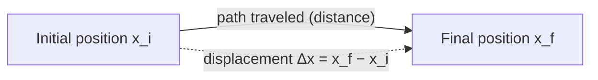
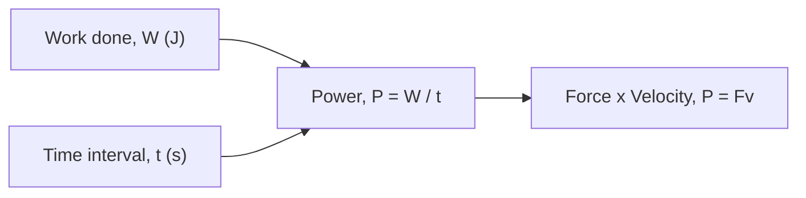

# SPL Run: build_concept_book

- **Adapter:** claude_cli
- **Model:** claude-sonnet-5
- **Tokens:** 1659 in / 1095 out
- **Latency:** 32061ms
- **Timestamp:** 2026-09-27 10:16:58

## Output

```output


---

## Displacement

Displacement measures how far an object's position has changed, and in which direction — it is not the same as distance traveled. If a runner completes one full lap of a 400-meter track, the distance traveled is 400 m, but the displacement is zero, because the runner ends up back where she started. Formally, displacement is defined as

$$\Delta x = x_f - x_i$$

where $x_i$ is the initial position and $x_f$ is the final position, both measured along a coordinate axis with a defined positive direction. Because $\Delta x$ carries a sign, it is a vector quantity, while distance — the total length of the path — is a scalar.

**Worked example.** A cyclist starts at position $x_i = 2\text{ m}$ on a straight bike path, rides forward to $x = 15\text{ m}$, then backtracks to $x_f = 9\text{ m}$. The total distance traveled is $13\text{ m} + 6\text{ m} = 19\text{ m}$. The displacement, however, depends only on start and end points:

$$\Delta x = x_f - x_i = 9\text{ m} - 2\text{ m} = 7\text{ m}$$

The positive sign indicates the net motion is in the positive direction, even though the cyclist reversed course partway through.

**Problem-solving application.** The same formula applies no matter how many segments a trip is broken into, because $\Delta x$ depends only on endpoints. Suppose a delivery drone starts at $x_i = 0\text{ m}$, flies to $x = 40\text{ m}$, returns to $x = 10\text{ m}$, then advances to $x_f = 25\text{ m}$. The distance traveled sums every leg: $40 + 30 + 15 = 85\text{ m}$. The displacement ignores the back-and-forth entirely:

$$\Delta x = x_f - x_i = 25\text{ m} - 0\text{ m} = 25\text{ m}$$

This property — that displacement collapses any number of intermediate moves into a single start-to-end difference — is what makes it useful for tracking net motion. A common error is to add up signed segment lengths as if computing distance; the correct method is always to subtract the final position from the initial one directly, regardless of the path's twists and turns.


*The dashed arrow shows displacement as the direct, straight-line change between start and end positions, independent of the actual path (solid arrow) taken.*

---

## Force

A force is any push or pull exerted on an object as a result of its interaction with another object. Because a force has both a size and a direction, it is a **vector quantity**: pushing a box with $10\text{ N}$ to the right produces a completely different outcome than pushing it with $10\text{ N}$ downward, even though the magnitude is identical. Forces are measured in newtons ($1\text{ N} = 1\text{ kg·m/s}^2$), and their effect on motion is governed by Newton's second law, $\vec{F}_{net} = m\vec{a}$, where $\vec{F}_{net}$ is the vector sum of every force acting on the object.

Because forces add like vectors, not like plain numbers, two forces acting on the same object combine by components. Suppose a $50\text{ N}$ force pulls east and a $30\text{ N}$ force pulls north on the same crate. The net force is not $80\text{ N}$; it is the vector sum:
$$
\vec{F}_{net} = (50\,\hat{x} + 30\,\hat{y})\ \text{N}, \qquad |\vec{F}_{net}| = \sqrt{50^2 + 30^2} \approx 58.3\ \text{N}
$$
directed at $\arctan(30/50) \approx 31^\circ$ north of east. This is why resolving forces into perpendicular ($x$- and $y$-) components before adding them is the standard first move in any force problem — it converts a geometric vector-addition problem into simple arithmetic on each axis.

**Problem-solving application:** A $2\text{ kg}$ block sits on a frictionless table. A rope pulls it with $12\text{ N}$ at $30^\circ$ above the horizontal, while a second rope pulls it with $8\text{ N}$ purely horizontally in the opposite direction. Find the block's acceleration.

Step 1 — resolve into components: rope 1 gives $F_{1x} = 12\cos30^\circ \approx 10.39\text{ N}$, $F_{1y} = 12\sin30^\circ = 6\text{ N}$; rope 2 gives $F_{2x} = -8\text{ N}$.
Step 2 — sum by axis: $F_{net,x} \approx 2.39\text{ N}$, $F_{net,y} = 6\text{ N}$ (a normal force and gravity cancel vertically only if the block stays on the table — here the vertical pull would need to be checked against the normal force, but treating this as a pure horizontal-plane problem gives $a_x = F_{net,x}/m \approx 1.2\text{ m/s}^2$).
Step 3 — interpret: the block accelerates predominantly in the direction of the stronger, more aligned force — illustrating that "adding forces" always means adding components, never magnitudes directly.

---

## Work

Work is the transfer of energy to or from an object via a force acting through a displacement. Unlike everyday usage, "work" in physics requires actual motion in the direction of the force — pushing against a wall until you're exhausted does zero work if the wall doesn't move. Quantitatively,

$$
W = Fd\cos\theta
$$

where $F$ is the magnitude of the applied force, $d$ is the magnitude of the displacement, and $\theta$ is the angle between the force vector and the displacement vector. Work is a scalar (measured in joules, $1\ \text{J} = 1\ \text{N}\cdot\text{m}$), even though force and displacement are vectors — this is because $W$ is really the dot product $\vec{F}\cdot\vec{d}$, and the cosine term extracts only the component of force aligned with the motion. When $\theta = 0°$, work is maximal and positive; when $\theta = 90°$, the force is perpendicular to the motion and does no work at all (e.g., gravity on a satellite in circular orbit); when $\theta = 180°$, the force opposes the motion and work is negative (e.g., friction removing kinetic energy).

**Worked example.** A worker pulls a 20 kg crate across a warehouse floor using a rope held at $30°$ above horizontal, applying a tension of $150\ \text{N}$, over a distance of $8\ \text{m}$. The work done by the tension is:

$$
W = (150\ \text{N})(8\ \text{m})\cos(30°) = 1200 \times 0.866 \approx 1039\ \text{J}
$$

Note that only the horizontal component of the tension ($150\cos 30°\approx 130\ \text{N}$) actually contributes to moving the crate forward; the vertical component partially lifts the crate but does not add to *this* displacement's work.

**Problem-solving application.** Work becomes a powerful shortcut when a problem asks about speed or energy change rather than time — invoking the work-energy theorem, $W_{\text{net}} = \Delta KE$, avoids solving Newton's second law and kinematics equations separately. For instance, if you know the net work done on a car as it decelerates, you can directly solve for its final speed without ever computing acceleration or time elapsed. When multiple forces act (applied force, friction, gravity, normal force), compute each force's work independently using its own angle $\theta$ relative to displacement, then sum them algebraically — forces perpendicular to motion (like normal force) always contribute zero and can be eliminated immediately, simplifying the calculation.

---

## Power

Power measures how quickly energy is transferred or work is performed. Two systems can accomplish the identical task — lifting the same crate to the same shelf — yet differ enormously in how fast they do it, and that speed is what power quantifies. Formally,

$$P = \frac{W}{t}$$

where $W$ is work in joules and $t$ is the time interval in seconds. The SI unit of power is the watt (W), with $1\text{ W} = 1\text{ J/s}$. Since work equals force times displacement along the direction of motion ($W = Fd$), power can also be written for constant force and velocity as

$$P = \frac{Fd}{t} = Fv$$

which is often the more practical form, since velocity is frequently known directly.

**Worked example.** A motor lifts a 50 kg load a vertical height of 6 m in 4 s at constant velocity. The work done against gravity is $W = mgh = (50)(9.8)(6) = 2940\text{ J}$. Dividing by time, $P = 2940/4 = 735\text{ W}$. If instead the same motor lifted the load in only 2 s, the work would be unchanged, but power would double to 1470 W — power depends on *rate*, not just total energy transferred.

**Problem-solving application.** Power calculations become essential when comparing how much force a machine can sustain at a given speed. Suppose an engine rated at 2000 W drives a cart at a cruising speed of 8 m/s. Using $P = Fv$, the maximum force the engine can sustain at that speed is $F = P/v = 2000/8 = 250\text{ N}$. Now suppose the cart speeds up to 10 m/s while the engine still delivers 2000 W: the sustainable force drops to $F = 2000/10 = 200\text{ N}$. This inverse relationship — more speed means less available force at fixed power — is a direct consequence of $P = Fv$ and is worth checking numerically whenever a problem gives power and asks for force, or vice versa: hold $P$ fixed, and $F$ and $v$ must trade off accordingly.


*Two equivalent routes to power: from total work over time, or from force and velocity for constant-force motion.*

---

## Energy Cost Calculation

Electricity bills are not based on power alone but on **energy** — power sustained over time. A device's energy consumption is measured in kilowatt-hours (kWh), and the cost of running it is found by multiplying that energy by the utility's price per kWh:

$$
E \text{ (kWh)} = P \text{ (kW)} \times t \text{ (h)}
$$

$$
\text{Cost} = E \times r
$$

where $P$ is power in kilowatts, $t$ is time in hours, and $r$ is the utility rate in dollars per kWh. Note that 1 kWh is *not* a unit of power — it is a unit of energy, equivalent to running a 1000-watt device for one hour ($1 \text{ kWh} = 3.6 \times 10^6 \text{ J}$).

**Worked example.** Suppose a window air conditioner rated at 1200 W runs for 8 hours a day, and the utility charges \$0.15 per kWh. First convert power to kilowatts: $P = 1.2$ kW. Daily energy use is

$$
E = 1.2 \text{ kW} \times 8 \text{ h} = 9.6 \text{ kWh}
$$

Daily cost is then $9.6 \times 0.15 = \$1.44$. Over a 30-day month, total cost is $1.44 \times 30 = \$43.20$.

**Problem-solving application.** These calculations become powerful when comparing devices or diagnosing a high bill. Suppose a household wants to know whether replacing an old refrigerator (150 W, running continuously) with an energy-efficient model (80 W) is worthwhile, given $r = \$0.13/\text{kWh}$. The old unit costs $0.150 \times 24 \times 0.13 = \$0.468/\text{day}$, or about \$14.04/month. The new unit costs $0.080 \times 24 \times 0.13 = \$0.2496/\text{day}$, or about \$7.49/month — a savings of roughly \$6.55/month. If the new refrigerator costs \$400 more, dividing cost by monthly savings gives a payback period of about 61 months (≈5 years), letting the student weigh upfront cost against long-term savings.

This same method generalizes to multi-device households: total energy cost is the sum of each appliance's $P \times t \times r$, which is why energy audits list wattage and daily usage hours for every device — it converts an abstract bill into an itemized, actionable breakdown.

---

## Payoff

Every concept in this book has been building toward a single question: what does a computation actually cost, and how do we predict that cost before we pay it? Energy cost calculation is the answer. It takes the abstractions developed earlier — units and dimensional analysis, rates and accumulation, and the physical relationship between power and time — and fuses them into a working model: $E = P \times t$, refined further when power itself varies, so that $E = \int_{t_0}^{t_1} P(t)\, dt$. This is the natural endpoint of the book because it is where measurement becomes decision-making. Once you can calculate energy cost reliably, you can compare alternatives, catch inefficiencies, and justify design choices with numbers instead of intuition.

Consider a data center evaluating two cooling strategies. Strategy A draws a constant 50 kW for 10 hours; strategy B draws a variable load, peaking at 70 kW during the day and dropping to 20 kW overnight, following $P(t) = 45 + 25\cos\left(\frac{\pi t}{12}\right)$ kW over a 24-hour cycle. Strategy A's cost is trivial: $E = 50 \times 10 = 500$ kWh. Strategy B requires integration: $E = \int_0^{24} \left(45 + 25\cos\left(\frac{\pi t}{12}\right)\right) dt = 45(24) + 25 \cdot \frac{12}{\pi}\sin\left(\frac{\pi t}{12}\right)\Big|_0^{24} = 1080$ kWh. The sinusoidal term integrates to zero over a full period — a result worth noticing, because it tells you the average power alone determines total energy when the variation is symmetric.

This is precisely why energy cost calculation unlocks so much downstream work. In electrical engineering, it drives circuit design and battery sizing, where load profiles like $P(t)$ above determine whether a battery lasts a shift or a week. In environmental science, the same integral converts a facility's operating schedule into a carbon footprint once you multiply by an emissions factor. In economics and public policy, it becomes the basis of tiered electricity pricing and infrastructure investment decisions, where $E$ translates directly into dollars and into arguments for or against a new power plant.

From here, the most rewarding next step is to pick one domain — energy economics is a strong choice — and trace how $E$ computed here becomes an input to a pricing or policy model, where technical calculation meets real-world tradeoffs.
```
