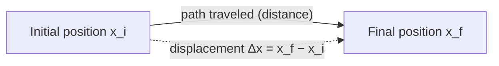
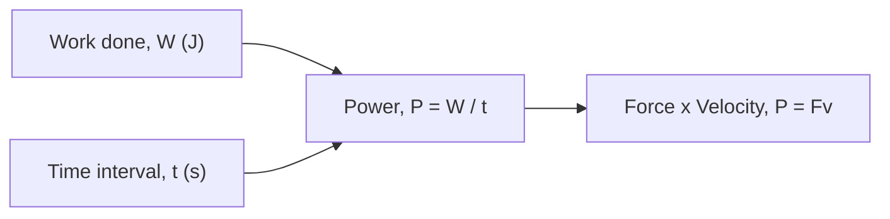

# SPL Run: build_concept_book

- **Adapter:** claude_cli
- **Model:** claude-sonnet-5
- **Tokens:** 1653 in / 1076 out
- **Latency:** 41840ms
- **Timestamp:** 2026-09-27 10:17:31

## Output

```output


---

## Displacement

Displacement measures how far an object's position has changed, and in which direction — it is not the same as distance traveled. If a runner completes one full lap of a 400-meter track, the distance traveled is 400 m, but the displacement is zero, because the runner ends up back where she started. Formally, displacement is defined as

$$\Delta x = x_f - x_i$$

where $x_i$ is the initial position and $x_f$ is the final position, both measured along a coordinate axis with a defined positive direction. Because $\Delta x$ carries a sign, it is a vector quantity, while distance — the total length of the path — is a scalar.

**Worked example.** A cyclist starts at position $x_i = 2\text{ m}$ on a straight bike path, rides forward to $x = 15\text{ m}$, then backtracks to $x_f = 9\text{ m}$. The total distance traveled is $13\text{ m} + 6\text{ m} = 19\text{ m}$. The displacement, however, depends only on start and end points:

$$\Delta x = x_f - x_i = 9\text{ m} - 2\text{ m} = 7\text{ m}$$

The positive sign indicates the net motion is in the positive direction, even though the cyclist reversed course partway through.

**Problem-solving application.** The same formula applies no matter how many segments a trip is broken into, because $\Delta x$ depends only on endpoints. Suppose a delivery drone starts at $x_i = 0\text{ m}$, flies to $x = 40\text{ m}$, returns to $x = 10\text{ m}$, then advances to $x_f = 25\text{ m}$. The distance traveled sums every leg: $40 + 30 + 15 = 85\text{ m}$. The displacement ignores the back-and-forth entirely:

$$\Delta x = x_f - x_i = 25\text{ m} - 0\text{ m} = 25\text{ m}$$

This property — that displacement collapses any number of intermediate moves into a single start-to-end difference — is what makes it useful for tracking net motion. A common error is to add up signed segment lengths as if computing distance; the correct method is always to subtract the final position from the initial one directly, regardless of the path's twists and turns.


*The dashed arrow shows displacement as the direct, straight-line change between start and end positions, independent of the actual path (solid arrow) taken.*

---

## Force

A force is any push or pull exerted on an object as a result of its interaction with another object. Because a force has both a size and a direction, it is a **vector quantity**: pushing a box with $10\text{ N}$ to the right produces a completely different outcome than pushing it with $10\text{ N}$ downward, even though the magnitude is identical. Forces are measured in newtons ($1\text{ N} = 1\text{ kg·m/s}^2$), and their effect on motion is governed by Newton's second law, $\vec{F}_{net} = m\vec{a}$, where $\vec{F}_{net}$ is the vector sum of every force acting on the object.

Because forces add like vectors, not like plain numbers, two forces acting on the same object combine by components. Suppose a $50\text{ N}$ force pulls east and a $30\text{ N}$ force pulls north on the same crate. The net force is not $80\text{ N}$; it is the vector sum:
$$
\vec{F}_{net} = (50\,\hat{x} + 30\,\hat{y})\ \text{N}, \qquad |\vec{F}_{net}| = \sqrt{50^2 + 30^2} \approx 58.3\ \text{N}
$$
directed at $\arctan(30/50) \approx 31^\circ$ north of east. This is why resolving forces into perpendicular ($x$- and $y$-) components before adding them is the standard first move in any force problem — it converts a geometric vector-addition problem into simple arithmetic on each axis.

**Problem-solving application:** A $2\text{ kg}$ block sits on a frictionless table. A rope pulls it with $12\text{ N}$ at $30^\circ$ above the horizontal, while a second rope pulls it with $8\text{ N}$ purely horizontally in the opposite direction. Find the block's acceleration.

Step 1 — resolve into components: rope 1 gives $F_{1x} = 12\cos30^\circ \approx 10.39\text{ N}$, $F_{1y} = 12\sin30^\circ = 6\text{ N}$; rope 2 gives $F_{2x} = -8\text{ N}$.
Step 2 — sum by axis: $F_{net,x} \approx 2.39\text{ N}$, $F_{net,y} = 6\text{ N}$ (a normal force and gravity cancel vertically only if the block stays on the table — here the vertical pull would need to be checked against the normal force, but treating this as a pure horizontal-plane problem gives $a_x = F_{net,x}/m \approx 1.2\text{ m/s}^2$).
Step 3 — interpret: the block accelerates predominantly in the direction of the stronger, more aligned force — illustrating that "adding forces" always means adding components, never magnitudes directly.

---

## Work

Work is the transfer of energy to or from an object via a force acting through a displacement. Unlike everyday usage, "work" in physics requires actual motion in the direction of the force — pushing against a wall until you're exhausted does zero work if the wall doesn't move. Quantitatively,

$$
W = Fd\cos\theta
$$

where $F$ is the magnitude of the applied force, $d$ is the magnitude of the displacement, and $\theta$ is the angle between the force vector and the displacement vector. Work is a scalar (measured in joules, $1\ \text{J} = 1\ \text{N}\cdot\text{m}$), even though force and displacement are vectors — this is because $W$ is really the dot product $\vec{F}\cdot\vec{d}$, and the cosine term extracts only the component of force aligned with the motion. When $\theta = 0°$, work is maximal and positive; when $\theta = 90°$, the force is perpendicular to the motion and does no work at all (e.g., gravity on a satellite in circular orbit); when $\theta = 180°$, the force opposes the motion and work is negative (e.g., friction removing kinetic energy).

**Worked example.** A worker pulls a 20 kg crate across a warehouse floor using a rope held at $30°$ above horizontal, applying a tension of $150\ \text{N}$, over a distance of $8\ \text{m}$. The work done by the tension is:

$$
W = (150\ \text{N})(8\ \text{m})\cos(30°) = 1200 \times 0.866 \approx 1039\ \text{J}
$$

Note that only the horizontal component of the tension ($150\cos 30°\approx 130\ \text{N}$) actually contributes to moving the crate forward; the vertical component partially lifts the crate but does not add to *this* displacement's work.

**Problem-solving application.** Work becomes a powerful shortcut when a problem asks about speed or energy change rather than time — invoking the work-energy theorem, $W_{\text{net}} = \Delta KE$, avoids solving Newton's second law and kinematics equations separately. For instance, if you know the net work done on a car as it decelerates, you can directly solve for its final speed without ever computing acceleration or time elapsed. When multiple forces act (applied force, friction, gravity, normal force), compute each force's work independently using its own angle $\theta$ relative to displacement, then sum them algebraically — forces perpendicular to motion (like normal force) always contribute zero and can be eliminated immediately, simplifying the calculation.

---

## Power

Power measures how quickly energy is transferred or work is performed. Two systems can accomplish the identical task — lifting the same crate to the same shelf — yet differ enormously in how fast they do it, and that speed is what power quantifies. Formally,

$$P = \frac{W}{t}$$

where $W$ is work in joules and $t$ is the time interval in seconds. The SI unit of power is the watt (W), with $1\text{ W} = 1\text{ J/s}$. Since work equals force times displacement along the direction of motion ($W = Fd$), power can also be written for constant force and velocity as

$$P = \frac{Fd}{t} = Fv$$

which is often the more practical form, since velocity is frequently known directly.

**Worked example.** A motor lifts a 50 kg load a vertical height of 6 m in 4 s at constant velocity. The work done against gravity is $W = mgh = (50)(9.8)(6) = 2940\text{ J}$. Dividing by time, $P = 2940/4 = 735\text{ W}$. If instead the same motor lifted the load in only 2 s, the work would be unchanged, but power would double to 1470 W — power depends on *rate*, not just total energy transferred.

**Problem-solving application.** Power calculations become essential when comparing how much force a machine can sustain at a given speed. Suppose an engine rated at 2000 W drives a cart at a cruising speed of 8 m/s. Using $P = Fv$, the maximum force the engine can sustain at that speed is $F = P/v = 2000/8 = 250\text{ N}$. Now suppose the cart speeds up to 10 m/s while the engine still delivers 2000 W: the sustainable force drops to $F = 2000/10 = 200\text{ N}$. This inverse relationship — more speed means less available force at fixed power — is a direct consequence of $P = Fv$ and is worth checking numerically whenever a problem gives power and asks for force, or vice versa: hold $P$ fixed, and $F$ and $v$ must trade off accordingly.


*Two equivalent routes to power: from total work over time, or from force and velocity for constant-force motion.*

---

## Metabolic Rate

Metabolic rate is the speed at which the body converts chemical energy from food into usable work, heat, and biosynthesis to keep cells alive and support activity. Because nearly all of this energy release depends on aerobic respiration, metabolic rate can be measured indirectly by tracking oxygen consumption: the body burns roughly 20.1 kJ (about 4.8 kcal) of energy for every liter of $O_2$ consumed, a conversion factor derived from the average energy yield of oxidizing carbohydrates, fats, and proteins. This technique, indirect calorimetry, lets physiologists estimate energy expenditure without measuring heat directly, which is difficult in a moving, insulated body.

**Worked example.** Suppose a person at rest consumes oxygen at a rate of 0.25 L/min. Their metabolic rate is:

$$
\text{Metabolic rate} = 0.25\ \frac{\text{L } O_2}{\text{min}} \times 20.1\ \frac{\text{kJ}}{\text{L } O_2} \approx 5.0\ \text{kJ/min}
$$

Scaling to a day: $5.0 \times 60 \times 24 \approx 7{,}250$ kJ/day, or about 1,730 kcal/day — a realistic resting metabolic rate (RMR) for an average adult.

**Problem-solving application.** A useful predictive relationship is Kleiber's law, an empirical scaling law describing how basal metabolic rate (BMR) relates to body mass $M$ across animals:

$$
\text{BMR} \propto M^{3/4}
$$

This $\tfrac{3}{4}$-power scaling (rather than a naive $M^1$, which would assume metabolism scales linearly with mass) reflects constraints from nutrient-transport networks — larger animals are more energy-efficient per unit mass because surface-area-to-volume ratios and vascular branching limit how fast energy can be delivered to tissue. For example, doubling an animal's mass increases BMR by a factor of $2^{0.75} \approx 1.68$, not 2. This lets physiologists estimate the caloric needs of a 70 kg human from data on a 10 kg dog: if the dog's BMR is 500 kJ/day, the human's predicted BMR is $500 \times (70/10)^{0.75} \approx 2{,}640$ kJ/day — remarkably close to measured values. Understanding this scaling helps clinicians set calorie targets, athletes calibrate training loads, and researchers compare energy efficiency across species using a single mathematical framework.

---

## Basal Metabolic Rate

Basal metabolic rate (BMR) is the rate at which the body converts chemical energy into heat and work while at complete physical and mental rest — no digestion, no exercise, no temperature stress. Because energy conversion per unit time is, by definition, power, BMR is properly expressed in watts, though clinical and nutrition contexts often report it in kilocalories per day. Roughly 75% of the calories a typical adult burns daily go toward BMR: keeping the heart beating, the brain signaling, cells repairing membranes, and organs maintaining ion gradients. The remaining ~25% covers digestion (thermic effect of food) and physical activity.

**Worked example.** A common clinical estimate is the Mifflin-St Jeor equation, which predicts BMR in kcal/day from mass $m$ (kg), height $h$ (cm), and age $a$ (years):

$$\text{BMR}_{\text{male}} = 10m + 6.25h - 5a + 5$$

For a 70 kg, 175 cm, 30-year-old man:

$$\text{BMR} = 10(70) + 6.25(175) - 5(30) + 5 = 700 + 1093.75 - 150 + 5 = 1648.75 \text{ kcal/day}$$

Converting to power (1 kcal = 4184 J, divided by 86,400 s/day):

$$P = \frac{1648.75 \times 4184 \text{ J}}{86{,}400 \text{ s}} \approx 79.8 \text{ W}$$

This is close to the power draw of an incandescent light bulb — a useful sanity check: the body is, quite literally, running at "80-watt bulb" output even doing nothing.

**Problem-solving application.** BMR calculations are the foundation of caloric-need estimation used in nutrition planning and metabolic-disorder screening. To find total daily energy expenditure (TDEE), BMR is multiplied by an activity factor $k$ (1.2 for sedentary, up to 1.9 for very active):

$$\text{TDEE} = \text{BMR} \times k$$

Clinicians use deviations from predicted BMR to flag conditions like hyperthyroidism (elevated BMR) or hypothyroidism (depressed BMR). For weight-management problems, a target caloric deficit or surplus is calculated relative to TDEE, not BMR alone — a frequent student error is to diet based on BMR and inadvertently starve the body of energy needed for activity and digestion, which can itself suppress BMR through adaptive thermogenesis.

---

## Payoff

Basal metabolic rate (BMR) is the energy a body spends at complete rest just to keep its cells alive — pumping blood, maintaining body temperature, running the nervous system, synthesizing proteins. It is the natural endpoint of this book because every other concept about energy balance, nutrition, and metabolism ultimately reduces to a comparison against this baseline number. You cannot reason about weight gain, weight loss, athletic fueling, or clinical metabolic disorders without first anchoring to how much energy the body burns doing nothing at all.

A worked example makes this concrete. Using the Mifflin-St Jeor equation, a widely validated regression formula, a 30-year-old man weighing 80 kg and standing 180 cm tall has a BMR of

$$
\text{BMR} = 10(80) + 6.25(180) - 5(30) + 5 = 1780 \text{ kcal/day}.
$$

That single number, 1780 kcal/day, is not a theoretical curiosity — it is the floor beneath every calorie-related decision this person or their physician will make. Multiply it by an activity factor (say 1.55 for moderate exercise) and you get total daily energy expenditure, the number a nutritionist uses to build a meal plan. Compare it to actual intake and you can predict weight trajectory. Track it over time and a sudden drop can signal thyroid dysfunction or the metabolic slowdown of caloric restriction.

This is why BMR functions as a hub concept rather than a leaf: dietitians use it to prescribe caloric targets, endocrinologists use it to flag metabolic disease, sports scientists use it to periodize training loads, and pharmacologists use it to scale drug dosing to body energy turnover. Each of these fields borrows the same equation and the same physiological logic, adapting only the correction factors for their population.

The formula above is simple enough to compute by hand, but its real power emerges when it becomes the input to a larger decision system — a diet plan, a training program, a clinical diagnosis. From here, the natural next step is to pick one of those downstream applications and trace exactly how BMR is adjusted, weighted, and interpreted inside it. Which one would you like to explore first?
```
