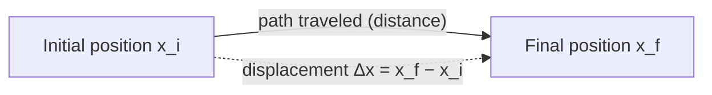
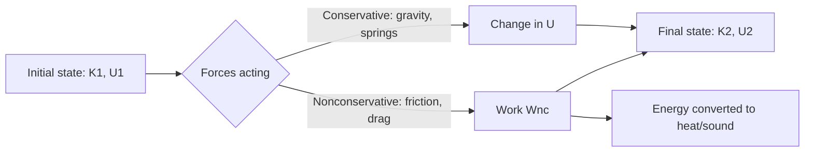
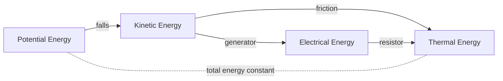

# SPL Run: build_concept_book

- **Adapter:** claude_cli
- **Model:** claude-sonnet-5
- **Tokens:** 2712 in / 1838 out
- **Latency:** 60761ms
- **Timestamp:** 2026-09-27 10:18:14

## Output

```output


---

## Displacement

Displacement measures how far an object's position has changed, and in which direction — it is not the same as distance traveled. If a runner completes one full lap of a 400-meter track, the distance traveled is 400 m, but the displacement is zero, because the runner ends up back where she started. Formally, displacement is defined as

$$\Delta x = x_f - x_i$$

where $x_i$ is the initial position and $x_f$ is the final position, both measured along a coordinate axis with a defined positive direction. Because $\Delta x$ carries a sign, it is a vector quantity, while distance — the total length of the path — is a scalar.

**Worked example.** A cyclist starts at position $x_i = 2\text{ m}$ on a straight bike path, rides forward to $x = 15\text{ m}$, then backtracks to $x_f = 9\text{ m}$. The total distance traveled is $13\text{ m} + 6\text{ m} = 19\text{ m}$. The displacement, however, depends only on start and end points:

$$\Delta x = x_f - x_i = 9\text{ m} - 2\text{ m} = 7\text{ m}$$

The positive sign indicates the net motion is in the positive direction, even though the cyclist reversed course partway through.

**Problem-solving application.** The same formula applies no matter how many segments a trip is broken into, because $\Delta x$ depends only on endpoints. Suppose a delivery drone starts at $x_i = 0\text{ m}$, flies to $x = 40\text{ m}$, returns to $x = 10\text{ m}$, then advances to $x_f = 25\text{ m}$. The distance traveled sums every leg: $40 + 30 + 15 = 85\text{ m}$. The displacement ignores the back-and-forth entirely:

$$\Delta x = x_f - x_i = 25\text{ m} - 0\text{ m} = 25\text{ m}$$

This property — that displacement collapses any number of intermediate moves into a single start-to-end difference — is what makes it useful for tracking net motion. A common error is to add up signed segment lengths as if computing distance; the correct method is always to subtract the final position from the initial one directly, regardless of the path's twists and turns.


*The dashed arrow shows displacement as the direct, straight-line change between start and end positions, independent of the actual path (solid arrow) taken.*

---

## Force

A force is any push or pull exerted on an object as a result of its interaction with another object. Because a force has both a size and a direction, it is a **vector quantity**: pushing a box with $10\text{ N}$ to the right produces a completely different outcome than pushing it with $10\text{ N}$ downward, even though the magnitude is identical. Forces are measured in newtons ($1\text{ N} = 1\text{ kg·m/s}^2$), and their effect on motion is governed by Newton's second law, $\vec{F}_{net} = m\vec{a}$, where $\vec{F}_{net}$ is the vector sum of every force acting on the object.

Because forces add like vectors, not like plain numbers, two forces acting on the same object combine by components. Suppose a $50\text{ N}$ force pulls east and a $30\text{ N}$ force pulls north on the same crate. The net force is not $80\text{ N}$; it is the vector sum:
$$
\vec{F}_{net} = (50\,\hat{x} + 30\,\hat{y})\ \text{N}, \qquad |\vec{F}_{net}| = \sqrt{50^2 + 30^2} \approx 58.3\ \text{N}
$$
directed at $\arctan(30/50) \approx 31^\circ$ north of east. This is why resolving forces into perpendicular ($x$- and $y$-) components before adding them is the standard first move in any force problem — it converts a geometric vector-addition problem into simple arithmetic on each axis.

**Problem-solving application:** A $2\text{ kg}$ block sits on a frictionless table. A rope pulls it with $12\text{ N}$ at $30^\circ$ above the horizontal, while a second rope pulls it with $8\text{ N}$ purely horizontally in the opposite direction. Find the block's acceleration.

Step 1 — resolve into components: rope 1 gives $F_{1x} = 12\cos30^\circ \approx 10.39\text{ N}$, $F_{1y} = 12\sin30^\circ = 6\text{ N}$; rope 2 gives $F_{2x} = -8\text{ N}$.
Step 2 — sum by axis: $F_{net,x} \approx 2.39\text{ N}$, $F_{net,y} = 6\text{ N}$ (a normal force and gravity cancel vertically only if the block stays on the table — here the vertical pull would need to be checked against the normal force, but treating this as a pure horizontal-plane problem gives $a_x = F_{net,x}/m \approx 1.2\text{ m/s}^2$).
Step 3 — interpret: the block accelerates predominantly in the direction of the stronger, more aligned force — illustrating that "adding forces" always means adding components, never magnitudes directly.

---

## Work

Work is the transfer of energy to or from an object via a force acting through a displacement. Unlike everyday usage, "work" in physics requires actual motion in the direction of the force — pushing against a wall until you're exhausted does zero work if the wall doesn't move. Quantitatively,

$$
W = Fd\cos\theta
$$

where $F$ is the magnitude of the applied force, $d$ is the magnitude of the displacement, and $\theta$ is the angle between the force vector and the displacement vector. Work is a scalar (measured in joules, $1\ \text{J} = 1\ \text{N}\cdot\text{m}$), even though force and displacement are vectors — this is because $W$ is really the dot product $\vec{F}\cdot\vec{d}$, and the cosine term extracts only the component of force aligned with the motion. When $\theta = 0°$, work is maximal and positive; when $\theta = 90°$, the force is perpendicular to the motion and does no work at all (e.g., gravity on a satellite in circular orbit); when $\theta = 180°$, the force opposes the motion and work is negative (e.g., friction removing kinetic energy).

**Worked example.** A worker pulls a 20 kg crate across a warehouse floor using a rope held at $30°$ above horizontal, applying a tension of $150\ \text{N}$, over a distance of $8\ \text{m}$. The work done by the tension is:

$$
W = (150\ \text{N})(8\ \text{m})\cos(30°) = 1200 \times 0.866 \approx 1039\ \text{J}
$$

Note that only the horizontal component of the tension ($150\cos 30°\approx 130\ \text{N}$) actually contributes to moving the crate forward; the vertical component partially lifts the crate but does not add to *this* displacement's work.

**Problem-solving application.** Work becomes a powerful shortcut when a problem asks about speed or energy change rather than time — invoking the work-energy theorem, $W_{\text{net}} = \Delta KE$, avoids solving Newton's second law and kinematics equations separately. For instance, if you know the net work done on a car as it decelerates, you can directly solve for its final speed without ever computing acceleration or time elapsed. When multiple forces act (applied force, friction, gravity, normal force), compute each force's work independently using its own angle $\theta$ relative to displacement, then sum them algebraically — forces perpendicular to motion (like normal force) always contribute zero and can be eliminated immediately, simplifying the calculation.

---

## Conservative Force

A force is **conservative** if the work it does on an object moving between two points depends only on the object's initial and final positions — never on the specific path taken. Equivalently, the work done by a conservative force around any closed path (start = end) is exactly zero:

$$\oint \vec{F} \cdot d\vec{l} = 0$$

This path-independence is what allows us to define a **potential energy function** $U(\vec{r})$, since work done can be assigned uniquely to positions rather than trajectories. The force and potential energy are related by

$$\vec{F} = -\nabla U, \qquad W_{A \to B} = -\Delta U = U(A) - U(B)$$

Gravity, the spring force, and the electrostatic force are all conservative. Friction and air resistance are **not**: they dissipate mechanical energy as heat, and the work they do depends on the length of the path traveled, not just the endpoints.

**Worked example.** A 2 kg block slides down a frictionless curved ramp from height $h = 5\,\text{m}$ to the ground, then continues along a different curved path back up to height $h = 5\,\text{m}$ on the other side. Because gravity is conservative, the work done by gravity over this trip is zero — the block returns to its starting height with the same speed it started with, regardless of how winding either ramp was. Using $U = mgh$, the work done by gravity as the block descends is $W = -\Delta U = mgh - 0 = (2)(9.8)(5) = 98\,\text{J}$, matching the kinetic energy gained — independent of the ramp's shape.

**Problem-solving application.** The practical power of conservative forces is that they let you bypass path integrals entirely: instead of computing $\int \vec{F} \cdot d\vec{l}$ along a complicated trajectory, you only need the potential energy at the two endpoints. This is the foundation of the **work-energy theorem** combined with **conservation of mechanical energy**: $K_A + U_A = K_B + U_B$ whenever only conservative forces act. A quick test for conservativeness in a force field $\vec{F}(x,y) = (F_x, F_y)$ is the curl condition $\partial F_x/\partial y = \partial F_y/\partial x$; if it holds everywhere in a simply connected region, the force is conservative and a potential function exists. This test is routinely used in mechanics and electromagnetism to verify whether a proposed force field admits an energy-conservation shortcut before attempting any calculation.

---

## Mass

Mass is the quantity of matter contained in an object, measured in kilograms (kg) in the SI system. It is a scalar and an intrinsic, additive property: two 2 kg blocks combined have a mass of 4 kg regardless of location, whether on Earth, the Moon, or in deep space. Mass is measured operationally through Newton's second law,

$$
F = ma \quad \Longrightarrow \quad m = \frac{F}{a},
$$

which says that a fixed force produces less acceleration on a more massive object — mass quantifies an object's resistance to being accelerated.

This distinguishes mass from **weight**, the gravitational force on an object, $W = mg$, which does vary with location because the gravitational acceleration $g$ changes from place to place.

**Worked example.** A 10 kg block is pushed across a frictionless surface with a net force of 25 N. Its acceleration is

$$
a = \frac{F}{m} = \frac{25\ \text{N}}{10\ \text{kg}} = 2.5\ \text{m/s}^2.
$$

If the same block is transported to the Moon, where $g$ drops from $9.8\ \text{m/s}^2$ to $1.6\ \text{m/s}^2$, its weight changes from 98 N to 16 N — but its mass remains 10 kg, and pushing it with 25 N still produces the same $2.5\ \text{m/s}^2$ acceleration, since mass is unaffected by gravity.

**Problem-solving application.** Because mass is additive and location-independent, it can be tracked as a conserved quantity through a physical process even when the object's shape, state, or location changes. Suppose 2 kg of ice at 0°C melts completely into water. No matter is created or destroyed, so the resulting water has a mass of exactly 2 kg — even though its volume shrinks by about 9%. The same reasoning applies to any mixing, phase change, or combination of masses: the total mass equals the sum of the parts, $m_{\text{total}} = m_1 + m_2 + \dots$, unless matter is physically added or removed. Recognizing mass as the conserved, additive quantity — as opposed to volume, weight, or force, all of which can change under identical conditions — is often the deciding step in correctly setting up a physics or chemistry problem.

---

## Velocity

Velocity is a vector quantity describing both the rate of change of an object's position and the direction of that change. This distinguishes it from speed, which captures only magnitude. For motion along a straight line, average velocity over a time interval is defined as

$$\bar{v} = \frac{\Delta x}{\Delta t} = \frac{x_2 - x_1}{t_2 - t_1}$$

where $x_1$ and $x_2$ are positions at times $t_1$ and $t_2$. As $\Delta t$ shrinks toward zero, this ratio converges to the instantaneous velocity, defined as the time derivative of position:

$$v(t) = \frac{dx}{dt} = \lim_{\Delta t \to 0} \frac{x(t + \Delta t) - x(t)}{\Delta t}$$

This limit definition is essential — velocity is not merely "distance over time," but the *slope of the position-time curve at a single instant*, which is why calculus, not arithmetic, is the correct tool for describing motion that changes continuously.

**Worked example.** Suppose a particle's position is given by $x(t) = 3t^2 - 2t + 1$ meters, with $t$ in seconds. To find the velocity at $t = 4\text{ s}$, differentiate: $v(t) = \frac{dx}{dt} = 6t - 2$. At $t = 4$, $v(4) = 6(4) - 2 = 22\ \text{m/s}$. This is the instantaneous velocity — the reading a speedometer-with-direction would show at that exact moment, distinct from the average velocity over, say, the interval $[0, 4]$, which would be $\bar{v} = \frac{x(4)-x(0)}{4-0} = \frac{41 - 1}{4} = 10\ \text{m/s}$. The discrepancy between 22 and 10 m/s illustrates why instantaneous and average velocity must never be conflated when motion is non-uniform.

**Problem-solving application.** Velocity graphs let you extract or verify motion information geometrically: the slope of a position-time graph gives velocity, and the *area* under a velocity-time graph gives displacement, since $\Delta x = \int_{t_1}^{t_2} v(t)\,dt$. This inverse relationship — differentiation to go from position to velocity, integration to go back — is the core toolkit for solving kinematics problems where you're given one function (position, velocity, or acceleration) and asked to reconstruct another, such as finding total displacement from a velocity function that changes sign (indicating a reversal in direction).

---

## Kinetic Energy

Kinetic energy is the energy an object possesses because it is moving. For an object of mass $m$ translating at speed $v$ (with $v \ll c$, so relativistic effects are negligible), the kinetic energy is

$$KE = \frac{1}{2}mv^2$$

This expression follows directly from the work-energy theorem: the net work done on an object equals its change in kinetic energy, $W_{net} = \Delta KE$. Starting from Newton's second law, $F = ma$, and integrating force over displacement,

$$W = \int F\,dx = \int ma\,dx = \int m\frac{dv}{dt}\,dx = \int mv\,dv = \frac{1}{2}mv^2 - \frac{1}{2}mv_0^2$$

using the substitution $dx/dt = v$. This derivation shows that $KE = \frac{1}{2}mv^2$ is not an arbitrary definition — it is the quantity whose change exactly tracks the work done by a net force, which is why kinetic energy is so useful for solving motion problems without tracking time explicitly.

**Worked example.** A 1200 kg car accelerates from rest to 25 m/s. Its kinetic energy at that speed is

$$KE = \frac{1}{2}(1200\text{ kg})(25\text{ m/s})^2 = \frac{1}{2}(1200)(625) = 375{,}000\text{ J} = 375\text{ kJ}$$

By the work-energy theorem, this is exactly the net work the engine (net of friction and drag) must have delivered to reach that speed, regardless of how long the acceleration took or whether it was uniform.

**Problem-solving application.** Kinetic energy's real power is in problems where forces are known but time is not. Suppose the same 1200 kg car, moving at 25 m/s, brakes to a stop under a constant friction force of 6000 N. Rather than solving for acceleration and time separately, apply the work-energy theorem directly: the net work done by friction over stopping distance $d$ must equal the negative of the car's kinetic energy, $-Fd = 0 - KE_i$. Solving,

$$d = \frac{KE_i}{F} = \frac{375{,}000\text{ J}}{6000\text{ N}} = 62.5\text{ m}$$

This illustrates a key problem-solving strategy: whenever a force and a change in speed are known but the time of interaction is not, relate them through work and kinetic energy rather than through kinematics. Also note the quadratic dependence on $v$: doubling the initial speed would quadruple $KE_i$, and therefore quadruple the stopping distance for the same braking force — a fact central to vehicle safety engineering, since it explains why small increases in speed produce disproportionately larger stopping distances and collision severity.

---

## Potential Energy

Potential energy, $U$, is energy a system stores by virtue of the relative positions or configuration of its parts, released as work when that configuration is allowed to change. It is defined only for **conservative forces** — forces for which the work done moving between two points is independent of the path taken. For such a force $\vec{F}$, the potential energy change is defined as the negative of the work the force does:

$$\Delta U = -W_{\text{conservative}} = -\int_{\vec{r}_i}^{\vec{r}_f} \vec{F} \cdot d\vec{r}$$

Equivalently, the force is recovered from $U$ by $\vec{F} = -\nabla U$ (in one dimension, $F = -dU/dx$): the force always points toward decreasing potential energy. This is why potential energy is only well-defined for conservative forces — friction, for instance, dissipates energy as heat depending on path length, so no consistent $U(x)$ can be assigned to it.

**Worked example.** Near Earth's surface, gravity is (to excellent approximation) constant, $F = -mg$ acting downward. Choosing $U = 0$ at height $y = 0$:

$$U(y) = -\int_0^y (-mg)\,dy' = mgy$$

For a spring obeying Hooke's law, $F = -kx$, so

$$U(x) = -\int_0^x (-kx')\,dx' = \tfrac{1}{2}kx^2$$

Both results confirm the physical intuition: raising a mass or stretching a spring stores energy equal to the work done against the restoring force.

**Problem-solving application.** A 2 kg block slides from rest down a frictionless incline, dropping 1.5 m in height, then compresses a spring ($k = 800\ \text{N/m}$) at the bottom. Because gravity is conservative and the incline is frictionless, mechanical energy is conserved:

$$mgh = \tfrac{1}{2}kx^2 \implies x = \sqrt{\frac{2mgh}{k}} = \sqrt{\frac{2(2)(9.8)(1.5)}{800}} \approx 0.271\ \text{m}$$

This illustrates the core problem-solving strategy: potential energy converts a force/motion problem into an algebraic energy-balance equation, avoiding the need to solve the incline's equations of motion directly. The reference point ($U=0$) is arbitrary — only differences $\Delta U$ carry physical meaning — but once chosen, it must be held fixed throughout a single calculation.

---

## Mechanical Energy

Mechanical energy $ME$ is the total energy an object or system possesses due to its motion and its position within a force field:

$$ME = KE + PE$$

where $KE = \tfrac{1}{2}mv^2$ is kinetic energy and $PE$ includes all potential energy terms present — gravitational ($mgh$), elastic ($\tfrac{1}{2}kx^2$), or others. The Work-Energy Theorem shows that when only **conservative forces** (gravity, spring force) act on a system, mechanical energy is conserved: $ME_i = ME_f$. Non-conservative forces like friction or air resistance convert mechanical energy into heat and sound, so $ME$ decreases whenever they act.

**Worked example.** A 2 kg ball is dropped from rest at a height of 5 m. Find its speed just before impact, ignoring air resistance.

At the top: $KE_i = 0$, $PE_i = mgh = (2)(9.8)(5) = 98\ \text{J}$, so $ME_i = 98\ \text{J}$.

Since only gravity acts, $ME$ is conserved: $ME_f = 98\ \text{J}$. At the ground, $h = 0$, so $PE_f = 0$ and $KE_f = 98\ \text{J}$.

Solving $\tfrac{1}{2}mv^2 = 98$: $v^2 = \dfrac{2(98)}{2} = 98$, giving $v \approx 9.9\ \text{m/s}$.

Note this matches the kinematic result $v = \sqrt{2gh}$ — conservation of energy is often a faster route to speed than tracking acceleration and time directly.

**Problem-solving application.** Conservation of $ME$ is most powerful when forces or accelerations change during motion — situations where kinematics equations become cumbersome. Consider a roller coaster car on a track with varying curvature, or a pendulum swinging through an arc: rather than integrating a changing net force, set $ME_{\text{initial}} = ME_{\text{final}}$ at any two points and solve directly for the unknown speed or height. The general strategy: (1) identify whether non-conservative forces (friction, applied forces, drag) do work — if so, use $ME_f = ME_i + W_{nc}$ instead of strict conservation; (2) choose convenient reference points for $PE$; (3) solve for the unknown, bypassing the need to know the object's exact path. This technique underlies analysis of pendulums, roller coasters, orbital mechanics, and spring-mass oscillators.

---

## Nonconservative Force

A force is nonconservative if the work it does on an object moving between two points depends on the path taken, not just on the endpoints. Equivalently, the work done by such a force around any closed loop is nonzero:

$$
\oint \vec{F} \cdot d\vec{l} \neq 0
$$

Because the work is path-dependent, no potential energy function $U(\vec{r})$ can be defined for a nonconservative force — there is no single-valued "stored energy" that depends only on position. Friction, air resistance, and normal forces during sliding are the classic examples: kinetic friction always opposes motion, so it removes mechanical energy and converts it to heat, regardless of the route taken.

This forces a modification of the work-energy theorem. If both conservative forces (gravity, springs) and nonconservative forces act, total mechanical energy $E = K + U$ is no longer conserved:

$$
\Delta E = \Delta K + \Delta U = W_{nc}
$$

where $W_{nc}$ is the work done by nonconservative forces. When $W_{nc} < 0$ (as with friction), mechanical energy decreases; that "lost" energy appears as heat, sound, or deformation — it is not destroyed, only converted to non-mechanical forms.

**Worked example:** A 2 kg block slides down a rough incline of height 3 m, arriving at the bottom with speed 5 m/s. Gravity does conservative work $W_g = mgh = (2)(9.8)(3) = 58.8\text{ J}$. The kinetic energy gained is $\Delta K = \frac{1}{2}mv^2 = \frac{1}{2}(2)(25) = 25\text{ J}$. Applying $\Delta K = W_g + W_{nc}$:

$$
W_{nc} = \Delta K - W_g = 25 - 58.8 = -33.8\text{ J}
$$

Friction removed 33.8 J of mechanical energy as heat — a quantity impossible to recover by any potential-energy bookkeeping, precisely because friction has none.

**Problem-solving strategy:** When a problem involves surfaces with friction, air drag, or applied pushes/pulls that don't retrace their path, do not try to assign a potential energy to that force. Instead, isolate it on the right side of the energy equation: compute $\Delta K + \Delta U$ from the conservative forces and geometry, and let $W_{nc}$ absorb the discrepancy. This identifies the "energy leak" directly, and $W_{nc} = F_{nc} d \cos\theta$ (for constant friction) lets you solve for unknowns like stopping distance or the coefficient of kinetic friction.


*How conservative and nonconservative forces jointly determine the final mechanical energy, with nonconservative work diverting energy out of the mechanical system.*

---

## Thermal Energy

When a block slides across a rough table and comes to rest, its kinetic energy does not vanish—it converts into **thermal energy**, the internal energy associated with the random, microscopic motion and vibration of the atoms and molecules that make up an object. Unlike the ordered motion of a macroscopic object (all atoms moving together in one direction), thermal energy is disordered: individual particles jostle, vibrate, and collide in random directions. This distinction is the key difference between mechanical energy (organized, recoverable) and thermal energy (disorganized, generally not recoverable as useful work).

Thermal energy is produced whenever a nonconservative force—most commonly friction or air resistance—acts on a system. Nonconservative forces dissipate mechanical energy by converting it into this random molecular motion, which is why energy "lost" to friction is not destroyed but transformed, consistent with conservation of energy:

$$\Delta KE + \Delta PE + \Delta E_{th} = 0$$

or equivalently, the mechanical energy lost equals the thermal energy gained: $\Delta E_{th} = -(\Delta KE + \Delta PE) = W_{friction}$ (in magnitude).

**Worked example:** A 2.0 kg block slides 3.0 m across a horizontal floor with a coefficient of kinetic friction $\mu_k = 0.25$, starting at 4.0 m/s. Find the thermal energy generated.

The friction force is $f = \mu_k mg = 0.25(2.0)(9.8) = 4.9$ N. The work done by friction (which becomes thermal energy) is $E_{th} = f \cdot d = 4.9 \times 3.0 = 14.7$ J. Check via energy conservation: initial KE $= \frac{1}{2}(2.0)(4.0)^2 = 16.0$ J. If the block doesn't fully stop, the remaining KE plus 14.7 J of thermal energy must equal 16.0 J—here, final KE $= 1.3$ J, giving final speed $\approx 1.14$ m/s, consistent with kinematics ($v^2 = v_0^2 - 2\mu_k g d$).

**Problem-solving application:** Whenever a problem states "energy is lost to friction," "heat is generated," or gives a coefficient of friction alongside a distance, treat that scenario as a two-step energy-conservation problem: (1) compute the friction force and the mechanical energy at the start and end points, (2) set the mechanical energy deficit equal to $E_{th} = f \cdot d$. This technique bypasses needing Newton's second law directly and is especially efficient when the path is curved or the frictional force is not constant in direction, as long as you can still compute the work done against friction along the path.

---

## Law Of Conservation Of Energy

The law of conservation of energy states that the total energy of an isolated system remains constant over time. Energy is neither created nor destroyed; it only transforms between forms — kinetic, potential, thermal, chemical, electrical — or transfers between subsystems. Formally, for an isolated system:

$$E_{\text{total}} = K + U + E_{\text{internal}} + \cdots = \text{constant}$$

so that between any two instants, $\Delta E_{\text{total}} = 0$, or equivalently $\Delta K + \Delta U + \Delta E_{\text{other}} = 0$. This is a genuine physical law (a consequence of time-translation symmetry via Noether's theorem), so the equation itself — not just a verbal description — is the tool you use to solve problems.

**Worked example.** A 2 kg ball is dropped from rest at height $h = 10\,\text{m}$. Ignoring air resistance, find its speed just before hitting the ground. Taking the ball–Earth system as isolated (no external work, negligible friction), mechanical energy is conserved:

$$K_i + U_i = K_f + U_f$$

At the top, $K_i = 0$ and $U_i = mgh$. At the bottom, $U_f = 0$, so all potential energy converts to kinetic energy:

$$mgh = \tfrac{1}{2}mv^2 \implies v = \sqrt{2gh} = \sqrt{2(9.8)(10)} \approx 14\,\text{m/s}$$

Notice the mass cancels — a direct consequence of energy conservation combined with the equivalence of gravitational and inertial mass.

**Problem-solving application.** When friction or air resistance is present, the system is no longer purely mechanical, but total energy is still conserved if you include thermal energy generated: $\Delta K + \Delta U + \Delta E_{\text{thermal}} = 0$. This lets you solve problems like finding the speed of a block sliding down a rough incline by treating "lost" mechanical energy as heat rather than abandoning conservation. The general strategy for any conservation-of-energy problem is: (1) define the system boundary, (2) identify every energy form present initially and finally, (3) set the sum equal across the two states, and (4) solve for the unknown.


*Energy converts between forms, but the total across all forms remains constant.*

---

## Renewable Energy Sources

Renewable energy sources are energy flows that are continuously replenished by natural processes on a human timescale — sunlight, wind, flowing water, and biomass — as opposed to fossil fuels (coal, oil, natural gas), which formed over millions of years and are consumed far faster than geology can replace them. The distinguishing criterion is not the total energy available but the *rate of replenishment relative to the rate of extraction*: a resource is renewable if nature restores it at least as fast as humans draw it down.

Each source converts a natural flux into usable power through a distinct physical mechanism. Solar photovoltaic cells convert photons directly into electric current via the photovoltaic effect in semiconductors. Wind turbines extract kinetic energy from moving air, with power output scaling as $P = \tfrac{1}{2}\rho A v^3$, where $\rho$ is air density, $A$ is the swept rotor area, and $v$ is wind speed — the cubic dependence on velocity explains why turbine siting is so sensitive to local wind conditions. Hydroelectric dams convert gravitational potential energy of elevated water into electricity as it falls through turbines, with available power given by $P = \rho g Q h$, where $Q$ is flow rate and $h$ is the height the water falls. Biomass releases energy stored by photosynthesis, either through direct combustion or conversion to biofuels.

**Worked example:** A wind farm site has average wind speed 8 m/s and air density $1.2\ \text{kg/m}^3$. A turbine with rotor diameter 100 m has swept area $A = \pi (50)^2 \approx 7854\ \text{m}^2$. The theoretical power in the wind is
$$P = \tfrac{1}{2}(1.2)(7854)(8^3) \approx 2.41\ \text{MW}.$$
Real turbines capture only a fraction of this — the Betz limit caps extractable power at $16/27 \approx 59.3\%$ of the wind's kinetic energy, so realistic output is closer to 1.4 MW. This ceiling arises from the physical requirement that wind must retain some downstream velocity to keep flowing through the rotor.

**Problem-solving application:** Engineers use these formulas to size installations against demand. If a community needs 5 MW of reliable capacity and site wind speed drops to 6 m/s at certain hours, the cubic term shows output falls to $(6/8)^3 \approx 42\%$ of rated power — motivating hybrid systems (wind paired with solar or storage) to smooth intermittency, a core design challenge distinguishing renewables from steady fossil-fuel generation.

---

## Payoff

Every concept in this course — energy conservation, power and efficiency, circuits, thermodynamic cycles, materials and systems thinking — converges here. Renewable energy sources are not an isolated topic; they are the applied test of whether you can take physical laws and turn them into working, scalable, real-world systems. A solar panel is a demonstration of the photoelectric effect and semiconductor physics under load. A wind turbine is a rotational-mechanics and fluid-dynamics problem wearing an engineering hat. A battery storage system is electrochemistry and circuit analysis solving the problem of intermittency. This is why renewable energy sits at the end of the book: it asks you to synthesize, not just recall.

Consider a concrete case. A 5 kW residential solar array in a location averaging 4.5 peak sun-hours per day produces roughly:

$$E_{\text{daily}} = P_{\text{rated}} \times \text{PSH} \times \eta_{\text{system}} = 5\text{ kW} \times 4.5\text{ h} \times 0.80 \approx 18\text{ kWh/day}$$

where $\eta_{\text{system}} \approx 0.80$ accounts for inverter losses, wiring resistance, and panel degradation — the same efficiency reasoning you used earlier for heat engines and electrical circuits now governs whether a household can go off-grid.

This single calculation radiates outward into every domain the concept touches. In **electrical engineering**, it demands understanding of inverters, grid synchronization, and load balancing. In **environmental science**, it requires quantifying displaced carbon emissions and life-cycle material costs (mining lithium or silicon is not emissions-free). In **economics and policy**, it forces cost-benefit analysis: levelized cost of energy (LCOE), subsidy structures, and payback periods. In **computer science and data systems**, it drives the optimization problems behind smart grids — forecasting demand, dispatching storage, and scheduling variable supply against variable load. In **materials science**, it motivates the search for higher-efficiency photovoltaics and higher-density batteries. No other concept in the book asks you to move fluently across this many disciplines at once.

That is the payoff: renewable energy is where physics stops being an exercise and becomes an engineering and policy constraint that the next generation must solve. Pick one thread — the grid-optimization problem, the materials-efficiency frontier, or the economics of decarbonization — and follow it to where the real unsolved problems still live.
```
