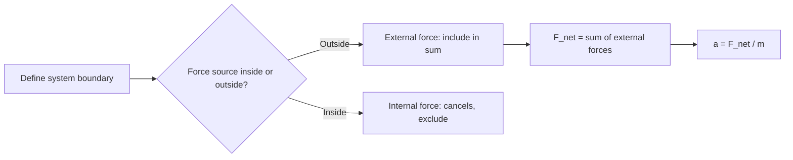
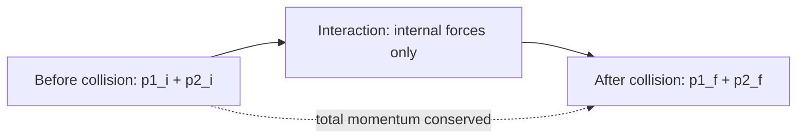
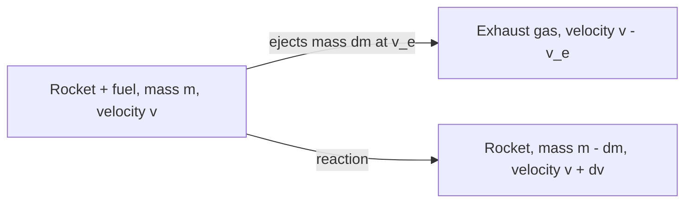
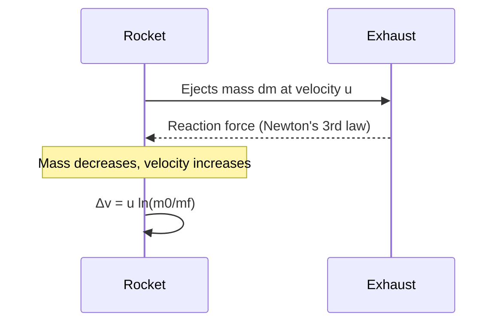

# SPL Run: build_concept_book

- **Adapter:** claude_cli
- **Model:** claude-sonnet-5
- **Tokens:** 7966 in / 4642 out
- **Latency:** 128583ms
- **Timestamp:** 2026-09-27 10:20:43

## Output

```output


---

## Mass

Mass is the quantity of matter contained in an object, measured in kilograms (kg) in the SI system. It is a scalar and an intrinsic, additive property: two 2 kg blocks combined have a mass of 4 kg regardless of location, whether on Earth, the Moon, or in deep space. Mass is measured operationally through Newton's second law,

$$
F = ma \quad \Longrightarrow \quad m = \frac{F}{a},
$$

which says that a fixed force produces less acceleration on a more massive object — mass quantifies an object's resistance to being accelerated.

This distinguishes mass from **weight**, the gravitational force on an object, $W = mg$, which does vary with location because the gravitational acceleration $g$ changes from place to place.

**Worked example.** A 10 kg block is pushed across a frictionless surface with a net force of 25 N. Its acceleration is

$$
a = \frac{F}{m} = \frac{25\ \text{N}}{10\ \text{kg}} = 2.5\ \text{m/s}^2.
$$

If the same block is transported to the Moon, where $g$ drops from $9.8\ \text{m/s}^2$ to $1.6\ \text{m/s}^2$, its weight changes from 98 N to 16 N — but its mass remains 10 kg, and pushing it with 25 N still produces the same $2.5\ \text{m/s}^2$ acceleration, since mass is unaffected by gravity.

**Problem-solving application.** Because mass is additive and location-independent, it can be tracked as a conserved quantity through a physical process even when the object's shape, state, or location changes. Suppose 2 kg of ice at 0°C melts completely into water. No matter is created or destroyed, so the resulting water has a mass of exactly 2 kg — even though its volume shrinks by about 9%. The same reasoning applies to any mixing, phase change, or combination of masses: the total mass equals the sum of the parts, $m_{\text{total}} = m_1 + m_2 + \dots$, unless matter is physically added or removed. Recognizing mass as the conserved, additive quantity — as opposed to volume, weight, or force, all of which can change under identical conditions — is often the deciding step in correctly setting up a physics or chemistry problem.

---

## Net External Force

The net external force, $\vec{F}_{\text{net}} = \sum \vec{F}_{\text{ext}}$, is the vector sum of every force acting on a system that originates outside its defined boundary. Internal forces — the ones objects within the system exert on each other — always cancel in pairs by Newton's third law and never appear in this sum. This distinction matters because Newton's second law, $\vec{F}_{\text{net}} = m\vec{a}$, only holds when $\vec{F}_{\text{net}}$ is computed correctly: include an internal force by mistake and the equation gives a wrong acceleration; omit an external one and you miss real motion. Choosing the system boundary is therefore not a bookkeeping formality — it determines which forces count as "external" and which vanish from the calculation entirely.

**Worked example.** Two blocks, $m_1 = 2\ \text{kg}$ and $m_2 = 3\ \text{kg}$, sit in contact on a frictionless floor. A horizontal push $F = 10\ \text{N}$ is applied to $m_1$. If we define the system as *both blocks together*, the contact force between them is internal and cancels out. The only external horizontal force is $F$, so
$$a = \frac{F_{\text{net}}}{m_1+m_2} = \frac{10}{5} = 2\ \text{m/s}^2.$$
Now shrink the boundary to just $m_2$. The push $F$ is no longer external to this smaller system — it never touches $m_2$ directly. The only external horizontal force on $m_2$ is the contact push $N$ from $m_1$. Since both blocks share the same acceleration, $N = m_2 a = 3(2) = 6\ \text{N}$. Redefining the boundary changed which forces counted as external, but the physics — and the acceleration — stayed consistent.

**Problem-solving application.** When solving multi-body problems, first isolate each object with a free-body diagram, then ask of every force: "does its source lie inside or outside my chosen boundary?" Only external forces enter $\sum \vec{F}_{\text{ext}} = m\vec{a}$ for that isolated body. A common error is including the reaction partner of an internal pair (e.g., friction between two blocks in contact) when the boundary encloses both — always check whether the force's origin and its target are both inside the same system before discarding it as internal.


*Decision flow for classifying forces as external or internal when computing net force on a chosen system.*

---

## Newtons Third Law

For every action force, there is a reaction force equal in magnitude and opposite in direction, acting on a different body. Formally, if body $A$ exerts force $\vec{F}_{A \to B}$ on body $B$, then body $B$ simultaneously exerts a force on body $A$ such that

$$\vec{F}_{A \to B} = -\vec{F}_{B \to A}$$

The two forces are equal in magnitude, opposite in direction, act along the same line, and — critically — act on *different* objects. This last point is what makes the law non-trivial: because the forces act on different bodies, they never cancel each other out when analyzing the motion of either object alone.

**Worked example.** A $60\,\text{kg}$ skater pushes off a $90\,\text{kg}$ skater on frictionless ice. The push exerts a force on the second skater; by Newton's Third Law, the second skater exerts an equal and opposite force back on the first. Since $F$ is the same magnitude for both, Newton's Second Law ($F = ma$) gives each skater a different acceleration, inversely proportional to mass. If the interaction lasts $0.2\,\text{s}$ and produces a force of $300\,\text{N}$:

$$a_1 = \frac{300\,\text{N}}{60\,\text{kg}} = 5\,\text{m/s}^2, \qquad a_2 = \frac{300\,\text{N}}{90\,\text{kg}} \approx 3.33\,\text{m/s}^2$$

The lighter skater recoils faster — same force, different response, because mass differs.

**Problem-solving application.** The law's power is in isolating one object at a time. To find the $60\,\text{kg}$ skater's motion, you only need the force acting *on* that skater — the $300\,\text{N}$ push from the other skater — and you apply $F = ma$ to that skater alone. You do not need to also track the reaction force the first skater exerts back, since that force acts on the *other* skater and belongs to a separate calculation. This is the standard technique in any multi-body problem: consider one object, list only the forces acting on it, and solve. A common student error is combining both members of an action-reaction pair into the same calculation — this always makes the forces cancel incorrectly and predicts zero net force where none exists. The fix is procedural, not conceptual: before solving, ask "which single object am I analyzing right now?" and discard every force that acts on anything else.


*The action force and its reaction force act on two different bodies simultaneously, equal in magnitude and opposite in direction.*

---

## Velocity

Velocity is a vector quantity describing both the rate of change of an object's position and the direction of that change. This distinguishes it from speed, which captures only magnitude. For motion along a straight line, average velocity over a time interval is defined as

$$\bar{v} = \frac{\Delta x}{\Delta t} = \frac{x_2 - x_1}{t_2 - t_1}$$

where $x_1$ and $x_2$ are positions at times $t_1$ and $t_2$. As $\Delta t$ shrinks toward zero, this ratio converges to the instantaneous velocity, defined as the time derivative of position:

$$v(t) = \frac{dx}{dt} = \lim_{\Delta t \to 0} \frac{x(t + \Delta t) - x(t)}{\Delta t}$$

This limit definition is essential — velocity is not merely "distance over time," but the *slope of the position-time curve at a single instant*, which is why calculus, not arithmetic, is the correct tool for describing motion that changes continuously.

**Worked example.** Suppose a particle's position is given by $x(t) = 3t^2 - 2t + 1$ meters, with $t$ in seconds. To find the velocity at $t = 4\text{ s}$, differentiate: $v(t) = \frac{dx}{dt} = 6t - 2$. At $t = 4$, $v(4) = 6(4) - 2 = 22\ \text{m/s}$. This is the instantaneous velocity — the reading a speedometer-with-direction would show at that exact moment, distinct from the average velocity over, say, the interval $[0, 4]$, which would be $\bar{v} = \frac{x(4)-x(0)}{4-0} = \frac{41 - 1}{4} = 10\ \text{m/s}$. The discrepancy between 22 and 10 m/s illustrates why instantaneous and average velocity must never be conflated when motion is non-uniform.

**Problem-solving application.** Velocity graphs let you extract or verify motion information geometrically: the slope of a position-time graph gives velocity, and the *area* under a velocity-time graph gives displacement, since $\Delta x = \int_{t_1}^{t_2} v(t)\,dt$. This inverse relationship — differentiation to go from position to velocity, integration to go back — is the core toolkit for solving kinematics problems where you're given one function (position, velocity, or acceleration) and asked to reconstruct another, such as finding total displacement from a velocity function that changes sign (indicating a reversal in direction).

---

## Isolated System

An **isolated system** is a collection of objects on which the net external force is zero. Internal forces — between objects inside the system — can act freely and can be large and complicated, but as long as nothing from outside pushes or pulls on the system as a whole, its total momentum cannot change. This is a direct consequence of Newton's second law applied to a system of particles:

$$
\vec{F}_{\text{net, ext}} = \frac{d\vec{p}_{\text{total}}}{dt}
$$

If $\vec{F}_{\text{net, ext}} = 0$, then $\vec{p}_{\text{total}}$ is constant — this is the **law of conservation of momentum**, and it holds only when the system is isolated. Internal forces (like the force one colliding cart exerts on another) always come in Newton's-third-law pairs *within* the system, so they cancel exactly when you sum forces over the whole system and cannot change $\vec{p}_{\text{total}}$.

**Worked example.** Two ice skaters, mass 60 kg and 80 kg, stand at rest on frictionless ice and push off each other. Treating "both skaters" as the system, gravity and the normal force from the ice are external but vertical and balanced, and there is no horizontal external force (ice is frictionless) — so the system is isolated horizontally. Total momentum before pushing is zero, so it must remain zero after:

$$
m_1 v_1 + m_2 v_2 = 0 \quad\Rightarrow\quad (60)v_1 = -(80)v_2
$$

If the 80 kg skater moves off at $2\ \text{m/s}$, then $v_1 = -\dfrac{80 \times 2}{60} = -2.67\ \text{m/s}$: the lighter skater moves faster in the opposite direction.

**Problem-solving application.** The key skill is correctly *choosing the boundary* of the system so it qualifies as isolated. Include an object that exerts an unbalanced external force (e.g., the ice with friction, or a wall someone pushes off), and momentum conservation fails for your chosen system — you'd need to expand the boundary (e.g., include the Earth) to restore isolation. This boundary-choice step is what separates correct momentum problems from incorrect ones: always ask "is there any external horizontal force on everything I've drawn inside my system?" before applying $\Delta \vec{p}_{\text{total}} = 0$.

---

## Linear Momentum

Linear momentum is defined as the product of an object's mass and its velocity:

$$\vec{p} = m\vec{v}$$

Because velocity is a vector, momentum is a vector too — it points in the same direction as $\vec{v}$, and its SI unit is kilogram-meters per second (kg·m/s). Momentum captures something velocity alone does not: how difficult an object is to stop or redirect. A 20,000 kg truck moving at 5 m/s and a 70 kg cyclist moving at 20 m/s can have comparable momenta, but bringing the truck to rest requires a much larger sustained force applied over the same time, since momentum is what force actually changes over time. Formally, Newton's second law in its original form states $\vec{F}_{net} = \dfrac{d\vec{p}}{dt}$, which reduces to $\vec{F} = m\vec{a}$ only when mass is constant.

**Worked example.** A 0.15 kg baseball travels at 40 m/s toward a bat. After being struck, it moves in the opposite direction at 50 m/s. Taking the initial direction as positive, the momentum change is:

$$\Delta p = m v_f - m v_i = (0.15)(-50) - (0.15)(40) = -7.5 - 6.0 = -13.5 \text{ kg·m/s}$$

The magnitude, 13.5 kg·m/s, represents the impulse delivered by the bat — a quantity you cannot obtain from speed alone, since the ball's speed only changed from 40 to 50 m/s, but its direction reversal makes the momentum change far larger than a simple speed difference would suggest.

**Problem-solving application.** Momentum's real power emerges in systems of multiple objects, where the individual momenta of interacting bodies change, but according to Newton's third law, internal forces come in equal-and-opposite pairs. This sets up the principle of conservation of momentum, central to analyzing collisions and explosions: $\sum \vec{p}_{i, initial} = \sum \vec{p}_{i, final}$ for an isolated system. When solving problems, always define a consistent positive direction first, then write momentum before and after the interaction for each object separately before summing — this prevents sign errors, which are the most common mistake students make when momentum vectors point in different directions.


*Conservation of momentum in a two-body collision: the total momentum before equals the total momentum after, even though individual momenta change.*

---

## Rocket Thrust

A rocket accelerates by expelling mass, not by pushing against the ground or air. This is a direct consequence of conservation of momentum: as the rocket ejects exhaust gas backward at high speed, the rocket itself must gain momentum forward to keep the total momentum of the system constant.

**Definition.** Consider a rocket of instantaneous mass $m$ moving at velocity $v$, ejecting exhaust at velocity $v_e$ relative to the rocket, at a mass flow rate $\dot m = -\frac{dm}{dt}$ (positive, since mass is decreasing). The thrust force is

$$
F_{\text{thrust}} = v_e \,\dot m
$$

This comes from applying Newton's second law to the rocket–exhaust system. In a short time $dt$, the rocket ejects mass $dm$ at velocity $v - v_e$ (in the ground frame), while the rocket's velocity changes by $dv$. Conservation of momentum gives:

$$
m\,v = (m - dm)(v + dv) + dm\,(v - v_e)
$$

Expanding and discarding the second-order term $dm\,dv$:

$$
m\,dv = v_e\,dm \quad\Rightarrow\quad m\frac{dv}{dt} = v_e\frac{dm}{dt} = -v_e\dot m
$$

The right-hand side, $v_e \dot m$, is the thrust force pushing the rocket forward — the reaction to the momentum carried away by the exhaust.

**Worked example.** A rocket engine ejects exhaust at $v_e = 3000\ \text{m/s}$ and burns fuel at $\dot m = 250\ \text{kg/s}$. The thrust is:

$$
F = (3000)(250) = 750{,}000\ \text{N} = 750\ \text{kN}
$$

**Problem-solving application.** Integrating $m\,dv = v_e\,dm$ from initial mass $m_0$ to final mass $m_f$ yields the Tsiolkovsky rocket equation:

$$
\Delta v = v_e \ln\!\left(\frac{m_0}{m_f}\right)
$$

This tells engineers how much velocity change a rocket can achieve given its exhaust velocity and mass ratio — the central design equation for staging, fuel budgeting, and mission planning in astronautics.


*Momentum conservation during exhaust ejection: the rocket gains forward momentum as exhaust carries momentum backward.*

---

## Conservation Of Momentum

For an isolated system — one with no net external force acting on it — the total momentum is conserved: it stays constant in time, even as momentum is exchanged among the system's parts. This follows directly from Newton's third law. If two objects interact only with each other, the force object 1 exerts on object 2 is equal and opposite to the force object 2 exerts on object 1. Since force is the rate of change of momentum, $\vec{F}_{12} = -\vec{F}_{21}$ implies

$$\frac{d\vec{p}_1}{dt} = -\frac{d\vec{p}_2}{dt} \quad \Rightarrow \quad \frac{d(\vec{p}_1 + \vec{p}_2)}{dt} = 0$$

so $\vec{p}_{\text{total}} = \vec{p}_1 + \vec{p}_2$ is constant. More generally, for $n$ interacting bodies with no external force, $\vec{p}_{\text{initial}} = \vec{p}_{\text{final}}$.

**Worked example.** A 0.50 kg cart moving at $2.0\ \text{m/s}$ collides with a stationary 1.5 kg cart, and the two stick together and move as one. Momentum before the collision:

$$p_i = m_1 v_1 + m_2 v_2 = (0.50)(2.0) + (1.5)(0) = 1.0\ \text{kg·m/s}$$

Since no external horizontal force acts on the two-cart system, $p_f = p_i = 1.0\ \text{kg·m/s}$. After the collision, the combined mass is $2.0$ kg, so

$$v_f = \frac{p_f}{m_1+m_2} = \frac{1.0}{2.0} = 0.50\ \text{m/s}$$

Momentum is conserved here even though the carts end up moving together rather than bouncing apart — the conservation law does not depend on the specific way the objects interact during the collision, which is precisely what makes it such a powerful problem-solving tool.

**Problem-solving application.** Momentum conservation lets you solve collision problems without knowing the details of the interaction forces — useful because collision forces are often complex, brief, and hard to measure directly. The general strategy: (1) define the system so that external forces are negligible or act along a direction you can ignore (e.g., ignore vertical gravity/normal forces that cancel during a horizontal collision); (2) write $\sum \vec{p}_i = \sum \vec{p}_f$ component-wise, one equation per direction; (3) solve for the unknown velocity or mass. Because this is a vector equation, momentum can be conserved in one direction (say, horizontal) even while forces act in another (say, vertical) — a distinction worth checking carefully before setting up the equation.

---

## Rocket Acceleration

A rocket accelerates by expelling mass. As propellant burns and exits through the nozzle at high speed, the rocket experiences a reaction thrust that pushes it forward, even in the vacuum of space where there is nothing to "push against." This is Newton's third law applied to a system of continuously changing mass, and it leads to the **rocket equation**:

$$
a = \frac{v_e \left(-\dfrac{dm}{dt}\right)}{m} - g
$$

Here $a$ is the instantaneous net acceleration, $v_e$ is the exhaust velocity relative to the rocket, $-\dfrac{dm}{dt}$ is the rate at which mass is ejected (positive, since $m$ decreases), $m$ is the rocket's remaining mass at that instant, and $g$ is gravitational acceleration acting against the rocket's motion. The thrust force itself is $F_{thrust} = v_e \left(-\dfrac{dm}{dt}\right)$, and dividing by the *current* mass $m$ — not the initial mass — is what makes this a differential equation: as $m$ shrinks, the same thrust produces ever-larger acceleration.

**Worked example.** A rocket has mass $m = 5{,}000\text{ kg}$, burns fuel at $-\dfrac{dm}{dt} = 20\text{ kg/s}$, with exhaust velocity $v_e = 2{,}500\text{ m/s}$, near Earth's surface ($g = 9.8\text{ m/s}^2$):

$$
a = \frac{(2500)(20)}{5000} - 9.8 = 10 - 9.8 = 0.2\text{ m/s}^2
$$

The rocket barely lifts off — thrust only slightly exceeds gravity. As fuel burns and $m$ drops to $3{,}000\text{ kg}$, thrust stays the same but $a = \frac{50000}{3000} - 9.8 \approx 6.9\text{ m/s}^2$: acceleration climbs sharply near burnout, which is why rockets appear to leap upward late in a burn.

**Problem-solving application.** To find total velocity gained (not just instantaneous $a$), integrate the mass term over time, which yields the **Tsiolkovsky rocket equation**:

$$
\Delta v = v_e \ln\left(\frac{m_0}{m_f}\right)
$$

where $m_0$ and $m_f$ are initial and final mass. This tells engineers how much propellant mass ratio is needed to reach a target $\Delta v$ (e.g., orbital insertion), independent of burn rate or gravity — gravity only affects losses during ascent, handled separately as "gravity loss" subtracted from the ideal $\Delta v$.

---

## Rocket Propulsion

A rocket accelerates without pushing against the ground, air, or water — a fact that puzzled early critics of spaceflight. The explanation lies in Newton's third law combined with conservation of momentum: the rocket expels mass (hot exhaust gas) backward at high velocity, and the exhaust pushes the rocket forward with equal and opposite force. No external medium is needed because the rocket and its expelled propellant form a closed system whose total momentum stays constant.

Because a rocket continuously loses mass as it burns fuel, its motion cannot be analyzed with the fixed-mass form of Newton's second law. Instead, consider the system at time $t$ with mass $m$ moving at velocity $v$, and at time $t + dt$ after ejecting mass $dm$ at exhaust velocity $u$ (relative to the rocket, opposite its motion). Conservation of momentum for the rocket-plus-exhaust system gives:

$$m\,dv = u\,dm$$

Integrating from initial mass $m_0$ to final mass $m_f$ yields the **Tsiolkovsky rocket equation**:

$$\Delta v = u \ln\!\left(\frac{m_0}{m_f}\right)$$

This is the fundamental theorem of rocketry: it relates the achievable velocity change $\Delta v$ to the exhaust speed $u$ and the ratio of initial to final mass. It requires this logarithmic form — not a linear approximation — because the mass being accelerated shrinks continuously as fuel burns, unlike a fixed-mass projectile.

**Worked example.** A rocket has initial mass $m_0 = 5{,}000\text{ kg}$ (including $4{,}000\text{ kg}$ of fuel) and exhaust velocity $u = 3{,}000\text{ m/s}$. After burning all fuel, $m_f = 1{,}000\text{ kg}$.

$$\Delta v = 3000 \times \ln\!\left(\frac{5000}{1000}\right) = 3000 \times \ln(5) \approx 3000 \times 1.609 \approx 4{,}830\ \text{m/s}$$

**Problem-solving application.** Suppose a mission requires $\Delta v = 9{,}000\text{ m/s}$ (roughly what is needed to reach low Earth orbit) using an engine with $u = 4{,}500\text{ m/s}$. Solve for the required mass ratio:

$$\frac{m_0}{m_f} = e^{\Delta v / u} = e^{9000/4500} = e^{2} \approx 7.39$$

This means over 86% of the rocket's initial mass must be propellant — a direct, quantitative reason why multi-stage rockets are used: discarding empty fuel tanks between stages avoids carrying dead mass through the entire burn, effectively raising the usable mass ratio for each stage.


*Sequence of momentum exchange between rocket and expelled exhaust, leading to the Tsiolkovsky rocket equation.*

---

## Payoff

Rocket propulsion is where the conservation laws you have been building toward finally meet an engineering problem with no shortcuts: how do you accelerate a vehicle in the vacuum of space, where there is no road, no air, no water to push against? The answer — expel mass backward to gain momentum forward — is conceptually simple but analytically deep, because the rocket's own mass shrinks continuously as it burns fuel. That is what makes this the natural endpoint of the book: it forces you to synthesize Newton's second law, conservation of momentum, and differential calculus into a single closed-form result, the Tsiolkovsky rocket equation:

$$
\Delta v = v_e \ln\left(\frac{m_0}{m_f}\right)
$$

where $v_e$ is the effective exhaust velocity, $m_0$ the initial mass, and $m_f$ the final (post-burn) mass. Derive it by writing $dp = 0$ for the rocket-plus-ejected-gas system over an infinitesimal time step, and the logarithm — not a linear or quadratic term — falls out naturally, explaining why adding fuel yields diminishing returns and why staging (discarding empty tanks to reduce $m_0$) is not an engineering luxury but a mathematical necessity.

This single equation is the gateway to everything downstream. In orbital mechanics, $\Delta v$ budgets determine whether a payload reaches low Earth orbit, escapes to the Moon, or reaches Mars — every mission plan is a $\Delta v$ ledger. In spacecraft design, the equation dictates fuel-to-payload ratios and drives the case for higher-$v_e$ propulsion (ion engines, nuclear thermal) over chemical rockets. In trajectory optimization, it combines with orbital transfer equations (Hohmann transfers, gravity assists) to schedule real missions under fuel constraints. And in the broader aerospace industry, it is the quantitative backbone behind reusability economics — why landing and reflying a booster stage changes the cost structure of access to space.

From here, the most rewarding next step is to take the rocket equation into a concrete mission-design problem: given a target $\Delta v$ for a Mars transfer orbit, work out the required mass ratio for a chemical engine versus an ion engine, and see for yourself why exhaust velocity, not thrust, is the parameter that decides whether a mission is even possible.
```
