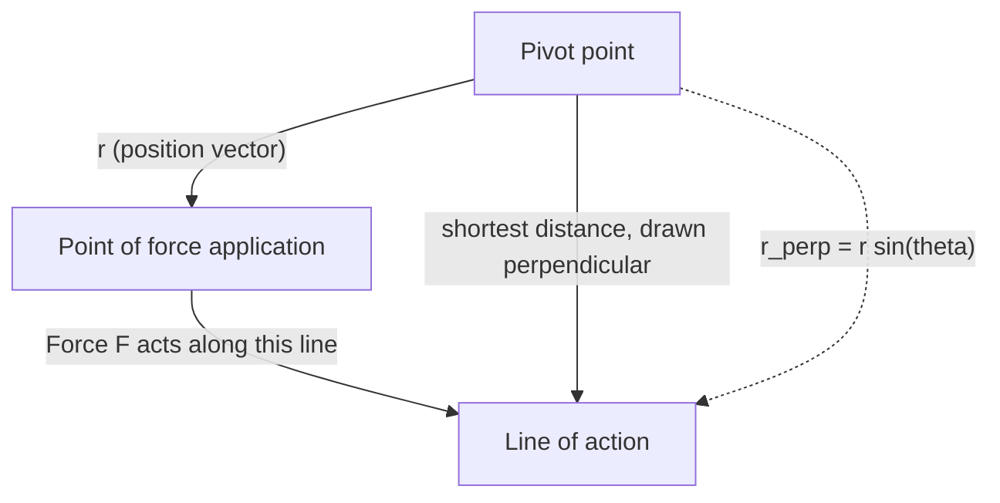
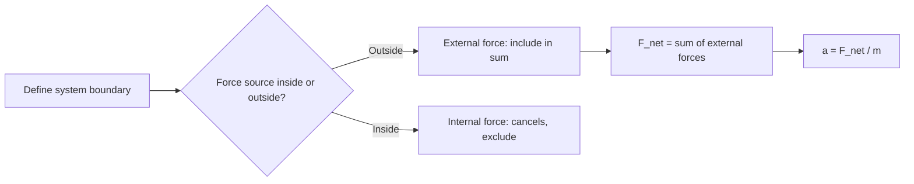

# SPL Run: build_concept_book

- **Adapter:** claude_cli
- **Model:** claude-sonnet-5
- **Tokens:** 9094 in / 4850 out
- **Latency:** 205376ms
- **Timestamp:** 2026-09-27 10:25:56

## Output

```output


---

## Force

A force is any push or pull exerted on an object as a result of its interaction with another object. Because a force has both a size and a direction, it is a **vector quantity**: pushing a box with $10\text{ N}$ to the right produces a completely different outcome than pushing it with $10\text{ N}$ downward, even though the magnitude is identical. Forces are measured in newtons ($1\text{ N} = 1\text{ kg·m/s}^2$), and their effect on motion is governed by Newton's second law, $\vec{F}_{net} = m\vec{a}$, where $\vec{F}_{net}$ is the vector sum of every force acting on the object.

Because forces add like vectors, not like plain numbers, two forces acting on the same object combine by components. Suppose a $50\text{ N}$ force pulls east and a $30\text{ N}$ force pulls north on the same crate. The net force is not $80\text{ N}$; it is the vector sum:
$$
\vec{F}_{net} = (50\,\hat{x} + 30\,\hat{y})\ \text{N}, \qquad |\vec{F}_{net}| = \sqrt{50^2 + 30^2} \approx 58.3\ \text{N}
$$
directed at $\arctan(30/50) \approx 31^\circ$ north of east. This is why resolving forces into perpendicular ($x$- and $y$-) components before adding them is the standard first move in any force problem — it converts a geometric vector-addition problem into simple arithmetic on each axis.

**Problem-solving application:** A $2\text{ kg}$ block sits on a frictionless table. A rope pulls it with $12\text{ N}$ at $30^\circ$ above the horizontal, while a second rope pulls it with $8\text{ N}$ purely horizontally in the opposite direction. Find the block's acceleration.

Step 1 — resolve into components: rope 1 gives $F_{1x} = 12\cos30^\circ \approx 10.39\text{ N}$, $F_{1y} = 12\sin30^\circ = 6\text{ N}$; rope 2 gives $F_{2x} = -8\text{ N}$.
Step 2 — sum by axis: $F_{net,x} \approx 2.39\text{ N}$, $F_{net,y} = 6\text{ N}$ (a normal force and gravity cancel vertically only if the block stays on the table — here the vertical pull would need to be checked against the normal force, but treating this as a pure horizontal-plane problem gives $a_x = F_{net,x}/m \approx 1.2\text{ m/s}^2$).
Step 3 — interpret: the block accelerates predominantly in the direction of the stronger, more aligned force — illustrating that "adding forces" always means adding components, never magnitudes directly.

---

## Pivot Point

**Definition.** The pivot point (or reference point) is the location about which torque is calculated. Torque is not an intrinsic property of a force alone — it depends on where that force acts *relative to a chosen point*. Recall $\vec{\tau} = \vec{r} \times \vec{F}$, so $\vec{r}$ — and therefore each torque — changes whenever the pivot changes. This is why the pivot must always be stated explicitly when solving a torque problem. For a rigid body in static equilibrium, however, the pivot is not arbitrary in the sense of mattering to the outcome: if net force and net torque are zero about one point, they remain zero about *every* point. That freedom to relocate the pivot without changing the physics is what makes the pivot point a genuine problem-solving tool rather than just a bookkeeping choice.

**Worked example.** A 4 m massless beam rests on a support at its center, with a 10 N weight hung 1 m to the left of center and a 20 N weight hung 0.5 m to the right of center. Take the pivot at the center support: torques are $\tau_1 = 10\,\text{N} \times 1\,\text{m} = 10\,\text{N·m}$ (counterclockwise) and $\tau_2 = 20\,\text{N} \times 0.5\,\text{m} = 10\,\text{N·m}$ (clockwise). Net torque $= 0$, confirming equilibrium. Now shift the pivot to the left end of the beam instead. The support force $N$ (which passes through the original center, now 2 m from the new pivot) contributes a torque of its own, and every distance in the problem must be re-measured from this new point. Each individual torque value is different from before, yet the *net* torque about this new pivot still sums to zero — the same equilibrium, described from a different vantage point.

**Problem-solving application.** Because the equilibrium condition holds regardless of where you place the pivot, you get to choose the pivot that makes the algebra easiest. Placing the pivot at the location of an unknown force — a hinge, a support reaction, a contact point — makes that force's moment arm zero, so it drops out of the torque equation entirely, leaving fewer variables to solve for. This single strategic choice is often what separates a two-line solution from a page of simultaneous equations, and it is the first thing to check before writing down any torque balance.

---

## Perpendicular Lever Arm

Torque measures how effectively a force rotates an object about a pivot. When the force does not act exactly perpendicular to the object, only part of it contributes to rotation — and the perpendicular lever arm is the tool that isolates that effective part.

Formally, torque is defined as $\tau = r_\perp F$, where $F$ is the magnitude of the applied force and $r_\perp$ is the **perpendicular lever arm**: the shortest distance from the pivot to the *line of action* of the force (the infinite line along which the force points, extended in both directions). This is equivalent to the more general vector definition $\tau = rF\sin\theta$, where $r$ is the distance from the pivot to the point of application and $\theta$ is the angle between the position vector and the force vector. The two formulas agree because $r_\perp = r\sin\theta$ — the perpendicular lever arm is just the component of $r$ that is perpendicular to $F$.

**Worked example.** A mechanic applies a $150\text{ N}$ force to a wrench handle $0.30\text{ m}$ long, pulling at an angle of $60°$ above the handle. Rather than computing $rF\sin\theta$ directly, find $r_\perp$ geometrically: drop a perpendicular from the pivot (the bolt) to the line along which the force acts. That perpendicular distance is $r_\perp = r\sin\theta = (0.30\text{ m})\sin(60°) = 0.26\text{ m}$. Then $\tau = r_\perp F = (0.26\text{ m})(150\text{ N}) = 39\text{ N·m}$.

**Problem-solving application.** The perpendicular lever arm method is often faster than the vector formula when a diagram is available: extend the force's line of action, drop a perpendicular from the pivot, and measure that segment directly — no angle needed. This is especially useful when force direction is given graphically rather than numerically. It also clarifies a key design principle: since $\tau = r_\perp F$, maximizing torque for a fixed force means maximizing $r_\perp$, which happens only when the force is applied *perpendicular to the lever* ($\theta = 90°$, so $r_\perp = r$). This is why door handles are placed far from hinges and wrenches are pulled perpendicular to their handle — both maximize the perpendicular lever arm to get the most torque from a given force.


*The perpendicular lever arm is the perpendicular segment from the pivot to the extended line of action of the force.*

---

## Net External Force

The net external force, $\vec{F}_{\text{net}} = \sum \vec{F}_{\text{ext}}$, is the vector sum of every force acting on a system that originates outside its defined boundary. Internal forces — the ones objects within the system exert on each other — always cancel in pairs by Newton's third law and never appear in this sum. This distinction matters because Newton's second law, $\vec{F}_{\text{net}} = m\vec{a}$, only holds when $\vec{F}_{\text{net}}$ is computed correctly: include an internal force by mistake and the equation gives a wrong acceleration; omit an external one and you miss real motion. Choosing the system boundary is therefore not a bookkeeping formality — it determines which forces count as "external" and which vanish from the calculation entirely.

**Worked example.** Two blocks, $m_1 = 2\ \text{kg}$ and $m_2 = 3\ \text{kg}$, sit in contact on a frictionless floor. A horizontal push $F = 10\ \text{N}$ is applied to $m_1$. If we define the system as *both blocks together*, the contact force between them is internal and cancels out. The only external horizontal force is $F$, so
$$a = \frac{F_{\text{net}}}{m_1+m_2} = \frac{10}{5} = 2\ \text{m/s}^2.$$
Now shrink the boundary to just $m_2$. The push $F$ is no longer external to this smaller system — it never touches $m_2$ directly. The only external horizontal force on $m_2$ is the contact push $N$ from $m_1$. Since both blocks share the same acceleration, $N = m_2 a = 3(2) = 6\ \text{N}$. Redefining the boundary changed which forces counted as external, but the physics — and the acceleration — stayed consistent.

**Problem-solving application.** When solving multi-body problems, first isolate each object with a free-body diagram, then ask of every force: "does its source lie inside or outside my chosen boundary?" Only external forces enter $\sum \vec{F}_{\text{ext}} = m\vec{a}$ for that isolated body. A common error is including the reaction partner of an internal pair (e.g., friction between two blocks in contact) when the boundary encloses both — always check whether the force's origin and its target are both inside the same system before discarding it as internal.


*Decision flow for classifying forces as external or internal when computing net force on a chosen system.*

---

## Torque

Torque, $\tau$, measures how effectively a force causes rotation about a pivot point. Unlike ordinary force, which produces straight-line acceleration, torque depends not only on how hard you push but on how far from the pivot you push and at what angle. Formally,

$$\tau = rF\sin\theta$$

where $r$ is the distance from the pivot to the point where the force is applied (the lever arm length), $F$ is the magnitude of the applied force, and $\theta$ is the angle between the force vector and the lever arm vector $\vec{r}$. Equivalently, torque is the magnitude of the cross product $\vec{\tau} = \vec{r} \times \vec{F}$, a vector quantity whose direction (by the right-hand rule) indicates the axis and sense of rotation. The $\sin\theta$ factor captures a key insight: only the component of force *perpendicular* to the lever arm contributes to rotation. A force applied directly along the lever arm ($\theta = 0°$) produces zero torque no matter how large it is.

**Worked example.** Suppose you apply a $40\ \text{N}$ force to a wrench handle $0.25\ \text{m}$ from the bolt, at an angle of $60°$ to the handle. The torque is
$$\tau = (0.25\ \text{m})(40\ \text{N})\sin 60° = (10)(0.866) \approx 8.66\ \text{N·m}.$$
If instead you pushed perpendicular to the handle ($\theta = 90°$), the same force would produce $\tau = 10\ \text{N·m}$ — the maximum possible torque for that force and distance, since $\sin 90° = 1$.

**Problem-solving application.** Torque problems typically ask you to find an unknown force, distance, or angle needed to achieve (or avoid) rotation, often under equilibrium conditions where $\sum \tau = 0$. Strategy:
1. Identify the pivot point.
2. For each force, determine $r$, $F$, and $\theta$ relative to that pivot.
3. Assign a sign convention (e.g., counterclockwise positive) and sum torques.
4. Solve for the unknown using $\sum \tau = 0$ (static equilibrium) or $\sum \tau = I\alpha$ (rotational dynamics).

For example, a seesaw balances when the torques from both riders about the fulcrum are equal and opposite — a direct application of the equilibrium condition that turns a qualitative "balance" observation into a solvable algebraic equation.

---

## Equilibrium

A rigid body is in **equilibrium** when it has zero linear acceleration and zero angular acceleration — equivalently, its net external force and net external torque both vanish. This is not the same as being at rest: a body moving at constant velocity or spinning at constant angular velocity is also in equilibrium, since neither its velocity nor angular velocity is changing. The two conditions are independent and both must hold:

$$\sum \vec{F}_{ext} = 0 \qquad \text{and} \qquad \sum \vec{\tau}_{ext} = 0$$

The first condition follows directly from Newton's second law, $\sum \vec{F} = m\vec{a}$, with $\vec{a} = 0$; the second follows from its rotational analog, $\sum \vec{\tau} = I\alpha$, with $\alpha = 0$. A body can satisfy the first condition and still rotate if the forces, though balanced, are applied off-axis — so both sums must be checked separately.

**Worked example.** A 4 m uniform beam of weight $W = 200\,\text{N}$ rests horizontally on two supports: one at the left end (A) and one 1 m from the right end (B). Find the support forces $F_A$ and $F_B$.

Translational equilibrium (vertical axis):
$$F_A + F_B - W = 0$$

Rotational equilibrium, taking torques about A so that $F_A$ drops out of the equation. The beam's weight acts at its center, 2 m from A; $F_B$ acts at 3 m from A:

$$F_B(3\,\text{m}) - W(2\,\text{m}) = 0 \implies F_B = \frac{200 \times 2}{3} \approx 133.3\,\text{N}$$

Substituting back: $F_A = 200 - 133.3 \approx 66.7\,\text{N}$.

**Problem-solving strategy.** Equilibrium problems reduce to a systematic procedure: (1) isolate the body with a free-body diagram; (2) write $\sum F_x = 0$ and $\sum F_y = 0$; (3) choose a pivot and write $\sum \tau = 0$ about it; (4) solve the resulting system. Placing the pivot at an unknown force's point of application eliminates that unknown from the torque equation, since equilibrium requires zero net torque about every axis, not just one — the same trick used for $F_A$ above turns a two-unknown system into two one-unknown equations.

---

## Mass

Mass is the quantity of matter contained in an object, measured in kilograms (kg) in the SI system. It is a scalar and an intrinsic, additive property: two 2 kg blocks combined have a mass of 4 kg regardless of location, whether on Earth, the Moon, or in deep space. Mass is measured operationally through Newton's second law,

$$
F = ma \quad \Longrightarrow \quad m = \frac{F}{a},
$$

which says that a fixed force produces less acceleration on a more massive object — mass quantifies an object's resistance to being accelerated.

This distinguishes mass from **weight**, the gravitational force on an object, $W = mg$, which does vary with location because the gravitational acceleration $g$ changes from place to place.

**Worked example.** A 10 kg block is pushed across a frictionless surface with a net force of 25 N. Its acceleration is

$$
a = \frac{F}{m} = \frac{25\ \text{N}}{10\ \text{kg}} = 2.5\ \text{m/s}^2.
$$

If the same block is transported to the Moon, where $g$ drops from $9.8\ \text{m/s}^2$ to $1.6\ \text{m/s}^2$, its weight changes from 98 N to 16 N — but its mass remains 10 kg, and pushing it with 25 N still produces the same $2.5\ \text{m/s}^2$ acceleration, since mass is unaffected by gravity.

**Problem-solving application.** Because mass is additive and location-independent, it can be tracked as a conserved quantity through a physical process even when the object's shape, state, or location changes. Suppose 2 kg of ice at 0°C melts completely into water. No matter is created or destroyed, so the resulting water has a mass of exactly 2 kg — even though its volume shrinks by about 9%. The same reasoning applies to any mixing, phase change, or combination of masses: the total mass equals the sum of the parts, $m_{\text{total}} = m_1 + m_2 + \dots$, unless matter is physically added or removed. Recognizing mass as the conserved, additive quantity — as opposed to volume, weight, or force, all of which can change under identical conditions — is often the deciding step in correctly setting up a physics or chemistry problem.

---

## Weight

Weight is the gravitational force exerted on an object by a nearby massive body — usually Earth. It is defined by Newton's second law applied to free fall:

$$W = mg$$

where $m$ is the object's mass (in kilograms) and $g$ is the local gravitational acceleration (approximately $9.8\ \text{m/s}^2$ near Earth's surface). Because weight is a force, it is measured in newtons (N), not kilograms — a common source of confusion. Mass measures how much matter an object contains and does not change with location; weight depends on the local gravitational field and does change.

**Worked example.** An astronaut has a mass of $80\ \text{kg}$. On Earth, her weight is:

$$W_{\text{Earth}} = (80\ \text{kg})(9.8\ \text{m/s}^2) = 784\ \text{N}$$

On the Moon, where $g_{\text{Moon}} \approx 1.6\ \text{m/s}^2$, her mass is unchanged, but her weight becomes:

$$W_{\text{Moon}} = (80\ \text{kg})(1.6\ \text{m/s}^2) = 128\ \text{N}$$

She would feel about one-sixth as heavy, though she is made of exactly the same amount of matter.

**Problem-solving application.** Weight calculations become essential once objects rest on a surface, because $mg$ is the force that the surface must balance to keep the object still. This balancing force is called the *normal force* ($N$) — the push a surface exerts perpendicular to itself. Consider a $60\ \text{kg}$ crate resting on a horizontal floor. For the crate to remain at rest, the normal force must equal its weight:

$$N = W = mg = (60)(9.8) = 588\ \text{N}$$

Now suppose the same crate sits on a scale inside an elevator accelerating upward at $2\ \text{m/s}^2$. The scale still measures the normal force $N$, but now $N$ and gravity no longer balance — instead, by Newton's second law, $N - mg = ma$, so:

$$N = m(g + a) = 60(9.8 + 2) = 708\ \text{N}$$

The scale reads more than the crate's actual weight, even though the crate's weight itself, $mg$, has not changed. This example shows why problem-solvers must be careful: weight is a fixed quantity determined by mass and $g$, while the normal force — what a scale actually reports — depends on the full dynamics of the situation, including acceleration.

---

## Center of Gravity

The center of gravity (CG) is the single point where a body's total weight can be treated as concentrated when analyzing torques and equilibrium. For a body made of point masses $m_i$ located at positions $x_i$ along a line, the CG is the weighted average position:

$$
x_{cg} = \frac{\sum_i m_i x_i}{\sum_i m_i}
$$

The same formula extends directly to two or three dimensions by applying it separately to each coordinate. Under Earth's essentially uniform gravitational field, this point coincides with the center of mass, so the two terms are used interchangeably in everyday problems.

The CG matters because it lets you replace a distributed weight with one equivalent force. If you compute the torque produced by gravity on every mass element about a pivot and add them up, the total equals exactly the torque produced by a single force $Mg$ applied at $x_{cg}$. This is why balancing, tipping, and lifting problems can be solved by treating the whole object as if all its mass sat at one point.

**Worked example.** A uniform 4 kg rod of length 2 m lies along the x-axis with one end at the origin. Its CG is at the geometric center, $x_{cg}=1$ m, since the mass is evenly distributed. Now attach a 2 kg point mass at $x=2$ m. The combined CG shifts toward the added mass:

$$
x_{cg} = \frac{(4)(1) + (2)(2)}{4+2} = \frac{4+4}{6} = 1.33\text{ m}
$$

**Problem-solving application.** To check whether a table with legs at $x=0$ and $x=3$ m stays upright when a 10 kg object is placed at $x=2.8$ m, find the combined CG of the table (mass 20 kg, CG at $x=1.5$ m) and the object:

$$
x_{cg} = \frac{(20)(1.5)+(10)(2.8)}{30} = \frac{30+28}{30} = 1.93\text{ m}
$$

Since 1.93 m falls between the two legs, gravity's torque is balanced by the legs' upward normal forces on both sides, and the table stays put. If the combined CG had fallen outside the 0–3 m span, all the torque would act on one side, and the table would tip — the same weighted-average calculation, just checked against the object's physical boundaries.

---

## Static Equilibrium

A rigid body is in **static equilibrium** when it is at rest and remains at rest: both the net external force and the net external torque acting on it are zero.

$$
\sum \vec{F}_{\text{ext}} = 0 \qquad \sum \vec{\tau}_{\text{ext}} = 0
$$

The first condition (translational equilibrium) alone is not sufficient — a body can have zero net force yet still spin up if the forces are arranged to produce a net twist. The second condition (rotational equilibrium) requires that torques, computed about *any* chosen pivot point, also sum to zero. Because the two conditions must hold together, if the net force is already zero the net torque works out to be the same about every point in space — so you are free to pick whichever pivot makes the algebra simplest.

**Worked example.** A uniform 4 m plank of weight 200 N rests horizontally on two supports, one at each end. A 50 kg person (weight $\approx 490$ N) stands 1 m from the left end. Find the force exerted by each support.

Let $F_L$ and $F_R$ be the upward support forces. Force balance gives:
$$
F_L + F_R = 200 + 490 = 690 \text{ N}
$$
Taking torques about the left support (so $F_L$ contributes zero torque), with counterclockwise positive and weights acting downward at their distances from the pivot:
$$
F_R(4) - 200(2) - 490(1) = 0 \implies F_R = \frac{400 + 490}{4} = 222.5 \text{ N}
$$
Then $F_L = 690 - 222.5 = 467.5$ N. Choosing the pivot at the point where the unknown force acts is the standard trick — it eliminates that unknown from the torque equation entirely.

**Problem-solving application.** Static equilibrium problems (ladders leaning on walls, cranes, bridge trusses, the human forearm as a lever) all follow the same recipe: (1) isolate the object and sketch every force acting on it, (2) write $\sum F_x = 0$ and $\sum F_y = 0$, (3) choose a pivot — ideally one through an unknown force — and write $\sum \tau = 0$, (4) solve the resulting system for the unknown forces or tensions. The two equilibrium conditions are the only tools you need; applying them consistently, with a well-chosen pivot, is what turns a complicated-looking structure into a solvable set of equations.

---

## Posture Back Strain

When you stand upright, your body's center of gravity sits almost directly above your hip and lower-spine pivot, so the torque your back muscles must supply to hold you up is small. Lean forward — to tie a shoe, lift a box, or slump over a desk — and that alignment breaks. The upper body's weight now acts at a horizontal distance from the pivot, creating a torque that must be balanced by the erector spinae muscles running along the spine. Because these muscles attach very close to the vertebral pivot, they must generate a force far larger than the weight they are balancing — this is the physical root of chronic back strain from poor posture.

Static equilibrium requires zero net torque about the pivot: $\tau_{net} = 0$, so $F_{muscle} \cdot d_{muscle} = W \cdot d_{weight}$, giving $F_{muscle} = W \cdot \dfrac{d_{weight}}{d_{muscle}}$.

**Worked example.** Suppose your upper body and head weigh $W = 400\ \text{N}$, and when you bend forward $30°$ their center of mass sits $d_{weight} = 0.30\ \text{m}$ horizontally from the L5–S1 disc (the common pivot point in the lower back). The erector spinae attaches only $d_{muscle} = 0.05\ \text{m}$ from that same pivot. Then:
$$F_{muscle} = 400\ \text{N} \times \frac{0.30\ \text{m}}{0.05\ \text{m}} = 2400\ \text{N}$$

The muscles must exert six times the weight they're supporting. That same large muscle force also presses back down through the disc — the disc ends up carrying a load well beyond the original 400 N of body weight. This is why repeated forward bending, not the weight itself, is what damages intervertebral discs over time.

**Problem-solving application.** This model explains standard ergonomic advice quantitatively: bending at the knees instead of the waist keeps $d_{weight}$ small by keeping the trunk upright, and holding a load close to the body (small $d_{weight}$ for the object too) directly reduces $F_{muscle}$. The lever-arm ratio $d_{weight}/d_{muscle}$, not the absolute weight lifted, is the dominant factor determining back-muscle load — a fact you can verify by comparing lifting technique scenarios and computing $F_{muscle}$ for each.

---

## Payoff

Posture and back strain sit at the end of this book because they are where every earlier concept — leverage, load distribution, muscular endurance, spinal anatomy — converges into something you actually feel. Understanding posture is not an abstract capstone; it is the point at which biomechanics stops being a diagram and becomes a daily practice that determines whether the body you have built through this material actually holds up under real-world use. Poor posture accumulates strain the way compound interest accumulates debt: a few degrees of forward head tilt or a slightly rounded lumbar curve seem trivial in isolation, but sustained over hours and years they redistribute load onto ligaments and discs that were never designed to bear it continuously. Mastering posture means you can diagnose *why* strain occurs — not just treat the symptom — because you understand the chain of forces from foot to spine to skull.

This is the natural endpoint of the book because it is the concept every other concept has been building toward: it is where knowledge becomes protective behavior. A student who understands muscle groups but not posture can still injure themselves at a desk. A student who understands posture can walk into an office, a gym, a car seat, or a hospital bed and immediately assess risk and correct it.

That is exactly why it unlocks such a wide range of applications. In ergonomic workplace design, posture principles translate directly into chair geometry, monitor height, and keyboard placement. In physical therapy and rehabilitation, they inform how clinicians rebuild movement patterns after injury. In sports biomechanics, they explain why elite athletes generate power without breaking down under repetitive strain. In public health, they shape guidelines for manual labor and long-duration seated work. Each domain takes the same core insight — that sustained misalignment converts ordinary movement into injury — and applies it to a different setting with its own constraints and stakes.

Pick one of these domains and follow it further: trace how a specific occupational or athletic context turns the general principle of posture into a concrete, testable intervention.
```
