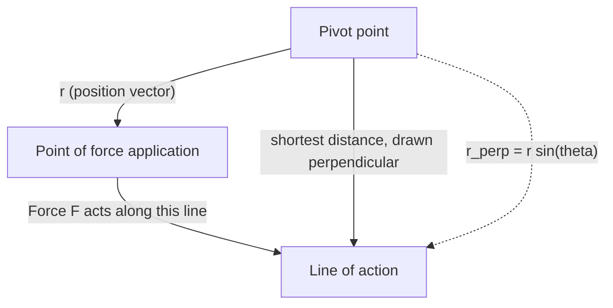
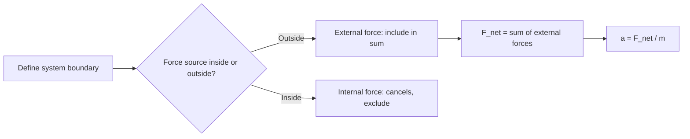
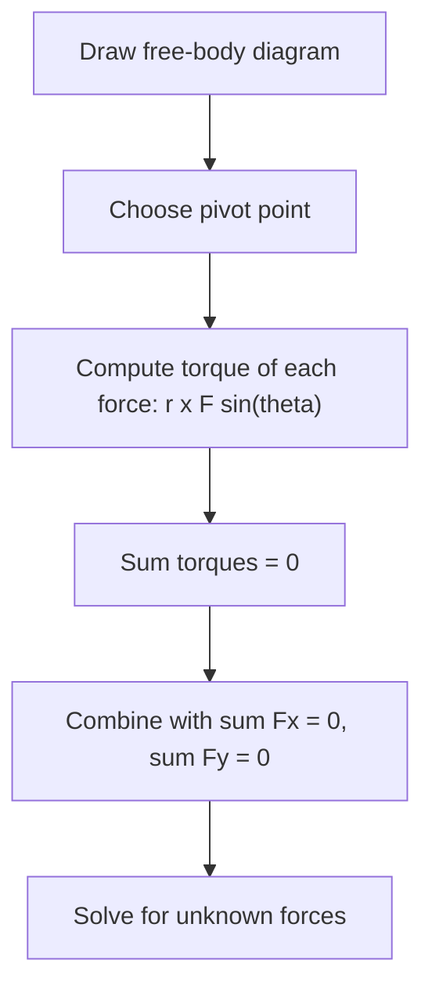
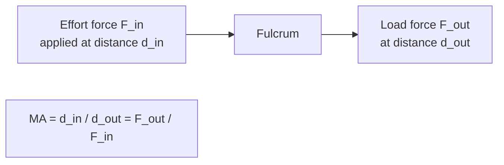
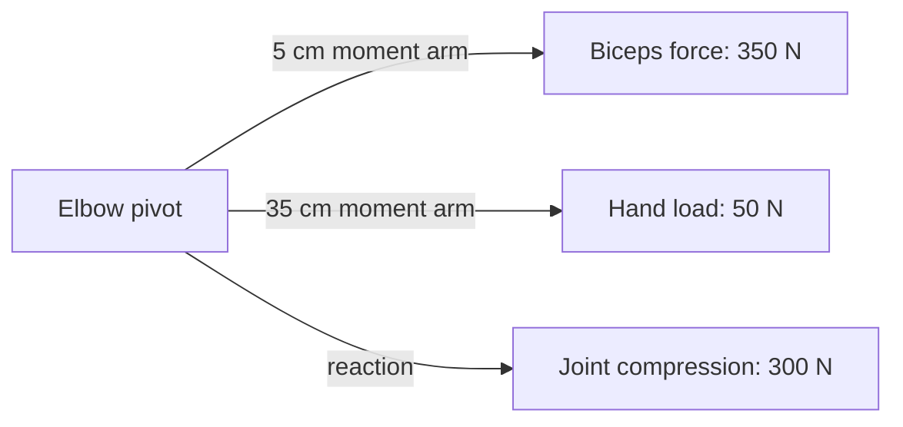

# SPL Run: build_concept_book

- **Adapter:** claude_cli
- **Model:** claude-sonnet-5
- **Tokens:** 5798 in / 3333 out
- **Latency:** 97844ms
- **Timestamp:** 2026-09-27 10:29:22

## Output

```output


---

## Force

A force is any push or pull exerted on an object as a result of its interaction with another object. Because a force has both a size and a direction, it is a **vector quantity**: pushing a box with $10\text{ N}$ to the right produces a completely different outcome than pushing it with $10\text{ N}$ downward, even though the magnitude is identical. Forces are measured in newtons ($1\text{ N} = 1\text{ kg·m/s}^2$), and their effect on motion is governed by Newton's second law, $\vec{F}_{net} = m\vec{a}$, where $\vec{F}_{net}$ is the vector sum of every force acting on the object.

Because forces add like vectors, not like plain numbers, two forces acting on the same object combine by components. Suppose a $50\text{ N}$ force pulls east and a $30\text{ N}$ force pulls north on the same crate. The net force is not $80\text{ N}$; it is the vector sum:
$$
\vec{F}_{net} = (50\,\hat{x} + 30\,\hat{y})\ \text{N}, \qquad |\vec{F}_{net}| = \sqrt{50^2 + 30^2} \approx 58.3\ \text{N}
$$
directed at $\arctan(30/50) \approx 31^\circ$ north of east. This is why resolving forces into perpendicular ($x$- and $y$-) components before adding them is the standard first move in any force problem — it converts a geometric vector-addition problem into simple arithmetic on each axis.

**Problem-solving application:** A $2\text{ kg}$ block sits on a frictionless table. A rope pulls it with $12\text{ N}$ at $30^\circ$ above the horizontal, while a second rope pulls it with $8\text{ N}$ purely horizontally in the opposite direction. Find the block's acceleration.

Step 1 — resolve into components: rope 1 gives $F_{1x} = 12\cos30^\circ \approx 10.39\text{ N}$, $F_{1y} = 12\sin30^\circ = 6\text{ N}$; rope 2 gives $F_{2x} = -8\text{ N}$.
Step 2 — sum by axis: $F_{net,x} \approx 2.39\text{ N}$, $F_{net,y} = 6\text{ N}$ (a normal force and gravity cancel vertically only if the block stays on the table — here the vertical pull would need to be checked against the normal force, but treating this as a pure horizontal-plane problem gives $a_x = F_{net,x}/m \approx 1.2\text{ m/s}^2$).
Step 3 — interpret: the block accelerates predominantly in the direction of the stronger, more aligned force — illustrating that "adding forces" always means adding components, never magnitudes directly.

---

## Pivot Point

**Definition.** The pivot point (or reference point) is the location about which torque is calculated. Torque is not an intrinsic property of a force alone — it depends on where that force acts *relative to a chosen point*. Recall $\vec{\tau} = \vec{r} \times \vec{F}$, so $\vec{r}$ — and therefore each torque — changes whenever the pivot changes. This is why the pivot must always be stated explicitly when solving a torque problem. For a rigid body in static equilibrium, however, the pivot is not arbitrary in the sense of mattering to the outcome: if net force and net torque are zero about one point, they remain zero about *every* point. That freedom to relocate the pivot without changing the physics is what makes the pivot point a genuine problem-solving tool rather than just a bookkeeping choice.

**Worked example.** A 4 m massless beam rests on a support at its center, with a 10 N weight hung 1 m to the left of center and a 20 N weight hung 0.5 m to the right of center. Take the pivot at the center support: torques are $\tau_1 = 10\,\text{N} \times 1\,\text{m} = 10\,\text{N·m}$ (counterclockwise) and $\tau_2 = 20\,\text{N} \times 0.5\,\text{m} = 10\,\text{N·m}$ (clockwise). Net torque $= 0$, confirming equilibrium. Now shift the pivot to the left end of the beam instead. The support force $N$ (which passes through the original center, now 2 m from the new pivot) contributes a torque of its own, and every distance in the problem must be re-measured from this new point. Each individual torque value is different from before, yet the *net* torque about this new pivot still sums to zero — the same equilibrium, described from a different vantage point.

**Problem-solving application.** Because the equilibrium condition holds regardless of where you place the pivot, you get to choose the pivot that makes the algebra easiest. Placing the pivot at the location of an unknown force — a hinge, a support reaction, a contact point — makes that force's moment arm zero, so it drops out of the torque equation entirely, leaving fewer variables to solve for. This single strategic choice is often what separates a two-line solution from a page of simultaneous equations, and it is the first thing to check before writing down any torque balance.

---

## Perpendicular Lever Arm

Torque measures how effectively a force rotates an object about a pivot. When the force does not act exactly perpendicular to the object, only part of it contributes to rotation — and the perpendicular lever arm is the tool that isolates that effective part.

Formally, torque is defined as $\tau = r_\perp F$, where $F$ is the magnitude of the applied force and $r_\perp$ is the **perpendicular lever arm**: the shortest distance from the pivot to the *line of action* of the force (the infinite line along which the force points, extended in both directions). This is equivalent to the more general vector definition $\tau = rF\sin\theta$, where $r$ is the distance from the pivot to the point of application and $\theta$ is the angle between the position vector and the force vector. The two formulas agree because $r_\perp = r\sin\theta$ — the perpendicular lever arm is just the component of $r$ that is perpendicular to $F$.

**Worked example.** A mechanic applies a $150\text{ N}$ force to a wrench handle $0.30\text{ m}$ long, pulling at an angle of $60°$ above the handle. Rather than computing $rF\sin\theta$ directly, find $r_\perp$ geometrically: drop a perpendicular from the pivot (the bolt) to the line along which the force acts. That perpendicular distance is $r_\perp = r\sin\theta = (0.30\text{ m})\sin(60°) = 0.26\text{ m}$. Then $\tau = r_\perp F = (0.26\text{ m})(150\text{ N}) = 39\text{ N·m}$.

**Problem-solving application.** The perpendicular lever arm method is often faster than the vector formula when a diagram is available: extend the force's line of action, drop a perpendicular from the pivot, and measure that segment directly — no angle needed. This is especially useful when force direction is given graphically rather than numerically. It also clarifies a key design principle: since $\tau = r_\perp F$, maximizing torque for a fixed force means maximizing $r_\perp$, which happens only when the force is applied *perpendicular to the lever* ($\theta = 90°$, so $r_\perp = r$). This is why door handles are placed far from hinges and wrenches are pulled perpendicular to their handle — both maximize the perpendicular lever arm to get the most torque from a given force.


*The perpendicular lever arm is the perpendicular segment from the pivot to the extended line of action of the force.*

---

## Net External Force

The net external force, $\vec{F}_{\text{net}} = \sum \vec{F}_{\text{ext}}$, is the vector sum of every force acting on a system that originates outside its defined boundary. Internal forces — the ones objects within the system exert on each other — always cancel in pairs by Newton's third law and never appear in this sum. This distinction matters because Newton's second law, $\vec{F}_{\text{net}} = m\vec{a}$, only holds when $\vec{F}_{\text{net}}$ is computed correctly: include an internal force by mistake and the equation gives a wrong acceleration; omit an external one and you miss real motion. Choosing the system boundary is therefore not a bookkeeping formality — it determines which forces count as "external" and which vanish from the calculation entirely.

**Worked example.** Two blocks, $m_1 = 2\ \text{kg}$ and $m_2 = 3\ \text{kg}$, sit in contact on a frictionless floor. A horizontal push $F = 10\ \text{N}$ is applied to $m_1$. If we define the system as *both blocks together*, the contact force between them is internal and cancels out. The only external horizontal force is $F$, so
$$a = \frac{F_{\text{net}}}{m_1+m_2} = \frac{10}{5} = 2\ \text{m/s}^2.$$
Now shrink the boundary to just $m_2$. The push $F$ is no longer external to this smaller system — it never touches $m_2$ directly. The only external horizontal force on $m_2$ is the contact push $N$ from $m_1$. Since both blocks share the same acceleration, $N = m_2 a = 3(2) = 6\ \text{N}$. Redefining the boundary changed which forces counted as external, but the physics — and the acceleration — stayed consistent.

**Problem-solving application.** When solving multi-body problems, first isolate each object with a free-body diagram, then ask of every force: "does its source lie inside or outside my chosen boundary?" Only external forces enter $\sum \vec{F}_{\text{ext}} = m\vec{a}$ for that isolated body. A common error is including the reaction partner of an internal pair (e.g., friction between two blocks in contact) when the boundary encloses both — always check whether the force's origin and its target are both inside the same system before discarding it as internal.


*Decision flow for classifying forces as external or internal when computing net force on a chosen system.*

---

## Torque

Torque, $\tau$, measures how effectively a force causes rotation about a pivot point. Unlike ordinary force, which produces straight-line acceleration, torque depends not only on how hard you push but on how far from the pivot you push and at what angle. Formally,

$$\tau = rF\sin\theta$$

where $r$ is the distance from the pivot to the point where the force is applied (the lever arm length), $F$ is the magnitude of the applied force, and $\theta$ is the angle between the force vector and the lever arm vector $\vec{r}$. Equivalently, torque is the magnitude of the cross product $\vec{\tau} = \vec{r} \times \vec{F}$, a vector quantity whose direction (by the right-hand rule) indicates the axis and sense of rotation. The $\sin\theta$ factor captures a key insight: only the component of force *perpendicular* to the lever arm contributes to rotation. A force applied directly along the lever arm ($\theta = 0°$) produces zero torque no matter how large it is.

**Worked example.** Suppose you apply a $40\ \text{N}$ force to a wrench handle $0.25\ \text{m}$ from the bolt, at an angle of $60°$ to the handle. The torque is
$$\tau = (0.25\ \text{m})(40\ \text{N})\sin 60° = (10)(0.866) \approx 8.66\ \text{N·m}.$$
If instead you pushed perpendicular to the handle ($\theta = 90°$), the same force would produce $\tau = 10\ \text{N·m}$ — the maximum possible torque for that force and distance, since $\sin 90° = 1$.

**Problem-solving application.** Torque problems typically ask you to find an unknown force, distance, or angle needed to achieve (or avoid) rotation, often under equilibrium conditions where $\sum \tau = 0$. Strategy:
1. Identify the pivot point.
2. For each force, determine $r$, $F$, and $\theta$ relative to that pivot.
3. Assign a sign convention (e.g., counterclockwise positive) and sum torques.
4. Solve for the unknown using $\sum \tau = 0$ (static equilibrium) or $\sum \tau = I\alpha$ (rotational dynamics).

For example, a seesaw balances when the torques from both riders about the fulcrum are equal and opposite — a direct application of the equilibrium condition that turns a qualitative "balance" observation into a solvable algebraic equation.

---

## Equilibrium

A rigid body is in **equilibrium** when it has zero linear acceleration and zero angular acceleration — equivalently, its net external force and net external torque both vanish. This is not the same as being at rest: a body moving at constant velocity or spinning at constant angular velocity is also in equilibrium, since neither its velocity nor angular velocity is changing. The two conditions are independent and both must hold:

$$\sum \vec{F}_{ext} = 0 \qquad \text{and} \qquad \sum \vec{\tau}_{ext} = 0$$

The first condition follows directly from Newton's second law, $\sum \vec{F} = m\vec{a}$, with $\vec{a} = 0$; the second follows from its rotational analog, $\sum \vec{\tau} = I\alpha$, with $\alpha = 0$. A body can satisfy the first condition and still rotate if the forces, though balanced, are applied off-axis — so both sums must be checked separately.

**Worked example.** A 4 m uniform beam of weight $W = 200\,\text{N}$ rests horizontally on two supports: one at the left end (A) and one 1 m from the right end (B). Find the support forces $F_A$ and $F_B$.

Translational equilibrium (vertical axis):
$$F_A + F_B - W = 0$$

Rotational equilibrium, taking torques about A so that $F_A$ drops out of the equation. The beam's weight acts at its center, 2 m from A; $F_B$ acts at 3 m from A:

$$F_B(3\,\text{m}) - W(2\,\text{m}) = 0 \implies F_B = \frac{200 \times 2}{3} \approx 133.3\,\text{N}$$

Substituting back: $F_A = 200 - 133.3 \approx 66.7\,\text{N}$.

**Problem-solving strategy.** Equilibrium problems reduce to a systematic procedure: (1) isolate the body with a free-body diagram; (2) write $\sum F_x = 0$ and $\sum F_y = 0$; (3) choose a pivot and write $\sum \tau = 0$ about it; (4) solve the resulting system. Placing the pivot at an unknown force's point of application eliminates that unknown from the torque equation, since equilibrium requires zero net torque about every axis, not just one — the same trick used for $F_A$ above turns a two-unknown system into two one-unknown equations.

---

## Mechanical Advantage

A simple machine — a lever, pulley, inclined plane, wedge, or screw — does not create energy; it trades force for distance so that a smaller input force can move a larger load. **Mechanical advantage (MA)** quantifies that trade-off as the ratio of output (load) force to input (effort) force:

$$
MA = \frac{F_{\text{out}}}{F_{\text{in}}}
$$

For an *ideal* machine (frictionless, massless components), energy conservation requires that input work equal output work: $F_{\text{in}} d_{\text{in}} = F_{\text{out}} d_{\text{out}}$, where $d$ denotes the distance each force acts through. Rearranging gives the **ideal mechanical advantage (IMA)**:

$$
IMA = \frac{F_{\text{out}}}{F_{\text{in}}} = \frac{d_{\text{in}}}{d_{\text{out}}}
$$

This form is powerful because $d_{\text{in}}/d_{\text{out}}$ is a purely geometric ratio — you can compute it from the machine's dimensions without ever measuring force.

**Worked example.** A lever has its fulcrum 0.2 m from the load and 1.0 m from the effort. If you push down with 50 N, what load can you lift? First, $IMA = d_{\text{in}}/d_{\text{out}} = 1.0\ \text{m} / 0.2\ \text{m} = 5$. Then $F_{\text{out}} = IMA \times F_{\text{in}} = 5 \times 50\ \text{N} = 250\ \text{N}$. The lever multiplies your effort fivefold, at the cost of pushing through five times the distance the load moves.

**Problem-solving application.** Real machines suffer friction, so the *actual* mechanical advantage (AMA), measured directly as $F_{\text{out}}/F_{\text{in}}$ from real force data, is always less than or equal to the IMA. The ratio between them defines **efficiency**:

$$
\eta = \frac{AMA}{IMA} \times 100\%
$$

Suppose the lever above actually requires 60 N to lift the same 250 N load (friction at the fulcrum). Then $AMA = 250/60 \approx 4.17$, and $\eta = 4.17/5 \times 100\% \approx 83\%$. This two-step method — compute IMA from geometry, compare to measured AMA — is the standard approach engineers use to diagnose energy losses in gear trains, pulley systems, and hydraulic jacks, and it generalizes directly to compound machines, where the overall mechanical advantage is the product of the MAs of each stage.

---

## First Condition Equilibrium

A rigid body is in **translational equilibrium** when the vector sum of all external forces acting on it is zero:

$$\sum \vec{F}_{ext} = \vec{F}_{net} = 0$$

Because force is a vector, this single equation is really three independent scalar conditions, one for each spatial axis:

$$\sum F_x = 0, \qquad \sum F_y = 0, \qquad \sum F_z = 0$$

This is the **first condition of equilibrium** (the second condition, $\sum \vec{\tau} = 0$, concerns rotational balance and is treated separately). Satisfying the first condition guarantees zero *linear* acceleration — by Newton's second law, $\vec{F}_{net} = m\vec{a}$, so $\vec{F}_{net} = 0 \Leftrightarrow \vec{a} = 0$. The object may still be moving, but at constant velocity (including the special case of being at rest).

**Worked example.** A 12 kg sign hangs from two cables making angles of $37^\circ$ and $53^\circ$ with the ceiling, meeting at a common point above the sign. Find the tension in each cable.

Set up axes with $x$ horizontal and $y$ vertical at the junction point. Three forces act there: $T_1$ at $37^\circ$, $T_2$ at $53^\circ$, and the weight $W = mg = (12)(9.8) = 117.6\text{ N}$ pulling straight down.

$$\sum F_x = 0: \quad T_2\cos 53^\circ - T_1\cos 37^\circ = 0$$
$$\sum F_y = 0: \quad T_1\sin 37^\circ + T_2\sin 53^\circ - W = 0$$

From the first equation, $T_2 = T_1\dfrac{\cos 37^\circ}{\cos 53^\circ} \approx 1.327\,T_1$. Substituting into the second equation:

$$T_1(0.602) + 1.327\,T_1(0.799) = 117.6$$
$$T_1(0.602 + 1.060) = 117.6 \;\Rightarrow\; T_1 \approx 70.8\text{ N}, \quad T_2 \approx 93.9\text{ N}$$

**Problem-solving strategy.** The first condition converts a geometric force diagram into an algebraic system: (1) isolate the object with a free-body diagram, (2) resolve every force into $x$- and $y$-components, (3) set each component sum to zero, (4) solve the resulting linear system. When more than two unknown forces appear, the system is *statically indeterminate* under this condition alone and requires the second condition (torque balance) to close the problem — a preview of the next section.


*Workflow for applying the first condition of equilibrium to a force problem.*

---

## Second Condition Equilibrium

A rigid body can have zero net force acting on it and still spin faster and faster — a spinning top has no net force pulling it sideways, yet it rotates. Force alone governs translational motion; it says nothing about rotation. The **second condition of equilibrium** closes this gap: for a rigid body to be in rotational equilibrium (no angular acceleration), the net external torque about *any* chosen pivot point must be zero:

$$\sum \vec{\tau}_i = 0$$

Torque is defined as $\vec{\tau} = \vec{r} \times \vec{F}$, where $\vec{r}$ is the position vector from the pivot to the point of force application. In two dimensions, this reduces to $\tau = rF\sin\theta$, with sign convention: counterclockwise torques positive, clockwise negative. A crucial theorem underlies this condition: if a rigid body has zero net force *and* zero net torque about one point, the net torque about *every other point* is also zero. This is why you may choose *any* pivot — strategically placing it where an unknown force acts eliminates that force from the equation entirely, since its lever arm becomes zero.

**Worked example:** A 4 m uniform beam of weight 200 N rests on two supports, one at the left end (A) and one 1 m from the right end (B). A 300 N load sits at the right end. Find the force at each support. Take torques about A to eliminate $F_A$:
$$\sum \tau_A = F_B(3\,\text{m}) - 200\,\text{N}(2\,\text{m}) - 300\,\text{N}(4\,\text{m}) = 0$$
Solving: $F_B = (400 + 1200)/3 = 533.3\,\text{N}$. Then from $\sum F_y = 0$: $F_A = 200 + 300 - 533.3 = -33.3\,\text{N}$ (the negative sign shows support A must actually pull *down* — meaning this beam configuration requires A to be bolted, not just resting).

**Problem-solving strategy:** always sketch the body, mark all forces with correct points of application, choose a pivot that kills the most unknowns, and apply $\sum \tau = 0$ alongside $\sum F_x = 0$ and $\sum F_y = 0$ — three equations for three unknowns in planar problems (e.g., two support forces and one angle, or a hinge force and a cable tension).


*Workflow for applying the second condition of equilibrium to a rigid-body problem.*

---

## Fulcrum

The fulcrum is the fixed point about which a lever rotates. It is the anchor that converts a push or pull applied at one location on a rigid bar into rotational motion, and its position relative to the applied force and the load determines whether the lever amplifies force, amplifies distance, or simply redirects the direction of effort. Every lever — a crowbar, a pair of scissors, a see-saw, the human forearm pivoting at the elbow — has exactly one fulcrum, and the physics of the system is governed by torque, the rotational analog of force.

Torque ($\tau$) about the fulcrum is the product of the applied force and the perpendicular distance from the fulcrum to the line of action of that force, called the lever arm:
$$\tau = F \cdot d$$
A lever is in rotational equilibrium when the torques on either side of the fulcrum balance:
$$F_1 d_1 = F_2 d_2$$
This single equation is the basis of mechanical advantage. If the fulcrum sits closer to the load than to the applied effort ($d_1$, the effort arm, is much longer than $d_2$, the load arm), a small effort force can balance or move a much larger load force — this is why a long crowbar with the fulcrum near the nail lets you pry it out with modest hand force.

**Worked example.** A 3 m uniform bar rests on a fulcrum placed 0.5 m from one end. A 400 N weight hangs at that near end. What force applied at the far end (2.5 m from the fulcrum) balances the bar?

Using $F_1 d_1 = F_2 d_2$: $400 \text{ N} \times 0.5 \text{ m} = F_2 \times 2.5 \text{ m}$, so $F_2 = 80$ N. Moving the fulcrum closer to the load turned a 400 N weight into an 80 N lifting problem — a mechanical advantage of 5.

**Problem-solving application.** Fulcrum placement is the key design variable in lever problems: shifting it toward the load increases force amplification but decreases the distance the load moves for a given effort-arm sweep (energy is conserved — work in equals work out, ignoring friction). Engineers exploit this trade-off in tools (bolt cutters, wheelbarrows) and in structural design (seesaw balance points, brake pedal linkages), where the fulcrum's location is chosen to match the force and precision requirements of the task.

---

## Simple Machine

A simple machine is a device that changes the magnitude or direction of an applied force to make work easier to perform. It does not reduce the total work required — by the work-energy principle, $W = F \cdot d$, any decrease in the force needed to accomplish a task is offset by a proportional increase in the distance over which that force is applied. What a simple machine provides is **mechanical advantage** ($MA$), the ratio of output force (load) to input force (effort):

$$MA = \frac{F_{out}}{F_{in}}$$

For a lever, this ratio is fixed entirely by geometry — specifically, the ratio of the two lever arms measured from the fulcrum:

$$MA = \frac{d_{in}}{d_{out}}$$

where $d_{in}$ is the distance from the fulcrum to the point where effort is applied, and $d_{out}$ is the distance from the fulcrum to the load.

**Worked example.** Suppose a 600 N rock needs to be lifted using a lever, with the fulcrum placed so that the effort arm is 1.5 m and the load arm is 0.5 m. The mechanical advantage is $MA = 1.5 / 0.5 = 3$. The effort force required is therefore $F_{in} = F_{out} / MA = 600 / 3 = 200$ N. Because energy is conserved (ignoring friction), the effort end of the lever must move three times farther than the load: if the rock rises 0.1 m, the effort end travels 0.3 m.

**Problem-solving application.** This trade-off generalizes across all simple machines — levers, pulleys, wheel-and-axles, inclined planes, wedges, and screws — each realizing $MA$ through a different geometric ratio (radius ratio for wheel-and-axle, length-over-height for an inclined plane). When solving compound-machine problems, treat the overall mechanical advantage as the product of the individual $MA$ values in series, and always check whether the problem specifies *ideal* $MA$ (frictionless, from geometry alone) or *actual* $MA$ (measured $F_{out}/F_{in}$, which is lower due to friction losses). The ratio of ideal to actual $MA$ gives the machine's efficiency, a quantity you can compute directly once both forces are known.


*The lever as the archetypal simple machine: mechanical advantage is set by the ratio of lever-arm distances from the fulcrum.*

---

## Lever

A lever is a rigid bar that pivots about a fixed point called the fulcrum, transmitting an input force applied at one point to an output force at another. Its behavior is governed by rotational equilibrium: at balance, the net torque about the fulcrum is zero. Since torque equals force times the perpendicular distance from the fulcrum (the lever arm), a lever lets a small input force at a long arm produce a large output force at a short arm — or vice versa.

Formally, if $F_i$ is the input force applied at distance $d_i$ from the fulcrum, and $F_o$ is the output force (load) at distance $d_o$, equilibrium requires

$$F_i \, d_i = F_o \, d_o.$$

The mechanical advantage (MA) is the ratio of output force to input force:

$$MA = \frac{F_o}{F_i} = \frac{d_i}{d_o}.$$

This is a direct consequence of the torque balance, not an independent rule — it tells you that whatever force you gain, you pay for in distance moved, since the work done, $F_i d_i \theta = F_o d_o \theta$ for a small rotation $\theta$, is conserved (ignoring friction).

Worked example: You want to lift a 300 N rock using a 2 m bar. You place the fulcrum 0.4 m from the rock, so $d_o = 0.4$ m and $d_i = 1.6$ m. Then

$$MA = \frac{d_i}{d_o} = \frac{1.6}{0.4} = 4,$$

so the input force needed is $F_i = F_o / MA = 300/4 = 75$ N. Moving the fulcrum closer to the load increases $d_i$ relative to $d_o$, raising the mechanical advantage — but you must push your end through a proportionally longer arc to lift the rock the same height.

Problem-solving application: Given a required MA, solve for fulcrum placement: rearrange $d_i/d_o = MA$ with $d_i + d_o = L$ (total bar length) to get $d_o = L/(MA+1)$. For $L = 2$ m and a desired MA of 5, $d_o = 2/6 \approx 0.33$ m — the fulcrum should sit about a third of a meter from the load. This same torque-balance equation underlies analysis of see-saws, crowbars, nutcrackers (class 2 levers, fulcrum at one end), and human forearms (class 3 levers, where MA < 1 trades force for speed and range of motion).

---

## Statics

Statics is the branch of mechanics that analyzes systems in **equilibrium** — objects at rest or moving at constant velocity, where the net force and net torque are both zero. This is the one new idea for this section, expressed by two vector equations:

$$\sum \vec{F} = 0 \qquad \sum \vec{\tau} = 0$$

The first equation ensures no linear acceleration (translational equilibrium); the second ensures no angular acceleration (rotational equilibrium), using torque as already defined in rotational dynamics. Each vector equation decomposes into scalar component equations — typically $\sum F_x = 0$, $\sum F_y = 0$, and $\sum \tau = 0$ about any chosen pivot point — giving up to three independent equations for a two-dimensional rigid-body problem.

**Worked example.** A uniform 4 m ladder of weight $W = 200\,\text{N}$ leans against a frictionless wall, with its base 1.6 m from the wall on a floor with friction. Find the normal force from the wall $N_w$, the normal force from the floor $N_f$, and the friction force $f$ at the base.

Vertical equilibrium: $N_f = W = 200\,\text{N}$ (the wall is frictionless, contributing no vertical force).

Horizontal equilibrium: $N_w = f$.

Torque about the base (eliminating $N_f$ and $f$, which act at that point): the wall's reaction torque must balance the ladder's weight torque. With height $h = \sqrt{4^2 - 1.6^2} \approx 3.67\,\text{m}$, setting torques equal: $N_w \cdot h = W \cdot (1.6/2)$, giving $N_w = \dfrac{200 \times 0.8}{3.67} \approx 43.6\,\text{N}$. Thus $f \approx 43.6\,\text{N}$.

**Problem-solving strategy.** The key skill in statics is choosing the pivot point strategically: placing it where an unknown force acts eliminates that force from the torque equation, reducing the number of simultaneous unknowns you must solve for. Combined with the two force equations, this typically yields exactly enough equations to solve for all unknown reaction forces — a technique essential in structural engineering, biomechanics (analyzing joint forces), and machine design.

---

## Muscles Joints Statics

The musculoskeletal system operates as a set of rigid levers: bones act as beams, joints act as pivots (fulcrums), and muscles supply the only rotational input force. Static equilibrium requires that the net torque about a joint be zero, $\sum \tau = 0$, where $\tau = F \cdot d$ and $d$ is the perpendicular distance from the force's line of action to the pivot. Because muscles attach very close to joints while the load (or the limb's own weight) acts far from the joint, muscles must generate forces far larger than the external load to balance the torque equation.

**Worked example.** Consider the forearm held horizontally, flexed at the elbow, supporting a $50\text{ N}$ weight in the hand. The biceps tendon attaches to the forearm about $5\text{ cm}$ from the elbow pivot, while the weight acts at $35\text{ cm}$ from the pivot (ignore forearm weight for simplicity). Taking torques about the elbow:
$$
F_{\text{biceps}} \cdot (5\text{ cm}) = 50\text{ N} \cdot (35\text{ cm})
$$
$$
F_{\text{biceps}} = \frac{50 \times 35}{5} = 350\text{ N}
$$
The biceps must pull with $350\text{ N}$ — seven times the weight held — because it operates at a severe mechanical disadvantage (a Class III lever, where the effort lies between the fulcrum and the load).

**Problem-solving application.** This same equilibrium equation explains joint reaction forces: since $\sum F = 0$ as well, the elbow joint itself must supply a downward-directed reaction force equal to $F_{\text{biceps}} - W = 300\text{ N}$ pressing the joint surfaces together. This is why joint compressive loads routinely exceed several times body weight, and it clarifies clinical reasoning: shortening the effective load arm (holding a weight closer to the body) or increasing the muscle's moment arm (as in some tendon-transfer surgeries) directly reduces the required muscle force for the same task.


*Torque balance at the elbow: a short muscle moment arm forces the biceps to generate far more force than the external load, producing large joint compression.*

---

## Payoff

Muscles-and-joints statics is the point where two ideas the course has built separately — rigid-body equilibrium and lever mechanics — fuse into a single, embodied model. A joint is a pivot; a bone is a lever arm; a muscle is a force applied at a fixed, often disadvantageous, angle and distance from that pivot. The governing law is unchanged from any other static system: the sum of torques about the joint must vanish, $\sum \tau = \sum F_i \, d_i \sin\theta_i = 0$, together with $\sum F = 0$ for translational equilibrium. What makes this the natural endpoint of the course is that it forces you to apply every static-equilibrium tool — free-body diagrams, moment arms, force decomposition — to a system where the geometry is unfavorable by design (short muscle moment arms trade force for speed and range of motion) and where the unknowns (joint reaction force, muscle tension) cannot be measured directly, only inferred from the equations.

Consider the classic case: holding a $50\,\text{N}$ weight in the hand with the forearm horizontal, biceps attached $5\,\text{cm}$ from the elbow, weight held $35\,\text{cm}$ out. Torque balance about the elbow gives $F_{muscle}(0.05) = (50)(0.35)$, so $F_{muscle} = 350\,\text{N}$ — seven times the load. Summing forces then reveals the joint itself absorbs roughly $300\,\text{N}$ of reaction force. This is the payoff of statics: a two-line calculation exposes forces the body is silently managing.

This machinery generalizes directly. In ergonomics and injury prevention, the same torque equation predicts which postures overload the spine or shoulder. In sports biomechanics, it explains why moving a muscle's insertion point by centimeters changes an athlete's power-versus-speed profile. In prosthetics and orthopedic implant design, engineers use identical free-body diagrams to size joint replacements for real in-vivo loads, not just the externally visible weight. In physical therapy and rehabilitation, it quantifies why certain exercises stress a joint more than the resistance alone suggests.

Pick one of these domains — ergonomics, sports performance, prosthetic design, or rehabilitation — and work through a full free-body analysis of a joint under a realistic load. You will find the same three equations doing all the work every time.
```
