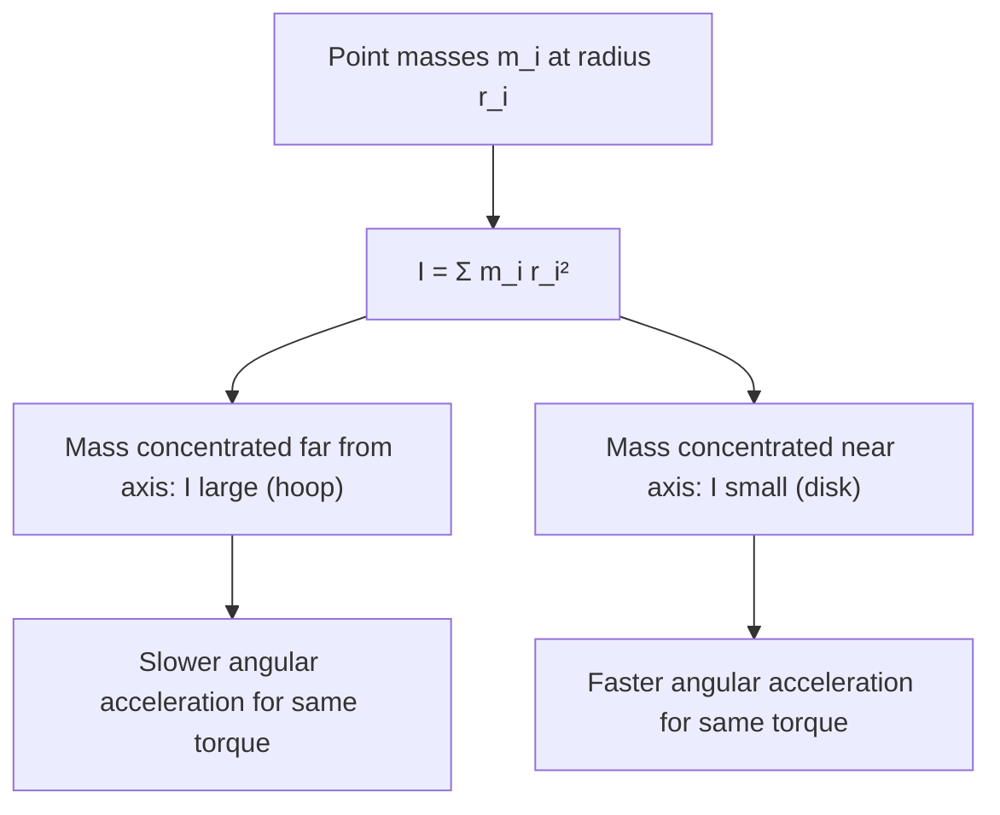

# SPL Run: build_concept_book

- **Adapter:** claude_cli
- **Model:** claude-sonnet-5
- **Tokens:** 10386 in / 5683 out
- **Latency:** 207510ms
- **Timestamp:** 2026-09-27 10:31:01

## Output

```output


---

## Mass

Mass is the quantity of matter contained in an object, measured in kilograms (kg) in the SI system. It is a scalar and an intrinsic, additive property: two 2 kg blocks combined have a mass of 4 kg regardless of location, whether on Earth, the Moon, or in deep space. Mass is measured operationally through Newton's second law,

$$
F = ma \quad \Longrightarrow \quad m = \frac{F}{a},
$$

which says that a fixed force produces less acceleration on a more massive object — mass quantifies an object's resistance to being accelerated.

This distinguishes mass from **weight**, the gravitational force on an object, $W = mg$, which does vary with location because the gravitational acceleration $g$ changes from place to place.

**Worked example.** A 10 kg block is pushed across a frictionless surface with a net force of 25 N. Its acceleration is

$$
a = \frac{F}{m} = \frac{25\ \text{N}}{10\ \text{kg}} = 2.5\ \text{m/s}^2.
$$

If the same block is transported to the Moon, where $g$ drops from $9.8\ \text{m/s}^2$ to $1.6\ \text{m/s}^2$, its weight changes from 98 N to 16 N — but its mass remains 10 kg, and pushing it with 25 N still produces the same $2.5\ \text{m/s}^2$ acceleration, since mass is unaffected by gravity.

**Problem-solving application.** Because mass is additive and location-independent, it can be tracked as a conserved quantity through a physical process even when the object's shape, state, or location changes. Suppose 2 kg of ice at 0°C melts completely into water. No matter is created or destroyed, so the resulting water has a mass of exactly 2 kg — even though its volume shrinks by about 9%. The same reasoning applies to any mixing, phase change, or combination of masses: the total mass equals the sum of the parts, $m_{\text{total}} = m_1 + m_2 + \dots$, unless matter is physically added or removed. Recognizing mass as the conserved, additive quantity — as opposed to volume, weight, or force, all of which can change under identical conditions — is often the deciding step in correctly setting up a physics or chemistry problem.

---

## Angular Velocity

**Definition.** Angular velocity, $\omega$, measures how fast an object rotates — the rate of change of angular position $\theta$ with respect to time:
$$
\omega = \frac{\Delta \theta}{\Delta t}, \qquad \text{or instantaneously,} \qquad \omega = \frac{d\theta}{dt}
$$
Angle is measured in radians, so $\omega$ has units of radians per second (rad/s). Angular velocity is a vector quantity: its magnitude gives the rotation rate, and its direction (by the right-hand rule) points along the rotation axis, indicating the sense of rotation (e.g., counterclockwise vs. clockwise when viewed from above).

Angular velocity connects directly to linear (tangential) speed for a point on a rotating body. If a point sits at radius $r$ from the rotation axis, its tangential speed is
$$
v = \omega r
$$
This relationship is why a horse on the outer edge of a merry-go-round moves faster (larger $v$) than one near the center, even though both share the same $\omega$.

**Worked example.** A bicycle wheel of radius $0.35\text{ m}$ completes 2 full revolutions in 1 second. Find $\omega$ and the tangential speed of a point on the rim.

Each revolution corresponds to $2\pi$ radians, so total angle swept is $\Delta\theta = 2 \times 2\pi = 4\pi$ rad in $\Delta t = 1\text{ s}$:
$$
\omega = \frac{4\pi \text{ rad}}{1\text{ s}} \approx 12.57 \text{ rad/s}
$$
Tangential speed at the rim:
$$
v = \omega r = 12.57 \times 0.35 \approx 4.40 \text{ m/s}
$$

**Problem-solving application.** Angular velocity is essential whenever you must relate rotational motion to real-world quantities like speed, frequency, or period. Given a rotation frequency $f$ (revolutions per second), convert with $\omega = 2\pi f$; given period $T$ (seconds per revolution), use $\omega = \dfrac{2\pi}{T}$. For example, Earth's rotation has $T = 86{,}164\text{ s}$ (one sidereal day), giving $\omega = \dfrac{2\pi}{86{,}164} \approx 7.29 \times 10^{-5}$ rad/s — a value used directly in satellite orbit calculations and Coriolis-effect problems. When solving multi-step mechanics problems (e.g., a rotating disk with objects at different radii), first find $\omega$ from the given time/angle data, then apply $v = \omega r$ to each point of interest — since $\omega$ is the same for every point on a rigid rotating body, it's often the most efficient quantity to solve for first.

---

## Force

A force is any push or pull exerted on an object as a result of its interaction with another object. Because a force has both a size and a direction, it is a **vector quantity**: pushing a box with $10\text{ N}$ to the right produces a completely different outcome than pushing it with $10\text{ N}$ downward, even though the magnitude is identical. Forces are measured in newtons ($1\text{ N} = 1\text{ kg·m/s}^2$), and their effect on motion is governed by Newton's second law, $\vec{F}_{net} = m\vec{a}$, where $\vec{F}_{net}$ is the vector sum of every force acting on the object.

Because forces add like vectors, not like plain numbers, two forces acting on the same object combine by components. Suppose a $50\text{ N}$ force pulls east and a $30\text{ N}$ force pulls north on the same crate. The net force is not $80\text{ N}$; it is the vector sum:
$$
\vec{F}_{net} = (50\,\hat{x} + 30\,\hat{y})\ \text{N}, \qquad |\vec{F}_{net}| = \sqrt{50^2 + 30^2} \approx 58.3\ \text{N}
$$
directed at $\arctan(30/50) \approx 31^\circ$ north of east. This is why resolving forces into perpendicular ($x$- and $y$-) components before adding them is the standard first move in any force problem — it converts a geometric vector-addition problem into simple arithmetic on each axis.

**Problem-solving application:** A $2\text{ kg}$ block sits on a frictionless table. A rope pulls it with $12\text{ N}$ at $30^\circ$ above the horizontal, while a second rope pulls it with $8\text{ N}$ purely horizontally in the opposite direction. Find the block's acceleration.

Step 1 — resolve into components: rope 1 gives $F_{1x} = 12\cos30^\circ \approx 10.39\text{ N}$, $F_{1y} = 12\sin30^\circ = 6\text{ N}$; rope 2 gives $F_{2x} = -8\text{ N}$.
Step 2 — sum by axis: $F_{net,x} \approx 2.39\text{ N}$, $F_{net,y} = 6\text{ N}$ (a normal force and gravity cancel vertically only if the block stays on the table — here the vertical pull would need to be checked against the normal force, but treating this as a pure horizontal-plane problem gives $a_x = F_{net,x}/m \approx 1.2\text{ m/s}^2$).
Step 3 — interpret: the block accelerates predominantly in the direction of the stronger, more aligned force — illustrating that "adding forces" always means adding components, never magnitudes directly.

---

## Moment Of Inertia

Mass measures an object's resistance to linear acceleration; moment of inertia $I$ measures its resistance to *angular* acceleration. For a system of point masses, it is defined as
$$I = \sum_i m_i r_i^2$$
where $r_i$ is the perpendicular distance of mass $m_i$ from the rotation axis. For a continuous body, the sum becomes an integral, $I = \int r^2 \, dm$. The key insight embedded in this formula is that $I$ depends not just on how much mass an object has, but on *where* that mass sits relative to the axis — mass far from the axis contributes disproportionately, since its effect scales with $r^2$, not $r$.

**Worked example.** Consider two objects of equal mass $M$ and radius $R$: a solid disk and a thin hoop, both rotating about their central axis. Integrating $I = \int r^2\,dm$ over a uniform disk gives $I_{\text{disk}} = \tfrac{1}{2}MR^2$, while every mass element of the hoop sits at the same distance $R$ from the axis, giving $I_{\text{hoop}} = MR^2$ directly from the definition. Even though both objects have identical mass and radius, the hoop has twice the rotational inertia because its mass is concentrated at the rim rather than spread toward the center.

**Problem-solving application.** This distinction matters directly: in a race down an incline, a solid disk (like a solid cylinder) accelerates faster than a hoop of equal mass and radius, because less of its kinetic energy is "used up" spinning the mass around a large radius — more is available for translational motion. Using the parallel axis theorem, $I = I_{\text{cm}} + Md^2$, you can also compute the moment of inertia about *any* axis parallel to one through the center of mass, given the center-of-mass value and the distance $d$ between axes. This theorem is essential for real engineering problems, such as finding the rotational inertia of a wheel rotating about an off-center axle rather than its geometric center, without re-deriving the integral from scratch.


*Comparing how mass distribution relative to the rotation axis changes the moment of inertia and resulting angular acceleration.*

---

## Angular Momentum

Angular momentum $L$ is the rotational counterpart of linear momentum $p = mv$, and it is the one new primitive of this section. You already know moment of inertia $I$ (how mass is distributed about a rotation axis, kg·m²) and angular velocity $\omega$ (rad/s) from earlier sections; angular momentum simply combines them:

$$L = I\omega$$

with units kg·m²/s. Just as linear momentum measures "how hard it is to stop a moving object," angular momentum measures "how hard it is to stop a spinning one." Recall that torque is related to angular momentum the same way force is related to linear momentum: $\tau = \dfrac{dL}{dt}$. Since this is just the rotational form of Newton's second law you already met, no new symbol is needed to see the consequence: when net external torque $\tau = 0$, $L$ stays constant. This is the law of conservation of angular momentum.

**Worked example.** A figure skater spins with arms extended, $I_1 = 4.0\ \text{kg·m}^2$, at $\omega_1 = 2.0\ \text{rad/s}$. She pulls her arms in, reducing her moment of inertia to $I_2 = 1.0\ \text{kg·m}^2$. Friction with the ice exerts negligible torque about the vertical axis, so angular momentum is conserved:

$$I_1\omega_1 = I_2\omega_2$$

$$(4.0)(2.0) = (1.0)\,\omega_2 \implies \omega_2 = 8.0\ \text{rad/s}$$

Her spin rate quadruples — the same physics that lets a diver tuck to spin faster, and the same reasoning behind Kepler's observation that planets sweep out equal areas in equal times, since gravity exerts no torque about the Sun.

**Problem-solving application.** The general strategy: (1) confirm net external torque is zero, so $L_i = L_f$; (2) write $L = I\omega$ for each configuration, recomputing $I$ if mass redistributes; (3) solve for the unknown. This same three-step approach applies to a ball striking a rotating door, an exploding rotating system, or a satellite changing orbital radius — making $L = I\omega$ conservation, alongside energy and linear momentum conservation, one of the most versatile tools in rotational dynamics.

---

## Torque

Torque, $\tau$, measures how effectively a force causes rotation about a pivot point. Unlike ordinary force, which produces straight-line acceleration, torque depends not only on how hard you push but on how far from the pivot you push and at what angle. Formally,

$$\tau = rF\sin\theta$$

where $r$ is the distance from the pivot to the point where the force is applied (the lever arm length), $F$ is the magnitude of the applied force, and $\theta$ is the angle between the force vector and the lever arm vector $\vec{r}$. Equivalently, torque is the magnitude of the cross product $\vec{\tau} = \vec{r} \times \vec{F}$, a vector quantity whose direction (by the right-hand rule) indicates the axis and sense of rotation. The $\sin\theta$ factor captures a key insight: only the component of force *perpendicular* to the lever arm contributes to rotation. A force applied directly along the lever arm ($\theta = 0°$) produces zero torque no matter how large it is.

**Worked example.** Suppose you apply a $40\ \text{N}$ force to a wrench handle $0.25\ \text{m}$ from the bolt, at an angle of $60°$ to the handle. The torque is
$$\tau = (0.25\ \text{m})(40\ \text{N})\sin 60° = (10)(0.866) \approx 8.66\ \text{N·m}.$$
If instead you pushed perpendicular to the handle ($\theta = 90°$), the same force would produce $\tau = 10\ \text{N·m}$ — the maximum possible torque for that force and distance, since $\sin 90° = 1$.

**Problem-solving application.** Torque problems typically ask you to find an unknown force, distance, or angle needed to achieve (or avoid) rotation, often under equilibrium conditions where $\sum \tau = 0$. Strategy:
1. Identify the pivot point.
2. For each force, determine $r$, $F$, and $\theta$ relative to that pivot.
3. Assign a sign convention (e.g., counterclockwise positive) and sum torques.
4. Solve for the unknown using $\sum \tau = 0$ (static equilibrium) or $\sum \tau = I\alpha$ (rotational dynamics).

For example, a seesaw balances when the torques from both riders about the fulcrum are equal and opposite — a direct application of the equilibrium condition that turns a qualitative "balance" observation into a solvable algebraic equation.

---

## Torque Angular Momentum Relation

**Definition.** Just as an unbalanced force changes an object's linear momentum, an unbalanced torque changes its angular momentum. For a system with angular momentum $\vec{L}$, the net external torque is

$$\vec{\tau}_{\text{net}} = \frac{d\vec{L}}{dt}$$

This is the rotational analogue of $\vec{F}_{\text{net}} = d\vec{p}/dt$: it follows from applying Newton's second law to every mass element of a rotating body and summing the resulting torques. For a rigid body with moment of inertia $I$, $L = I\omega$, so when $I$ is constant the relation reduces to the familiar $\tau_{\text{net}} = I\alpha$. But $\tau_{\text{net}} = dL/dt$ is more general — it remains valid even when $I$ itself changes, as when a skater pulls in her arms mid-spin, a case $\tau = I\alpha$ cannot handle on its own.

**Worked example.** A merry-go-round with moment of inertia $I = 300\text{ kg·m}^2$ starts at rest. A constant net torque of $150\text{ N·m}$ acts for $4\text{ s}$. Multiplying both sides of $\tau_{\text{net}} = dL/dt$ by $dt$ and integrating over the interval gives $\Delta L = \tau_{\text{net}}\Delta t = (150)(4) = 600\text{ kg·m}^2/\text{s}$. Since $L = I\omega$ and the system starts at rest, $\omega_f = \Delta L / I = 600/300 = 2\text{ rad/s}$.

**Problem-solving application.** The relation $\tau_{\text{net}} = dL/dt$ is essential whenever torque is not constant or $I$ changes during the motion — cases where $\tau = I\alpha$ alone breaks down. If $\tau(t)$ varies with time, integrate directly: $\Delta L = \int \tau(t)\, dt$, the area under the torque-time curve, exactly as linear impulse is the area under a force-time graph. Before reaching for $\tau = I\alpha$, first check whether $I$ is truly constant over the interval; if it isn't, work with $L = I\omega$ and $\tau_{\text{net}} = dL/dt$ directly, computing $\Delta L$ first and extracting $\omega$ or $\alpha$ only afterward. This ordering — momentum first, kinematics second — is what makes variable-$I$ and variable-torque problems tractable.

---

## Conservation Of Angular Momentum

You've already met angular velocity $\omega$, moment of inertia $I$, and torque $\tau$ in earlier sections on rotational kinematics and dynamics. This section introduces one new quantity built from them: **angular momentum** $L$, which measures how much rotational motion a spinning object or system possesses. For a rigid body rotating about a fixed axis,

$$L = I\omega$$

Just as torque is the rotational counterpart of force, angular momentum is the rotational counterpart of linear momentum $p = mv$. Newton's second law in rotational form states $\tau_{\text{net}} = dL/dt$, so whenever the net external torque on a system is zero, $L$ stays constant over time:

$$L_{\text{initial}} = L_{\text{final}} \quad \Rightarrow \quad I_1\omega_1 = I_2\omega_2$$

This is not a loose analogy — it follows directly from Newton's second law, and it holds exactly whenever torques from friction, air resistance, or other external forces are negligible.

**Worked example.** A figure skater spins with arms extended, giving a moment of inertia $I_1 = 4.0\ \text{kg·m}^2$ at angular velocity $\omega_1 = 2.0\ \text{rad/s}$. She pulls her arms in, reducing her moment of inertia to $I_2 = 1.0\ \text{kg·m}^2$. Since no external torque acts on her (ice friction is negligible), $L$ is conserved:

$$I_1\omega_1 = I_2\omega_2 \implies (4.0)(2.0) = (1.0)\omega_2 \implies \omega_2 = 8.0\ \text{rad/s}$$

Her angular velocity quadruples as her moment of inertia drops to one-quarter of its original value — an inverse trade-off between $I$ and $\omega$ that requires no extra muscular torque beyond pulling her arms inward.

**Problem-solving application.** The general strategy: (1) identify the system and confirm no net external torque acts during the event, (2) determine $I_1$, $\omega_1$, and the new configuration's $I_2$, (3) solve $I_1\omega_1 = I_2\omega_2$ for the unknown. This reasoning explains a diver tucking into a somersault to spin faster, a neutron star spinning up dramatically as a collapsing star's radius shrinks (since $I \propto mr^2$), and a person on a rotating stool spinning faster when pulling in weights held at arm's length. In each case, redistributing mass closer to the rotation axis decreases $I$, and conservation of $L$ forces $\omega$ to increase proportionally.

---

## Collisions Of Extended Bodies

When two extended (non-point) bodies collide and at least one is rotating or the collision occurs off-center, angular momentum $L$ about a fixed axis or pivot is conserved whenever the net external torque about that axis is zero — even though kinetic energy is generally lost to deformation, sound, and heat, just as in linear collisions. The conservation law is

$$
L_i = I_i\,\omega_i = I_f\,\omega_f = L_f,
$$

where $I$ is the total moment of inertia about the pivot before and after the collision. Because $I$ can change (mass redistributes relative to the axis), $\omega$ must adjust to keep $L$ constant — the rotational analog of momentum conservation in a perfectly inelastic linear collision. This is the only new idea in this section: everything else below is this same equation applied to a moving object striking a pivoted one.

**Worked example.** A uniform rod of mass $M = 2\ \text{kg}$ and length $\ell = 1\ \text{m}$ pivots freely about one end, initially at rest. A ball of mass $m = 0.1\ \text{kg}$ moving at $v = 8\ \text{m/s}$ strikes the free end perpendicularly and sticks. Find the angular velocity just after impact.

Before the collision, only the ball carries angular momentum about the pivot. Since it strikes perpendicular to the rod at the full length $\ell$, its angular momentum is simply its linear momentum times that distance:
$$
L_i = mv\ell = (0.1)(8)(1) = 0.8\ \text{kg·m}^2/\text{s}.
$$
After the collision, the ball (now a point mass at radius $\ell$) and rod rotate together:
$$
I_f = \frac{1}{3}M\ell^2 + m\ell^2 = \frac{1}{3}(2)(1)^2 + (0.1)(1)^2 = 0.767\ \text{kg·m}^2.
$$
Conservation gives
$$
\omega_f = \frac{L_i}{I_f} = \frac{0.8}{0.767} \approx 1.04\ \text{rad/s}.
$$
Kinetic energy is *not* conserved: $\tfrac12 mv^2 = 3.2\ \text{J}$ before, versus $\tfrac12 I_f\omega_f^2 \approx 0.42\ \text{J}$ after — most of it lost to deformation at the sticking point, just as in a perfectly inelastic linear collision.

**Problem-solving strategy.** Identify (1) the pivot or axis, (2) $L_i$ from each moving piece before impact, and (3) the combined $I_f$ once mass reconfigures around that axis, then solve $\omega_f = L_i / I_f$. The pivot is what makes $L$ (not linear momentum) the conserved quantity here.

---

## Payoff

Collisions of extended bodies is the concept where every rotational and translational tool built earlier — center of mass, moment of inertia, angular momentum, torque-impulse — must operate together, because a real object rarely gets struck through its center of mass. A bat striking a ball off-center, a bumper car glancing another, a satellite fragment tumbling after impact: all of these require you to track *both* the change in linear momentum $\mathbf{p} = m\mathbf{v}_{cm}$ and the change in angular momentum $L = I\omega$ produced by a single impulsive force $J$ applied at some offset $\mathbf{r}$ from the center of mass, since $\Delta L = \mathbf{r} \times \mathbf{J}$. Add a coefficient of restitution to relate pre- and post-collision relative velocities at the contact point, and you have the complete machinery: conservation of linear momentum, conservation of angular momentum about the collision point, and an empirical restitution law closing the system algebraically. This is why the concept is the capstone — it is the first place where translation and rotation are not separate problems solved in parallel but a single coupled system solved simultaneously, exactly as real rigid-body mechanics demands.

The reach of this idea is what makes it worth the difficulty. In vehicle safety engineering, crash simulations model bumpers, frames, and occupants as extended bodies exchanging impulsive torques and forces, which is precisely why a corner impact spins a car differently than a head-on one. In robotics, a gripper or a legged robot making contact with an object or the ground must solve the same impulse-at-an-offset problem to predict whether the contact induces slipping, bouncing, or a stable grasp. In sports biomechanics, the "sweet spot" of a bat or racket is nothing more than the point where an off-center impulse produces zero reactive rotation at the handle — a direct application of the torque-impulse relation. In planetary science, asteroid and debris collisions are analyzed this way to predict post-impact tumbling and fragment trajectories.

If one of these appeals to you, the vehicle safety case is the richest place to start: it lets you build a two-body, off-center collision model from scratch and watch conservation laws predict a spin that intuition alone would miss.
```
