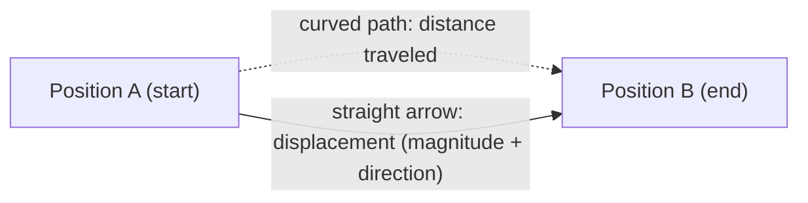
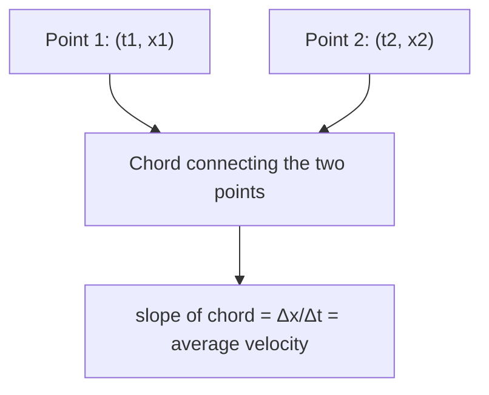
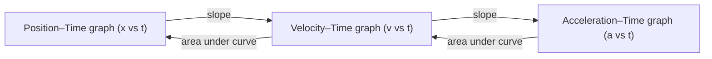

# SPL Run: build_concept_book

- **Adapter:** claude_cli
- **Model:** claude-sonnet-5
- **Tokens:** 13490 in / 7568 out
- **Latency:** 207429ms
- **Timestamp:** 2026-09-27 12:36:22

## Output

```output


---

## Position

Position describes where an object is located at a specific instant, measured relative to a chosen reference frame — an origin point plus a set of coordinate axes. Without a reference frame, "location" is meaningless: saying a car is "5 km east" only makes sense once you fix where "here" is. In one dimension, position is a signed number $x$ (positive or negative relative to the origin); in two or three dimensions, it is a vector $\vec{r} = (x, y, z)$ or $\vec{r} = x\hat{i} + y\hat{j} + z\hat{k}$. The sign or direction encodes which side of the origin the object is on.

**Worked example.** Suppose you set the origin at your front door and define east as positive. A jogger starts at $x = 0$, runs to $x = +300\text{ m}$ (a park), then turns back to $x = -100\text{ m}$ (a café west of the door). At the moment she reaches the café, her position is $x = -100\text{ m}$ — this is where she is right now, regardless of the winding path she took to get there. Position is a snapshot, not a running tally of ground covered; two joggers who took completely different routes could still end up at the exact same position.

**Problem-solving application.** Changing the reference frame shifts every position value by a constant but does not change any physical outcome — how an object moves relative to itself is unaffected by where you decide to put the origin. This is why, when solving motion problems, you are free to place the origin wherever makes the algebra simplest (e.g., at the object's starting point, so $x_0 = 0$). A common pitfall is mixing reference frames mid-problem — for instance, using "positive up" for a ball's height but "positive right" for its horizontal motion without being explicit about both axes. Always state your origin and positive direction before writing any equation; this single habit prevents the majority of sign errors in kinematics problems, including those involving free fall, projectile motion, and multi-object comparisons. Once this habit is set, later quantities built from position — such as how far an object has shifted, or how fast it is moving — inherit a consistent, unambiguous sign convention.

---

## Time

Time is the physical quantity that orders events and measures the interval between them. In the International System of Units (SI), time is measured in seconds (s), and since 1967 the second has been defined not by astronomical motion but by an atomic standard: 1 second equals 9,192,631,770 periods of the radiation emitted by a cesium-133 atom transitioning between two hyperfine energy levels. This definition replaced earlier ones based on Earth's rotation because atomic transitions are far more stable and reproducible — Earth's spin varies slightly due to tidal friction and geological events, while a cesium atom's transition frequency does not drift.

**Worked example.** Suppose a cesium clock counts oscillations to measure an event lasting exactly 2.5 seconds. The number of periods counted is
$$
N = 2.5 \times 9{,}192{,}631{,}770 = 22{,}981{,}579{,}425 \text{ periods}.
$$
This illustrates the operational meaning of "one second": it is not an abstract unit but a literal count of physical oscillations, calibrated against a reproducible natural process.

**Problem-solving application.** Time measurement underlies velocity, acceleration, and rate calculations throughout physics and engineering. Consider a GPS satellite, which relies on atomic clocks to timestamp signals to nanosecond precision. General relativity predicts that a clock in the satellite's weaker gravitational field runs faster than one on Earth's surface by about $45.7\ \mu\text{s/day}$, while special relativity (due to the satellite's orbital speed) causes it to run slower by about $7.2\ \mu\text{s/day}$. The net effect, $+38.5\ \mu\text{s/day}$, must be corrected in the satellite's onboard clock; uncorrected, positioning errors would accumulate at roughly $10\ \text{km/day}$. This example shows why time is not merely a background parameter but an actively engineered quantity: precise timekeeping standards, and the physical laws governing how time itself behaves under motion and gravity, directly determine the accuracy of technologies like GPS.

Time's role as the SI base unit for the second also makes it foundational to defining other units — the meter, for instance, is defined via the distance light travels in a fixed fraction of a second — illustrating how a single precise standard can anchor an entire system of measurement.

---

## Vector

A **vector** is a mathematical object defined by two properties simultaneously: a **magnitude** (size, always non-negative) and a **direction** in space. This distinguishes it from a **scalar**, which carries magnitude only (e.g., temperature, mass, time). Graphically, a vector is drawn as an arrow: length encodes magnitude, and the arrowhead encodes direction. Vectors are written in several equivalent notations: $\vec{v}$, $\mathbf{v}$, or as an ordered tuple of components, $\vec{v} = \langle v_x, v_y \rangle$ in two dimensions.

Given a vector's components, its magnitude follows from the Pythagorean theorem:
$$|\vec{v}| = \sqrt{v_x^2 + v_y^2}$$
and its direction is the angle $\theta$ it makes with a reference axis:
$$\theta = \tan^{-1}\left(\frac{v_y}{v_x}\right)$$
These two formulas are simply two ways of reading the same object — the component form $\langle v_x, v_y \rangle$ and the magnitude-direction form $(|\vec{v}|, \theta)$ describe the identical arrow.

**Worked example.** A drone's displacement from its launch point is recorded as $\vec{d} = \langle 3, 4 \rangle$ km. To report this to a pilot who thinks in terms of "how far and which way" rather than "how far east and how far north," convert to magnitude-direction form:
$$|\vec{d}| = \sqrt{3^2+4^2} = 5 \text{ km}, \qquad \theta = \tan^{-1}(4/3) \approx 53.1^\circ \text{ north of east}$$
The drone is 5 km from launch, at a bearing of 53.1° north of east — the 3-4-5 right triangle appears here not as an abstract exercise but as the geometry underlying any two-component vector.

**Problem-solving application.** The reverse conversion matters just as much: given magnitude and direction, recover the components. A vector of magnitude 10 N at 30° above the horizontal has components
$$v_x = 10\cos(30^\circ) \approx 8.66, \qquad v_y = 10\sin(30^\circ) = 5$$
This decomposition into components along a shared set of axes is the standard first move in most physics and engineering problems, since it puts every vector into a form that can be worked with numerically rather than geometrically. Practicing conversion in both directions — components to magnitude/direction, and magnitude/direction to components — builds the fluency needed for every later operation performed on vectors.

---

## Displacement

Displacement is the vector quantity describing the change in an object's position, defined as $\Delta x = x_f - x_i$, where $x_i$ is the initial position and $x_f$ is the final position. Because displacement is a vector, it carries both magnitude (how far) and direction (which way), and it depends only on the starting and ending points — not on the path taken to get there. This distinguishes displacement from distance, the total length of the path traveled, regardless of direction. In one dimension, a positive or negative sign encodes direction (e.g., $+x$ for rightward, $-x$ for leftward); in two or three dimensions, displacement is expressed as an ordered pair of components, $\Delta x$ and $\Delta y$ along perpendicular axes.

**Worked example.** A runner starts at $x_i = 2\text{ m}$, jogs to $x = 10\text{ m}$, then turns back to $x_f = 6\text{ m}$. The distance traveled is $8\text{ m} + 4\text{ m} = 12\text{ m}$, but the displacement is $\Delta x = 6 - 2 = 4\text{ m}$ in the positive direction — much smaller than the distance because the return trip partially cancels the outward trip.

**Problem-solving application.** Displacement problems typically require tracking direction carefully through multiple stages of motion, then combining components rather than magnitudes. For a 2D case, suppose a hiker walks $3\text{ km}$ east then $4\text{ km}$ north. Using the Pythagorean theorem, the net displacement magnitude is $|\vec{\Delta x}| = \sqrt{3^2 + 4^2} = 5\text{ km}$, directed at $\theta = \tan^{-1}(4/3) \approx 53.1^\circ$ north of east — even though the hiker walked $7\text{ km}$ total. Resolving motion into perpendicular components, combining each axis separately, then recombining the result is the standard method for any multi-leg displacement problem, and the same approach will apply directly to velocity and acceleration vectors later in kinematics.


*Displacement is the straight-line vector from start to end, while distance follows the actual curved path traveled.*

---

## Elapsed Time

Elapsed time is the duration over which motion or a process occurs — the interval between a starting instant and an ending instant. It is defined as

$$
\Delta t = t_f - t_0
$$

where $t_f$ is the final (ending) time, $t_0$ is the initial (beginning) time, and $\Delta t$ is measured in seconds (SI unit), though minutes, hours, or years are common depending on context. Because $\Delta t$ is a *difference* between two clock readings, it is a scalar quantity — it has magnitude but no direction — and by convention $\Delta t \ge 0$ for any motion actually observed, since $t_f$ occurs after $t_0$.

It is important to distinguish elapsed time from the time coordinates themselves. A time coordinate like $t_0 = 2\ \text{s}$ tells you *when* something happened relative to a chosen origin (often when a stopwatch starts, $t_0 = 0$). Elapsed time tells you *how long* something took, independent of where the clock happened to start. This distinction matters in kinematics: velocity and acceleration are defined using $\Delta t$, not raw clock readings, precisely because motion shouldn't depend on an arbitrary choice of when the stopwatch was zeroed.

**Worked example.** A sprinter crosses the start line at $t_0 = 12.40\ \text{s}$ on the stadium clock and the finish line at $t_f = 22.83\ \text{s}$. The elapsed time for the race is

$$
\Delta t = 22.83\ \text{s} - 12.40\ \text{s} = 10.43\ \text{s}.
$$

Note that the individual readings ($12.40\ \text{s}$, $22.83\ \text{s}$) are irrelevant to judging the sprinter's performance — only $\Delta t$ matters.

**Problem-solving application.** Elapsed time becomes the denominator in every rate calculation you'll use throughout kinematics: average velocity $\bar{v} = \Delta x / \Delta t$, average acceleration $\bar{a} = \Delta v / \Delta t$, and later, instantaneous rates via limits as $\Delta t \to 0$. A common pitfall in multi-step problems is subtracting times in the wrong order or mixing units (e.g., minutes with seconds) before computing $\Delta t$ — always convert to consistent units first, then subtract, then use the result in any rate formula. When a problem gives you two clock readings rather than a duration directly, computing $\Delta t$ correctly is often the first and most error-prone step before any physics begins.

---

## Average Velocity

Average velocity describes how an object's position changes over a finite interval of time. It is defined as

$$\bar{v} = \frac{\Delta x}{\Delta t} = \frac{x_2 - x_1}{t_2 - t_1}$$

where $x_1$ and $x_2$ are positions at times $t_1$ and $t_2$. Because displacement $\Delta x$ is a vector — it carries direction as well as magnitude — average velocity is also a vector, distinct from average *speed*, which uses total distance traveled and is always non-negative. The SI unit is meters per second (m/s). A key subtlety: average velocity depends only on the endpoints of the interval, not on what happened in between. An object could speed up, slow down, or reverse direction partway through the trip, and $\bar{v}$ would not capture any of that detail — it only "sees" where the object started and ended, and how long it took.

**Worked example.** A cyclist starts at position $x_1 = 20\text{ m}$ at $t_1 = 2\text{ s}$ and reaches $x_2 = 80\text{ m}$ at $t_2 = 10\text{ s}$. The average velocity is

$$\bar{v} = \frac{80 - 20}{10 - 2} = \frac{60\text{ m}}{8\text{ s}} = 7.5\text{ m/s}$$

If instead the cyclist had ridden to $x = 100\text{ m}$ and back to $x_2 = 80\text{ m}$ during that same interval, the average velocity would be unchanged — still $7.5\text{ m/s}$ — even though the cyclist traveled much farther and at higher speeds along the way.

**Problem-solving application.** On a position-time graph, average velocity over an interval is the slope of the straight line (chord) connecting the two endpoints: pick any two points on the curve, and slope $= \Delta x/\Delta t$. This makes average velocity easy to extract from tabulated or graphed data without needing the equation of motion. For example, given a table of a car's position at several times, you can compute $\bar{v}$ over any pair of entries just by taking the difference in position over the difference in time — useful for comparing how "fast" a trip was over different legs of a journey, or for checking whether an object's motion was net-forward, net-backward, or net-zero over a stretch of time (the sign of $\bar{v}$ tells you the net direction, even if the object doubled back along the way).


*A position-time graph with two marked points connected by a chord; the chord's slope gives the average velocity over that interval.*

---

## Average Acceleration

**Definition.** Average acceleration measures how quickly velocity changes over an interval of time. If an object's velocity changes from $v_1$ to $v_2$ over a time interval $\Delta t = t_2 - t_1$, the average acceleration is

$$\bar{a} = \frac{\Delta v}{\Delta t} = \frac{v_2 - v_1}{t_2 - t_1}$$

Because velocity is a vector, $\bar{a}$ is also a vector — it points in the direction of the *change* in velocity, not necessarily in the direction of motion. Its SI unit is meters per second squared ($\text{m/s}^2$), reflecting that it is "velocity per time," or equivalently "(distance per time) per time."

**Worked example.** A car traveling east at $12\ \text{m/s}$ speeds up to $28\ \text{m/s}$ east over $8$ seconds while merging onto a highway. Its average acceleration is

$$\bar{a} = \frac{28\ \text{m/s} - 12\ \text{m/s}}{8\ \text{s}} = \frac{16\ \text{m/s}}{8\ \text{s}} = 2\ \text{m/s}^2 \text{ (east)}$$

This says that, on average, the car's eastward speed increases by $2\ \text{m/s}$ every second. Note this is the *average* rate — the car might accelerate unevenly (faster at first, then leveling off), but $\bar{a}$ smooths that variation into a single representative value over the interval.

**Problem-solving application.** A common trap is treating acceleration as purely a "speeding up" quantity. Consider a ball thrown straight up, which leaves your hand at $v_1 = +15\ \text{m/s}$ (upward) and, $1.5\ \text{s}$ later, is moving at $v_2 = -7.5\ \text{m/s}$ (now downward). Taking up as positive:

$$\bar{a} = \frac{-7.5\ \text{m/s} - 15\ \text{m/s}}{1.5\ \text{s}} = \frac{-22.5\ \text{m/s}}{1.5\ \text{s}} = -15\ \text{m/s}^2$$

The negative sign doesn't mean "slowing down" — it means the acceleration vector points downward throughout, consistent with gravity acting continuously, even while the ball is still rising. This distinction — sign indicates *direction*, not just speeding up versus slowing down — is essential when average acceleration is used to reconstruct motion (e.g., solving for final velocity via $v_2 = v_1 + \bar{a}\,\Delta t$) or to identify the net force via $F = m\bar{a}$ in problems spanning a finite time interval rather than an instant.

---

## Graphical Analysis Of Motion

Position, velocity, and acceleration are linked through rates of change, and graphs make that link visible without requiring calculus notation to be useful. On a position–time ($x$ vs. $t$) graph, the **slope at any point equals the instantaneous velocity**: $v = \dfrac{\Delta x}{\Delta t}$ for a straight-line segment, or the slope of the tangent line if the graph curves. A steeper slope means faster motion; a negative slope means motion in the negative direction; a horizontal segment ($\text{slope}=0$) means the object is at rest. Likewise, on a velocity–time ($v$ vs. $t$) graph, the **slope equals acceleration**, $a = \dfrac{\Delta v}{\Delta t}$, and the **area under the curve equals displacement**, since area is $v \times t$-type accumulation. These two graphs are not independent pictures — one is the rate-of-change record of the other — so consistent motion must produce consistent slopes and areas across both.

**Worked example.** A cart's position is recorded as $x = 2\,\text{m}$ at $t=0\,\text{s}$, $x = 8\,\text{m}$ at $t = 3\,\text{s}$, then it holds at $x = 8\,\text{m}$ until $t = 5\,\text{s}$. On the $x$–$t$ graph, the first segment has slope $\frac{8-2}{3-0} = 2\,\text{m/s}$, so $v = 2\,\text{m/s}$ during that interval. The second segment is flat, so $v = 0$ from $t=3$ to $t=5\,\text{s}$. Plotting these two velocity values against time produces a $v$–$t$ graph that steps from $2\,\text{m/s}$ down to $0\,\text{m/s}$ at $t=3\,\text{s}$ — a graph of the *derivative* of the first.

**Problem-solving application.** Given a $v$–$t$ graph showing constant $a = -4\,\text{m/s}^2$ starting from $v_0 = 20\,\text{m/s}$, you can find when the object stops by reading the slope backward: the line reaches $v=0$ where $t = \dfrac{v_0}{|a|} = 5\,\text{s}$. The displacement over those 5 seconds is the triangular area under the line, $\frac{1}{2}(20)(5) = 50\,\text{m}$ — matching the kinematic equation $x = v_0 t + \frac{1}{2}at^2$ without needing to solve it algebraically. This graphical shortcut is especially powerful when acceleration is *not* constant, since slope and area readings still work locally even when a single equation does not apply to the whole motion.


*Slope operations move from position to velocity to acceleration graphs; area operations move in the reverse direction, recovering displacement and velocity change.*

---

## Payoff

Graphical analysis of motion is the concept that turns kinematics from a collection of memorized formulas into a single, visual language. Once you can read a position-time graph, a velocity-time graph, and an acceleration-time graph — and translate fluidly between them — you no longer need to guess which equation applies to which scenario. The slope of a position-time graph gives velocity, $v = \dfrac{dx}{dt}$; the slope of a velocity-time graph gives acceleration, $a = \dfrac{dv}{dt}$; and the area under a velocity-time graph gives displacement, $\Delta x = \int v\,dt$. This is why the concept sits at the end of the book: it is the synthesis point where algebraic kinematics, the geometry of slopes and areas, and the calculus of derivatives and integrals all converge into one coherent way of seeing motion. It is the natural endpoint because every other kinematics tool — constant-acceleration equations, free-fall problems, relative motion — can be recovered by reading or sketching the right graph, but the reverse is not true: graphs contain information the equations alone do not, such as the sign changes that reveal when an object turns around or momentarily stops.

This graphical fluency is also what makes motion analysis exportable. In experimental physics and engineering, sensor data rarely arrives as a clean equation; it arrives as a scatter of position or velocity readings over time, and the ability to extract slopes, concavity, and areas from that data — even when noisy — is the practical skill that separates a student who "knows kinematics" from one who can analyze a real motion capture, a car's telemetry, or an accelerometer trace. The same slope-and-area reasoning generalizes far beyond position and velocity: any system where one quantity is the rate of change of another (population growth rates, current as the rate of charge flow, reaction rates in chemistry) can be read the same way once you've internalized this concept here.

From here, the most productive next step is to take one real, messy dataset — a dropped ball, a rolling cart, a sprinter's 100-meter split times — and reconstruct its full motion story using nothing but the graphs. Pick a motion, plot it, and read it.
```
