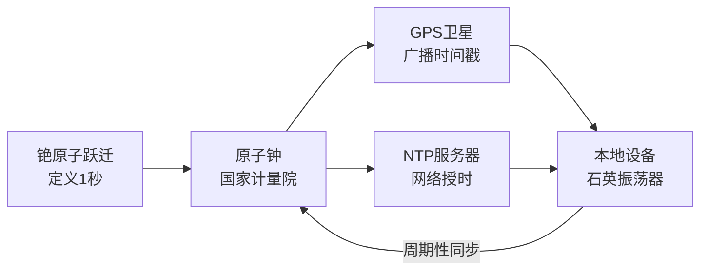
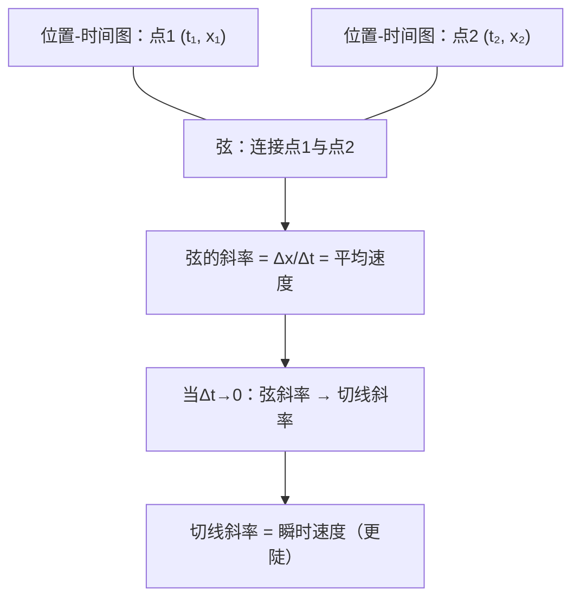

# SPL Run: build_concept_book

- **Adapter:** claude_cli
- **Model:** claude-sonnet-5
- **Tokens:** 9007 in / 2352 out
- **Latency:** 162173ms
- **Timestamp:** 2026-09-27 20:37:41

## Output

```output


---

## Position（位置）

**定义**

位置（position）描述一个物体在某一时刻相对于所选参考系（reference frame）的空间坐标。要确定位置，必须先固定一个参考系——包括原点、坐标轴方向和单位——因为"位置"本身没有绝对意义，只有相对意义。在一维运动中，位置常用带符号的坐标 $x(t)$ 表示，正负号指示物体相对原点位于哪一侧；在二维或三维中，位置用位置矢量 $\vec{r}(t) = x(t)\,\hat{i} + y(t)\,\hat{j} + z(t)\,\hat{k}$ 表示，它既有大小也有方向。位置与位移（displacement）不同：位移是位置的变化量 $\Delta \vec{r} = \vec{r}(t_2) - \vec{r}(t_1)$，而位置是某一时刻的绝对坐标值。

**范例**

设一辆车沿笔直公路行驶，选择公路上的收费站为原点，向东为正方向。若车在 $t=0\,\text{s}$ 时位于 $x_0 = 50\,\text{m}$（收费站以东 50 米），并以恒定速度 $v = -20\,\text{m/s}$（向西）行驶，则任意时刻的位置为：
$$x(t) = x_0 + vt = 50 - 20t$$
在 $t = 3\,\text{s}$ 时，$x(3) = 50 - 60 = -10\,\text{m}$，说明此时车已越过收费站，来到其西侧 10 米处。这里的负号并不代表"负的距离"，而是相对参考系方向的标记。

**问题求解应用**

处理位置问题的关键步骤是：(1) 明确定义参考系的原点与正方向；(2) 写出位置随时间变化的函数 $x(t)$（若加速度非零，则为 $x(t) = x_0 + v_0 t + \tfrac{1}{2}at^2$）；(3) 代入具体时刻求解坐标；(4) 通过比较两个时刻的位置计算位移，而非直接假设位置等于路程。例如，若要判断两物体何时相遇，只需令它们的位置函数相等 $x_1(t) = x_2(t)$，解出共同时刻 $t$，再代回任一函数求出相遇的具体位置坐标。这种"先建参考系、再列方程、后求解"的流程是运动学分析的基础范式。

---

## Time

时间是变化发生的区间，用来标定事件的先后顺序与持续长短。在国际单位制（SI）中，时间的单位是秒（s），其现代定义并非基于地球自转或天文周期，而是基于原子物理的一个不变常数：铯-133原子基态两个超精细能级之间跃迁所对应辐射的 $9{,}192{,}631{,}770$ 个周期，定义为 $1\text{ s}$。这一定义之所以被采用，是因为原子跃迁频率极其稳定，不受地理位置、温度或使用年限的影响，从而使全世界的计时基准可以彼此对齐、相互校准。

**校准的层级结构**：日常使用的时钟（手机、电脑、实验室仪器）本身并不直接测量原子跃迁，而是通过网络时间协议（NTP）或全球定位系统（GPS）信号，定期与"原子钟"同步。GPS 卫星上搭载的原子钟持续广播时间戳，接收设备据此修正自身的时钟漂移。这就是为什么手机在飞行模式下几天不联网后，时间仍可能出现秒级误差——本地晶振（石英振荡器）的频率会随温度、电压缓慢漂移，必须周期性地"对表"。

**问题解决应用**：假设某台服务器的本地时钟每天漂移 $0.5$ 秒（即晶振频率略微偏离标称值），运维团队要求任何两台服务器之间的时间差不得超过 $50$ 毫秒，以保证分布式数据库日志的顺序正确性。那么最长可以间隔多久同步一次 NTP？

设漂移速率为 $r = 0.5\ \text{s/day}$，允许的最大误差为 $\Delta t_{\max} = 0.05\ \text{s}$。同步间隔上限为：

$$
T = \frac{\Delta t_{\max}}{r} = \frac{0.05}{0.5} = 0.1\ \text{day} \approx 2.4\ \text{小时}
$$

即该服务器至少每 $2.4$ 小时需与授时源同步一次，否则时间误差可能导致分布式系统中"先发生"关系（happens-before）判断出错，引发数据不一致。这类计算是分布式系统工程、金融交易时间戳、卫星导航精度设计中的常规实践——把抽象的"时间"概念转化为可预算、可校准的工程约束。


*该图展示时间基准从原子跃迁定义，经原子钟、GPS与NTP逐级传递，最终校准本地设备时钟的层级结构。*

---

## Vector（向量）

**定义**

向量（vector）是同时具有**大小（magnitude）**与**方向（direction）**的量，用图形表示时为一条箭头：箭头的长度正比于大小，箭头的指向即为方向。这与标量（scalar，只有大小无方向的量，如质量、温度）形成鲜明对比。在平面直角坐标系中，向量 $\vec{v}$ 可用分量形式表示为 $\vec{v} = (v_x, v_y)$，其大小由勾股定理给出：

$$|\vec{v}| = \sqrt{v_x^2 + v_y^2}$$

方向则可用与 $x$ 轴的夹角 $\theta = \tan^{-1}(v_y / v_x)$ 描述。向量的核心运算规则是：加法遵循平行四边形法则（或首尾相接法），标量乘法只改变长度不改变方向（除非乘以负数，此时方向反转）。

**范例**

设一架飞机以相对空气 $200\text{ km/h}$ 向正北方向飞行，同时遭遇一股向东吹的风，风速为 $50\text{ km/h}$。飞机相对地面的实际速度即为两个速度向量之和：

$$\vec{v}_{\text{飞机}} = (0, 200), \quad \vec{v}_{\text{风}} = (50, 0)$$
$$\vec{v}_{\text{合}} = (50, 200)$$

合速度大小为 $|\vec{v}_{\text{合}}| = \sqrt{50^2 + 200^2} \approx 206.2\text{ km/h}$，方向偏东 $\theta = \tan^{-1}(50/200) \approx 14.0°$。这说明即使各分力独立作用，最终效果必须通过向量合成才能正确求得——直接相加大小（如 $200+50=250$）是错误的，因为方向未对齐。

**解题应用**

向量思维广泛用于力学（力的合成与分解）、导航（位移与速度）以及计算机图形学（物体位移与朝向）。解题的标准流程是：①将每个向量分解为正交分量；②对分量分别求和；③用勾股定理求合向量大小，用反正切求方向角。例如，物体同时受到 $30\text{ N}$（沿 $0°$）和 $40\text{ N}$（沿 $90°$）两个力，合力大小为 $\sqrt{30^2+40^2}=50\text{ N}$，方向角 $\tan^{-1}(40/30)\approx 53.1°$。掌握向量分解与合成，是后续学习力矩、动量守恒乃至线性代数中向量空间概念的基础。

---

## Displacement

位移（displacement）描述物体位置的变化，定义为末位置与初位置之差：

$$\Delta x = x_f - x_i$$

它是一个矢量，既有大小（magnitude）又有方向（direction）。这一点与路程（distance）截然不同：路程只记录物体实际经过的路径长度，是标量，永远为非负值；而位移只关心起点与终点的相对关系，与中间走了多少弯路无关。若物体最终回到出发点，位移为零，但路程可以远大于零。

**例题**：一名学生从教室门口（记为原点，$x_i = 0\text{ m}$）出发，沿走廊向东走了 $12\text{ m}$ 后，又转身向西走回 $5\text{ m}$。
- 路程 $= 12 + 5 = 17\text{ m}$（标量，只累加，不考虑方向）
- 末位置 $x_f = 12 - 5 = 7\text{ m}$（以向东为正方向）
- 位移 $\Delta x = x_f - x_i = 7 - 0 = 7\text{ m}$，方向为东

可以看到，位移只用起点和终点计算，中间的往返细节被"抵消"掉了。

**问题解决应用**：位移的矢量性质使其可以用坐标或分量相加来处理二维、三维问题。例如，若一人先向东走 $3\text{ m}$，再向北走 $4\text{ m}$，总位移不是简单的 $3+4=7\text{ m}$，而应用矢量加法（勾股定理）求合位移大小：

$$|\Delta \vec{x}| = \sqrt{3^2 + 4^2} = 5\text{ m}$$

方向则用 $\theta = \arctan(4/3) \approx 53.1°$（以东为基准，偏北方向）描述。这种矢量合成方法是后续学习速度、加速度、力等矢量运算的基础——只要涉及"变化量"且有方向意义的物理量，都遵循相同的合成规则。


*图示：从位置 A 到位置 B，弯曲路径表示实际经过的路程，直线箭头表示位移矢量，同时标注其大小与方向。*

理解位移与路程的区别，是建立"矢量思维"的第一步，也是后续学习速度（位移的时间变化率）与加速度概念的必要基础。

---

## Elapsed Time

**定义**

经过时间（elapsed time）是指一段运动的结束时刻与起始时刻之差，记作

$$\Delta t = t_f - t_0$$

其中 $t_f$ 为末时刻，$t_0$ 为初时刻，单位为秒（s）。经过时间是一个标量，恒为正值（假设我们按运动发生的先后顺序定义 $t_f > t_0$），它描述的是"过程持续了多久"，而不是"发生在什么时刻"。区分这两者很重要：$t_0$ 和 $t_f$ 是时间轴上的坐标点，而 $\Delta t$ 是这两点之间的间隔长度。

**范例**

一辆汽车在 $t_0 = 2.0\ \text{s}$ 时经过路标 A，在 $t_f = 7.5\ \text{s}$ 时经过路标 B。求经过时间。

$$\Delta t = t_f - t_0 = 7.5\ \text{s} - 2.0\ \text{s} = 5.5\ \text{s}$$

若已知路标 A、B 之间的距离为 $88\ \text{m}$，则可进一步求出平均速度：

$$\bar{v} = \frac{\Delta x}{\Delta t} = \frac{88\ \text{m}}{5.5\ \text{s}} = 16\ \text{m/s}$$

这体现了 $\Delta t$ 在运动学中的核心作用：它是连接位移、速度、加速度的桥梁——几乎所有运动学公式（如 $v = v_0 + at$，$\Delta x = v_0 t + \tfrac{1}{2}at^2$）中的时间变量，实际上指的都是经过时间，而非绝对时刻。

**解题应用**

在实际问题中，一个常见易错点是：题目给出的是两个"时刻"（例如"下午 3:00"和"下午 3:05"），而不是直接给出 $\Delta t$。此时必须先做减法求出经过时间，再代入运动学公式。另一个常见情形是分段运动：若一个过程包含多个阶段，总经过时间等于各阶段经过时间之和：

$$\Delta t_{\text{total}} = \Delta t_1 + \Delta t_2 + \cdots + \Delta t_n$$

例如，一名短跑运动员在 $0\sim 3\ \text{s}$ 内加速，在 $3\sim 10\ \text{s}$ 内匀速，求其在匀速阶段的经过时间：$\Delta t_2 = 10\ \text{s} - 3\ \text{s} = 7\ \text{s}$。掌握"先找准 $t_0$、$t_f$，再作差"这一步骤，是正确应用一切运动学方程的前提。

---

## Average Velocity

**定义**

平均速度是位移与所用时间之比，记作

$$\bar{v} = \frac{\Delta x}{\Delta t} = \frac{x_2 - x_1}{t_2 - t_1}$$

其中 $\Delta x$ 是位移（末位置减初位置），$\Delta t$ 是经过的时间。注意平均速度是**矢量**，其符号（正或负）表示方向；这与"平均速率"不同，后者是标量，等于路程除以时间，恒为非负。在国际单位制中，平均速度的单位是 $\text{m/s}$。

**例题**

一辆车在 $t_1 = 2\,\text{s}$ 时位于 $x_1 = 10\,\text{m}$，在 $t_2 = 6\,\text{s}$ 时位于 $x_2 = -2\,\text{m}$。求这段时间内的平均速度。

$$\bar{v} = \frac{x_2 - x_1}{t_2 - t_1} = \frac{-2\,\text{m} - 10\,\text{m}}{6\,\text{s} - 2\,\text{s}} = \frac{-12\,\text{m}}{4\,\text{s}} = -3\,\text{m/s}$$

负号说明车沿负方向运动，平均速度大小为 $3\,\text{m/s}$，方向为 $x$ 轴负方向。

**解题应用**

在位置-时间图中，平均速度等于连接两个数据点的**弦（chord）的斜率**。这是理解平均速度与瞬时速度关系的关键：瞬时速度是位置-时间曲线在某一点处**切线**的斜率，可以看作当 $\Delta t \to 0$ 时弦的斜率的极限。因此，解题时若题目给出位置随时间变化的表格或图像，只需选取起止两点，计算斜率即可得到该时间段内的平均速度；若要求某一时刻的瞬时速度，则需取越来越短的时间间隔，观察弦的斜率是否趋于某个稳定值。这种"弦逼近切线"的思路也是后续学习导数概念的物理直觉基础。



*位置-时间图上两点间的弦斜率表示平均速度，其极限即为某一点处更陡的切线斜率——瞬时速度。*

---

## Average Acceleration

**定义**

平均加速度描述的是速度在一段时间内的变化快慢，是一个矢量量。设某物体在时刻 $t_1$ 的速度为 $\vec{v}_1$，在时刻 $t_2$ 的速度为 $\vec{v}_2$，则平均加速度定义为

$$\bar{a} = \frac{\Delta \vec{v}}{\Delta t} = \frac{\vec{v}_2 - \vec{v}_1}{t_2 - t_1}$$

在国际单位制（SI）中，速度的单位是 $\text{m/s}$，时间的单位是 $\text{s}$，因此加速度的单位是 $\text{m/s}^2$。需要强调的是，$\Delta \vec{v}$ 是速度矢量的差，不是速率（速度大小）的差——即使物体的速率不变，只要方向发生了变化（例如做匀速圆周运动），加速度也不为零。方向上，$\bar{a}$ 与 $\Delta \vec{v}$ 同向，而不一定与瞬时速度方向相同。

**例题**

一辆汽车沿直线行驶，在 $t_1 = 0\,\text{s}$ 时速度为 $v_1 = 10\,\text{m/s}$（向东），经过 $5\,\text{s}$ 后速度变为 $v_2 = 25\,\text{m/s}$（仍向东）。求这段时间内的平均加速度。

$$\bar{a} = \frac{25 - 10}{5 - 0} = \frac{15}{5} = 3\,\text{m/s}^2 \ (\text{方向向东})$$

即汽车每秒速度平均增加 $3\,\text{m/s}$。

**解题应用**

平均加速度最重要的应用是在已知初末速度和时间间隔时，反推运动的其他量，或判断运动方向是否发生改变。例如，若一物体初速度为 $v_1 = 8\,\text{m/s}$（向右），经过 $4\,\text{s}$ 后变为 $v_2 = -4\,\text{m/s}$（即向左，大小 $4\,\text{m/s}$），则

$$\bar{a} = \frac{(-4) - 8}{4} = \frac{-12}{4} = -3\,\text{m/s}^2$$

负号说明加速度方向向左，与初速度方向相反——这正是物体先减速后反向运动的特征（如竖直上抛后下落，或小球撞墙弹回）。解题时的关键步骤是：先规定正方向，再将所有速度按此方向代入正负号，最后用 $\bar{a} = \Delta v / \Delta t$ 求解，切勿混淆"减速"与"加速度为负"——加速度的正负仅取决于其方向与所设正方向的关系，与物体是加速还是减速无必然联系。

---

## Graphical Analysis Of Motion

**定义**

在一维运动中，位置–时间图（$x$–$t$ 图）与速度–时间图（$v$–$t$ 图）不仅是运动的可视化记录，更是提取动力学信息的计算工具。位置–时间图上任意一点的**瞬时速度**等于该点切线的斜率：

$$v(t) = \frac{dx}{dt} = \lim_{\Delta t \to 0} \frac{x(t+\Delta t) - x(t)}{\Delta t}$$

对于匀速运动，$x$–$t$ 图是直线，斜率即为常数速度。对于变速运动，图线弯曲，此时**平均速度**是两点间的连线（弦）斜率，而**瞬时速度**才是切线斜率——二者的区别正是微积分中平均变化率与瞬时变化率的区别。同理，速度–时间图上任意一点切线的斜率给出**瞬时加速度**：

$$a(t) = \frac{dv}{dt}$$

此外，位移可由 $v$–$t$ 图中曲线下的**面积**求得：$\Delta x = \int_{t_1}^{t_2} v(t)\,dt$。这是图像法的核心——斜率给出导数（速度、加速度），面积给出积分（位移、速度变化）。

**范例**

一辆汽车的位置数据为：$t=0$ s 时 $x=0$ m，$t=2$ s 时 $x=8$ m，$t=4$ s 时 $x=32$ m。若将三点绘于 $x$–$t$ 图上，可见曲线上凹（斜率递增），说明车辆在加速。计算 $t=0$ 到 $t=2$ s 的平均速度：$\bar{v} = \frac{8-0}{2-0} = 4$ m/s；$t=2$ 到 $t=4$ s：$\bar{v} = \frac{32-8}{4-2} = 12$ m/s。平均速度递增，证实加速运动，且可估算 $t=2$ s 附近的瞬时加速度约为 $a \approx \frac{12-4}{2} = 4$ m/s²。

**解题应用**

图像法的实用价值在于**逆向推断**：给定 $v$–$t$ 图，可通过分段计算面积（梯形或矩形）求总位移，而不需要已知运动方程。例如，若 $v$–$t$ 图显示物体先以 $10$ m/s 匀速运动 $3$ s，再在 $2$ s 内匀减速至 $0$，总位移为两段面积之和：$10 \times 3 + \frac{1}{2} \times 10 \times 2 = 30 + 10 = 40$ m。掌握斜率与面积的双重解读，是处理复杂运动学问题（尤其是非常量加速度情形）最有效的定量分析手段。

---

## Payoff

运动的图像分析（graphical analysis of motion）之所以成为本书的收官概念，是因为它把前面所学的位置、速度、加速度这些孤立的量，统一编织进一套可读、可算、可预测的视觉语言。一条 $x$-$t$ 图的斜率给出瞬时速度 $v = \dfrac{dx}{dt}$；一条 $v$-$t$ 图的斜率给出加速度 $a = \dfrac{dv}{dt}$，而其下方的面积则给出位移 $\Delta x = \displaystyle\int_{t_1}^{t_2} v\,dt$。掌握了这一点，学生不再需要死记一堆运动学公式，而是能够直接"读出"物体的运动历史：图像的弯曲程度告诉你加速度是否恒定，图像的凹凸方向告诉你速度是在增加还是减少。这正是本书从"描述运动"走向"分析并预测运动"的自然终点——图像成为连接代数公式与物理直觉的桥梁。

举一个具体的应用场景：假设一辆车的 $v$-$t$ 图在 0 到 10 秒内是一条从 $0$ 上升到 $20\ \text{m/s}$ 的直线，随后 10 秒保持水平。通过读图，我们立刻知道前 10 秒的加速度是 $a = \dfrac{20-0}{10} = 2\ \text{m/s}^2$，而总位移则是梯形面积 $\Delta x = \dfrac{1}{2}(20)(10) + 20 \times 10 = 300\ \text{m}$。这种"以图代算"的能力，正是运动图像分析真正的价值所在：它把微积分的核心思想（斜率即导数、面积即积分）用最直观的方式呈现给尚未系统学习微积分的学生，同时也为已经学过微积分的学生提供了一个几何化的验证工具。

这项技能的迁移范围远超经典力学课堂本身：无论是分析心跳信号的波形、金融市场价格曲线的涨跌趋势，还是机器人轨迹规划中的速度—时间曲线优化，其底层逻辑都是同一种"从图像中提取变化率与累积量"的思维方式。可以说，运动图像分析不仅是物理学的终点，也是数据素养的起点。

接下来，建议你选择一个具体方向深入探索：例如，尝试用真实的 GPS 或加速度传感器数据绘制一辆自行车或汽车的运动图像，并从中反推出它的加减速策略——这将是检验你是否真正掌握本书核心思想的最佳试炼场。
```
